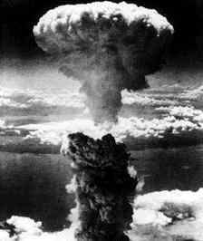

Title: Á atómöld
Slug: a-atomold
Date: 2007-08-09 14:46:00
UID: 172
Lang: is
Author: Unnur María Bergsveinsdóttir
Author URL: http://unnur.klaki.net
Category: Í umræðunni
Tags: 

Í kvöld munu logandi ljós fljóta bæði á Reykjavíkurtjörn og á Minjasafnstjörninni á Akureyri. Athöfnin haldin er í minningu fórnarlamba kjarnorkuárásanna á japönsku borgirnar Hírósíma og Nagasakí. Með henni er krafan um friðsaman og kjarnorkuvopnalausan heim undirstrikuð. Á báðum stöðum hefst dagskráin klukkan 22.30. 

Síðasta kertafleyting sem ég var viðstödd var afar falleg athöfn. Hátt í á annað þúsund logandi ljós flutu á Reykjavíkurtjörn. Veður var stillt og í stað þess að dreifast um tjörnina röðuðu ljósin sér meðfram bökkum hennar, allt frá Skothúsvegi og langleiðina niður að Ráðhúsi. Frá Fríkirkjunni séð var eins og langur ljósormur skriði á vatninu og lýsti upp það mannhaf sem hafði safnast saman til að votta virðingu sína minningu nokkur hundruð þúsunda Japana sem fyrir sextíu árum létust af völdum kjarnorkuárásanna á Hiroshima og Nagasaki.

Þeir sem aðhyllast japanskan búddisma trúa því að einu sinni á ári snúi sálir látinna ættingja til jarðar. Þeim þrem dögum sem andar forfeðranna eru á kreiki er fagnað veglega með veisluhöldum, söng og dansi og grafreitir eru hreinsaðir og skreyttir blómum. Í lok Obon hátíðarinnar fleyta Japanir pappírslömpum með logandi kertum niður ár og vötn til að lýsa öndunum aftur veginn yfir í þeirra heim. Margt af því fólki sem lést í kjarnorkuárásunum tveim hreinlega bráðnaði eða varð að ösku. Líkamsleyfar þeirra var þannig ekki hægt að jarðsetja né sýna viðeigandi virðingu og því reika andar þeirra ráðvilltir um jörðina. Þegar beiðni barst frá Japan fyrir um tuttugu árum, að Íslendingar fleyttu kertum í minningu fórnarlambanna, var tilgangur bónarinnar sá að með sameiginlegu átaki fólks um allan heim næði birtan frá kertaljósunum að verða nægilega björt til að vísa fyrrum íbúum Hiroshima og Nagasaki leiðina út úr myrkrinu.

Sumir telja að upphaf atómaldar hafi markað upphaf nýrrar aldar. Einskonar öld Vatnsberans fyrir vísindasinnaða. Kjarnorkukrafturinn er í hugum manna á víxl tákn eyðileggingar og upphafs og um það er nafngift atómskáldanna nærtækt dæmi. Á sínum tíma töluðu bæði forsetar heimsvelda og íslenskir blaðamenn um stórkostlegustu uppfinningu mannkyns. Í mínum huga eru þó mögnuðustu ummælin um þessa byltingu þau sem eru lögð í munn persónu í skáldsögunni, The Atom Heart, að það sé ekki það að mannkynið skuli hafa beislað atómkraftinn sem sé ógnvænlegt, heldur hitt að við skulum ekki óttast hann.

Ég vissi ekki margt um heimspólítík þegar ég var lítil stúlka. En ég vissi að yfir mér og fjölskyldu minni og ekki bara öllum íbúm smábæjarins sem ég bjó í heldur líka fólkinu í útlöndum, vofði skelfileg ógn. Hvenær sem var gat brjálaður forseti, hvort sem var í austri eða vestri, ýtt á takka og sett kjarnorkusprengjur af stað. Og eins og það væri ekki nógu hræðileg tilhugsun þá grunaði mig að kærulausar skúringakonur og brjálaðar skrifstofublækur gætu líka komið af stað heimsendi. Eftir að ég eltist átti ég hinsvegar sífellt auðveldara með að lifa með tilhugsuninni um það að hægt væri að eyða heiminum hundrað sinnum. Þó lifum við í dag við engu minni ógn en þegar ég var fimm ára. Ef eitthvað er, þá er ástandið verra.

Í dag hafa stórveldin misst einkaleyfið á gereyðingarvopnum, til eru smáþjóðir sem hóta að njúka nágranna sína beiti þeir kúm sínum vitlausu megin við landamærin og Bandaríkjaforseti vill  ólmur hefja þróun nýrra tegunda lítilla kjarnavopna til að beita í stríði.

Hvort sem við aðhyllumst búddisma eða ekki hljótum við öll að vera sammála um það að það sé ærin ástæða til þess að staldra við eitt ágústkvöld á ári, kveikja á kerti og hugleiða þá atburði sem áttu sér stað fyrir sextíu árum síðan. Það er gott til þess að vita að margir tendra kertið í von um að lýsa týndum öndum veginn heim. Ef einhver von er til þess að við náum að vísa okkar eigin sálum veginn í átt til skynsemi og mannúðar er hinsvegar afar þarft verk unnið. Því það er ekki fólkið sem lést í Hiroshima og Nagasaki sem er hinar raunverulegu týndu sálir heldur við, sem höfum gleymt því hvað það þýðir að lifa á atómöld.
