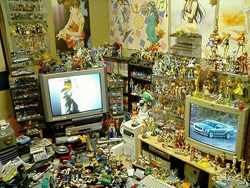
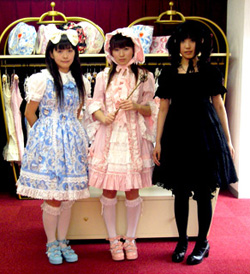
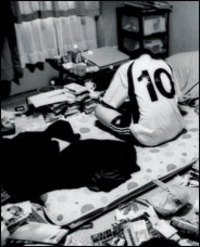

Title: Að finna sinn innri otaku
Slug: ad-finna-sinn-innri-otaku
Date: 2007-03-01 11:00:00
UID: 138
Lang: is
Author: Íris Ellenberger
Author URL: 
Category: Í útlöndum, Menningarfræði
Tags: 

Japanir eru í augum Íslendinga, sem og annarra Vesturlandabúa, mjög sérstök þjóð. Þeir þykja mjög vestrænir miðað við aðrar Asíuþjóðir en einnig framandi og stundum óskiljanlegir. Svo mjög að það þykir flott og svalt að geta vitnað í dægurmenningu landsins og slegið um sem með orðum eins og otaku, hikikomori og nihonjinron. Mætti því ætla að þetta verði afskaplega svöl grein. Hugtakið _otaku_ er einmitt eitt slíkra tískufyrirbrigða. Í ákveðnum hópum þykir það afar flott að kalla sig otaku sem er skondið þar sem orðið merkir einfaldlega lúði eða nörd. Það getur jafnvel þýtt „ofstækismaður“ í neikvæðasta skilningi orðsins.

Otaku þýðir upphaflega „þitt heimili“ og er notað sem þérun. Um netheima gengur sú saga að hugtakið otaku hafi fyrst birst á prenti í myndasögu Akio Nakamori, _Otaku no Kenkyū_, þar sem hann veitti því athygli að nördar notuðu þetta orð sem þérun í mun meira mæli en aðrir samlandar þeirra. Aðrar kenningar rekja uppruna orðsins til aðdáenda ákveðinna sjónvarpsþátta. Uppruninn er því umdeildur en flestir eru sammála um að nútímamerking þess hafi mótast við upphaf 9. áratugar 20. aldar.[^1]

Otaku eru undartekningarlaust karlmenn, yfirleitt ungir að aldri, sem hafa svo ástríðufullan áhuga á ákveðnu málefni að það jaðrar við asperger-heilkenni. Áhugasvið otaku er fjölbreytt; tölvur, manga, anime, tölvuleikir og hernaður. Ungu mennirnir eru yfirleitt haldnir mikilli söfnunaráráttu ; sagt er að sumir kaupi allt í þremur eintökum, noti eitt eintakið, varðveiti annað og láti það þriðja í skiptum fyrir varning sem aðrir safnarar hafa sankað að sér. Þótt konur séu iðulega undanskildar þegar rætt er um otaku má ef til vill finna merki slíkrar áráttu í götutísku Japan. Má þar nefna lólítu-tískuna þar sem mjög strangar reglur gilda um hegðun og klæðaburð vilji stúlka kallast sönn lólíta.

Yfirdrifinn áhugi otaku á sér stundum óhugnanlegar birtingarmyndir. Fullorðnir karlmenn safna sumir styttum sem eru nákvæmar eftirlíkingar af nærfataklæddum unglingsstúlkum. Aðrir eyða fúlgum fjár í að kaupa myndavélar og aðdráttarlinsur atvinnuljósmyndara til að geta elt uppáhaldssmástirnin sín. Smástirnin þau er „fjöldaframleiddar“ söngkonur á unglingsaldri sem komast í sviðsljósið frekar fyrir útlit en sönghæfileika og eiga flestar stuttan feril. 

Þrátt fyrir sjúklega rækt við hugðarefni sín voru otaku frekar óþekkt fyrirbæri framan af. Það breyttist hins vegar árið 1989 þegar fjöldamorðinginn Tsutomu Miyazaki var handtekinn fyrir hrottaleg morð á fjórum barnungum stúlkum. Við húsleit fundust um 6000 myndbandsspólur sem fjölmiðlar sögðu innihalda klámteiknimyndir og hryllingsmyndir að mestu. Myndböndin reyndust hins vegar vera upptökur á kvikmyndum og teiknimyndaþáttum. Þar fundust þó einnig myndbönd sem hann hafði tekið af limlestingu fórnarlamba sinna. Ýktar sögur af myndbandaeign Miyazaki komu otaku í sviðsljósið og leiddu til almennrar hneysklan á otaku-menningunni.[^2] Fjaðrafokið dvínaði en þó eru ódæði Miyazakis enn kölluð „otaku-morðin“.

Étienne Barral hefur kynnt sér menningu ofurnördanna. Hann rekur tilvist þessarar undirmenningar til mikillar hagsældar í Japan, vaxandi neysluhyggju og gríðarlegrar samkeppni í skólum og á vinnumarkaði. Samkvæmt Barral bregðast otaku við þessum samfélagsaðstæðum með því að flýja veruleikann og loka sig af í sýndarheimi sjónvarpsþátta, teiknimynda og tímarita. Í krafti tækni, sérstaklega internetsins, geti þeir einangrað sig heima fyrir að vild.[^3] 

Félagleg einangrun ungra Japana getur farið út í öfgar. Á síðustu árum hefur nýtt hugtak verið að festa sig í sessi. _Hikikomori_ merkir „að draga sig í hlé“ eða „öfgakennd félagsleg einangrun“. Hugtakið er notað bæði yfir ástandið og þá sem þjást af þessu, fjölda japanskra unglinga, yfirleitt elstu synir, sem dvelja í foreldrahúsum og hafa kosið að einangra sig svo frá samfélaginu að þeir koma ekki undir bert loft svo mánuðum og árum skiptir. Þessi hneigð virðist hafa gripið um sig á svipuðum tíma og otaku-menningin, um miðjan 9. áratug 20. aldar.[^4] Á svipaðan hátt og otaku komust hikikomori í sviðsljósið vegna morða sem framin voru af einstaklingum sem stimplaðir voru hikikomori.[^5]

Dr. Tamaki Saito sálfræðingur var fyrstur til að vekja máls á þessu heilkenni en á síðustu árum hafa fjölmargir sálfræðingar rannsakað þessa einangrunarhneigð. Saito rekur hikikomori til þátta í sögu Japan. Í fortíðinni var einvera álitin dyggð auk þess sem þjóðin einangraði sig frá umheiminum.[^6] Flestir sem fjallað hafa um hikikomori á Vesturlöndum eru sammála um að þetta vandamál sé bundið við Japan þótt tilfelli hafi komið upp í Suður-Kóreu og Taívan. Aðrir hafa hins vegar bent á að hikikomori geti komið upp við svipaðar samfélagaslegar aðstæður í hvaða landi sem er. Þá hefur verið vitnað í dæmi um hikikomori frá Óman.[^7] Þegar BBC gerði heimildarþátt um hikikomori bárust þeim fjölmörg bréf sem lýstu svipuðum tilfellum í Bretlandi.[^8]

Dr. Saito virðist því hafa gerst sekur um nokkuð sem kallast _nihonjinron_, orðræðu um sérstök einkenni Japans og Japana. Þessar kenningar hófu mótunarskeið sitt upp úr síðari heimsstyrjöld. Þær eru einkenni þjóðernishyggju og er ætlað að skapa Japan einstaka eiginleika. Svipaðar kenningar hafa mótast meðal allra þjóða og er þá skemmst að minnast kenninga um Íslendinga sem einstaka kynblöndu Kelta og Norðmanna sem talar einstakt mál. Hikikomori virðist því ekki einskorðað við japanskt samfélag vegna þess að Japan er svo sérstakt land með einstaka sögu. Svipuð tilfelli finnast í samfélögum þar sem ákveðnir samfélagslegir þættir eru til staðar, mikill þrýstingur um að skara fram úr, mikil samkeppni og strangt skólakerfi. 

Orðræða vestrænna fjölmiðla um hikikomori og otaku er ef til vill til vitnis um það hvernig Vesturlönd hafa gengist inn á nihonjinron-umræðuna í Japan. Fjallað er um þessi fyrirbæri sem sérjapönsk samfélagsvandamál sem gætu ekki gerst í nokkru öðru landi væru svipaðar félagsaðstæður til staðar. Otaku, hikikomori og lólítur eru nefnd sem dæmi um hversu sérstakir, jafnvel klikkaðir, Japanir geta verið án þess að taka tillit til þess að birtingarmyndir þessa finnast einnig á Vesturlöndum. „Sérviska“ Japana verður jafnvel að tísku þegar komið er til Vesturlanda. Meðal ákveðinna hópa á Vesturlöndum, t.d. í Bandaríkjunum og Frakklandi, þykir afar svalt að kallast otaku. Orðið er nokkurs konar samnefnari fyrir ofurnörd eða sérfræðing í menningu Japana, t.d. anime og manga. Hér á Íslandi er hugtakið otaku ekki þekkt nema í mjög þröngum hópi Japansáhugafólks. 

Hálfpervertískur áhugi Vesturlandabúa á samfélagsmeinum sem þykja einskorðast við Japan útskýrist ef til vill af því að okkar eigin samfélag getur borið svipuð einkenni, mætti þar nefna mikla neysluhyggju, hagsæld, samkeppnisandrúmsloft og þrýsting um að skara fram úr. Að minnsta kosti virðast Íslendingar ekki vera menn með mönnum, eða konur með konum, nema þær eigi Benz og banka í útlöndum. Gæti verið að við tökum undir fullyrðingar um að otaku og hikikomori einskorðist við Japan vegna þess að við finnum til samkenndar með þeim og skiljum af hverju þeir vilja einangra sig frá samfélaginu eða týna sér í ævintýraheimi? Erum við að afneita okkar innri otaku? Eða eru Japanir virkilega eins „spes“ og við viljum að þeir séu?

[^1]: Otaku, Wikipedia, <http://en.wikipedia.org/wiki/Otaku>.

[^2]: Hani, Yoko, „Serial child-killer Miyazaki sentenced to death“, _Japan Times_ 21.-27. apríl 1997, 4; Tsutomu Miyazaki, <http://en.wikipedia.org/wiki/Tsutomu_Miyazaki>.

[^3]: Barral, Étienne, _Otaku. Les enfants du virtuel_, J’ai lu 2001.

[^4]: Hikikomori, Wikipedia, <http://en.wikipedia.org/wiki/Hikikomori>.

[^5]: Larimer, Tim, „Natural-born killers?“, _Time_, 28. ágúst 2000, 9.

[^6]: Rees, Phil, „Japan: The Missing Million“, bbc.co.uk, 20. október 2002, <http://news.bbc.co.uk/2/hi/programmes/correspondent/2334893.stm>.

[^7]: Sakamoto, Noriyuki o.fl., „Hikikomori, is it a culture-reactive or culture-bound syndrome? Nidotherapy and a clinical vignette from Oman“, _International Journal of Pshychiatry in Medicine_, 35:2 2005, 191-198.

[^8]: Japan: The Missing Million — comments, [bbc.co.uk](http://news.bbc.co.uk/2/hi/programmes/correspondent/read_your_comments/2335031.stm).

