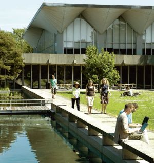
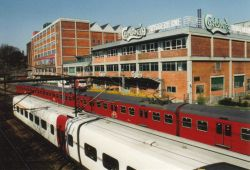

Title: Að hefja nám í borg Absalons
Slug: ad-hefja-nam-i-borg-absalons
Date: 2006-11-30 09:27:49
UID: 115
Lang: is
Author: Þórir Hrafn Harðarson
Author URL: 
Category: Póstur að utan, Háskólanám
Tags: 

Í sumar náði ég loksins þeim merka áfanga að útskrifast með B.Sc. gráðu  í rafmagnsverkfræði eftir smá brölt í Háskóla Íslands. Verkfræðin er þó þess eðlis að til fá réttindi þarf maður að klára meistaranám. Eftir útskrift var því ekkert annað í stöðunni en að ganga strax í það mál og halda áfram í skóla í tvö ár í viðbót. Smá reynsla af meistaranáminu í HÍ var nóg til að sannfæra þennan nema um að meistaragráða frá skólanum væri liklega ekkert voðalega merkilegur pappír, alla vega ekki af gæðum námsins að dæma. Því var stefnan sett á kóngsins Kaupmannahöfn. 

En af hverju Kaupmannahöfn? Við því er einfalt svar. Að komast í skólann þurfti ekki mikið annað en að skrá sig. Gömul tengsl Íslands við Danmörku gera það að verkum að það er lítið mál að flytja milli landanna og komast inn í danska kerfið. Danski tækniháskólinn, DTU, er virtur og góður skóli sem kostar ekkert fyrir flesta Evrópubúa að vera í. Þar að auki er undirritaður frekar heimakær og þar sem að flytja til Kaupmannahafnar er álíka mikill viðburður og að flytja til Reykjavíkur frá Akureyri, þá hentaði það ágætlega.

Fyrsta mál á dagskrá var að finna sér stað til að búa á. Því var sótt um að komast að á stúdentagarði í byrjun apríl. Áætlunin sú að það myndu líkast til losna fullt af íbúðum í lok júní og þá væri hægt að fá íbúð í júlí eða ágúst sem myndi bíða eftir manni þegar út væri komið í byrjun september. Það gekk ekki beint eftir, eftirspurn meðal námsmanna í húsnæði tölvuert meiri en manni hafði grunað. Til allrar lukku gat ég fengið að komast inn hjá vini mínum sem átti lausa stofu handa mér til að gista í meðan ég var að bíða eftir að fá inn á stúdentagarð. Núna í byrjun desember mun ég svo loksins fá húsnæði, eftir 8 mánaða bið. 

En burtséð frá húsnæðisveseni var gott að komast í skólann. Námið í DTU er töluvert skipulegra uppraðað en í HÍ og vilja dagarnir nýtast aðeins betur. Hvert misseri er 30 einingar, sem samsvarar 15 einingum í HÍ, og til að uppfylla þær þarf að taka um 3–4 kúrsa. Sambærilegt nám í HÍ krefst þess að viðkomandi taki 5 kúrsa. Náminu er svo raðað þannig að hverjum degi er skipt upp í tvö hólf, fyrir hádegi og eftir hádegi, og hvert hólf um 3–4 klukkutímar. Hvað þessum klukkutímum er svo varið í er misjafnt eftir kúrsum, en oft er byrjað á fyrirlestri og svo síðari helmings tímans varið í að leysa verkefni og dæmi. 5 eininga kúrs hefur eitt svona hólf í viku og 10 eininga tvö. Því má meðal nemandi búast við að eyða um 20–24 vinnutímum í viku í skólanum, en svo eru  skýrslur og verkefni utan þess. Andrúmsloftið í skólanum er einnig töluvert annað en maður á að venjast heima. Í verkfræðideildinni í HÍ upplifði ég alltaf að þar hefðu kennararnir töluvert minni áhuga á að kenna og meiri áhuga að fella sem flesta. Á 3ja ári í náminu í HÍ voru enn  kúrsar með 40–50% fallhlutfall. Í DTU hafa kennararnir margir hverjir töluvert meiri áhuga á að kenna en það sem maður á að venjast að heiman. Hér eru að sjálfsögðu nokkrar risaeðlur sem halda yfirleitt frekar gagnslausa fyrirlestra, en það virðist vera minna um þær og meira um hina sem virkilega hafa áhuga á því að kenna. Ég hef aðeins verið hér í 3 mánuði, það verður líklega að bíða fram í lok desember þegar prófin er búin áður en maður hefur haldbærar upplýsingar um hvort þessi bætta aðstaða og andrúmsloft skilar sér í betri einkunnum. 

Að búa í Danaveldi er ósköp þægilegt og, eins og áður hefur komið fram, ekki mikið meiri viðburður en að flytja frá Reykjavík í aðeins stærri borg. Helstu kostirnir sem Kaupmannahöfn hefur fram yfir Reykjavík eru góðar almenningssamgöngur og lægra matvöruverð. Verður þó að segjast að ég fékk vægt sjokk þegar ég fór fyrst að versla í matinn þar sem vöruúrvalið er töluvert minna en maður er vanur heima. Í ódýrustu búðunum fær maður bara helstu grunnnauðsynjar og smá úrval af því sem þeim datt í hug að panta þann mánuðinn. Aðeins dýrari búðir hafa svo aðeins meira úrval, sem er vanalega svipað einhverju millistigi milli þess úrvals sem þekkist í Bónus og Nóatún. Oftar en ekki þarf maður alla vega að kíkja í tvær mismunandi búðir þegar verslað er í matinn. Hér er líka skyndibiti töluvert ódýrari, nóg af stöðum þar sem hægt er að fá kebab, pítsur og annað slíkt á undir 500 kr. Það veldur því að maður freistast oft til að lifa á rusli þegar mikið er að gera. Hér er líka töluvert gott lestar- og strætókerfi, auk neðanjarðarlestar sem flytur mann hratt milli staða miðsvæðis. Þörfin fyrir bílinn er alla vega ekki jafnsterk hér og heima. Oft jafnvel fljótlegra að komast milli staða með því að taka lest en keyra. 

Eins og við má búast þá flykkjast hingað Íslendingar og skipta þeir vanalega þúsundum sem eru hér í námi hverju sinni. Því er ekki óalgengt að Íslendingur sem kemur hingað í nám eigi fyrir nokkra góða vini áður en hann er kominn inn fyrir landsteinanna. Ég persónulega átti hér þrjá góða vini að heiman, sem eru hér enn, þegar ég flutti til Danmerkur. Maður ætti því ekki að þurfa að örvænta yfir að einangrast og verða einmanna. Það er líka ágætt þar sem í minni reynslu eru danir lokaðri en við Íslendingar ef eitthvað er og getur verið frekar erfitt að kynnast þeim ef maður talar ekki reiprennandi dönsku. Mér hefur alla vega hingað til tekist að kynnast ágætlega finna, spánverja og chilé-búa, en engum dönum. En það er spurning hvort það muni kannski ekki breytast þegar á liður og maður verður sleipari í að skilja talaða dönsku. 

Allt í allt er Danmörk ágætur staður til búa. Fyrir þá sem eru meiri ævintýrafólk og vilja kynnast nýrri og framandi menningu er Danmörk ekki málið, hér er allt frekar kunnulegt. En fyrir okkur hin sem langar að fá að mennta okkur og geta samt haldið góðu sambandi við heimahagana, vini og vandamenn, þá er Danmörk ágætis val.

