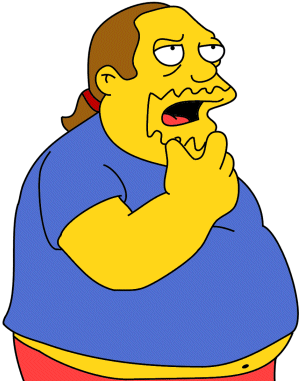

Title: Aðdáendamenning og hinn góði smekkur
Slug: addaendamenning-og-hinn-godi-smekkur
Date: 2008-01-10 13:25:00
UID: 208
Lang: is
Author: Unnur María Bergsveinsdóttir
Author URL: http://unnur.klaki.net
Category: Menningarfræði
Tags: 

Menningarfræðingurinn Henry Jenkins er jafnan talinn fyrstur akademískra fræðimanna til að mótmæla viðteknum hugmyndum um sjónvarpsáhorfandann sem óvirkan viðtakanda. Kenningar sínar setti hann fyrst fram í bókinni _Textual Poachers.: Television Fans and Participatory Culture_ sem kom út árið 1992. Hér á eftir verður tæpt á aðalatriðum þeirra hugmynda sem Jenkins setur þar fram.

Valdið, og þá nánar tekið baráttan um menningarforræði, er miðlægur punktur í kenningum Jenkins um aðdáendamenningu. Hann byggir á kenningum Bourdieu um hinn góða smekk og gildi hans og sýnir fram á hvernig staðalímyndir af aðdáendum tiltekinna menningarfyrirbrigða eru skapaðar með það að markmiði að lágmarka menningarleg völd þessara hópa. Á sama tíma liggur þó vald aðdáendanna í möguleikum þeirra á því að túlka menningarafurðir hverskonar á máta sem framleiðendur þeirra sáu ekki fyrir og skapa út frá þeim nýjar afurðir sem framleiðendur hins upprunalega efnis hafa ekki stjórn á.

Samkvæmt hugmyndum Bourdieu er smekkur ekki náttúrulegt fyrirbæri heldur félagslegt og það að hafa góðan smekk er því lærð hegðun en ekki meðfædd. Mörk hins góða smekks skilgreinir hann út frá hagsmunum hópa sem afmarkast einna helst af stéttarstöðu en einnig af kyngervi. Í umfjöllun sinni stillir Jenkins aðdáendum sjónvarpsþátta meðal annars upp á móti íþróttaaðdáendum sem hann bendir á að samfélagið samþykki mun frekar. Þeir síðarnefndu leggja mikla áherslu á raunveruleika þeirra atburða sem þeir fylgist með á meðan þeir fyrrnefndu eru oft ásakaðir um skort á þroska fyrir þær sakir að kjósa fantasíuna.[^1] Vert er að minna á að íþróttaaðdáendur eru að meirihluta karlmenn en aðdáendur sjónvarpsþátta oft konur.[^2]

Forræði yfir hinum góða smekk er ein helsta aðferðin til að viðhalda félagslegri aðgreiningu þar sem þeir sem hafa hinn góða smekk á valdi sínu eiga greiðari leið til metorða innan þess skipulags og þeirra hópa sem skilgreina sig út frá tilteknum smekk. Sömuleiðis verður þannig smekkur þeirra sem valdamestir eru í samfélaginu sá smekkur sem almennt er skilgreindur sem eftirsóknarverður. Vegna þess að smekkurinn er svo samofinn öðrum samfélagslegum og menningarlegum þáttum þá getur fagurfræðilegt smekkleysi haft í för með sér samfélagslega höfnun hins smekklausa.

Á sama hátt og smekkurinn er ekki náttúrulegt fyrirbæri þá er viðhald hins góða smekks hinsvegar ekki sjálfvirkt. Hinn góði smekkur er sífellt í krísu og tilvera þeirra smekklausu ögrar stöðu hans stöðugt. Því þarf að standa vörð um mörk hans og er það gert með umræðum, sérstaklega í fjölmiðlum. Efni sem er álitið óæskilegt er oft úthrópað sem skaðlegt fyrir samfélagið/neytendur þess á einhvern hátt og lagasetningar og þrýstingur af öðru tagi eru notaðar til þess að viðhalda fagurfræðilegum viðmiðum undir því yfirskini t.d. að vernda börn og unglinga gegn skaðlegum áhrifum afþreyingarefnis eða að standa vörð um menningararf.

Jenkins bendir á að líta megi á einfaldaðar og oft niðrandi staðalímyndir aðdáendamenningar sem birtingarmynd hræðslunnar við það að viðteknum smekk sé ógnað. Aðdáendurnir ögra varðmönnum hins viðtekna smekks með því einu að fíla menningarefni sem fellur utan hins viðtekna smekks eða með því að upphefja uppáhaldið sitt með því að nálgast það á máta sem vanalega er frátekinn fyrir efni sem flokkast til „æðri menningar“. _„The most intolerable thing for those who regard themselves as the posessors of legitimate culture is the sacrilegious reuniting of tastes which taste dictates shall be seperated_“[^3] skrifaði Bourdieu einmitt.

Eitt af vandamálunum sem varðmenn hins viðtekna smekks standa frammi fyrir er að það er ekki hægt að afskrifa aðdáendur sem hóp þar sem þeir eru oft vel menntað fólk úr miðstétt[^4]. Smekk þeirra verður því að fagurfræðilegri perversjón[^5]. Varðmennirnir bregðast við þessu með því að framandgera aðdáendurna og opinberar árásir og háð í fjölmiðlum eru klassísk leið til þess að gera almenningi það ljóst að smekkur aðdáendanna slæmur og aðdáendurnir sjálfir þar með á einhvern hátt gallaðir. Þannig eru einstaklingar lattir frá því að aðhyllast hinn „slæma smekk“. Þessi aðferð virkar upp að vissu marki. Ef svo væri ekki fyndu aðdáendur ekki hjá sér þörf til að réttlæta hugðarefni sín. Sem þeir gera oft með því t.d. að benda á það sem þeir eiga sameiginlegt „venjulegu“ fólki en líka með því að benda á aðdáendur sem eyða meiri tíma/orku í áhugamálið en þeir sjálfir, einstaklinga sem hafa týnt sér djúpt inn í heim fantasíunnar. Með auknum samskiptamöguleikum hefur öðrun aðdáendanna hinsvegar líka styrkt þá. Það að vita að til eru ótal margir sem hafa áhuga á sama sjónvarpsþættinum rýfur einangrunina og þjappar þeim saman sem hóp með sameiginlega sjálfsmynd. 

Jenkins segir frá atriði úr sjónvarpsþættinum Saturday Night Live þar sem William Shatner talar til Star Trek áhorfanda og segir honum að vaxa upp úr þáttunum, að öðlast líf. Þetta er algeng ályktun hvað Star Trek aðdáendur varðar, að þeir séu óþroskaðir einstaklingar sem séu enn ekki færir um að axla þá ábyrgð sem því fylgir að fullorðnast.[^6] Bók Jenkins er þó einmitt skrifuð út frá þeirri forsendu að aðdáendur Star Trek eigi sér áhugavert líf fyrir tilstilli þáttanna og þeirrar aðdáendamenningar sem blómstrar í kringum þá. Jenkins vísar í því samhengi til kenninga De Certeau um lestur og hugmynda hans um neytandann sem notanda. Það sem hann á við er að þrátt fyrir tilraunir valdhafa til að stjórna lestri (bæði á texta, myndum og öðrum tjáningarformum) er það ævinlega lesandanum í sjálfsvald sett hvernig hann afkóðar textann. Lesandinn bætir þannig eigin hugmyndum og ályktunum við merkingu vörunnar, fyllir í eyður, spinnur útúrdúra, býr til samhengi sem höfundar sjónvarpsþátta reiknuðu aldrei með. 

Handan valdsviðs framleiðandanna verður geta sjónvarpsþættir þannig af sér fanfiction, myndlist, umræður, og allra handa tjáningu. Með aktívum lestri verður einfalda sjónvarpsgláp að flóknum og gefandi lestri aðdáandans. Þannig er í raun kolröng sú einfaldaða mynd sem svo oft er dregin upp af Star Trek aðdáandanum að hann hangi dofinn fyrir framan sjónvarpið daginn út og inn. 

Birminghamskólinn[^7] hefur fjallað um hugtakið bricolage hvað merkingarsköpun varðar og bent á það að það er ekki hin eiginlega merking hlutanna sjálfra heldur það samhengi sem þeir eru settir í sem skapar tákngildi þeirra.[^8] Þetta tengir Jenkins mjög skemmtilega við hugmyndir De Certeau og dregur upp mynd af lesandanum sem hirðingja sem ferðist um lendur sjónvarpsþáttanna, hirði það sem honum hugnast og skeytir saman eftir eigin smekk. 

Jenkins og De Certeau greinir á um tvær hliðar hins aktíva lesturs. De Certeau aðgreinir skrifendur (framleiðendur) og lesendur (áhorfendur) mjög skýrt. Hið skrifaða hefur hjá De Certeau varanleika sem hið lesna hefur ekki og er þar með í sterkari stöðu til að setja lestrinum skorður á meðan að hinn aktívi lestur er tækifærissinnaður og sætir lagi þegar færi gefst á að skjóta inn merkingu eða snúa upp á þá sem er fyrir. Jenkins telur þetta ekki gilda um aðdáendamenninguna. Fyrir það fyrsta eru lesendur De Certeau einangraðir en það gildir ekki um aðdáendamenninguna sem er félagslegt umhverfi þar sem lestri er deilt og sú merking sem lögð er í hlutina konkretíseruð með umræðu. Þannig getur hinn stolni lestur orðið grundvöllur frekari merkingarsköpunar í stað þess að gufa upp eins og gerist í hugmyndum De Certeau. Í ofanálág gerir sköpunargleði aðdáendanna skilin á milli skrifenda og lesenda mun óskýrari. Lesendurnir eru líka framleiðendur og verða á þeim grundvelli jafnvel að fullgildum framleiðendum. Margir vísindaskáldsagnahöfundar byrjuðu feril sinn einmitt með aðdáendaskrifum í tímarit aðdáenda.[^9] Howard Becker notar hugtakið Art World til að lýsa tengslanetsheimi hinnar samþykktu menningar. Samkvæmt Jenkins á aðdáendamenningin líka sitt Art World sem er utan stjórnsvæðið framleiðendanna og inn á þetta svæði stíga óháð framleiðslufyrirtæki sem þjóna aðdáendunum. 

Vald aðdáendanna nær þó ekki út fyrir þeirra heim. Þegar kemur að því að hafa bein áhrif á sjónvarpsþættina hafa þeir lítil raunveruleg áhrif. Við heyrum stundum af því að undirskriftasafnanir hafi komið í veg fyrir að þáttaraðir hafi verið teknar af dagskrá en jafnvel þegar sýnt er fram á að fjöldinn allur af áhorfendum vilji að tilteknar þáttaraðir haldi áfram í framleiðslu velta slíkar ákvarðanir í raun og veru fyrst og fremst á duttlungum framleiðandanna. Það er því mýta að hin ósýnilega hönd hins frjálsa markaðar sjái til þess að það sem við sjáum í sjónvarpinu sé það sem viljum. 

[^1]: Henry Jenkins: _Textual Poachers. Television, Fans & Participating Culture_,  bls. 18-19. 
[^2]: Idem,  bls. 48.
[^3]: Idem, bls. 17.
[^4]: Jenkins rökstyður ekki þessa staðhæfingu en eftir að hafa velt þessu fyrir mér er það reyndar augljóst að þetta er sá hópur sem hefur efni á því að eyða tíma og peningum í áhugamál. 
[^5]: Idem, bls. 19.
[^6]: Idem,  bls. 20.
[^7]: Hér er átt við Hebdige, Stuart Hall, Tony Jefferson og Angela McRobbie auk fleiri fræðimanna.
[^8]: Henry Jenkins: _Textual Poachers. Television, Fans & Participating Culture_, bls. 39.
[^9]: Idem,  bls. 44-46.

