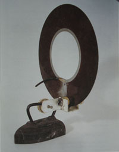
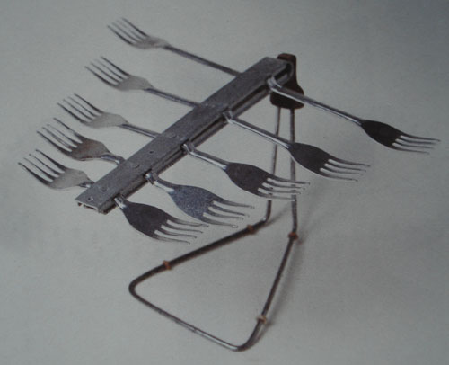
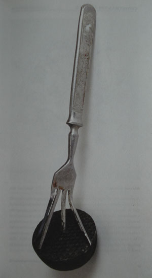

Title: Af dilkadrætti
Slug: af-dilkadraetti
Date: 2008-04-08 17:10:28
UID: 246
Lang: is
Author: Þóra Pétursdóttir
Author URL: 
Category: Fornleifafræði, Menningarfræði
Tags: Home-Made:Contemporary Russian Folk Artifacts, Rússland, vöruskortur, nútímamenning, menningararfur, thingamyjigs, notagildi, Magritte, flokkun, túlkunarferli, endurvinnsla, Cornelius Holtorf, Vladimir Arkhipov

Í sumar sem leið var ég á rölti um miðbæ Reykjavíkur og álpaðist, eins og maður gerir iðulega, inn í einhverja af bókabúðum bæjarins og, eins og iðulega, fór ég ekki tómhent þaðan út aftur. Einhversstaðar í hilluflæminu varð lítil forvitnileg bók a vegi mínum sem strax vakti athygli mína og hefur síðan verið mér bæði góð afþreying og tilefni til vangaveltna. Þessi litla forvitnilega bók heitir _Home-Made: Contemporary Russian Folk Artifacts_ og er eftir rússneska listamanninn Vladimir Arkhipov. Arkhipov er sjálfmenntaður listamaður sem hefur síðan 1990 einbeitt sér að rússneskri nútímamenningu og þá sérstaklega heimatilbúnum, hversdagslegum nytjahlutum. Í stuttu máli hefur Arkhipov ferðast um Rússland vítt og breitt, inn á heimili rússneskrar alþýðu, vopnaður myndavél og diktafón, í leit að efnivið í listsköpun sína. Í bráðum tvo áratugi hefur hann nú sankað að sér einhverju forvitnilegasta safni gripa sem um getur og auk þess sköpunarsögu hvers og eins þeirra. Í safni hans eru nú yfir 1000 munir af öllum stærðum og gerðum – allt frá heimasmíðuðum baðtappa til traktors.

Arkhipov er fæddur í Sovétríkjunum 1961 og elst upp í samfélagi þar sem stöðugur skortur var á flestum vörum til daglegs lífs og brúks. Og við þær aðstæður kynntist hann strax í æsku hinum ýmsu „ólíkindatólum“ – furðulegum heimasmíðuðum tækjum og tólum sem foreldrar hans töfruðu fram til heimilisins. Það tók Arkhipov þó mörg ár að átta sig á því að þessi yfirlætislausu höfundaverk foreldra hans og annarra væru í rauninni ómetanlegur hluti sovésks menningararfs. Í þögn sinni segja þessir hversdagslegu og oft á tíðum framandi og illskiljanlegu hlutir sögu sovéskrar alþýðu, efnahags- og pólitískra aðstæðna og samfélagsbreytinga í fortíð sem er svo nálæg okkur, þó hún virðist ógnarfjærri.

Fyrir utan algjörlega einstakt útlit sitt eiga þessir furðuhlutir, eða „thingamyjigs“ eins og Arkhipov kallar þá, það sameiginlegt að vera framleiddir í einu eintaki, til þess að svara brýnni en takmarkaðri (eða staðbundinni) þörf, en ekki sem vörur (e. goods) með hagnaðarmöguleika í huga. Þar að auki virðist fagurfræðilegt mikilvægi sjaldan hafa verið til staðar, heldur hefur notagildið í langflestum tilfellum verið það sem mestu máli skipti. Margir þeirra eru samsettir, smíðaðir úr öðrum hlutum sem hver og einn höfðu e.t.v. tapað (nota)gildi sínu en gátu með sameinuðum kröftum sínum þjónað nýjum tilgangi. Þannig er það að þrátt fyrir að flest þessara ólíkindatóla komi manni einkennilega fyrir sjónir getur verið að hlutar þeirra séu ekki jafn framandi þegar betur er að gáð; Tappi í baðkar búinn til úr tálguðum skósóla og gaffli, götusópara-skófla úr umferðarskilti á hvolfi, loftnet úr göfflum, herðatrjám, gjörðum, straujárnum o.s.frv.

Sem fornleifafræðingi finnst mér bók Arkhipovs ekki bara skemmtileg lesning prýdd flottum ljósmyndum heldur finnst mér hún líka vekja upp ótal margar áhugaverðar spurningar og vangaveltur tengdar fræðigreinum eins og fornleifafræði þar sem viðfangsefnið er hlutir og efnismenning. Til dæmis vangaveltur sem snúa að flokkun hluta og túlkun á gildi þeirra, verðmæti og notkun. Hvað _er_ þetta? og, til hvers er það brúklegt?

Á frægu málverki eftir Magritte er mynd af pípu og undir henni stendur „Ceci n’est pas une pipe“, eða „þetta er ekki pípa“. Mér dettur þessi pípa, eða ekki-pípa, oft í hug þegar ég fletti bók Arkhipovs því þótt svo hugsun Magritte hafi kannski verið dálítið önnur eru hversdagsleg furðuverk Arkhipovs líka annað en þau virðast við fyrstu sýn. Vegavinnuskiltið er ekki vegavinuskilti, heldur götusópara-skófla. Gafflar eru ekki gafflar, heldur loftnet eða tappar í baðkar. Eins og Arkhipov segir sjálfur eru sumir hlutanna jafnvel svo framandi og flóknir að þeir láta ekki flokkast „because there is nothing else like them in existence“[^1] . Þessi samsettu og endurnýttu furðuverk undirstrika því að mínu mati með óyggjandi hætti hversu ótrúlega takmarkandi flokkun (e. classification) gripa er í eðli sínu. Þegar gripir eru dregnir í dilka, t.d. á vettvangi eða við úrvinnslu fornleifauppgrafta, er það eðlilega gert á grundvelli þeirrar þekkingar sem er til staðar, þ.e.a.s. gripir eru dregnir í þá dilka sem til eru og efnislegir eiginleikar þeirra og ásjóna virðast helst heyra undir. Þannig teljum við okkur svara spurningunni “hvað er þetta? og þ.a.l., til hvers er það brúklegt? Við höfum jafnvel tilhneigingu til að ganga enn lengra og fullyrða ýmislegt um verðmæti hluta á grundvelli þessa dilkadráttar – sverð í gröf heiðins landnámsmanns er verðmætara en brýnið sem hann bar í belti sínu. Hið sama gerist líka þegar við rekumst á nýja og framandi hluti í daglegu lífi okkar. Við skoðum þá og mátum við aðra hluti úr okkar þekkta efnislega menningarumhverfi og túlkum þá og flokkum á grundvelli þess.

Ég vil ekki halda því fram að flokkun gripa sé slæm, því hún er nauðsynlegt skref í túlkunarferlinu (bæði í fræðilegum og hversdagslegum skilningi). Hins vegar er mikilvægt að maður sé meðvitaður um það hve huglægt og menningarlega skorðað þetta ferli er, en það er einmitt það sem bók Arkhipovs opnar augu manna fyrir.  Ef við lítum á furðuverk Arkhipovs verður flokkun eða túlkun á grundvelli míns (efnis)menningarlega bakgrunns erfið og stundum ómöguleg – nema ég fengi að slíta gripina í sundur. Þ.e.a.s. ég þekki þessa hluti, en _þekki_ þá samt ekki! Í því samhengi sem þeir koma mér fyrir sjónir í bókinni eru þeir mér algjörlega framandi og það er aðeins í gegnum sköpunarsögu þeirra (sem fylgir hverjum hlut) að ég get áttað mig á því _hvað þeir eru_. Ef ég hefði dregið þá í dilka og túlkað útfrá minni menningarlegu forskrift hefði ég komist að einhverju allt öðru.

Það samfélagslega samhengi sem þessi furðuverk eru upprunnin í er auðvitað mjög ólíkt því samfélagslega samhengi sem ég og mínir dilkar tilheyrum. Og það er einmitt eitthvað sem maður þarf að hafa í huga við  rannsóknir á fortíðinni. Við aðstæður eins og ríktu í Sovétríkjunum eru hlutir kannski ekki jafn fastskorðaðir við einhverja ákveðna forskrift og í okkar kapítalíska alsnægtasamfélagi. Menn sjá hlutina e.t.v. í samhengi hverju sinni og í stað þess að „spyrja hvað er þetta?“, spyrja þeir „hvað _getur þetta orðið?_“ Í stað þess að sjá takmörk þeirra sjá menn möguleikana sem felast í hlutunum sjálfum og þannig mætti segja að verði til annað samband eða samskiptaform á milli hluta og manna – sem ekki byggir eingöngu á forskrifuðum hlutverkum heldur á gagnvirkum samskiptum þar sem handlagni og þekking manna kallast á við form, efni, liti og áferð hlutanna.

Dæmi um það hve forskrifaðar og takmarkaðar hugmyndir við höfum um hluti í umhverfi okkar er til dæmis hve fljót við erum oft að úrskurða hluti „ónýta“. Það felst í orðinu „ónýtt“ að það á við um hlut sem ekki er brúklegur lengur. Þ.e.a.s. hann er ekki brúklegur til þess _eina_ hlutverks sem honum var og er ætlað. Við aðstæður eins og furðuverk Arkhipovs eru upprunnin í á þetta hugtak alls ekki við. Hlutir eru ekki „ónýtir“ – þeir eru kannski á einhverjum tímabilum lífsskeiðs síns „ónýttir“, en fá síðan ný og ný hlutverk í krafti eiginleika sinna og seiglu. Skilgreiningin á því hvað hlutir _eru_ verður í þessu samhengi algerlega fljótandi og möguleikarnir á flokkun og dilkadrætti óljósir – eða ónauðsynlegir.

Eins og fornleifafræðingurinn Cornelius Holtorf bendir á þá hættir okkur til þess að líta á efnislega eiginleika hluta sem algerlega stöðug og óhagganleg fyrirbæri: „a pot was a pot was a pot“[^2] . Hlutir eins og furðuverk Arkhipovs sýna hins vegar fram á hið gagnstæða: gaffall er tappi er loftnet.... og undirstrika þannig mikilvægi þess að líta a hluti sem „verur“ sem geta í krafti eiginleika sinna skipt um hlutverk (og þ.a.l. gildi) margoft á lífsleið sinni. Til þess að skilja hluti, t.d. úr fortíðinni, og hvað þeir _eru_ er því ekki nóg að draga þá í forskrifaða dilka – sem getur raunar beinlínis takmarkað skilning okkar – heldur verðum við líka að reyna að átta okkur á því _hvernig þeir eru tilkomnir_...og jafnframt að sætta okkur við það að sumir hlutir eigi ekki heima í dilkum.    

[^1]: Arkhipov, V. (2006) _Home-Made: Contemporary Russian Folk Artifacts_. FUEL, London.

[^2]: Holtorf, C. (2002) „Notes on the life history of a pot sherd“ í _Journal of Material Culture_ 7:1, bls. 49-72.

[^3]: Ljósmyndir af gripum: Arkhipov, V. (2006) _Home-Made: Contemporary Russian Folk Artifacts_. FUEL, London.

