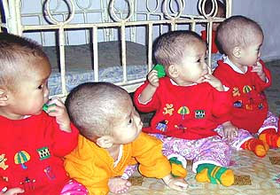

Title: Af hverju ættleiðum við ekki börn frá Eþíópíu eða Grænlandi?
Slug: af-hverju-aettleidum-vid-ekki-boern-fra-ethiopiu-eda-graenlandi
Date: 2006-04-06 08:24:00
UID: 61
Lang: is
Author: Svala Jónsdóttir
Author URL: 
Category: Samfélag, Í umræðunni
Tags: 

Þegar við lesum um þekkta einstaklinga sem ættleiða börn frá fátækum löndum, þá gætum við freistast til þess að halda að það sé ekki flókið mál að ættleiða munaðarlaust barn erlendis frá. Við gætum haldið að það þyrfti ekki annað en hjartarými, húsrými og hóflegt magn af peningum til þess að bjóða foreldralausu barni sómasamlegt líf. En málið er því miður ekki svona einfalt.  

Hulda Hákon myndlistarkona velti því fyrir sér í DV í síðasta mánuði hvers vegna Íslendingar ættleiddu ekki börn frá Grænlandi. Hulda hafði heimsótt grænlenskt munaðarleysingjahæli og sagði það hafa verið erfitt að sjá „öll þessi börn sem ekki eiga neina foreldra.“ Hún benti á að flug til Grænlands tæki aðeins tvo tíma, sem er svipað og flug til Ísafjarðar með hefðbundnum seinkunum.

Munaðarleysingjar heimsins eru ótrúlega margir nú í byrjun 21. aldarinnar. Samkvæmt tölum Unicef voru fleiri en 100 milljón munaðarlaus börn undir 18 ára aldri í heiminum í lok ársins 2003. Leikkonan Angelina Jolie vakti athygli heimspressunnar á síðasta ári þegar hún ættleiddi litla stúlku frá Eþíópíu, en áætlað er að foreldralaus börn í Eþíópíu séu allt að fimm milljónir. Ekkert þeirra verður þó ættleitt til Íslands á þessu ári eða því næsta, ef að líkum lætur. 

### Hvaðan má ættleiða?

Hvernig stendur á því að við ættleiðum ekki börn frá Eþíópíu eða Grænlandi? Hvers vegna þarf fólk að bíða mánuðum og jafnvel árum saman eftir að því að fá að ættleiða barn, ef heimurinn er fullur af munaðarlausum börnum sem þrá það heitast að eignast foreldra? Svarið má að hluta til finna í reglum þeirra landa þar sem börnin búa, en íslenskar reglur um ættleiðingar hafa líka sitt að segja.

Ef við skoðum erlendar ættleiðingar í Bandaríkjunum, þá koma flest börnin frá Kína rétt eins og hér á landi. Næstflest börn koma frá Rússlandi, síðan kemur Guatemala, Suður-Kórea, Úkraína, Kazakstan, Eþíópía, Indland, Kólumbía og Filipppseyjar. Íslendingar geta aðeins ættleitt börn frá þremur af þessum tíu löndum, þ.e. Indlandi, Kína og Kólumbíu. Auk þess geta íslenskir foreldrar ættleitt börn frá Tælandi og Tékklandi, en Tékkland bættist nýlega í hóp þeirra landa sem Ísland er með ættleiðingarsamband við.

Íslensk lög gera ekki ráð fyrir að væntanlegir foreldrar sæki um ættleiðingu beint til annars lands. Samkvæmt lögum um ættleiðingar má enginn sem er búsettur hér á landi ættleiða erlendis frá nema með forsamþykki dómsmálaráðuneytisins. Lögin segja einnig að enginn megi hafa milligöngu á Íslandi um ættleiðingar erlendis frá nema löggilt ættleiðingarfélög. Á öllu landinu er eitt löggilt ættleiðingarfélag, en það er Íslensk ættleiðing. Íslensk ættleiðing er aðeins í sambandi við fimm lönd og það takmarkar verulega svigrúm Íslendinga til þess að ættleiða börn frá öðrum löndum.

### Hverjir mega ættleiða?

Íslensk lög takmarka ekki aðeins þær leiðir sem hægt er að fara til þess að ættleiða börn erlendis frá, heldur kveða þau einnig á um það hverjir mega ættleiða. Leyfi til ættleiðingar eru háð ýmsum skilyrðum, m.a. varðandi aldur, hjúskaparstöðu, fjárhag og heilsufar. Væntanlegir foreldrar þurfa einnig að standast skoðun ýmissa sérfræðinga áður en leyfið er veitt. 

Lengi vel miðuðust íslensk ættleiðingalög eingöngu við hjón. Þegar lög um staðfesta samvist samkynhneigðra voru samþykkt árið 1996 var sérstaklega tekið fram að ákvæði ættleiðingarlaga ættu ekki við um staðfesta samvist. Fjórum árum síðar var lögunum breytt í þá átt að fólki í staðfestri samvist var leyft að ættleiða börn makans, nema um væri að ræða kjörbarn frá öðru landi. Fólk í staðfestri samvist má enn ekki ættleiða börn erlendis frá. 

Þegar ný lög um ættleiðingar voru samþykkt árið 1999 var einhleypum leyft að ættleiða börn „ef sérstaklega stendur á og ættleiðing er ótvírætt talin barninu til hagsbóta.“ Áður höfðu örfáir einhleypir einstaklingar fengið undanþágu til þess að ættleiða, en þarna var í fyrsta skipti kveðið á um rétt þeirra til ættleiðinga í lögum.

Í umræðu um frumvarpið á Alþingi sagði Sólveig Pétursdóttir, þáverandi dómsmálaráðherra að í þessu ákvæði væri lögð áhersla á það að „ef heimila á einhleypum manni að ættleiða barn, þá þarf að sýna fram á að sá hinn sami sé hæfileikum búinn til að ala upp barn **umfram það sem venjulegt má teljast**.“ Sólveig sagði jafnframt að auknar kröfur til einhleypra byggðust á því að almennt væri barni „talið fyrir bestu að alast upp hjá tveimur foreldrum, þ.e. móður og föður.“

Í raun geta afar fáir einhleypir Íslendingar ættleitt börn frá öðrum löndum, þar sem aðeins tvö af þeim löndum sem Íslensk ættleiðing er í sambandi við leyfa ættleiðingar frá einstaklingum. Samkvæmt upplýsingum frá Íslenskri ættleiðingu geta að meðaltali tveir til þrír einhleypir Íslendingar ættleitt erlend börn á ári hverju, en um 20 einstaklingar eru nú á biðlista. 

### Hverra hagsmuna er verið að gæta?

Á síðasta ári vakti mál 48 ára gamallar konu nokkra athygli í íslenskum fjölmiðlum, en henni var synjað um leyfi til ættleiðingar vegna aldurs og holdafars. Konan sætti sig ekki við synjunina og fór með málið fyrir Héraðsdóm Reykjavíkur, þar sem hún bar sigur úr býtum. Sjónarmið dómsmálaráðuneytisins í því máli virðist hafa verið að betra væri fyrir munaðarlaust barn að alast upp á munaðarleysingjahæli, heldur en að alast upp hjá miðaldra, þéttholda konu á Íslandi. 

Í sumum tilfellum gerir íslenska ríkið meiri kröfur til foreldra sem vilja ættleiða, heldur en heimalönd barnanna gera. Þannig segir nýleg reglugerð um ættleiðingar að almennt sé hámarksaldur umsækjenda 45 ár, þó að t.d. yfirvöld í Kína leyfi að allt 55 ára gömlu fólki að ættleiða börn þaðan. Reglugerðin krefst þess líka að hjón hafi búið saman í þrjú ár en (gagnkynhneigt) sambúðarfólk í fimm ár, áður en parið fær að ættleiða. 

Það má spyrja sig hvort allar þessar reglur eru til þess fallnar að gæta hagsmuna munaðarlausra barna, eða hvort að þær byggi á gamaldags og jafnvel úreltum hugmyndum um foreldra og fjölskyldur. Að minnsta kosti er erfitt að skilja þann hugsunarhátt að betra sé fyrir barn að alast upp án foreldra en að alast upp hjá ástríkri fjölskyldu, þó svo að foreldrarnir falli ekki inn í hefðbundnar staðalmyndir um gagnkynheigð hjón á „réttum“ aldri. 

---

#### Heimildir

- Adopting Ethiopia’s Aids Orphans, BBC News Belgium, 4. mars 2005
- Heimasíða Alþingis, <http://www.althingi.is/altext/125/10/r12160822.sgml> Skoðað 5. apríl 2006.
- Heimasíða bandaríska utanríkisráðuneytisins, <http://travel.state.gov/family/adoption/stats/stats_451.html> Skoðað 5. apríl 2006.
- Heimasíða Íslenskrar ættleiðingar, [www.isadopt.is](http://www.isadopt.is) Skoðað 5. apríl 2006.
- Lög um staðfesta samvist nr. 87/1996
- Lög um ættleiðingar nr. 130/1999
- Reglugerð um ættleiðingar nr. 238/2005
- The State of the World’s Children 2006: Excluded and Invisible (skýrsla). Unicef, 2006. 
- Ættleiðing og ofþyngd: Ríkið dæmt. Ríkisútvarpið, 10. júní 2005
- Ættleiðum grænlensk börn. DV, 11. mars 2006

