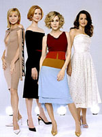
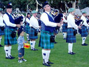
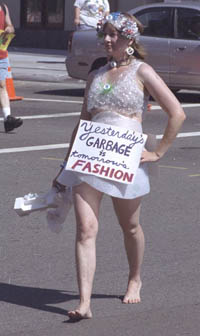

Title: Af hverju klæðum við okkur í föt
Slug: af-hverju-klaedum-vid-okkur-i-foet
Date: 2006-10-17 15:49:00
UID: 103
Lang: is
Author: Erna María Jensdóttir
Author URL: 
Category: Þjóðfræði, Neyslusamfélagið
Tags: 

Á hverjum degi vöknum við og tökum ákvörðun um hvaða fötum við ætlum að vera í þann daginn. Oft skiptum við líka um föt mörgum sinnum yfir daginn. Hvort sem sú ákvörðun er meðvituð eða ekki þá hefur hún gífulega mikla þýðingu fyrir ímynd okkar.  Elizabeth Rouse skrifaði bókina _Understanding Fashion_[^1], þar veltur hún fyrir sér afhverju við klæðum okkur í föt og hvað hefur áhrif á hvaða föt við klæðum okkur í.  Þó svo að Elizabeth hafi ekki verið að gera neinar tímamóta uppgvötanir við leit að svari spurningar sinnar, er áhugavert að velta þeim hversdaglega hlut eins og fötum aðeins fyrir sér og skoða hvers vegna þau skipa eins stóran sess í líf okkar og raun er.

### Margar skýringar hafa verið gefnar á því hversvegna við klæðum okkur í föt.

Elizabeth telur að fjórar skýringar séu þar helst ráðandi. Ein þeirra er  hagnýting. En þá eru fötin til að verja líkama okkar gegn áreitum og aðskotahlutum og svo til að halda á okkur hita eða kæla okkur. Þessi skýring virðist þó ekki duga ein og sér sem ástæða þess að við klæðum okkur í föt, því oft klæðum við okkur í föt sem eru óhagnýt og óþægileg. Eins og að klæðast jakkafötum í miklum hita, ganga í óþægilegum skóm eða stuttum pilsum í kulda. Elizabeth kemur inn á að maðurinn búi yfir eðlislægi hita- og kælikerfi eins og flest önnur spendýr og því sé í raun ekki eins mikil nauðsyn fyrir okkur að klæða okkur. 

Önnur ástæða er talin vera kynferðislegt aðdráttarafl. Þá er átt við að fólk klæði sig í föt til að draga fram og auglýsa kynferði sitt og ýkja þá líkamsburði sem eru aðlaðandi fyrir hitt kynið. Það virðist heldur ekki alltaf ganga upp, því oft klæða kynin sig í eins föt eða þá að einstaklingar eða kyn klæða sig þannig að þau hylji líkamsvöxt sinn eins og tíðkast til dæmis meðal islamskra kvenna.

Sumir halda því fram að við klæðum okkur í föt vegna þess að við fyllumst skömm yfir að láta sjá okkur nakin. Oft tengist þetta viðhorf trúarbrögðum þar sem í mörgum trúarbrögðum eru gefnar einhverjar kröfur á klæðnað. Í kristni sem dæmi, er það talið syndsamlegt að ganga um nakinn og því krafa um að kynfæri séu hulin. Það virðist heldur ekki alveg ganga upp því það ætti þá að duga að ganga í nærfötum einum sér. Einnig virðist þetta ekki gilda um öll samfélög, því mörg dæmi eru um að fólki finnst mjög eðlilegt að ganga um nakið og virðist nekt eða þessi skömm sem ef til vill er vísað í, ekki felast í að vissir líkamspartar sjáist eins og kynfæri, því Rouse tekur dæmi um konur í Nuer ættbálknum í  Afríku sem finnast þær naktar án sérstaka „diska“  sem þær geyma í vörunum.

Elizabeth telur að fegurðargildi eða þörfin til að skreyta sig sé helsta skýring þess að við klæðum okkur í föt, þessi hvöt virðist hafa verið hjá frummönnum og einnig þekkist þetta á meðal simpansa. Fólk virðist almennt hafa mjög gaman af því að skreyta sig með allskonar hlutum. Þessir hlutir eru oft á tíðum fágætir, verðmætir og taldir fallegir í viðkomandi samfélagi. Fólk í nær öllum samfélögum sama hversu ólík þau eru, skreyta sig að einhverju leyti. Þessir hlutir hafa ekki þær hagnýtu skýringar eins og vörn gegn kulda, hita eða áreiti.

Þær skýringar sem hér hafa verið nefndar hafa flestar nokkurn grundvöll sem hugsanleg skýring en virðast samt ekki ná að skýra ástæðu þess að við klæðum okkur að öllu leyti. Líklegast er við klæðum okkur eftir aðstæðum og þörfum. 

### Klæðnaður sem samskiptamáti

Það er sjaldnast tilviljun sem ræður því hvernig fötum við klæðumst. Elizabeth tekur það skýrt fram í bókinni að klæðnaður sé félagsleg hegðun og nefnir hún ótal dæmi um það hvernig við gefum frá okkur skilaboð með fatnaðinum.  Við gefum skilaboð um hver við erum, hvað við gerum og hvað við viljum að aðrir haldi um okkur. Við getum notað fatnað til að stýra því hvernig ókunnugir líta á okkur. Bankastarfsmenn klæða sig til að mynda upp í jakkaföt til að sýnast ábyrgir og traustsins verðugir. Því fer klæðnaðurinn ekki eftir veðurfari eða þægindum. Vændiskonur klæða sig upp í eggjandi klæðnað og efnislítinn til að líta út fyrir að vera „til í tuskið.“ Að sama skapi myndi því bankastarfsmaðurinn ekki klæða sig upp eins og vændiskonan.

Hópar klæða sig oft í svipaðan fatnað og eru þjóðernishópar ef til vill stærstu hóparnir. Mynstur, liti og sniðir eru oft einkennandi fyrir hópa. Sem dæmi um það eru skotapils. En á Skotlandi er gömul hefð fyrir því að fjölskyldur klæðist pilsum með ákveðnum mynstrum og litum sem eru einkennandi fyrir fjölskyldurnar. Einnig nefnir Elizabeth dæmi um að í Japan klæðist fólk litum eftir því á hvað aldri það er. 

Fatnaður hefur þannig ólíka merkingu á milli þjóðfélags- og menningarhópa og því erfitt fyrir ókunnuga að skilja þau skilaboð sem fatnaðurinn á að standa fyrir, eins og með skotapilsin.
Fólk klæðist einnig fatnaði til að skilgreina sig innan hópa. Er þar helst að nefna vinnufatnað. Þá klæðir fólk sig ólíkt eftir því hvaða hlutverki það gegnir.  Það fellst líka ákveðið öryggi í því að fólk klæði sig upp í einkennisbúninga. Við getum þannig auðveldlega leitað til þeirra manneskju sem við erum að leita að, til dæmis lögregluþjón, ræstitækna, lækna, smiði, búðarstarfsmann og svo fram vegins.

Hópar klæða sig einnig í einkennis búninga til að skapa liðsheild og á það sérstaklega við um hópíþróttir og hermenn. Einnig hafa skólabúningar verið notaðir til að skapa öllum nemendum skólans jafna stöðu innan hans, þannig að krakkar meðal annars geti ekki greint í sundur hverjir eiga efnameiri foreldra en aðrir.

Nokkrir þættir eru ráðandi í því hvaða föt verða fyrir valinu; framboð, fjárhagur og félagsleg staða. Við klæðum okkur í þau föt sem við getum nálgast og eru í boði. Áður fyrr var auðvelt að greina fólk í stéttir eftir klæðnaði. En það hefur breyst eftir að meira framboð er orðið á vönduðum fatnaði og einnig eru efnaðir orðnir margbreytilegri í lífsháttum og klæðaburði. 

Kynjaskipting og aldur eru líklegast þeir þættir sem ráða því helst hvernig föt við klæðum okkur í og virðist það ganga jafnt yfir öll samfélög. Þó svo að viðmið sé ekki alltaf þau sömu. Til dæmis er algengt í vesturheimi að nota liti til að aðgreina kyn ungabarna þar sem að líkami þeirra er að mestu leyti eins. Einnig klæðast börn sérstökum barnafatnaði sem einkennist einna helst af þægindum og hagnýtingu, á meðan fullorðnir troða sér í föt sem gefa skilaboð um aldur þeirra, stétt og stöðu. Elizabeth tekur fram að börn læra snemma að fötin þeirra vekja upp viðbrögð. Þekkt er að börn klæði sig upp og fari í hlutverkaleiki og eru grímubúningar gott dæmi um það.

Elizabeth veltur þeirri stórri spurningu fram um hvort einstaklingurinn hafi í raun frelsi um hvaða fötum hann gengur í.  Hún telur að það sé frekar takmarkað, því einstaklingurinn er stöðugt eins og áður hefur verið nefnt að gefa einhver skilaboð með þeim klæðnaði sem hann gengur í. Litir, efni, snið, framboð, líkamsvöxtur, fjárhagur, félagsleg staða, mynstur, allt eru þetta atriði sem skipta máli. Regnkápa hefur til dæmis mjög hagnýtan tilgang en hún getur einnig sagt mikið um manneskjuna sem gengur í henni. Er regnkápan tískuvara, (t.d. frá Burberries?) eða er hún íþróttaleg (og þá frá Nike?) Er kápan hrein og snyrtileg, eða er hún krumpuð, illa hneppt og rifin? Öll smáatriði senda einhver skilaboð um manneskjuna.

Fötin skapa sjálfsmynd okkar og finnst mörgum hverjum óþægilegt að lána einhverjum fötin sín. Einna helst er að við viljum lána nánustu ættingum og vinum fötin okkar. Makar skiptast því oft á fötum sem merki um nánd. Elizabeth nefnir að föt eru orðin okkar annað skinn og erum við nánast aldrei nakin nema kannski rétt á meðan við böðum okkur eða skiptum um föt. Því nærri líkamanum sem fötin eru því tregari erum við að lána þau. Við erum því frekar tilbúin að lána einhverjum jakkann okkar heldur en nærföt eða skyrtu.

Stærsti punkturinn að mati Elizabeth er sá að það að klæða sig er félagsleg hegðun. Við klæðum okkur eftir aðstæðum. Við skiptum oft um föt eftir því hvaða hlutverk við þurfum að gegna. Sum hlutverk endast stutt eins og gestur í brúðkaupsveislu eða jarðarför, önnur endast mun lengur eins og vinnufatnaður og hversdags fatnaður okkar. Sem dæmi er fær manneskja sem er klædd í náttföt um miðja dag fólk til að halda að hún sé ný vöknuð.

### Tíska

Það sem helst hefur haft áhrif á þessa félagslegu hegðun okkar, að klæða okkur í ólík föt, er tíska. Elizabeth segir að merking orðins tíska sé frétt, og þá frétt um breytingu. Breytingu sem verður breytingarnar vegna, en er ekki endilega hægt að tengja við hagnýtar ástæður.  

Hugtakið „tíska“ er þannig skýrð sem breyting sem verður á klæðnaði. Tíska er ekki endilega stíll sem meirihlutinn klæðist heldur það sem mikilvæga og merkilega fólkið klæðist og oft á tíðum hefur tískan verið tengd ríku og félagslega vel stæðu fólki. Í dag er til sérstakt samfélag tískuiðnaðarins. Hann mótar og hefur gífurleg áhrif á klæðaburð fólks. Elizabeth segir að tískan nái yfir persónulegan smekk fólks og hvernig við skynjum útlit okkar áður fyrr. Tískan mótar hvað er talið fallegt hverju sinni og fær fólk til að ganga í fötum sem það fannst hryllilega ljótt áður og föt sem þeim fannst vera flott verða hallærisleg og gamaldags. 

Augljóst er að við klæðum okkur eftir aðstæðum, ímynd okkar skiptir gríðalega miklu máli í samskiptum okkar við aðra. Þó svo að föt líti stundum út fyrir að vera ómerkilegur hlutur sem við klæðumst til að hylja líkama okkar, þá býr margt þar á baki. Klæðnaður er mjög stór þáttur í félagslegri hegðun okkar. Þau senda mörg mismunandi skilaboð, sem eru skilin á mismunandi hátt. Alla vega veldur það mér ansi oft talsverður höfuðverk hverju ég skal klæðast fyrir hvert tækifæri og má því ekki vanmeta þann gríðalega tíma sem fólk eyði í þegar kemur að dressa sig upp.

[^1]: Rouse, Elizabeth (1999) “Clothing Culture and Communication“ í Understanding Fashion. BSP Professional Books, Oxford
