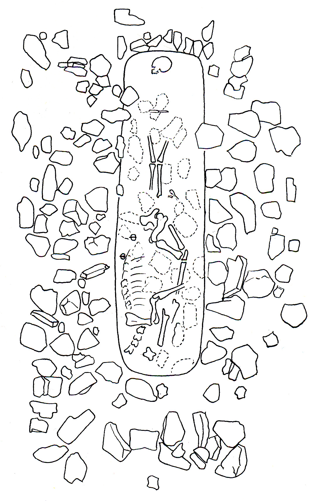

Title: Af kumlum og rannsókn þeirra
Slug: af-kumlum-og-rannsokn-theirra
Date: 2008-09-04 16:03:42
UID: 552
Lang: is
Author: Þóra Pétursdóttir
Author URL: 
Category: Fornleifafræði
Tags: kuml, Fornleifafræði, haugfé

Kuml, það er grafir heiðinna forfeðra okkar, eru einn stærsti minjaflokkurinn frá landnámsöld og líklega sá minjaflokkur sem mest hefur verið rannsakaður og fjallað um. Þar ber óumdeilanlega hæst rannsóknir og doktorsrit Kristjáns Eldjárn en kumlin voru alla tíð eitt hans aðaláhugamál.

Á Íslandi eru í dag u.þ.b. 325 þekkt kuml sem dreifast á rúmlega 160 fundarstaði víðsvegar um landið. Þrjú svæði eru þó mest áberandi fyrir fjölda kumla, en það eru Árnes- og Rangárvallasýsla á Suðurlandi, Fljótsdalshérað á Austurlandi og Eyjafjarðarsvæðið á Norðurlandi. Vestfirðir og Vesturland skera sig aftur á móti úr vegna þess hve fá kuml hafa fundist þar og hafa fræðimenn löngum velt fyrir sér ýmsum mögulegum ástæðum þess.

Eins og áður sagði hafa þessar tegundir minja lengi heillað bæði fræðimenn og almenning, enda hvílir yfir þeim ákveðin dulúð sem vekur forvitni og löngun til þess að grafast fyrir. Kumlin eru líka brunnar upplýsinga og vel til þess fallin að varpa ljósi á ýmsa þætti þess samfélags sem fyrst byggði landið. Ef litið er yfir rannsóknarsögu íslenskra kumla er hins vegar greinilegt að rannsóknir manna hafa lengi verið fremur einsleitar og áherslurnar að miklu leyti þær sömu. Þótt það kunni að hljóma sérkennilega má segja að það sem einkenni þessar rannsóknir sé það að áherslan er ekki á kumlin sjálf heldur eru þau aðeins verkfæri til þess að varpa ljósi á aðra þætti sem menn virðast óþreytandi geta velt fyrir sér. Þetta eru aðallega tveir óvissuþættir; annars vegar sá sem snýr að uppruna Íslendinga og hins vegar sá sem lýtur að tímasetningu landnáms. Kumlin eru þess vegna hlutuð niður (mannabein með mannabeinum, sverð með sverðum, kambar með kömbum o.s.frv.) og eftir formerkjum gerðfræðinnar er hver flokkur síðan borinn saman við sína líka annarstaðar í Víkingaheiminum. Hin endurtekna niðurstaða er sú að líkur bendi til að Ísland hafi að verulegu leyti byggst úr Noregi, en í minni mæli frá öðrum hornum Víkingaheimsins - og bergmálar þannig það sem um málið var ritað í fyrndinni.

Annað sem einkennt hefur flestar íslenskar kumlarannsóknir, þar með talið rannsóknir Kristjáns Eldjárn, er ákveðin vantrú á upplýsingagildi þeirra og í staðinn mikil áhersla á lítilfjörleika safnsins, á fátæklega efnismenningu, á tilkomulitla ásjónu kumlanna og einsleitni þeirra. Þessi vantrú kemur manni í fyrstu á óvart, ekki síst í ljós þess að sumir þessara fræðimanna, eins og títtnefndur Kristján Eldjárn, helgaði stórum hluta ævi sinnar rannsóknum á þessum aumkunarverðu minjum. Sé málið hins vegar sett í samhengi er það kannski ósköp eðlilegt. Að verulegu leyti stafar þetta líklega af vantrú á íslenskri fornleifaræði almennt í samanburði við tvennt; annars vegar bókmenntaarfinn og hina rituðu Íslandssögu og hins vegar forna efnismenningu hinna Norðurlandanna. Samanborið við vel kryddaðar og magnþrungnar frásagnir, persónulýsingar og ættartölur Ísendingasagna eða nákvæmni Landnámu og Íslendingabókar virkuðu kumlin kannski heldur upplýsingasnauð. Við hlið stórra hauga, skipsgrafa, brunakumla, gulls og annarra gersema sem dregnar voru úr jörðu annarsstaðar á Norðurlöndunum voru þau líka kannski svolítið aumkunarverð. Það sem hins vegar er óeðlilegt er hve lengi þessi vantrú hélt velli, og gerir jafnvel enn í hugum sumra.

Afleiðingin þessarar þrautseigju er sú að segja má að þrátt fyrir þá miklu umfjöllun sem íslensk kuml hafa hlotið í gegnum tíðina eru kumlin í raun lítt rannsakað fyrirbæri. Markmiðanna vegna hefur áherslan verið á einstaka þætti en á ekki _kumlið_ sem heild auk þess sem einblínt hefur verið á það sem _ekki_ er til staðar og mögulegar skýringar á því. Upprunans vegna er Noregur, norska kumlasafnið og "norski siðurinn" í þessum rannsóknum einskonar "norm" eða "prótótýpa" sem íslensku kumlin eru mæld við og leidd af. Áherslan verður í framhaldinu á það sem íslenska kumlasafnið _skortir_ til þess að geta talist al-norskt – þ.e. stóra hauga, meiri fjölbreytni, ríkidæmi, brunakuml o.s.frv – og megináhersla er lögð á að skýra hvers vegna t.d. með vísun í fátækt, kristin áhrif, íhaldsemi, skort á eldiviði o.s.frv. Þó svo það sé aldrei sagt berum orðum er viðhorf manna í rauninni það að íslenska kumlasafnið sé _frávik_.

Eins og áður sagði er það eðlilegt að kumlin séu nýtt til þess að varpa ljósi á þætti eins og uppruna, landnám, verslunartengsl og efnahag, þar sem þau geta hentað vel til slíks. Það er hins vegar afar sérkennilegt að þau hafi aldrei verið  notuð til þess að draga fram mynd af athöfninni, greftruninni, sem þau eru afurð og hluti af, og í framhaldi af trú og hugarmheimi manna. Menn hafa ekki spurt spurninga eins og: Hvað gekk mönnum til? Af hverju eru þessir hlutir hér? Raunar má frekar greina þá skoðun að athöfnin hafi verið fremur tilviljunarkennd en ekki persónulega né félagslega mikilvæg. Það er raunar engin séríslensk feimni heldur nokkuð sem einkenndi fornleifafræði um allan heim fram á 9. áratug liðinnar aldar. Menn veigruðu sér við því að stíga það skref að taka til umfjöllunar óáþreifanlega þætti með efnismenninguna eina að vopni - þar voru menn komnir út fyrir ramma fornleifafræðinnar. Þetta hefur hins vergar breyst og þeim fjölgað sem telja að sé efniviðurinn góður og nálgunin ígrunduð geti efnismenning einmitt gefið upplýsingar um óáþreifanlega og andlega þætti mannlegs lífs til forna.

Til þess að unnt sé að fjalla um og túlka íslensk kuml með það að markmiði að varpa ljósi á hugarheim eða trú forfeðra okkar er hins vegar nauðsynlegt að hefja leikinn á því að endurskoða það þrautseiga viðhorf til kumlasafnsins sem rætt hefur verið um hér að framan. Þ.e.a.s. ef útgangspunkturinn er sá að kumlin séu upplýsingasnauð, einsleit og fátækleg hefur reynslan sýnt að afurðirnar verða varla kræsilegar. Ef öllum samanburði við bókmenntir eða kumlasaöfn annarra Norðurlanda er ýtt til hliðar er raunin hins vegar sú að ýmislegt áhugavert kemur í ljós. Það er ákveðinn fjölbreytileiki en á sama tíma greinileg einkenni og reglufesta innan safnsins. Það eru vissulega tiltölulega fáir "tilkomumiklir" gripir á borð við vönduð og dýr sverð eða nælur. Aftur á móti er fremur mikið af "hversdagslegum" hlutum eins og eldstálum, hnífum, brýnum, metum o.s.frv. Það er líka þónokkuð af náttúrulegum hlutum eins og smásteinum af ýmsum gerðum, skeljum og þessháttar (sem raunar er gripaflokkur sem líklega er algengari en rannsóknir gefa til kynna þar sem auðvelt er að hunsa hann). Að lokum eru hestar afar áberandi í heiðnum útfararsið á Íslandi og er talsverður breytileiki, en þó reglufesta, í því hvernig þeir eru greftraðir. Þetta síðasttalda atriði er raunar það sem einkennir íslenska kumlasafnið einna helst og greinir það jafnframt frá greftrunarsiðum annarra svæða Víkingaheimsins.

Ef litið er á hvert kuml sem samsetta og merkingarbæra heild (sem ekki ber að kljúfa niður) er það líka greinilegt að það er ákveðin reglufesta í því hvernig þessum mismunandi þáttum var raðað saman í þá mynd sem kumlið er. Með öðrum orðum virðist alls engin tilviljun ráða þeirri samsetningu. Maður verður yfirleitt ekki var við að hlutum sé kastað í gröfina heldur miklu frekar að þeir séu lagði niður af nákvæmni, eftir ákveðinni forskrift - og kannski virðingu. Þegar maður veltir því fyrir sér er það kannski einmitt þessi nákvæma framsetning sem er hvað mest áberandi við þessa tegund grafa - þ.e.a.s. sýnileikinn. Það er líka þessi sterki sjónræni þáttur framsetningarinnar sem greinir þennan greftrunarsið frá þeim sem við búum allflest við í íslensku samfélagi í dag. Þar sjáum við sjaldan hinn látna og oft sjáum við jafnvel fátt sem minnir á hann. Í kumlinu virðist framsetningin hins vegar eiga að undirstrika nálægðina og tengslin á milli hinna mismunandi þátta (manns, hests, hunds, sverðs, nælu, brýnis o.s.frv.) og sýnileika hvers og eins í tengslum við hina.

Við getum auðvitað aldrei vitað fyrir víst hvort hlutir eða dýr í kumli hafi verið í eigu hins látna, eða hver tengsl þeirra hafa verið. Það er heldur ekki aðalatriðið því þessi heildræna framsetning _skapar_ tengsl á milli þeirra, hvort sem þau hafa verið til staðar fyrir eða ekki. Í þessu samhengi er mikilvægt að minnast þess að enginn þeirra hluta (dýra eða manna) sem eru í kumlinu urðu til á staðnum - og ekki féllu þeir af himnum heldur. Hver hlutur í gröfinni bar með sér ákveðna lífssögu - stutta eða langa - og með henni ákveðið tengslanet. Ef við gefum okkur það (sem raunar er ekki svo langsótt) að það hafi verið aðstandendur og vinir hins látna sem stóðu að athöfninni er einnig ljóst að flestir þessara gripa voru þekktir í augum viðstaddra. Hestar og hundar (og jafnvel vopn eða aðrir gripir) hafa verið þekkt undir nafni og sem ákveðnir karakterar með ákveðna eiginleika og sögu. Vera þeirra og annarra gripa í kumlinu og þar með þátttaka í athöfninni hlýtur því að hafa haft ákveðna þýðingu fyrir mönnum og verið þeim mikilvæg.

Þó svo því sé hér haldið fram að kumlið sé ein órjúfanleg heild er það alveg ljóst að hinn látni er miðpunktur athafnarinnar.  Það er lát hans sem framkallar athöfnina, leiðir þá saman sem eiga að uppfylla hana og drífur þá áfram. Þannig að þótt svo hinn látni grafi sig ekki sjálfur þá er hann á ákveðinn hátt _virkur_ þátttakandi í áthöfninni. Vegna sýnileikans er nærvera hans tvíræð - hann bæði _er_, og _er ekki_ á staðnum. Þetta er ákaflega mikilvægt atriði því vegna þessarar óræðu tilveru hefur hinn látni getað haft nokkur áhrif á framfylgni ákveðinna þátta, kannski m.a. um hvað lagt yrði í gröfina. Í því ljósi má hugsa sér að þeir hlutir sem fylgdu hinum látna í dauðann hafi verið í eigu hans eða a.m.k. tengst honum á einhvern átt í lifanda lífi. Þá má e.t.v. líta svo á að athöfnin feli í sér einskonar endurheimt hins látna - eða það sem á ensku mætti kalla "re-membering". Þ.e. hinn látni er lagður í gröfina ásamt hlutum eða dýrum sem honum tengdust, sumir með mjög nánum hætti - og voru jafnvel álitnir _hlutar af hinum látna_. Á þann hátt er hinn látni endurheimtur eða _re-membered_ í votta viðurvist, og hans er minnst eða _remembered_ sem hluta af stærra samhengi.

Þegar grafinn er fram 100 kg bátur í kumli sem staðsett er efst á bröttum ási nokkra kílómetra frá sjó er tilviljun líklega það síðasta sem mér dettur í hug! Og þegar betur er að gáð eru íslensk kuml talsvert mikið ríkulegri en oft hefur verið gefið í skyn því tilfellið er að tíðar yfirlýsingar um fátækt og fábreytni íslenskra kumla segja í rauninni lítið um kumlasafnið, heldur vitna frekar um ákveðið hallæri í túlkun. 

---
 
<small>Mynd: Kristján Eldjárn (1966) "Kuml úr heiðnum sið, fundin á síðustu árum" í _Árbók hins íslenzka fornleifafélags_ 1965, bls 37.</small>
