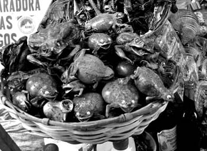
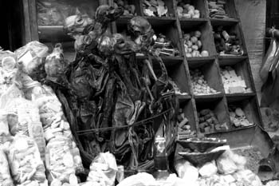
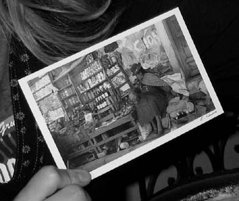

Title: Af nornamarkaðnum í La Paz, Bólivíu
Subtitle: Frá glimmerfroskum til „mannfórna.“
Slug: af-nornamarkadnum-i-la-paz-boliviu
Date: 2006-05-09 15:45:00
UID: 70
Lang: is
Author: Bryndís Björgvinsdóttir
Author URL: 
Category: Þjóðfræði
Tags: 

Móðir mín heillast mjög af gylltum hlutum, enda er hún kölluð Kata gyllta. Gylltir hlutir eru auðmannlegir og ekki auðfáanlegir. Vandamál móður minnar sem er ekki svo auðug er því að komast yfir gyllta kertastjaka, gylltar diskamottur og gyllta baðsloppa fyrir lítinn sem engan aur. Ég þóttist hafa leyst vandamál móður minnar þegar ég fann þurrkaðan frosk á nornamarkaði í Bólivíu. Froskurinn atarna átti að veita eigandanum endalausa auðlegð ef sígarettu væri stungið upp í glenntan kjaftinn á honum. Ekki skemmdi það fyrir að hann var skreyttur gylltu glimmeri og búið var að setja gullsteina í augntóftir hans. Tollurinn tók af mér froskinn á leiðinni heim, það er víst bannað að taka með sér dýr úr landi. Þeir kölluðu þetta ólöglegan útflutning á lífverum úr Amazon, ég hafði ekki hugmynd um að froskurinn væri þaðan. Móðir mín kvaðst vera fegin þegar ég sagði henni fréttirnar af tollinum. Froskurinn gat bara haldið áfram að vera þurrkaður í Bólivíu fyrir henni. Hún sagðist síðan hvort eð er ekki vilja skapa óþarfa eldhættu með því að færa sígarettur inn á heimilið og upp í froskinn. Eitthvert barnabarnið gæti kveikt í henni fyrir misskilning. Ég var svo sem alveg sátt, ég hafði fengið mitt. Ég hafði fengið að kynnast nornamarkaðinum í La Paz í Bólivíu, Suður-Ameríku. 

Á nornamarkaðnum í La Paz er hægt að kaupa styttur til að bæta kynlífið, þurrkuð beltisdýr til þess að vernda heimilið gegn þjófnaði og þurrkuð lamadýrsfóstur. Allskonar jurtir má þar einnig finna, sumar veita þetta og skapa hitt, aðrar koma í veg fyrir þetta en þó ekki hitt o.s.frv. Nornirnar sátu við básana sína, feitlagnar konur með sítt svart hár sem spratt eins og foss undan dökkbrúnum harðkúluhattinum. Engin norn er án harðkúluhatts í La Paz, strýtuhattar sjást ekki nema í vestrænum kvikmyndum um galdrafólk.  Ég þorði ekki að taka ljósmyndir af nornunum, það var varað við því í öllum ferðamannabæklingum sem ég las. En þegar nornirnar litu undan var ég fljót að vippa upp myndavélinni og taka myndir af básunum þeirra, án flass og enginn skaði skeður. Þurrkuðu lamadýrsfóstrin voru hvað mest áberandi, enda frekar ófögur sjón þar á ferð. Á markaðnum reyndi ég að komast að tilgangi þeirra en fékk ekkert svar. Fjórum dögum seinna rakst ég á viðtal í blaði við prófessor einn sem hafði kynnt sér tilgang þurrkuðu lamadýrafóstranna til hlítar. Greinin og blaður við aðra ferðamenn á bar í kjölfar lestursins leiddu ýmislegt í ljós.

Lamadýrafóstrin eiga að færa þeim gæfu sem vilja byggja hús. Fóstrin eru fórn til guðsins PachaMama og eru þau grafin undir eða við hús sem á að reisa. Lamadýrsfóstrin eru einskonar heilsutrygging fyrir verkamennina sem vinna byggingarvinnuna, PachaMama mun ekki krefjast frekari fórna ef fóstri hefur þegar verið komið fyrir. Til eru dæmi um það að verkamenn neiti að vinna hafi fórn ekki verið framkvæmd. Það þykir þó ekki vera nægilegt að fórna lamadýrsfóstri keyptu á nornamarkaðinum ef reisa á stærri byggingar. Sú saga gengur meðal ferðamanna í Bólivíu að stærri byggingar krefjist einskis minna en mannfórna, mannlíks til að grafa undir byggingunni. Mér þótti nú nóg um þegar hér var komið við sögu. Gat það verið að enn þann dag í dag væri verið að stunda mannfórnir í S-Ameríku? Líkt og fyrr á tímum þegar Inkarnir áttu að hafa fórnað fersku mannablóði sólinni til dýrðar. 

Sumir vilja meina að svarið við þessari spurningu sé að finna í hinni dramatísku hugmynd um fílagrafreitinn. Sagt er að þegar fílar vilji deyja þá fari þeir á ákveðinn stað, sem þeir vita fyrirfram um, til þess eins að kveðja heiminn. Í Bólivíu getur þetta átt við um fólk.  

Tembladerani er hverfi í suður La Paz sem þykir þjakað af áköfum dagdrykkjumönnum. Margir eru barirnir í Tembladerani en þeir eru ekki allir sambærilegir. Sumir þeirra, vel faldir og dimmir, eru einskonar fílagrafreitir. Barir sem konur og menn sækja til þess eins að drekka sig í hel. Þegar andinn hefur kvatt líkamann er líkunum komið fyrir úti á götu eða þau seld til byggingarverktaka, til þess að þeir geti fært PachaMama fórn og  verkamönnunum heilsutryggingu í leiðinni. Byggingarverktakar í Bólivíu eiga því við sama vandamál að stríða og hún móðir mín, að komast yfir eitthvað sem ekki er auðfáanlegt fyrir ekki svo mikinn pening. Allavega minni en „gull“ og mannslíf ættu að vera metin á. Það er ekki beint hægt að líta á þessar aðgerðir sem mannfórnir. Lögregla og ríki líta á þetta sem ágæta samfélagsþjónustu, fólki í sjálfsmorðshugleiðingum og drykkjurútum er haldið frá götunum og kirkjuturnum. Fórnin er í sjálfu sér frekar furðuleg, annaðhvort að kaupa lamadýrsfóstur á markaði eða að hringja í kráreiganda og spyrja hvort einhver ógæfumaður hafi drukkið sig í hel hjá honum nýlega. PachaMama gerir engar kröfur um sérstakan dauðdaga, sá guð spyr aðeins um blóð og hold. Kannski þessi „samfélagsþjónusta“ sé svar nútímans, þar sem ekki má fórna fólki á altari, við nýjum hugsunarhætti og lagaboðum. Nú veit ég ekki hvað er satt og hverju er logið, en ég held samt að margur maðurinn hvíli undir háhýsum La Paz. Ég var fegin að nornirnar skorðuðu sig við lamadýrsfóstrin sem sína óhugnanlegustu söluvöru. Annars þorði ég nú aldrei að kíkja á bak við tjöldin hjá þeim.

---

<small>
Grein Bryndísar birtist fyrst í tímariti þjóðfræðinema, *Slæðingi* sem kom út nú á vordögum. *Slæðingur* er væntanlegur á netið á næstu vikum. Rétt er að geta þess að meðfylgjandi myndir voru allar teknar af Bryndísi.
</small>
