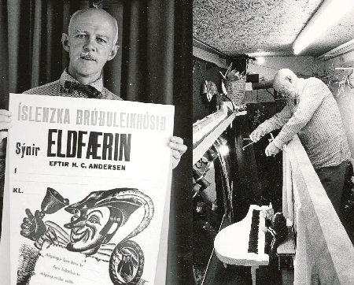
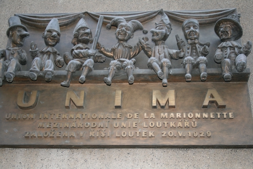

Title: Af upphafi brúðuleikhúss á Íslandi 
Slug: af-upphafi-bruduleikhuss-a-islandi
Date: 2008-10-07 15:09:26
UID: 697
Lang: is
Author: Sigríður Sunna Reynisdóttir
Author URL: 
Category: Leiklist, Listir
Tags: Brúður, leikbrúður, brúðuleikhús, Jón E.Guðmundsson, Jeppi á Fjalli, Holberg, Kurt Zier, Myndlista og Handíðarskólinn, Fást, Göthe, Iðnó, strengjabrúður, handbrúður, Íslenska Brúðuleikhúsið, kanasjónvarpið, Hans og Gréta, Eldfærin, Fúsi Flakkari, Stundin Okkar, UNIMA, Keflavíkursjónvarpið, Union International de la Marionetta, Sameinuðu Þjóðirnar, Mikael Mechke, Litli Prinsinn, Þjóðleikhúsið

Leikbrúðulist er ævagömul listgrein sem á sér langa og ríka hefð í ýmsum menningarsamfélögum. Elstu heimildir um leikbrúður ná allt aftur til Egypta til forna, en þeir notuðu heilagar brúður við trúarathafnir sínar. Það eru hins vegar rétt rúmlega fimmtíu ár frá því að fyrsta brúðuleikhúsið var stofnað á Íslandi.

Elstu sögur af brúðuleikhúsi hér á landi koma frá Jóni E. Guðmundssyni, en hann sagði frá brúðuleikhúsi um Jeppa á Fjalli eftir Holberg sem danskur maður sýndi á Eyrarbakka árið 1914. Ekki hafa fundist fleiri frásagnir af sýningunni og virðist hún ekki hafa kynnt leikbrúðulistina fyrir landanum að neinu ráði.

Af erlendum áhrifavöldum mætti hins vegar nefna hinn þýska Kurt Zier sem kom til landsins á stríðsárunum og stofnaði Marionettufélagið ásamt hópi áhugafólks um brúðuleikhús. Árið 1968 stýrði Kurt leikbrúðunámskeiði sem var haldið á vegum Myndlista- og Handíðaskólans í samstarfi við Sjónvarpið. Þar skólaði Kurt marga af þeim brúðuleikurum sem við eigum í dag og afraksturinn var uppsetning á _Fást_ eftir Göthe sem var sýnd í Iðnó en þar að auki voru gerðir þættir fyrir sjónvarpið.

Jón E. Guðmundsson má þó án efa nefna föður íslensks brúðuleikhúss.  Jón fæddist þann 5. janúar árið 1915 á Patreksfirði og komst fyrir tilviljun í kynni við leikbrúðugerð á unga aldri í heimabæ sínum. Kynnin voru með þeim hætti að starfsmaður í verslun bæjarins stóð eitt sinn á búðartröppunum með handbrúðu sem hann lét segja „Heilsaðu Jóni“ og hafði þetta atvik mikil áhrif á hann.

Jón komst síðan fyrir alvöru í tengsl við brúðuleikhús þegar hann nam ungur myndlist í Kaupmannahöfn. Þá fór hann eitt sinn í heimsókn til samnemanda síns sem vann að handbrúðuleikhúsi og upp frá því var ekki aftur snúið. Handbrúður voru sem sagt fyrstu kynni Jóns af brúðuleikhúsi, en sjálfur kaus hann yfirleitt að vinna með strengjabrúður. Ástæðan fyrir því var sú að Jóni þótti strengjabrúður búa yfir fleiri möguleikum en handbrúður og einnig þótti honum krefjandi að vinna með þær. Strengjabrúður Jóns voru af öllum stærðum og gerðum en áttu það flestar sameiginlegt að vera handskornar út úr íslensku birki.

Jón stofnaði Íslenska Brúðuleikhúsið árið 1954 og var þá fyrstur hér á landi til að að stofna brúðuleikhús og reka það. Brautryðjendastarfið var hreint ekki auðvelt til að byrja með, þar sem Jón mætti litlum skilningi samlanda sinna fyrir þessari nýju listgrein. Fólk fussaði og sveiaði og furðaði sig á því að fullorðinn maður væri að leika sér með dúkkur! Þrátt fyrir mótlætið hafði ástríða Jóns fyrir strengjabrúðum yfirhöndina og vóg á endanum þyngra en almenningsálitið.

Jón starfrækti leikhús sitt lengst af í skúrbyggingu sem hann keypti á Flyðrugranda í byrjun áttunda áratugarins. Áhorfendasalurinn gat tekið 30 gesti í sæti og meðfram veggjunum umhverfis gestina stóðu fjölmargar brúður Jóns úr öðrum leikritum, en þær skipta hundruðum. Í leikhúsinu nýttist fjölbreytilegur bakgrunnur Jóns í myndlist. Hann vann sýningarnar yfirleitt alveg sjálfur; allt frá leikmyndum og brúðum til veggspjalda. Tók þá yfirleitt um eitt ár að undirbúa hverja sýningu. Jón sýndi aðallega leikgerðir af þekktum þjóðsögum og ævintýrum á borð við Hans og Grétu, Rauðhettu og Eldfærin.  Á starfsævi sinni sýndi Jón þó mun víðar en á Flyðrugrandanum, enda keypti hann húsnæðið frekar seint á ferlinum. Hann ferðaðist umtalsvert með sýningar sínar, bæði hér innanlands sem víða erlendis. Nokkrar brúður urðu meira að segja svo víðförlar að vera sendar á sýningu undir Fují fjalli í Japan undir lok 9. áratugarins.

Mest ferðaðist Jón með brúðuna Fúsa flakkara sem hann gerði fyrir _Stundina Okkar_ árið 1968. Jón flakkaði um landið með brúðuna í samvinnu við Sjónvarpið, en hann stjórnaði brúðunni ætíð sjálfur og fékk leikara til að ljá henni rödd. Jón talaði mikið um það hvernig tilkoma sjónvarpsins á Íslandi gjörbreytti viðhorfi almennings til brúðuleikhúss, alveg frá og með Keflavíkursjónvarpinu. Auk þess að starfa sem brúðuleikari, vann Jón ætíð ötullega að því að kynna leikbrúðulist á Íslandi með margvíslegum hætti. Hann fléttaði brúðuleikhúsi inn í myndlistarkennslu, hélt reglulega námskeið í brúðugerð fyrir unga sem aldna um land allt og gegndi ennfremur stöðu formanns UNIMA á Íslandi í fjöldamörg ár.

UNIMA (Union International de la Marionette) eru alþjóðleg samtök brúðuleikhúsfólks sem voru stofnuð árið 1929 í Prag. Samtökin hafa það að markmiði að hvetja til fræðilegra rannsókna á sögu brúðuleikhúss auk þess að stuðla að framþróun listgreinarinnar, efla hana og kynna í alþjóðlegu samstarfi. UNIMA starfa undir regnhlíf Sameinuðu þjóðanna og standa vörð um Mannréttindasáttmálann frá árinu 1948.   Deild samtakana á Íslandi var stofnuð árið 1976 og var Jón fyrsti formaðurinn. Aðalhvatamaðurinn að stofnun félagsins hér var sænski brúðuleikhúsmaðurinn Mikael Mechke, en hann reyndist mikil vítamínsprauta fyrir brúðuleikhúslíf á Íslandi. Mechke kom til landsins til þess að halda leikbrúðunámskeið í Reykholti og setti auk þess upp margrómaða sýningu sína á Litla Prinsinum í Þjóðleikhúsinu.

Brúðuleikhús varð smám saman fastur þáttur í íslensku menningarlífi og var sett í alþjóðlegt samhengi fyrir tilstilli UNIMA. Félagið hefur staðið fyrir námskeiðum og alþjóðlegum brúðuleikhúshátíðum hérlendis auk þess að vera tengiliður við erlent brúðuleikhúsfólk sem hefur áhuga á að vera með gestasýningar. Jón E. Guðmundsson vann alla tíð mikilvægt brautryðjandastarf við að festa brúðuleikhúsið í sessi á Íslandi og skapa því stöðu á meðal annarra listgreina.

---

#### Heimildir: 

* Jón E. Guðmundsson í viðtali við Ríkisútvarpið árið 1988 Greinasafn Morgunblaðsins hjá Landsbókasafni Íslands
* Ólafur J. Engilbertsson. 2007. _Leikmyndlist á Íslandi: Þróun leikmynda-og leikbrúðugerðar í leikhúsum og sjónvarpi frá upphafi atvinnumennsku í leiklist á Íslandi til loka 20. Aldar_, bls. 118-127. Sögumiðlun ehf í samstarfi við Leikminjasafn Íslands
* Ólafur J. Engilbertsson. 2007. „Jón E. Guðmundsson“. Leikminjasafn Íslands. Vefslóð: <http://www.leikminjasafn.is/syning/joneg.html>. Sótt 19. september 2008
* [Vefsíða UNIMA samtakanna](http://pagesperso-orange.fr/unima/index.htm)
