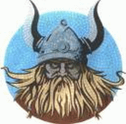

Title: Afrekin „Okkar“!
Slug: afrekin-okkar
Date: 2006-02-09 09:54:00
UID: 43
Lang: is
Author: Hrafnkell Lárusson
Author URL: 
Category: Fjölmiðlar, Í umræðunni
Tags: 

Í auglýsingaflóði nýliðinna jóla og áramóta vöktu athygli vandaðar og glæsilegar auglýsingar þar sem nafn Íslands og ýmis þjóðernisleg tákn komu fyrir. Þetta voru auglýsingar frá íslenskum „útrásarfyrirtækjum“ sem reglulega eru í fréttum vegna „landvinninga“ sinna í öðrum löndum. Í auglýsingunum gaf m.a. að líta svipmyndir úr erlendum borgum sem margir hér heima þekkja til í. Þetta er líka borgir þar sem íslenskir athafnamenn hafa haslað sér völl. Myndirnar í auglýsingunum voru sem gylltur rammi utan um marglofaða viðskiptasigra landa okkar erlendis. En framsetning og vísanir þeirra voru til þess fallnar að gera þetta að sigri „Okkar“! Já, það erum víst „Við“ — íslensku „víkingarnir“ — sem eigum þessa sigra. Og landmenn, upp til hópa, berja sér á brjóst. Útrásin er orðin að kappleik sem er leikin samkvæmt fyrirliggjandi úrslitum við ímyndaðan andstæðing með kunnugleg nöfn: Ísland — Danmörk / Ísland — England. Þjóðrembufylleríið heldur áfram. „Við“ höldum áfram að sigra! Eða hvað? 

Að slá á þjóðernislega strengi er fjarri því nýlunda hér á landi. Þetta hafa t.d. stjórnmálamenn gert lengi ekki síst þegar utanríkismál eru annars vegar. Hver man ekki eftir að hafa heyrt frammámann íslenska ríkisins byrja setningu á orðunum: „Íslendingar vilja …“ eða „Íslendingar ætla …“ áður en hann vatt sér yfir í að skýra frá vilja eða ætlun stjórnvalda (sem e.t.v. var í blóra við vilja meginhluta landsmanna). Slík orðanotkun er auðvitað ekki ástæðulaus. Með henni fær skoðun einstaklings/hóps sem er í einhverskonar forsvari fyrir landslýð aukið vægi. Hún er kynnt sem vilji allra og þannig klædd í slopp þjóðernisins. Í þeim klæðnaði er erfiðara að gagnrýna skoðunina enda er þá verið að mæla gegn (sjálfskipuðum) fulltrúa hins „almenna vilja“.  

Útrás íslenskra kauphéðna hefur verið sveipuð klassískum íslenskum „þjóðbúningi“. Fjölmiðlarnir sýna næsta órofa samstöðu við að lofa útrásina á þjóðernislegum grundvelli og forsvarsmenn útrásarfyrirtækja ýta undir þetta. Þeim er ljóst að íslenskur almenningur hefur ekkert með athafnir þeirra að gera. Hagurinn felst hins vegar í að gera þennan sama almennig meðvirkan. Fá hann til að fagna „sigrum“ sem þeir væru þeirra eigin. Lifa sig inn í stemmingu og finnst þeir vera þátttakendur þegar þeir eru raunverulega aðeins áhorfendur. Gleðin yfir útrásarhetjunum er af sama meiði runnin og gleði yfir sigurleikjum íslenska handboltalandsliðsins. Um daginn heyrði ég flaumósa íþróttafréttamann lýsa glæsilegum sigri „Okkar“ á Rússum! Af orðum hans mátti skilja að öll 300 þúsundin sem byggja landið hafi verið þátttakendur í þessum handboltaleik! Hins vegar tapaði handboltalandsliðið (heldur smærri hópur en hinn fyrri) fyrir Norðmönnum. Fussum svei! „Við“ vorum ekki með í þeim leik! Enda tapaðist hann. Með því að allir sem telja sig Íslendinga séu talaðir inn í þátttökuhlutverk í afrekum á erlendri grundu vinnst líka annað. Öll gagnrýni á hetjurnar er ósjálfrátt flokkuð sem niðurrifsstarfsemi og öfund. Gildir þá einu hvort gagnrýnin kemur héðan að heiman eða erlendis frá. Hver sá sem lýsir efasemdum verður hælbítur sem er óalandi og óferjandi.

Ólíkt sumum löndum mínum (þ.m.t. allmörgum fjölmiðlamönnum) upplifði ég mig ekki sem neinn sigurvegara yfir Dönum þó íslenskir athafnamenn keyptu Magasin í Kaupmannahöfn. Sá atburður fékk hins vegar lýsingu líkt og um væri að ræða landsleik í handbolta sem unnist hefði með glæsibrag — á útivelli. Jafnvel mátti greina þá skoðun að langþráðar hefndir á Dönum fyrir stjórn landsins forðum daga væru að nást. Já, loksins hefðum „Við“ náð að jafna um Dani. Ég sá hins vegar ekki að þetta kæmi mér mikið við enda hafði ég ekkert um þessi kaup að segja, fremur en hin nítíu og níu komma eitthvað prósent landsmanna. Danskur almenningur gleymdi líka að vera „tapsár“ yfir þessu, þó tekist hafi að fanga fúllynda einstaklinga í þeirra hópi og draga í viðtöl. Flestir létu sér standa á sama eða voru e.t.v. almennt meðvitaðri um stöðu sína á áhorfendabekkjunum en hinir keppnisglöðu Íslendingar. 

Í þau skipti sem gagnrýni hefur beinst að „Íslensku útrásinn“ hefur henni jafnan verið svarað á þjóðernislegum nótum. „Þeir“ eru bara öfundsjúkir yfir atorku „Okkar“ og glæsileik.! Í ræðu og riti hefur nefnilega verið ansi stutt í lyndiseinkunnirnar þegar útrásin er til umræðu. Ástæðurnar fyrir árangri „Okkar“ eru sumsé þær helstar hvað „Við“ erum dugleg, þrautseig, ákveðin og áræðin, svo helstu sameiginlegu einkenni landmanna séu tínd til samkvæmt orðræðu þjóðernisrembunnar. Slíkar „skýringar“ taka margir gildar þrátt fyrir að þær séu í raun goðsögulegar fullyrðingar sem vitanlega standast ekki skoðun og gera jafnframt lítið úr öðrum en þeim sem teljast til hinnar útvöldu þjóðar: Íslendinga. Þessar skýringar eru þó látnar duga enda ósköp gaman að trúa þeim og þær miðast að því að styrkja hugmyndina um sérstöðu og mikilfengleik íslensku dvergþjóðarinnar, sem virðist mikilvægt að hamra á í tíma og ótíma hvort sem sérstaðan er meint eða raunveruleg. „Við“ erum spes! Það hefur líka um nokkurt skeið verið álitin goðgá á Íslandi að gagnrýna innlenda aðila sem standa í framkvæmdum á erlendri grundu. Slíkt hefur verið flokkað sem niðurrifs og úrtölustarfsemi sem ekki eigi að leggja eyru við. Þetta eru fulltrúar „Okkar“ og þeir eru friðhelgir. En hvað er á bak við glansmyndina? Ég veit ekki hvort það er skortur á þjóðernisrembingi eða takmörkuð þekking mín á viðskiptum (ég er hvort eð er aðeins áhorfandi) sem fær mig til að spyrja hvernig það getið gengið, ekki einu sinni heldur ítrekað, að (íslensk) fyrirtæki kaupi önnur sem eru miklu stærri en þau sjálf? 

Einn af holdgervingum íslensku útrásarinnar og tvímælalaust einn besti vinur hennar er forseti íslenska lýðveldisins. Hann hefur verið óþreytandi við að lofa afrek útrásarhetjanna, jafnan undir þjóðernislegum formerkjum kryddað með hinum sameiginlegu lyndiseinkunnum. Fyrir nokkru hélt forsetinn upphafserindið í fyrirlestraröð á vegum Sagnfræðingafélagsins. Síðan hafa tveir fyrirlesarar aðrir fylgt í kjölfarið. Nú síðast Jón Karl Helgason sem flutti sinn fyrirlestur sl. þriðjudag. Einhverjir vonuðust til að forsetinn myndi í sínu erindi nota þennan vettvang til að kalla fram fræðimanninn í sjálfum sér og fjalla um útrásina með gagnrýnum hætti. Hinir sömu urðu fyrir vonbrigðum. Það sem áheyrendur upplifðu var sama gagnrýnislausa og upphafna lofrullan og margoft hafði heyrst áður. Núverandi forseti hefur enda verið afar duglegur við að hafa stórar hjarðir íslenskra viðskiptafrömuða í fylgdarliði sínu þegar hann þeytist til annarra landa í nafni landsmanna. Í slíkum ferðum hefur hann oftar en ekki virkað eins og borðskraut á samningaborði viðskiptanna, eða í besta falli talsmaður viðskiptasendinefndar. Er kannski vert að spyrja sig: Hver er að fylgja hverjum? En þó er víst að íslenskur almenningur borgar fargjaldið. Líkt og hinn sami almenningur borgar háa vexti, há flugfargjöld, hátt matarverð, o.s.frv. En við gerum ekki meira en að nöldra ofan í barm okkar vegna þessa. Rétt eins og þegar stjórnendur útrásarfyrirtækjanna — „strákarnir okkar!“ — skammta sér árslaun sem nema ævitekjum venjulegs starfsmanns í fyrirtækinu — eða meir. Við nöldrum lítillega hvert við annað og látum þar við sitja.

Nú þegar Evrópumótinu í handbolta er lokið þarf þjóðerniskenndin þó ekki að kólna. Þeir sem vilja halda henni volgri geta áfram yljað sér við loflegar lýsingar Morgunblaðsins og annarra íslenskra fjölmiðla af afrekum „Okkar“ á heimsmeistaramótinu í fjármagnsflutningum. Á því móti tökum „Við“ ekki þátt nema sigurinn sé þegar í höfn. Hann innbyrðum við sitjandi fyrir framan sjónvarpið með aðra höndina á fjarstýringunni og hina lausa til að leggja á brjóstið þegar við á. „Landvinningastríð víkinganna“ heldur áfram á skjánum og síðum blaðanna. Já, íslenski dugnaðurinn, þrautseigjan, ákveðnin og áræðnin lætur ekki að sér hæða! „Við“ munum halda áfram að fagna meintum sigrum „Okkar“ — þar til veruleikinn kippir okkur niður á jörðina þegar við fáum reikninginn fyrir áhorfið.

