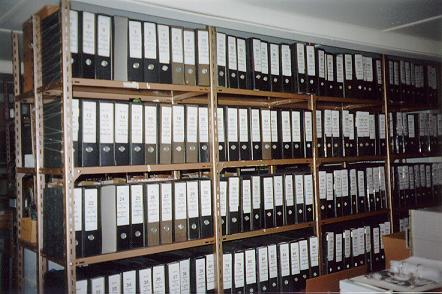

Title: Aftur í ljósið með gæsalöppum og allt
Subtitle: Opið bréf til Hrafns Sveinbjarnarsonar 
Slug: aftur-i-ljosid-med-gaesaloeppum-og-allt
Date: 2008-02-08 12:43:00
UID: 217
Lang: is
Author: Óli Gneisti Sóleyjarson
Author URL: 
Category: Bókasafns- og upplýsingafræði, Sagnfræði
Tags: 

Það er margt sem Hrafn Sveinbjarnarson veit ekki um bókasafns- og upplýsingafræði. Hann virðist til að mynda halda að skjalastjórn og upplýsingafræði séu samheiti. Svo er ekki. Skjalastjórn er almennt talin ein af undirgreinum upplýsingafræðinnar. Þessi mörk eru óljós en sjálfur tel ég bókasafnsfræðina sjálfa einnig vera undirgrein upplýsingafræðinnar.

Hrafni virðist mikið niðri fyrir þegar hann talar um ummæli sem hafa fallið um skrif hans á póstlistum. Hann vitnar í netsiðareglur Upplýsingar, sem hann kallar ranglega félag bókasafns- og upplýsingafræðinga, og telur þær hafa verið brotnar (þó ekkert hafi verið rætt um mál Hrafns á póstlista félagsins). Staðreyndin er sú að einungis ein ómálefnaleg ummæli hafa mér vitandi fallið um hann á umræðupóstlistum. Þau voru brandari frá mér þar sem ég líkti Hrafni við segulbandsupptöku sem gæti ekki hætt að endurtaka sömu ræðuna þó rökin væru öll hrakin. Raunar virðist Hrafn vera gjarn á að snúa gagnrýni á skrif sín yfir á persónu sína.

En það sem kom mér mest á óvart í síðustu grein Hrafns er að hann segist hafa verið kallaður heimskingi af bókasafns- og upplýsingafræðingi á póstlista eða í grein. Þetta virðast vera tilbúningur hjá Hrafni. Enginn kannast við að hann hafi verið kallaður heimskingi eða heimskur. Aftur á móti sakaði Hrafn ónafngreinda embættismenn um "heimsku" í viðtali í Viðskiptablaðinu þann 29. janúar síðastliðinn. Þar að auki sagði hann að skjalastjórar opinberra stofnana lærðu "vitleysu" í sínu námi. Rúðunum hefur fækkað nokkuð í glerhúsi Hrafns.

Hrafn nálgast nú að skilja hvernig skjalastjórar nota hugtökin virk og óvirk skjöl og er það vel - batnandi manni er jú best að lifa. Upphaflegi misskilningur hans skín þó í gegn þegar hann segir að "[h]ér á landi snýst hún [skiptingin í virk, óvirk og hálfvirk skjöl] um geymslu- og húsaskipan og er því harðla lítils virði og fjarri því að vera einhver hátimbruð fræðikenning." Þessi skipting hefur nefnilega aldrei verið álitin hátimbruð fræðikenning meðal skjalastjóra heldur eru hugtökin notuð til þæginda. Mér segir svo hugur að hugtök um geymslumál séu í skjalastjórn oft meira virði en hátimbraðar fræðikenningar. Reyndar virðist Hrafn vera á því að það væri allt í lagi að tala um virk og óvirk skjöl ef þau væru bara kölluð skjöl á virku og óvirku stigi. Þetta er orðhengilsháttur. Flestum þykir þjálla að tala einfaldlega um "óvirkt skjal" frekar en "skjal á óvirku stigi". Þegar Hrafn segir að "[k]jarni málsins er sá að skjöl breyta ekki um eðli eða hlutverk við það að flytjast á milli herbergja eða húsa" erum við fullkomlega sammála enda hefur enginn haldið neinu slíku fram. Ekki heldur hefur neinn annar en Hrafn sjálfur haldið því fram að "skjölum [sé skipt í] virk og óvirk skjöl eftir aldri" - skjöl sem lítið eru notuð eru talin óvirk, og mikið notuð skjöl talin virk. Gamalt skjal getur vel verið virkt ef það er í "notkun".

Söguleg skýring Hrafns á því hvernig (og hvers vegna) tölvuvæðingin átti sér stað er á köflum vafasöm. Hrafn virðist telja að aðaldriffjöður tölvuvæðingar séu stjórnmálamenn sem vilji fótum troða borgaraleg réttindi vegna hræðslu og vanþekkingar og að embættismenn búi við þá ógn að missa vinnuna fari þeir ekki að vilja stjórnmálamanna. Það gæti verið að sagnfræðingar framtíðarinnar muni líta málið öðrum augum. Þeir munu jafnvel sjá að rafræn stjórnsýsla jók yfirleitt aðgengi borgara að stjórnvöldum. Það er þó rétt hjá Hrafni að við verðum einnig að huga að varðveislu til framtíðar og þar getur tölvutæknin verið mönnum erfið.

Hrafn telur mig ekki hafa rökstutt þá staðhæfingu mína að hann hafi gerst sekur um ósannindi og rógburð í fyrri grein minni. Þarna vantaði víst beinar tilvitnanir. Við skulum skoða upphaflega erindið hans Hrafn:

> "Hluti af þeim hjávísindum er að telja eðlilegt að grisja 95% af þeim skjölum sem mynduð eru. Hin 5 prósentin eru svokölluð söguleg skjöl. Svona bull er hluti af því sem ógnar varðveislu skjala á Íslandi. Þetta er beinlínis kennt í bókasafns- og upplýsingafræði við Háskóla Íslands og má jafna því við það að við þá mætu stofnun væri kennt að jörðin væri flöt. Fólk sem hefur lært þessa vitleysu hefur verið ráðið til opinberra stofnana til þess að starfa að skjalavörslu."

Hér má bæði finna róg og ósannindi og í fyrri grein minni benti ég á ósannindin. Í skjalastjórn er lögð mikil áhersla á að fara eftir lögum um meðferð skjala. Það er engum kennt að það sé eðlilegt að eyða (skilningur Hrafns á orðinu grisjun) 95% skjala í opinberum stofnunum. Það að kalla fræðigreinina hjávísindi er líka rógur.

Þegar Hrafn talar um upprunareglu í skjalasöfnum segir hann að "[m]eðal fólks sem starfar að skjalavörslu virðist þessi einfalda grundvallarregla stundum fara fyrir ofan garð og neðan. Ekki síst meðal svokallaðra upplýsingafræðinga." Við Hrafn erum sammála um að þessi regla sé einföld, en hins vegar þykir mér miður að hann skuli kjósa að ráðast svona að upplýsingafræðingum. Annars vegar gerir hann lítið úr starfsheiti þessarar stéttar og hins vegar vill hann halda því fram að þessi starfstétt, sem hefur sérstaklega lært upprunaregluna í námi sínu, eigi erfiðar með að skilja þessa reglu en aðrir. Þessi staðhæfing Hrafns er ekki studd með neinum dæmum eða rökum og hér er ef til vill komið lítið dæmi um hvers vegna erindi Hrafns fékk þessi neikvæðu viðbrögð við erindi sínum frá fagaðilum eins og raun bar vitni. Þetta er rógur og ósannindi sem ekki sæmir "drottningu hugvísinda".

Það er annars áhugavert að Hrafn telji gæsalappir mikilvægar til að fara með rétt mál því sjálfur notar hann gæsalappir þegar hann vitnar í lokaorð síðustu greinar minnar án þess að það skili meiningu minni að nokkru leyti til skila. Út fór hvatning mín um samvinnu skjalastjóra og skjalavarða sem mér þótti einna mikilvægust. Ég mæli með því að fólk lesi þessi orð mín í samhengi í stað þess að treysta á útdrátt Hrafns.

Við Hrafn verðum væntanlega að vera ósammála um tugstafakerfið og óendanlega tölustafakerfið. Ég er líka á því að skjalastjórar eigi að hlýða fyrirmælum Þjóðskjalasafns og héraðsskjalasafna um skjalakerfi enda er það skylda þeirra eins og mér var kennt þegar ég lærði skjalastjórn. Ég er hins vegar einnig á því að skylda kennara sé að temja nemendum sínum það sem þeir telja best og Hrafni verður því ekki að ósk sinni að nemar í bókasafns- og upplýsingafræði hætti að læra um kosti óendanlega kerfisins umfram tugstafakerfisins. Það er líka þannig að þó að bækur og skjöl séu ólík þá eru fáir sem þekkja galla takmarkaðra kerfa betur en við sem þurfum að búa við Dewey tugstafakerfið.

Þrátt fyrir það sem á undan hefur komið þykir mér mikilvægt að benda á að þó að við Hrafn eigum hér í ritdeilum þá erum við sammála um grunnatriðin. Það er mikið verk að vinna í skjalamálum á Íslandi. Við þurfum á skilningi yfirvalda og einkageirans að halda. Skjalasöfn eru alltof oft of neðarlega í forgangsröðinni. Þó virðist Hrafn vera ósáttur við að háskólamenntaðir skjalastjórar séu farnir að taka við af ófaglærðum riturum í skjalasöfnum. Hann hæðist líka að starfstitlinum og telur hann merkingarlausan. Ég tel að hann sé í raun merki um aukna virðingu fyrir umsjónarmönnum skjalasafna og þar með aukinn skilning á nauðsyn þeirra. Það er skref í rétta átt.

