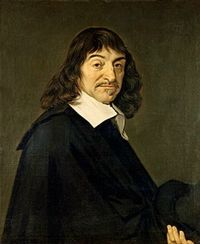

Title: Allar efasemdir þínar eru bara dropi í hafið miðað við það sem þú veist í raun ekki
Slug: allar-efasemdir-thinar-eru-bara-dropi-i-hafid
Date: 2007-08-02 16:22:00
UID: 171
Lang: is
Author: Karl Jóhann Jóhannsson
Author URL:
Category: Heimspeki
Tags:

Draumar eru senur í huga okkar sem við upplifum í svefni, sumar ósköp hversdagslegar, aðrar mjög óvenjulegar, fáránlegar, eða jafnvel ógnvekjandi. Á meðan á draumnum stendur er upplifunin mjög raunveruleg, stundum svo raunveruleg að sá er dreymir er ekki alveg viss í vöku hvort þetta átti sér stað eða ekki.

Kínverski spekingurinn Chang-tzu skrifaði fyrir rúmlega tveim þúsund árum: „Einu sinni dreymdi [mig] að ég væri fiðrildi, flöktandi hingað og þangað… skyndilega vaknaði ég… nú veit ég ekki hvort ég var maður að dreyma að ég væri fiðrildi, eða hvort ég sé fiðrildi að dreyma nú að ég sé maður.“[^1]

Hér verður fjallað um það hvernig við upplifum drauma og hvers vegna við ættum að taka það með fyrirvara hvað sé draumur og hvað veruleiki.

Börn læra ekki strax muninn á hlutlægu og huglægu, og læra ekki muninn fyrr en þau eru orðin um hálfan tug að aldri. Þriggja ára barn veit því ekki munin á því að strjúka hest í alvörunni (hinum hlutlæga heim) eða í draumi (hinum huglæga heim). Börn upplifa því lítið sem engan mun á svefn og vöku til að byrja með. En sem fullorðið fólk lærir það að skilja á milli þessara tveggja.

Til þess að byggja heimsmynd sína á hátt sem honum fannst vísindalega ásættanleg, hugleiddi René Descartes muninn á svefn og vöku í fyrstu hugleiðingu bókar sinnar _Hugleiðingar um frumspeki_.[^2] Descartes byrjar á því að tala um það að hann skuli ekki samþykkja vitneskju, nema hann sé þess viss að hún sé áreiðanlegar og óvéfengjanlegar. Hann hyggst ráðast á þann grundvöll sem vitneskja er byggð á, skilningsvitunum. En þar sem skilningsvitin hafi blekkt hann áður „og hyggin maður ber aldrei fullt traust til þess sem hafa einu sinni brugðist honum“ þá ætlar hann sér að hugleiða hvað sé vitneskja í raun og hverju við getum tekið sem sjálfsögðu og óvéfengjanlegu. Descartes leggur því áherslu á að þótt skilningsvitin blekki stundum er „eitt og annað sem ekki verður efast um _með neinu skynsamlegu móti_.“ Þetta er grundvallarhugmynd í þessari hugleiðingu hans, allt er hægt að efast um. Hver sem hefur áttað sig á því gerir mikið úr því til að byrja með, en eftir smá tíma er séð að fátt verður grætt á því að efast um allt, góður fyrirvari er kannski nauðsynlegur, en veruleg afneitun allra efnislegra hluta til lengdar er nær geðveiki en heilbrigði, eins og Descartes bendir á.

Næst bendir Descartes á að þeir hlutir, sem fólk með geðklofa – það er ranghugmyndir, ofskynjanir og fleira slíkt – og með alvarlegt hugrof, sér í vöku sinni sér hann í draumum sínum. Svo bendir hann einnig á að draumar eru ekki jafn skýrir og veruleikinn sem þú getur svo vel fundið fyrir með skilningarvitunum. En hugsanir sem slíkar eru líka hægt að hafa í draumum, þar með eru mörk draums og veruleika kannski ekki svo skýr eftir allt saman telur Descartes.

Descartes leggur svo til að allt sé bara draumur og heimurinn í kringum okkur sé ein stór skynvilla; að draumar séu líkari myndum, sem geta ekki verið annað en eftirmyndir af einhverju raunverulegu. En hann bendir á að við getum ekki ímyndað okkur það sem við ekki þegar vitum, ímyndun okkar nær aldrei lengra en vitneskja okkar, þó svo að ímyndunin væri eitthvað alveg óséð fyrr væri það samt tilkomið úr þeim efnislegu hlutum sem eru til fyrir. Svo bendir hann á að til séu sannindi sem við erum öll sammála um — sameiginlega samþykkt sannindi. Til dæmis felst í þessu að ferningur hafi fjórar hliðar og að tveir og þrír séu fimm.

Næst leggur Descartes til að Guð hafi gert þetta svo, búið þetta allt til. Ekkert þarf í raun að vera efnislegt. Á endanum getur okkur einnig skjátlast um hluti eins og að tveir og þrír séu fimm. Descartes telur að til að geta byggt raunverulega vitneskju á vísindalegum grundvelli þurfi hann að efast um allt. Þá sérstaklega til að koma í veg fyrir hleypidóma.

Descartes segir að hann muni ekki ganga að því vísu að Guð sé til og að ekki sé til slíkur guð heldur illur andi sem reynir allt hvað hann getur til að blekkja okkur. Allt efnislegt sem við skynjum sé sett þarna af þessum anda til þess að blekkja okkur í að halda að þetta sé raunverulegt.

Hvort sem það sé þessi andi, geimverur sem hafa sett heila okkar í krukku og hent líkamanum, eða illræmd vélmenni sem notfæra sér líkama okkar sem rafhlöður og hafa tengt miðtaugakerfi okkar við leiðslur í tölvu sem leyfir okkur að skynja heim sem er í raun aðeins tölvuforrit, þá er þetta lífeðlisfræðilega hægt. Ekki kannski með nútímatækni — nema það sé einmitt það sem verurnar/vélmennin vilji að við höldum — en allt er mögulegt, allt sem við getum ímyndað okkur er mögulegt, sama hversu ólíklegt sem það er.

Slík kenning myndi jafnvel skýra margt sem við skiljum ekki, enn í dag þá skýrir fólk óskýranlega hluti með tilvist æðri valds, guðs eða slíks. Í grunninn er þetta ein spurning sem svo oft hefur verið spurð að orðin eru orðin tóm, „hvernig veistu?“

En áður en við tökum afgerandi afstöðu skulum við víkja að gagnrýni Gilbert Ryles á hugmyndir Descartes.[^3] Ryles gagnrýnir hugmynd Descartes um takmarkanir á skynfærum okkar, að það sé ekki nóg að horfa, hlusta, eða snerta til þess að vita. Ryles tekur dæmi: Til að hægt sé að falsa peninga þurfa peningar að vera til og sameiginlega samþykktir. En þar sem peningar eru til, og líka falsaðir peningar gætu menn haft efasemdir um alla peninga ef þeir kynnu ekki að greina á milli þeirra. Ryles segir um efasmendamanninn:

> [H]versu almennar sem grunsemdir hans kunna að vera þá er alltaf ein staðhæfing sem hann getur ekki haldið fram, nefnilega sú staðhæfing að allir peningar séu falsaðir. Vegna þess að það verður að vera til svar við spurningunni „fölsun hvers?“

Það sem Ryle á við hér er að ef allt er falsað þá er ekkert raunverulegt til að miða við. Ef allt væri fölsun myndum við ekki geta hugsað málið með efasemdar-hugarfari því enginn grundvöllur væri til þess. Peningur er það sem við segjum að hann sé, ekkert meira, ekkert minna.

Gagnrýni Ryles bítur þó ekki endilega á rök Descartes, því heimurinn gæti allur verið fölsun án þess að vera fölsun nokkurs. Grundvöllurinn, sjálfur efnisheimurinn í allri sinni dýrð, gæti verið fölsun, sérsniðin fyrir okkur af anda, geimverum, eða hverju/hverjum sem okkur dettur í hug, en þó ekkert meira en það sem okkur dettur í hug. Andinn sem blekkir, segir Descartes, hefur búið þetta til — til þess að blekkja — en jafnvel þó svo að við getum ekki efast án þess að vita um hvað við erum að efast.

Descartes segist ekki geta verið viss um muninn á svefn og vöku, en draumar þurfa þó ekki að vera fölsun neins, því ef draumurinn er búin til af anda þá er það einungis andinn sem þarf að geta falsað. Andinn gæti verið gæddur hæfileikum til hugsunar sem er langt utan okkar ímyndunarafls og því getur hann búið til draumaheim fyrir okkur sem er gerólíkur vöku, sem við gætum aftur á móti aldrei ímyndað okkur.

Ef til vill stöndum við þá innan skynsamlegra marka skynsemi og efasemda. En það er þó líklega best að hafa í huga að hugsa ekki _of_ mikið út í það.

[^1]: MacKenzie: Dreams and dreaming. London: Aldus books, 1965.
[^2]: Descartes, R., Hugleiðingar um frumspeki, (þýð. Þorsteinn Gylfason). Reykjavík: Hið íslenska bókmenntafélag, 2001.
[^3]: Ryle, G., Ógöngur, (þýð. Garðar Árnason). Reykjavík: Lærdómsrit, 2000.

