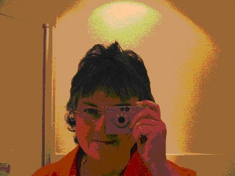

Title: Allegóría í Öskju
Slug: allegoria-i-oeskju
Date: 2006-05-18 14:03:00
UID: 73
Lang: is
Author: Unnur María Bergsveinsdóttir
Author URL: http://unnur.klaki.net
Category: Sagnfræði
Tags:

Í dag hefst [Söguþing](http://www.kistan.is/soguthing/Default.asp?Sid_Id=23514&tId=99&Tre_Rod=&qsr) og er það breska fræðikonan [Liz Stanley](http://www.sps.ed.ac.uk/staff/stanley.htm) sem flytur minningarfyrirlestur Jóns Sigurðssonar. Stanley er prófessor í félagsfræði við Háskólann í Edinborg en starfar á mörkum félagsfræði, sagnfræði, heimspeki og bókmennta og hefur einkum fengist við kvenna- og kynjasögu. Sagnfræðistofnun og Rannsóknarstofa í kvenna- og kynjafræðum gáfu landanum færi á að kynnast þessari spennandi fræðikonu betur með því að standa fyrir málstofu með Stanley. Voru þar annarsvegar voru ræddar persónulegar heimildir og notkun þeirra og svo hinsvegar það sem Stanley kýs að nefna archigraphics. Síðarnefnda hugtakið er er vissulega framandlegt og finnst ekki í neinni orðabók enda skóp Stanley til gagngert þess að ná utan um hugmyndir sínar um það víðtæka ferli sem öflun og úrvinnsla heimilda er.

Ég neyddist í gær til að ferðast um með strætisvagni og var því hvað tímasetningar varðar duttlungum örlagana háð en ekki eigin útreiknanlega fótstigskrafti. Þegar ég komst upp í Öskju var málstofan nýlega hafin og mér til mikillar skelfingar sá ég, þegar ég gægðist inn um skyggt glerið í dyrunum, að öll borð og stólar í stofunni voru þétt setin og breyttist sú sýn ekkert sama hversu oft ég rýndi í gegnum rúðuna. Eg sá hinsvegar að umræður voru þegar komnar vel af stað og á þéttskipuðum og skipulega uppröðuðum bekkjunum sátu alvöru fræðimenn íhuglir á svip og skiptust á því sem að utan séð virtust vera úthugsaðar og þaulskipulagðar pælingar. Það er skemmst frá því að segja að því lengur sem ég beið með nefið klesst upp að rúðunni eftir því að hlé yrði á akademíska samsöngnum og ég gæti laumað mér inn án þess að trufla, því meira hikaði ég og varð að lokum að óhagganlegum saltstólpa og ákvað að bíða bara eftir kaffihlénu sem var á dagskrá eftir rúman klukkutíma. Tímann þangað til notaði ég til að klára að lesa grein Stanley um hið dularfulla archigraphics og varð einhverju nær.

### _-and the Schreiner epistolarium- and the Schreiner epistolarium Archigraphics: in -the- politics, ethics and theoretics -of- / feminist historiography_

Hér að ofan má líta titil greinar Stanley, sem lögð var til grundvallar seinni hluta málstofunnar. Fyrst þegar ég opnaði skjalið sem sent var til félaga á Gammabrekku setti ég titilinn í beint samhengi við áminningu þess efnis að greinin sé á uppkastsstigi og henni megi ekki dreifa né vitna í án leyfis frá Stanley[^1]. Fljótlega varð mér þó ljóst að titillinn var þaulhugsaður í orðsins fyllstu merkingu og lýsir vinnsluferli sjálfrar greinarinnar. Stanley sagðist upphaflega hafa skrifað greinina fyrir tiltekið málþing og hefði hún öðrum þræði verið hugsuð sem létt prakkarastrik, eða sem skrumskæling á hugtakinu ,,opinn texti“. Þegar Már Jónsson skýrði henni frá því að greinin hefði verið send á u.þ.b. 300 sagnfræðinga virtist henni bregða við og flissaði að tilhugsuninni. Ég tel þó augljóst að hér sé deginum ljósara að öllu gríni fylgir einhver alvara og eru hugmyndir Stanley um framsetningu vinnuferlisins mjög athyglisverðar.

Greinin sem ber hinn flókna titil hefst á því að lýsa konu sem situr í einrúmi fyrir framan auðan tölvuskjá og autt blað. Hún hefur ákveðna hugmynd um það hvað hún ætlar að skrifa, hefst handa, horfir á orðin birtast á pappír og skjá, hikar, strokar út, skrifar, bætir við, setur orð í sviga, hugsar. Stanley lýsir því hvernig hún í gegnum samræður við sjálfa sig skrifar sig niður á lausnina. Þannig er lesandinn minntur á að á bak við snyrtilegar fræðigreinar er þykkur frumskógur mannlegra hugleiðinga, ákvarðana og endurskoðunar þeirra. Fræðin eru svo miklu meira en snyrt og stífð framsetning niðurstaðanna.

Þegar ég settist inn í málstofuna eftir kaffihléið komst ég að því að næg voru sætin. Það sjónarhorn sem ég hafði inn um glerrúðuna hafði bara ekki gefið rétta mynd af raunveruleikanum handan við dyrnar. Samlíkingin við það sem ég hafði rétt í þessu verið að lesa var yfirþyrmandi. Ekki bara sá ég að fræðimennahópurinn samanstóð jafnt af doktorum og nemum, heldur sátu viðstaddir alls ekki allir virðulega við uppröðuð borð heldur líka hvippinn og hvappinn um salinn. Einnig gerði ég mér ljóst að sjálft herbergið var um það bil þrisvar sinnum stærra en það hafði virst í gegnum glerið. Rétt eins og sjálf fræðin var samkoman mun stærri og óreiðukenndari en hún hafði virst utanfrá.

Í seinni helmingi málstofunnar varð Stanley tíðrætt einmitt um þetta sem ég hafði upplifað svo áþreifanlega. Hvernig hlutirnir virðast svo sléttir og felldir utan frá að óinnvígðir gera sér ekki grein fyrir möguleikum sínum. Rétt eins og doktorsnemarnir sem henni finnst svo miður að njörvi sig niður við það að fylgja staðaluppskriftum að lokaverkefnum hafði ég ekki gert mér grein fyrir því að það væri allt í lagi að fara í kringum reglurnar, laumast inn of seint, setjast á lausan stól í staðinn fyrir að telja mig þurfa að setjast við skipulega uppstilltu skeifuna í miðjum salnum.

Meðan ég sat og svimaði yfir hinni óaðfinnanlegu allegoríu sem ég sé þarna milli hugmynda Stanley og upplifunar minnar af því rými sem þær voru settar fram í, hélt Stanley áfram að slá fram fram róttækum staðhæfingum. _Teaching is the great bar to learning!_ sagði hún og átti við það hvernig kerfið getur orðið til þess að loka leiðum í stað þess að halda þeim opnum. Hvernig við verðum svo upptekin af því að eltast við ,,rétt“ verklag að við sjáum ekki lengur aðra möguleika en þá sem tilgreindir eru í leiðbeiningabæklingnum. Hún talaði líka um hvernig sú viðtekna hefð að hreinsa framsetningu rannsóknarniðustaðna af skjalaskarkala hefði það í för með sér að vinna fræðimanna yrði að ósýnilegu og leyndardómsfullu fyrirbæri. Hvernig ósýnileiki rannsóknarferlisins hefti möguleika viðtakandans á því að melta með sér staðhæfingarnar sem þar af hljótast. Hvernig dauðhreinsun texta af öllum efa og mótsögnum frystir niðurstöðurnar þannig að lesandinn hefur enga möguleika á að kryfja röksemdafærsluna sem liggur að baki, aðeins möguleika til að samþykkja þær eða hafna þeim. Að mati Stanley töpum við öll á þessu veldi hefðanna og til að undirstrika nauðsyn þess að leyfa skjalaskarkalanum að heyrast í framsetningunni barði hún í borðið, svo harkalega að íslenskir sagnfræðingar hrukku við.

Ég gekk út úr málstofunni með höfuðið fullt af spennandi og ögrandi hugmyndum og mér leið mun frekar eins og ég hefði verið á rokktónleikum en málstofu í sagnfræði. Hefðu verið seldir Lizbolir og bækur við útgang Öskju þá hefði ég eytt öllum vasapeningunum mínum. Ég hlakka því alveg hreint ógurlega til að heyra Liz Stanley flytja minningarfyrirlestur Jóns Sigurðssonar seinna í dag.

[^1]: Hér hef ég sökum tímaskorts og birtingarpressu gætt þess að vitna ekki í greinina nema hvað varðar titil og svo þau atriði sem komu skýrt fram á málþinginu. Því er það að ég get því miður ekki leyft mér að útmála mig um það hversu afspyrnu góður penni Liz Stanley er en mögulega fæ ég færi til þess seinna þegar tíminn leyfir öflun tilskilinna leyfa.

