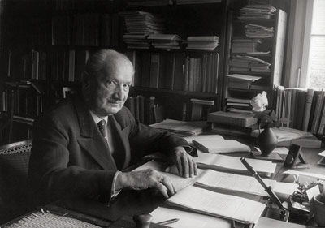

Title: Allt sem þig hefur alltaf langað til að vita um tækni (en þorðir ekki að spyrja Heidegger)
Slug: allt-sem-thig-hefur-alltaf-langad-til-ad-vita-um-taekni
Part: 1/2
Date: 2008-09-23 10:45:05
UID: 631
Lang: is
Author: Jóhann Helgi Heiðdal
Author URL: 
Category: Heimspeki
Tags: Martin Heidegger, Gestell, tækni

Eins og frægt er varaði þýski heimspekingurinn Martin Heidegger (1889-1976) við hættum tækninnar. En hvað var það nákvæmlega sem var honum svo hugleikið? Í greininni „Die Frage nach der Technik.“[^1] \(Spurningin um tæknina) reynir hann að komast að eðli hennar. Hann telur að allt hafi sér visst eðli en það er þó dulið mönnunum, þ.e. vera hlutanna er ekki aðeins það sem er fyrir framan okkur eða það sem hann kallaði nærveru heldur erum við alltaf í tvíþættum tengslum við hana (nærvera/fjarvera). Í ljósi þeirra gríðarlegu áhrifa sem tæknin hefur á líf okkar er mikilvægt að komast að þessu dulda eðli. Hann tekur þó skýrt fram að tækni og uppruni tækninnar er tvennt ólíkt. Hann skoðar ekki flugvélar, verksmiðjur, bíla o.s.frv. í sjálfu sér, þetta eru aðeins hlutir en ekki eðlið sjálft. Til dæmis tekur Heidegger tré og bendir á að eðli trésins er að vera tré en þó er eðlið sjálft ekki tré. Að segja að tré sé að vera tré er bara eintóm klifun sem hjálpar okkur ekki neitt.[^2] Í samræmi við heimspekilegt markmið sitt sem hann kallaði grundvallar verufræði leitast hann frekar við að draga fram sannleikann sem er okkur dulinn.

Hann bendir á að orðið tækni sé komið frá gríska orðinu _techne._ Hjá Grikkjunum þýddi _techne_ ekki aðeins hæfni og geta einhvers heldur einnig hugaraflið og listir. Tæknin hjá Grikkjunum var því órjúfanlega tengd hinu ljóð- og listræna. Þannig byrjar Heidegger rannsókn sína á uppruna tækninnar með því að draga fram dulinn uppruna orðsins. Einnig leitar hann aftur til Aristótelesar og kenninga hans um orsakir. Heidegger telur mjög mikilvægt að leita aftur til upprunans vegna þess að upprunalegar hugmyndir afskræmast smám saman með tímanum. Ef nýta á hugmyndir Grikkja þarf því að leita aftur til þeirra og það sem þeir sögðu í raun og veru. Ekki er hægt að styðjast við síðari tíma útfærslur. Aristóteles hélt því fram að til að útskýra eitthvað til hlítar þarf að gera grein fyrir fjórum orsökum, úr hverju hluturinn er, hvaða form hann hefur, hvaða tilgangi hluturinn þjónar og hver það var sem kom hlutnum til leiðar. Það er einmitt þessi síðasta tegund orsaka sem Heidegger veltir fyrir sér. Hann telur að Grikkirnir höfðu áttað sig á því að þegar hlutir verða til þá eru þeir dregnir fram, þeir kölluðu þetta _poiesis_ eða framsetningu. Hlutir sem búnir eru til eru sem sagt settir fram eða þeim er leitt til leiðar. En það sem er mikilvægt hér er að hlutir eru dregnir fram á mismunandi hátt. Tækni er því aðeins ein tegund framsetningar eða _poiesis._

Nútímatækni er því ekki aðeins eintóm framleiðsla tæknilegra hluta heldur er hún ákveðin leið til að draga hluti fram, ákveðin leið sem veran birtist okkur. Uppruni tækninnar hjá Heidegger er það sem hann kallar _Ge-stell_.[^3] Sjálfur útskýrir hann þetta hugtak svona:

> [_Ge-stell_] means the gathering together of the setting-upon that sets upon man i.e. challenges him forth, to reveal the actual, in the mode of ordering, as standing-reserve.[^4]

Hann á við að uppruni tækninnar er það sem drífur mennina ávallt meira og meira áfram til þess að láta hlutina birtast sér sem eintómt hráefni, eitthvað sem þeir geta notað.

_Ge-stell_ er því einhvers konar áskorun sem lætur mennina skynja hluti aðeins sem tiltæka, eitthvað sem hefur aðeins praktískt gildi fyrir okkur. Það kemur í veg fyrir að mennirnir skynji hlutina á annan hátt. Til dæmis má nefna að hér áður fyrr litu menn allt öðruvísi á skóg en þeir gera nú til dags, skógur var allt annað fyrirbæri en hann er í dag.  Skógur var mjög mismunandi upplifun fyrir mismunandi aðila, þ.e.a.s. skógur birtist fólki á mismunandi hátt. Í dag er skógur í okkar augum eintómt hráefni sem við getum notað til að framleiða ýmislegt fyrir okkur, eitthvað sem kemur okkur að gagni. Fyrir mörg hundruð árum voru menn í mismunandi tengslum við skóginn, hann birtist þeim á mismunandi hátt. Nú sjáum við hann aðeins sem eitthvað sem við getum notað. Það er einmitt _Ge-stell_ sem hefur komið þessum hugsunarhætti í kring. Það drífur okkur áfram til þess að láta alltaf fleiri og fleiri fyrirbæri í kringum okkur verða það sem Heidegger kallar birgðastöður. Við erum því farin að halda að allt í kringum okkur sé þarna í raun og veru aðeins til nota handa okkur.

Annað hugtak sem mikilvægt er að fjalla um í þessu samhengi er það sem Heidegger kallar örlög. Hann er þó alls ekki að meina örlög í venjulegum skilningi þess orðs. Sannleikurinn hjá Heidegger er afhjúpun á eðli einhvers. Það sem við skynjum í heiminum afhjúpar sig svo á mismunandi hátt. Örlög hjá Heidegger er því allar tegundir afhjúpunar, allur sá háttur sem við getum skynjað á og verið í tengslum við heiminn í kringum okkur. Það sem hann á við hér er því að _Ge-stell_ er aðeins einn afhjúpunarhátturinn sem innifalinn er í örlögum manna. Við upplifum hluti í kringum okkur sem birgðastöður vegna _Ge-stell_ en það er þó ekki endilega hvernig þeir þurfa að vera. Að mati Heideggers er mikilvægt að maðurinn átti sig á þessu. _Ge-stell_ er verufræðilegt ástand manna, þ.e. ein leið afhjúpunar.

En vegna þess allir mögulegir afhjúpunarhættir eru innifaldir í örlögum manna þá leiðir það af sér að _Ge-stell_ er einnig örlög manna. Þetta leiðir til einkennilegrar niðurstöðu. Hjá Heidegger er tæknin því ekki afleiðing af framförum manna í vísindum. Samkvæmt venjulegum söguskilningi þá leiddi iðnbyltingin og miklar tækniframfarir á 19. og 20. öld af fyrri tíma uppgötvunum manna í náttúruvísindum. Eitt leiðir þá af öðru. En samkvæmt Heidegger er _Ge-stell_, drifkraftur tækninnar alltaf innifalið í örlögunum, í eðli tækninnar. Eitt leiddi því ekki einfaldlega af öðru heldur var tæknihyggjan sem við sjáum í dag nú alltaf til staðar í eðli þessa hugsunarháttar. Birtingarmyndin afhjúpaði sig aðeins síðar meir.

Eins og við höfum séð áleit Heidegger að tæknin hafi verið mun flóknara fyrirbæri en aðeins framleiðsla ýmissa hluta sem við höfum gagn af. Hún er verufræðilegt vandamál. Tæknihyggjan nær alveg aftur til gullöld Grikklands og við erum enn að súpa seiðið af hugsunarhættinum sem spratt upp þar. En í hverju felst hættan? Í seinni hlutanum útskýri ég það.

[^1]: Greinin var upphaflega fyrirlestur sem Heidegger flutti 18. nóvember 1953.
[^2]: Heidegger, Martin, „The Question Concerning Technology", William Lovitt  þýð.  í David Farell Krell (ritstj.), _Martin Heidegger: Basic Writings_, Harper Collins Publisher, New York, 1993, bls. 311.
[^3]: _Ge-stell_ er tæknilegt hugtak sem á sér enga hliðstæðu í íslensku og því leyfi ég þýska orðinu að standa. Það sama á við um _Dasein_.
[^4]: Sama rit, bls.325
