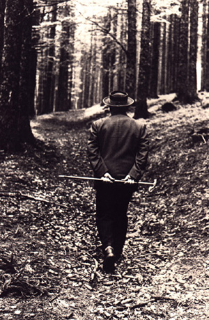

Title: Allt sem þig hefur alltaf langað til að vita um tækni (en þorðir ekki að spyrja Heidegger)
Slug: allt-sem-thig-hefur-alltaf-langad-til-ad-vita-um-taekni
Part: 2/2
Date: 2008-09-25 13:30:00
UID: 648
Lang: is
Author: Jóhann Helgi Heiðdal
Author URL: 
Category: Heimspeki
Tags: Martin Heidegger, Dasein, Ge-stell, tækni, Messkirch, Todtnauberg, Svartiskógur, Friedrich Hölderlin, siðfræði Kant

Hver er hættan við tækni sem Heidegger varaði við? Tæknin sem Heidegger kallar eina birtingarmynd afhjúpunar verunnar hefur leitt til mikilla framfara á öllum sviðum mannlegs lífs. Má þá ekki draga þá ályktun að gott sé fyrir mennina að sjá hlutina í kringum sig sem birgðastöður? Heidegger telur að svo sé ekki. Hættan liggur i því að vegna þess að _Ge-stell_, áskorunin sem lætur mennina skynja allt sem birgðastöður ágerist ávallt, verður alltaf meiri og meiri þá leiðir hún á endanum til þess að við förum að skynja mennina sjálfa sem tiltæka eða eins og hann segir:

> Meanwhile, man, precisely as the one so threatened exalts himself and postures as lord of the earth. In this way the illusion comes to prevail that everything man encounters exists only insofar as it is his construct. This illusion gives rise in turn to one final delusion: it seems as though man everywhere and always encounters only himself.[^1] 

Kjarninn í siðfræði Immanuel Kants er að koma ávallt fram við menn sem markmið í sjálfu sér en ekki aðeins sem leið að markmiði. Þetta svipar til þess sem Heidegger er að vara við. Mannveran eða _Dasein_ eins og hann kallar hana er einstök einmitt vegna þess að hún er eina veran sem spyr sig um veru sína. Því er það mjög mikið áhyggjuefni þegar farið er að líta á ekki aðeins alla hlutina í heiminum sem birgðarstöður, eitthvað sem er þar aðeins til notkunar handa manninum, heldur einnig manninn sjálfan, eða aðeins sem leið að markmiði. Þegar það gerist hlýtur það að leiða til mikilla hamfara.

Þetta er þó ekki það eina sem Heidegger hefur áhyggjur af:

> The threat to man does not come in the first instance from the potentially lethal machines and apparatus of technology. The actual threat has already afflicted man in his essence. The rule of [_Ge-stell_] threatens man with the possibility that it could be denied to him to enter into a more original revealing and hence to experience the call of a more primal truth.[^2]

Eins og hefur áður komið fram er _Dasein_ einstök. Hún er það sem veran afhjúpar sig fyrir og skilyrði þess að veran afhjúpi sig yfirhöfuð. _Dasein_ er eina veran sem getur upplifað veruna og túlkað hana á ýmsan hátt. Þess vegna er hún í raun og veru að svíkja eðli sitt þegar veran birtist henni aðeins á einn hátt. Þegar veran er aðeins farin að afhjúpa sig sem birgðastaða fyrir _Dasein_ vegna _Ge-stell_ þá gerir hún sér ekki grein fyrir öðrum háttum, hvernig veran getur einnig sýnt sig. Þetta er mun meira áhyggjuefni því þar með erum við hætt að sjá heiminn í réttu ljósi. Það sem meira er þá getum við meira að segja gleymt verunni yfirhöfuð og sokkið svo djúpt inn í _Ge-stell_ að þaðan er engrar undankomu auðið. Við skynjum þá allt sem birgðastöður og spyrjum ekki einu sinni lengur út í aðrar birtingarmyndar verunnar, spurningin um veruna er þá dauð fyrir okkur. Það væri að mati Heideggers mesti harmleikurinn. Leiknum væri lokið og mönnunum ekki lengur bjargandi.

En hverju er Heidegger þá nákvæmlega að kalla eftir? Auðvelt er að túlka hann á þann veg að hann sé að vara við firringu nútíma lífs og vill að mennirnir snúi aftur til einfaldari lifnaðarhátta þar sem þeir eru í meiri tengslum við náttúruna í kringum sig. Það er ýmislegt sem rennir stoðum undir þá túlkun. Til dæmis þá fæddist Heidegger og ólst upp í Messkirch sem er lítill bær í Þýskalandi. Hann þekkti því vel einfalt bændalíf og kunni mjög vel við það. Hann átti einnig lítinn kofa í Todtnauberg í Svartaskógi þar sem hann fór oft til að vera einn og stunda heimspekilegar rannsóknir. Heidegger hélt því fram að einveran og nálægðin við náttúruna væri besta leiðin til að stunda heimspeki. Því er auðvelt að halda fram að Heidegger hafi með einhverju móti haft andúð á borgaralífinu og tækninni sem umlykur það og leit á það sem hnignun nútímamannsins hversu djúpt sokkinn hann er í tæknina að hann er farinn að þjóna henni en ekki öfugt.

Þetta tel ég þó vera kolrangan lestur á hugsun Heideggers um tæknina. Hvað Heidegger fannst raunverulega um borgaralífið skal ég hér látið ósagt en það er nokkuð víst að hann var ekki svo barnalegur í hugsun að hann hafi haldið að það væri mögulegt fyrir mennina að snúa aftur frá núverandi ástandi. Þótt hann sé mjög svartsýnn um framtíð mannkyns þá heldur hann ekki fram að öllu sé lokið og hann vitnar í þýska ljóðskáldið Friedrich Hölderlin sem sagði: „but where danger is, grows the saving power also"[^3]
Hölderlin var uppáhalds ljóðskáld Heideggers sem gekk meira að segja svo langt að halda fram að hann væri mesta skáld Þjóðverja.

En hvað á hann við með þessari tilvitnun? Heidegger vill meina að með því að skynja hættuna sem okkur stafar af tæknilegri nálgun okkar á verunni þá skynjum við á sama tíma leið okkar út úr þessu ástandi. Heidegger er mjög myrkur í máli hér og erfitt að skilja hann. Hann á þó líklegast við að með því að átta sig á að tæknin er aðeins ein birtingarmynd verunnar þá áttum við okkur á sama tíma á því að við erum einnig opin fyrir öðrum birtingarháttum. Um leið og við erum búin að skilja tækni sem birtingarmynd verunnar þá þurfum við ekki lengur að beygja okkur undir _Ge-stell_, áskorunina sem lætur okkur skynja hluti sem birgðastöður. Þá áttum við okkur á því að tæknin sé aðeins hluti af örlögum mannkyns en ekki öll sagan. Það er því nákvæmlega með því að átta okkur á eðli tækninnar sem raunveruleiki okkar umbreytist með róttækum hætti. Við sjáum að veran birtist í gegnum okkur og það er þar sem bjargráðið liggur að mati Heideggers.

Það er þó ljóst að í síðasta viðtalinu sem tekið var við Heidegger af _Der Spiegel_ árið 1966 og var birt eftir dauða hans að hann er þar þeirrar skoðunar að þessi atburður, að við áttum okkur á eðli tækninnar hafi enn ekki orðið. Mannkyninu stafar enn mikil hætta af tækninni. Hann lætur þar þau frægu orð falla að: „only a God can save us now."[^4]  Það er ekki auðvelt að átta sig á nákvæmlega hvað hann meinar með þessu. Það er þó ljóst að hann er ekki að meina Guð í neinum hefðbundnum skilningi, hann á t.d. ekki við hinn kristna Guð. Ein túlkun er sú að samkvæmt skoðun hans á tækninni þá þurfum við að finna leið til að komast undan hinni tæknilegu áskorun eða _Ge-stell_. Það hljótum við að gera með því stunda ýmislegt sem ekki er tæknilegt í eðli sínu. Við þurfum því einhverja leið til að ýta hinum tæknilega hugsunarhætti til hliðar. En hvernig er þetta gert? Til þess þurfum við einhvern nýjan hugsunarhátt. Þetta er það sem hann meinar með Guði, einhver atburður sem verður til þess að við hugsum á nýjan, róttækan hátt, ekki tæknilega. Til þess þurfum við einhvers konar Guð sem gefur þessum nýja hugsunarhætti merkingu, eitthvað sem festir hugsun okkar í sessi og gefur henni gildi.[^5]

[^1]: Heidegger, Martin, „The Question Concerning Technology“, William Lovitt  þýð.  í David Farell Krell (ritstj.), Martin Heidegger: Basic Writings, Harper Collins Publisher, New York, 1993, bls. 332.
[^2]: Sama rit, bls. 333
[^3]: Sama rit, bls. 333
[^4]: Dreyfus, Hubert L., „Heidegger on the connection between nihilism, art, technology, and politics“,  í Charles B. Guignon (ritstj.), The Cambridge Companion to Heidegger: Second Edition, Cambridge University Press, New York, 2006, bls. 365.
[^5]: Sama rit, bls. 365-367

 
