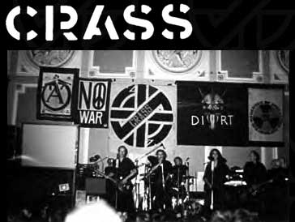

Title: Alltaf kátt í höllinni!
Slug: alltaf-katt-i-hoellinni
Date: 2006-01-12 02:18:00
UID: 35
Lang: is
Author: Unnur María Bergsveinsdóttir
Author URL: http://unnur.klaki.net
Category: Sagnfræði, Tónlist
Tags:

_Stúlkan stendur í troðfullri Laugardalshöll, umkringd tæplega fimm þúsund manns. Allir teljast viðstaddir hingað komnir til að sýna göfugu málefni stuðning. Til að sýna að þeim standi ekki á sama um framtíð lands og þjóðar. Það er heitt og troðið og á sviðinu skiptast tónlistarmenn og aktívistar á að fanga athygli fjöldans. Það sem af er kvöldinu hafa bæði stórstjörnur og lítt þekktir tónlistarmenn komið fram; sérkennilegur söngur Bjarkar hefur kitlað eyrun en gól Einars Arnar hefur fengið hluta gestanna til að flýja fram í andyri að skoða bæklinga og plaggöt umluktir sígarettumekki. Stúlkan kom of seint til að sjá gjörningana en henni skildist þeir hefðu þótt skrýtnir. Undir lokin tryllir Bubbi viðstadda með því að segja frá fjöllunum sem hafa vakað í þúsund ár. Þegar stúlkan gengur út í kuldann og þessa nótt sem er svo köld heyrist henni á tali nálægra að markmiði tónleikahaldara, að flykkja Íslendingum til liðs við góðan málsstað, hafi verið náð. Hún vonar innilega að þessi viðkvæma tilfinning eigi við rök að styðjast, að hún hafi verið viðstödd viðburð sem muni stuðla að betri framtíð. Efst í huga er henni þó mögnuð og langþráð endurkoma meistara Megasar._

Sitji lesendur Hugsandi nú forviða fyrir framan skjáinn og spyrji sig hvort Hugsandi feti hér í fótspor mistækra fréttablaða í umfjöllun um tónleika Hættu hópsins skal það tekið fram að hér að ofan var ryki vísvitandi slegið í augu þeirra. Megas var jú að minnsta kosti ekki holdi klæddur á sviðinu í Laugardalshöll síðasta laugardagskvöld frekar en Nick Cave. Hér er þó ekki um að ræða óvönduð vinnubrögð heldur er hér að ofan vísað til atburðar sem átti sér stað fyrir rétt rúmlega 20 árum síðan, í september 1983, og var tilefnið ekki náttúruvernd heldur friðarbarátta.

Það reynir hugsanlega á minni marga lesenda að koma fyrir sig um hvaða tónleika er rætt, enda er ekki aðeins langt um liðið heldur líka langt síðan samkoma af þessu tagi fyllti síðast Laugardalshöllina. Það er óhætt að reikna með því að aðstandendur _Ertu að verða náttúrulaus?_ hafi, að minnsta kosti í laumi, varpað öndinni léttar þegar miðarnir seldust upp svo hratt sem raun var. Það er þó ekki einsdæmi að slíkir viðburðir séu vel sóttir, slíkt gerðist í tvígang fyrir rúmum tveim áratugum og vakti, rétt eins og í dag, verðskuldaða athygli. Samvinna aktívista og tónlistamanna á sér langa sögu en fyrir árið 1980 voru það oftast lágstemmdir vísnasöngvarar sem rauluðu fyrir vini dýra, manna og náttúru um þrælavinnu og maístjörnur, móðurást og göfuglyndi. Sómakærir og ábyrgir þjóðfélagsþegnar höfðu getað barist fyrir betri heimi í friði fyrir sóðarokki og hávaðagargi því sem seinna var kennt við Hótel Borg.  Í upphafi níunda áratugarins tók rokkið hinsvegar ákafan fjörkipp fyrir tilstilli pönksins og nýbylgjunnar og kveikti í brjóstum ungra drengja ákafa löngun til að standa gleiðir á sviði með gítar. Utangarðsmenn trylltu um landsbyggðina og rokktónleikar voru staðurinn til að sýna sig og sjá aðra. Hér fólust möguleikar sem skyldi nýta og Laugardalshöll var í tvö merkileg skipti staðurinn.

Fyrri stórtónleikarnir sem um er rætt voru haldnir á vegum samtaka herstöðvandstæðinga þann 13. september 1980. Samkoman var haldin undir kjörorðinu _Rokk gegn her_. Í opnunartölu, sem Sveinn Hauksson hélt, var rokkið kynnt sem nýtt vopn í friðarbaráttu og fram komu hljómsveitir sem voru meðal þeirra vinsælustu á þessum tíma: Mezzoforte, Þursaflokkurinn og Utangarðsmenn. Tónleikarnir voru vel sóttir og blaðamaður Dagblaðsins skrifaði að vopnið nýja virtist ætla að vera sterkt í höndum herstöðvaandstæðinga. Reiknaðist Dagblaðinu til að um þrjú þúsund manns hefðu setið salinn og voru áhorfendur samkvæmt blaðamanni af öllum toga, „allt frá pönkurum upp í alþingismenn og allt þar á milli“.

Milli tónlistaratriðanna tróð leikflokkurinn Táragas upp í gervi hermanna. Í stað þess að myrða fólk og limlesta var aðaliðja gervihermannanna að sippa, leika sér í teygjutvisti og öðrum leikjum sem venjulega eru frekar tengdir við friðsæla sumardaga og börn á grunnskólaaldri. Höllin var skreytt risastórum brúðum, illa förnum, sem áttu að tákna fórnarlömb stríðsátaka og einnig fjölda spjalda með slagorðum og myndum. Viðamesta skemmtiatriðið utan tónlistarinnar var þó sýning kvikmyndar af gasslagnum á Austurvelli árið 1949.  Sumir tónlistarmannanna brugðu líka á leik, Karl heitinn Sighvatsson spilaði til dæmis í lögreglubúningi.

Umfjöllun fjölmiðla um atburðinn var þrátt fyrir stærð hans mjög misjöfn, Dagblaðið og Þjóðviiljinn birtu heilsíðuumfjöllun. Morgunblaðið þagði þunnu hljóði og Alþýðublaðið gagnrýndi Samtök Herstöðvaandstæðinga harðlega fyrir „ameríkanseríngu“ og hæddist að því að samtökin skyldu velja svo óþjóðlega leið, sem úrkynjað rokk, til að berjast gegn Kananum og uppnefndi samtökin „fótgöngulið Alþýðubandalagsins“.

Seinni tónleikarnir voru haldnir rúmum tveim árum síðar, 10 september 1983, undir kjörorðinu _Við krefjumst framtíðar_. Að tónleikunum stóðu grasrótarsamtök ungs fólks og var viðburðurinn vandlega auglýstur, meðal annars með útgáfu sérstaks blaðs þar sem friðarmál voru rædd af þeim tónlistarmönnum sem spila skyldu. Aðalnúmer tónleikanna var breska pönkhljómsveitin Crass sem ekki aðeins samanstóð af friðarsinnuðum anarkistum heldur bjuggu hljómsveitarmeðlimir saman í kommúnu rétt utan við London og ræktuðu sitt eigið grænmeti. Crass boðaði róttækar skoðanir sínar bæði í textum og útpældu myndmáli og spilaði groddalegt og svalt pönkrokk. Lög þeirra fordæmdu kjarnorkuárásirnar á Nagasaki og Falklandseyjastríðið og kröfðu Margréti Thatcher og breska ríkisstjórn um svör við áleitnum spurningum. Það var Grammið sem flutti Crass inn en plötur þeirra höfðu verið þó nokkuð vinsælar meðal íslenskra pönkrokkara, einkum þeirra sem voru í yngri kantinum.

Rétt eins og á friðartónleikunum 1980 var dagskrá kvöldsins margþætt. Leikhópurinn Svart og Sykurlaust stikaði á stultum um salinn og ein svalasta hljómsveit Íslandssögunnar, Oxmá, rokkaði á karlaklósettinu. Í þetta skiptið voru sömuleiðis sýndar kvikmyndir, í þetta skiptið voru það fallandi sprengjur og kjarnorkusveppir sem var varpað á tjaldið. Hvað tónlistina varðar var það aftur rokkhetjan Bubbi sem kom fram í fararbroddi hljómsveitarinnar Egó og í þetta skiptið steig bróðir hans Tolli líka á stokk ásamt Ikarus. Sjálfur Megas kom því hér fram á sínum fyrstu tónleikum í langan tíma og ungsveitin Vonbrigði lýsti seinna yfir einlægri gleði yfir því að hafa þetta kvöld deilt sviði með ofurpönkunum í Crass. Það er mál fjölmiðla sem fluttu fréttir af samkomunni að hún hafi verið vel lukkuð allt þar til sjálft aðalnúmer kvöldsins tók upp á því að láta tónleikagesti hlýða á langdreginn ljóðalestur og neitaði svo að spila annað en lög af nýjustu plötu sinni _Yes Sir I Will_ sem var lítt þekkt hérlendis og tormelt. Þeir sem höfðu vonast eftir að heyra kunnuglega smelli, sem gilti eflaust um meirihluta þeirra 4000 manns sem sóttu tónleikana, fóru því burt í fússi.

Okkur sem lítum til baka finnst eflaust töluvert til þess koma að til viðbótar við þá sem taldir eru upp hér að ofan krafðist ung hljómsveit sinnar eigin framtíðar með því að spila þetta kvöld sína fyrstu tónleika. Hljómsveitin hafði verið samansett örfáum mánuðum fyrr úr hæfileikaríkum einstaklingum úr hljómsveitum á borð við Þey, Fan Houtens Kókó, Purrki Pillnik og Tappa Tíkarrassi til að ljúka með stæl hinni goðsagnakenndu útvarpsþáttaröð Áföngum. Ætlunin var upphaflega aðeins að flippa í síðasta Áfangaþættinum og kom hópurinn fram undir nafninu _Gott Kvöld_ en tónlistargjörningurinn tókst svo vel að ákveðið var að halda samstarfinu áfram og varð nafnið _Kukl_ fyrir valinu að uppástungu hinnar ungu söngkonu Bjarkar.

Góður rómur var gerður að framkomu Kuklsins í Laugardalshöll og þar á ofan tókust góð kynni með þeim og aðalnúmeri kvöldsins, Crass. Báru þau ávöxt í formi plötu og tónleikaferðar um Evrópu árið eftir. Þess má geta að Bubbi hinsvegar flutti um sama leyti til Bandaríkjanna þar sem hann náði naumlega að flýja þau örlög að vera gerður að hasarstjörnu í víkingamynd af B-sort. Eins og minnst var á í upphafi þessarar greinar stóðu þessar hetjur íslenskrar rokksögu bæði á sviði Laugardalshallarinnar nú síðustu helgi.

Rétt áður en Egó renndi í lokalag _Ertu að verða náttúrulaus_ tónleikanna, lét Bubbi þau orð falla að líklega hefði meirihluti viðstaddra ekki verið fæddur þegar þetta lag var samið. Ég leit í kringum mig og glotti við tönn þar sem stór hluti viðstaddra var þvert á móti einmitt alveg nógu gamall til að hafa verið viðstaddur bæði hin skiptin þegar hann rokkaði fyrir góðum málsstað í Höllinni. Reyndar hafði ég  nokkru fyrr um kvöldið hitt vinkonu mína sem hafði verið viðstödd aðra þá tónleika sem hér hefur verið rætt um og var nú viðstödd ásamt eiginmanni og dætrum. Hún hafði þó í hálfkæringi hótað því að láta sig hverfa úr höllinni áður en Bubbi stigi á svið til að fá ekki tímaflakkslost. Ef áfram heldur sem horfir er alls ekki ólíklegt að aktívistar muni halda áfram að fylla Laugardalshöllina einu sinni til tvisvar á áratug svo lengi sem land girðir sær og unglingarnir sem sækja muni slíkar samkomu í framtíðinni verði sumir hverjir í fylgd foreldra og jafnvel afa eða ömmu sem muni þræta um það hvort Bubbi hafi verið betri árið 1980, 1983, 2006 eða 2018.

