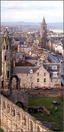

Title: Analýsur verðandi meistara í útlöndum
Slug: analysur-verdandi-meistara-i-utloendum
Date: 2005-11-03 08:59:09
UID: 13
Lang: is
Author: Björk Þorleifsdóttir
Author URL: 
Category: Póstur að utan, Sagnfræði
Tags: University of St. Andrews, Skotland, Háskóli Íslands, meistaranám, umhverfissagnfræði

Meistaranám í sagnfræði er jafn fjölbreytilegt og skólar sem bjóða upp á það eru margir. Nýverið hafa þær raddir gerst háværari sem krefjast uppstokkunar og breytinga í sagnfræðiskor Háskóla Íslands. Hér kemur örlítið innlegg í þá umræðu, frá nokkuð ólíkum sjónarhóli þó. Ætlunin er nefnilega að gera úttekt á meistaranámi í sagnfræði á Bretlandseyjum, nánar tiltekið við University of St Andrews í Skotlandi. Samanburður við meistaranám á Íslandi er ógjörningur þar sem ég hef aldrei setið tíma á meistarastigi við Háskóla Íslands en kannski hjálpar þessi samtíningur gagnrýnendunum að vega og meta jákvæða jafnt sem neikvæða þætti námsins við hina íslensku sagnfræðiskor

Þegar ég hélt í víking til Skotlands haustið 2004, var ég grunlaus um hvað í vændum var. Ég hafði áður en námið hófst spjallað við nokkra prófessora í faginu við háskólann sem heillaði og komst helst að því að námið þætti ansi hreint strembið og að öllu jöfnu heltust nokkrir nemendur úr lestinni á hverju ári. Sú varð reyndar raunin, tveir af um tíu meistaranemendum nútímasöguskorar hættu námi á önninni og einnig fréttist af nemum sem fengu ekki leyfi skorarinnar til að vinna meistararitgerðina vegna „slappra“ einkunna. Meðaleinkunn námskeiða við háskólann þarf að vera nálægt fyrstu einkunn til þess að nemendur fái að byrja á meistararitgerðinni. Náist það ekki, fá þeir gráðu sem er nefnd Graduate Diploma og eru svo sendir heim. Nemendur eru almennt á þeirri skoðun að markmið námskeiðshluta meistaranámsins sé að vinsa úr nemendafjöldanum. Meistaranámið virðist því vera prófsteinn á hverjir hafa nægilega sterk  bein og þekkingu til að halda áfram í doktorsnám. Það skal tekið fram að grunnnám við skoska háskóla er nokkuð ólíkt íslenska kerfinu. Nemendur hefja almennt háskólanám við átján ára aldur og velja tvö til þrjú fög til að stúdera fyrst um sinn. Eftir þriðja árið er BA-gráðu lokið og þá tekur við eins árs MA-nám. Því næst geta nemendur sótt um svonefnt Post Graduate nám, sem eru þrjár gráður, Master of Literature sem er eitt ár, Master of Philosophy sem eru tvö ár og að lokum doktorsnám sem er um þrjú ár eftir hin tvö fyrrnefndu.

Nemendaflóran í námskeiðunum var þannig að meistaranemar sátu oft  námskeið með þriðja árs BA-nemum og MA-nemum. Þeir sem voru í MLitt eða MPhil fengu þó önnur og meira krefjandi verkefni en aðrir nemendur. Námskeiðin voru alla jafna nokkuð erfið og kennd einu sinni í viku, tvo tíma í senn. Mikið vinnuálag, með þremur ritgerðum í námskeiði auk framsögu og gríðarlegum lestri frumheimilda, fylgdi. Vinnudagurinn teygðist oftar en ekki langt fram á nótt og skrifast það að einhverju leyti á reynsluleysi við að skrifa á fræðimáli sem var ekki hin ástkæra, ylhýra íslenska. Það er ekki beinlínis hægt að segja að kennararnir hafi tekið á nemendum sínum með silkihönskum. Verkefnin fékk maður til baka með ýtarlegum og á stundum harkalegum umsögnum. En að kvöldi dags var svo sem ágætt að fá ekki sérmeðferð vegna þess að maður var útlendingur og lærði ég mikið um fræðileg vinnubrögð í gegnum þessa óvægnu gagnrýni.

Vegna þess hve fáir nemendur eru í meistaranámi í hverju fagi nútímasögu við háskólann var brugðið á það ráð að halda sameiginlegt námskeið í sögu sagnfræðinnar og hinum ýmsu aðferðum við miðlun sögu. Þrír prófessorar skiptu kennslunni á milli sín og var þessi kjarnakúrs kenndur á tveggja vikna fresti og þá tvo tíma í senn. Lesefnið var oft um átta doðrantar fyrir hvern tíma og þurfti að beita herkænsku í baráttunni um bækurnar á bókasafninu. Lesefnið var einnig víðfeðmt, allt frá ritum Leopolds von Ranke til verka Emmanuels Le Roy Ladurie og Francis Fukuyama. Ritgerðavinna í námskeiðinu átti að fjalla um söguspeki sérsviðs hvers nemanda og var hamrað á því að ekki mætti týna sér í frásögninni, það átti að analýsera allt frá a-ö. Þetta námskeið, eins og önnur námskeið sem ég tók, hafði vissa vankanta. Ber þar helst að nefna það sem ég myndi kalla litla viðveru. Námskeið sem er kennt einu sinni í viku, hvað þá einu sinni á tveggja vikna fresti vill oft líða fyrir það og verða innihaldsrýrt og yfirborðskennt. Að mínu mati er út í hött að setja nemendum fyrir að lesa haug af þurrum bókum, sumum allt að tvöhundruð ára gömlum og ætlast svo til þess að þeir mæti í tíma og komi öllum fróðleiknum frá sér fullmeltum og útúrgagnrýndum á tveimur tímum. Það verður að viðurkennast að þegar maður lá yfir þessum þungu skruddum var oft á tíðum freistandi að líta í snilldarbókina hans Georgs Iggers Sagnfræði á 20. öld, sem kom nýverið út á íslensku.

Ég verð líka að minnast á málstofur eða „malstofur“ sem nemendum bar skylda til að sækja aðra hverja viku. Það er svolítið viðloðandi nútímasögu að allt snúist um hernaðarbrölt dauðra og jafnvel ekki svo dauðra karla og voru málstofurnar engin undantekning frá þeirri hefð. Eilíft mal um þessa og hina orrustuna. Einn fræðimaðurinn tók sig meira að segja til og fjallaði um hernaðaruppbyggingu Habsborgaraveldisins og eins og hún lagði sig (á meðan ég lagði mig). Í þessum málstofum nútímasöguskorarinnar voru fyrirlestrar því nokkuð einsleitir og hefðu að ósekju mátt vera fjölbreyttari. Það er leiðigjarnt hvað margir fræðimenn eru enn fastir í svona söguskoðun. Ekki er þó svo að skilja að ég hafi horn í síðu hernaðarsögu og stórkarlasögu, mér finnst einfaldlega að það eigi ekki að hygla þeim á kostnað annara hliða nútímasagnfræði. Mitt áhugasvið fékk þó uppreisn æru í málstofum í undirdeild nútímasöguskorar, umhverfissagnfræðinni. Þar var, einu sinni í mánuði, fjallað var um rusl og drasl og mengun og landslag frá ýmsum sjónarhornum.

Það góða við námið var að yfirleitt átti maður greiðan aðgang að kennurunum. Raunar mætti ég ávallt í kaffi til míns leiðbeinanda og skorarformanns á föstudögum þar sem farið var í gegnum framvindu mála. Prófessorarnir áttu það þó til að vera frekar háfleygir og nota orð eins og „amalgamated“ og „boisterously“. Ég svaraði yfirleitt með hinu klassíska „excuse me“ og bað þá um að endurorða setninguna á barnamáli þar sem mitt móðurmál væri ekki engilsaxneska. Þá ber að nefna að í náminu var lögð áhersla á ýmsar praktískar hliðar fræðimennsku. Boðið var upp á tungumálanámskeið í spænsku, þýsku og frönsku nemendum að kostnaðarlausu til þess að auðvelda grams í frumheimildum á þessum málum. Ef slíkt er ekki á boðstólum við sagnfræðiskor Háskóla Íslands, mæli ég eindregið með því að þessu fyrirkomulagi verði komið á hið snarasta. Það er nefnilega tvennt ólíkt að böðlast í gegnum Dansk uden problemer á menntaskólaárunum og að tækla dönsku skjalasöfnin þegar maður er kominn í lokaritgerð á háskólastigi. Einnig voru í boði námskeið í tölvuvinnslu, fyrirlestrahaldi og jafnvel hvernig eigi að sækja um vinnu að námi loknu. Það verður að viðurkennast að tölvunámskeiðin voru kærkomin enda hafa sagnfræðingar hingað til ekki verið þekktir fyrir að vera ofboðslega tæknilega sinnaðir.

Ennfremur fundust mér leiðbeiningar við fyrirlestrahald vera af hinu góða. Meðal þess sem nemendum var sett fyrir var að halda fyrirlestur sem var opinn almenningi og tala nánast blaðlaust í tuttugu mínútur. Power Point og önnur hjálpargögn voru bönnuð og það eina sem var leyfilegt var að hafa glósur meðferðis sem gátu komist fyrir aftan á litlu umslagi. Árangur var síðan metinn af kennurum út frá mælsku og hvort viðkomandi fyrirlesara tókst að halda óskiptri athygli áheyrenda. Undirrituð hefur því miður farið á of marga fyrirlestra þar sem spennandi efni er hreinlega skemmt með lélegri framsögn, þar sem fyrirlesarinn grúfir sig ofan í nóturnar sínar í pontu og les mónótónískt og orðrétt upp. Þannig fyrirlestrar væru máske best framreiddir á prenti, dreift til áheyrenda sem læsu yfir og spyrðu svo spurninga að lestri loknum. Okkur hættir víst flestum til að falla í þennan fúla pytt upplestrarins og því tel ég það kærkomið að þjálfa upprennandi fræðimenn í að spjalla óhikað og blaðlaust um viðfangsefni sín.

Hér hefur verið stiklað á stóru um kosti og galla meistaranáms í mínum skóla. Ég er, þegar á heildina er litið, ánægð í mínu námi og vona að meistaranemar við Háskóla Íslands séu það líka. Að lokum vil ég nýta mér það sem ég ef lært á „extra curricular“ námskeiðum og óska hér með eftir atvinnu við sagnfræðirannsóknir að námi loknu haustið 2006!
