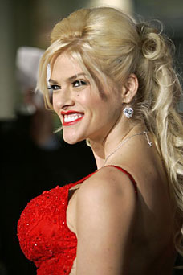
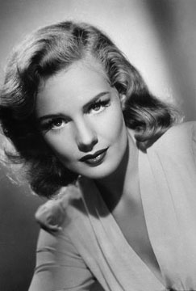
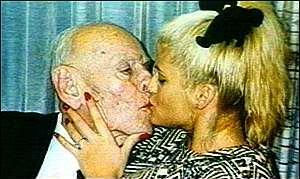
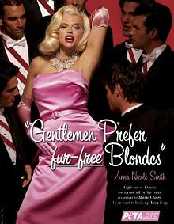

Title: Anna er dáin! Lengi lifi Anna!
Slug: anna-ad-eilifu
Date: 2007-02-15 14:31:00
UID: 133
Lang: is
Author: Unnur María Bergsveinsdóttir
Author URL: http://unnur.klaki.net
Category: Menningarfræði
Tags: 

Í bókinni Stars, sem er eitt undirstöðuverka kvikmyndafræðinnar, greindi Richard Dyer  stjörnukerfi (star-system) Hollívúdd.[^1] Stjörnukerfið var verkfæri stóru kvikmyndaveranna og gekk út á það að gera stjörnur úr laglegu fólki. Aðalþunginn var lagður á ímynd stjörnunnar frekar en á leikhæfileika hennar, þó svo algengt væri að kvikmyndaverin skylduðu skjólstæðinga sína til að taka tíma í leiklist, söng og dansi. 

Stjörnukerfið var það sem ýtti smástirnunum upp á stjörnuhimininn, barnungum leikkonum hverra hlutverk það var, án alls dulbúnings, að vera aðlaðandi. Útlitskröfur þær sem gerðar voru til þeirra voru skilgreindar í samningum og engin frávik voru leyfð frá þeirri ímynd sem á hverjum tíma taldist eftirsóknarverð. Kerfið var lögmál smástirnanna og sem lögmál var það skilvirkt með eindæmum, svo skilvirkt reyndar að í flestum frásögnum af ástum og ævi (og geðveiki) hinnar óstýrilátu Francis Farmer, sem yfirvöld komu fyrir á geðveikrahæli eftir að hún sýndi lögreglumönnum óvirðingu, er það flokkað sem ein fyrsta birtingarmynd geðveilu hennar að hún hafi á innan við ári eftir að hún skrifaði undir samning við MGM kvikmyndaverið látið augabrúnir sínar vaxa á ný, óplokkaðar og villtar. 

Hegðun og framkomu leikkvenna, innan kvikmyndaversins jafnt sem utan, voru einnig sett skilyrði í samningum. Langt fram á seinni hluta tuttugustu aldarinnar snerust Hollywood smástirnin þannig eftir sporbaugum sem kröfðust þess þær væru ógiftar, ósnertanlegar og helst hreinar en sexí meyjar. Á sama tíma, á bak við hina beinu markaðsetningu glansblaðaviðtalanna og leikaraspjaldanna möluðu hinsvegar maskínur auglýsingadeildanna og dreifðu slúðursögum sem sköpuðu umtal sem gekk í beint berhögg við hina hreinlífu ímynd sem kvikmyndaverið skapaði stjörnum sínum út á við.

Florence Lawrence er eitt fyrsta dæmið um þetta síðarnefnda en ein fyrsta markaðsbrellan hvað markaðssetningu kvikmyndastjarna varðar var helguð henni. Árið 1910 réði framleiðandinn Carl Laemmle hana til að leika aðalhlutverkið í kvikmynd framleiddri af fyrirtæki hans Biograph. Þó svo frásagnir deili á um það hvað nákvæmlega gerðist er það ljóst að Laemmle tilkynnti í fjölmiðlum að Florence, sem þá hafði öðlast nokkra frægð sem Biograph-stúlkan, hefði látist í bílslysi í St. Louis við umdeilanlegar kringumstæður. Eftir að andlát hennar hafði ollið nokkru uppnámi birti Laemmle heilsíðu auglýsingu í sama blaði og birt hafði andlátsfregnina þar sem hann neitaði sögunni og hélt því reyndar fram að samkeppnisaðilar stúlkunnar hefðu komið þessari andstyggðarslúðursögu á kreik til að varpa skugga á stjörnuna. Opinbert loforð Laemmle um að Florence myndi mæta til frumsýningar næstu kvikmyndar sinnar olli svo uppþotum á frumsýningunni þegar eldheitir aðdáendur flykktust á staðinn. Í kjölfar allra látana öðlaðist Flo Lo að sjálfsögðu frægð stranda á milli.[^2] 

Ég rifja þessa sögu upp nú í skugga andláts Anna Nicole Smith. Ótímabært andlát hennar hefur vakið mikið umtal og sjálft umtalið hefur svo aftur orðið að umtalsefni. Hérlendis jafnt sem erlendis hafa blaðamenn og álitsgjafar deilt um það hvort það sé réttlætanlegt að eyða svo miklu plássi í umfjöllun um Önnu og um það hvað sá gífurlegi áhugi sem almenningur sýnir andláti hennar standi fyrir. Í Lesbók Morgunblaðsins birtist síðustu helgi grein eftir Jóhann Bjarna Kolbeinsson þar sem hann gagnrýnir þessa miklu umfjöllun, stúlkan atarna hafi einungis verið fræg fyrir það að vera fræg og ævi hennar og örlög séu hvorki merkilegri né ómerkilegri en örlög hins ófræga almúga. Gekk Jóhann Bjarni reyndar svo langt að skrifa að það væri „hæpið að segja að hún [Anna] hefði verið merkileg manneskja“.[^3] Guðrún Guðlaugsdóttir pistlahöfundur og álitsgjafi gagnrýndi grein Jóhanns Bjarna strax daginn eftir og benti á að einmitt vegna þess að lífshlaup Önnu hefði ekki verið svo ósvipað ævi svo ótal margra annarra hefði almenningur áhuga á henni og fréttaflutningurinn rétt á sér. Auk þess væri það í því ljósi einstaklega ósmekklegt að gera grín að lífi Önnu sem ómerkilegu.[^4] Jóhann Bjarni svaraði Guðrúnu strax og varði sjónarmið sitt með því að endurtaka það álit sitt að Anna hefði einungis verið fræg fyrir það að vera fræg og að það væri alls ekki sjálfsagt að fjölmiðlar ættu að veita atburðum af þessu tagi slíka ofurathygli einungis vegna þess að almenningur hefði áhuga á þeim. 

Nú er það augljóst að bæði Guðrún og Jóhann Bjarni gefa sér gerólíkar forsendur þegar þau skoða fjölmiðlaumfjöllun um andlát Önnu og eru í raun að horfa á sitt hvorn hlutinn, Guðrún á það hversvegna almenningur hefur áhuga á Önnu á meðan Jóhann Bjarni spyr hvort hægt sé að réttlæta fréttaflutninginn. Margir kynnu jafnvel að halda því fram að þau hefði bæði rétt fyrir sér. Ég ætla hinsvegar að leyfa mér að benda á að hvorugt þeirra sér út fyrir íturvaxinn líkama Texasmærinnar. 

Guðrún hefur nefnilega vissulega rétt fyrir sér þegar hún bendir á að jafnvel í okkar litla íslenska samfélagi deili fjölmargir sorgum og hörmum Önnu. Anna átti í mislukkuðum samböndum, glímdi við áfengissýki, barðist við aukakílóin undir gagnrýnu auga heimspressunnar og upplifði þá ógæfu að missa nána ástvini sviplega. Það er erfitt að setja sig í spor þess sem kallar ómerkilega slíkar fréttir af lífi heimsfrægs einstaklings, sama á hvaða forsendum frægðin byggir. Að það að Anna hafi deilt sorgum og hörmum okkar dauðlega fólksins er hinsvegar ekki að mínu mati ástæðan fyrir því að heimsbyggðin stendur á öndinni yfir fréttaflutningi af henni og þar gerir Guðrún, í annars næmri umfjöllun, skiljanlegan, en stóran, feil. 

Mistök Jóhanns Bjarna aftur á móti eru öllu augljósari og gagnleg sem inngangur að umfjöllun um hið raunverulega mikilvægi Önnu. Forsenda Bjarna (hvernig hann komst niður á hana skýrir hann reyndar í hvorugri greininni nánar) er sú að Anna hafi verið fræg fyrir að vera fræg. Sem er auðvitað í vissum skilningi rétt en samt svo alrangt. Frægð Önnu er engin tilviljun og í raun mikil völundarsmíð. Brygðist almenningur ekki við fréttum af Önnu væru það mistök sem rekja mætti beint til einhvers almannatengslafulltrúans. 

Anna Nicole Smith fæddist árið 1967 í Houston og hét lengst af Vicky Lynn Hogan. Hún giftist aðeins 17 ára að aldri strák úr sveitinni, og eignaðist með honum barn eins og góðum konum ber. En hugur Önnu stefndi hærra, hátt, hátt á vit átrúnaðargoðs hennar Marilyn Monroe. Í leit sinni að frægð og frama varð Anna fyrst strippari, svo fráskilin og svo leikfang ársins á síðum Playboy tímaritsins. Hún lék í mis misheppnuðum kvikmyndum og giftist árið 1994 eldgömlum karlfauski sem hrökk auðvitað uppaf um það bil ári eftir að þau gengu í það heilaga. Eldgamli karlfauskurinn var vellauðugur og í rúman áratug stóð Anna í einum umtöluðustu málaferlum bandarískrar réttarsögu þar sem sjálf ástin var vegin og metin. Að kalla þetta að vera frægur fyrir ekkert bendir til þess að Jóhann Bjarni hafi alið lungann af ævi sinni innilokaður í trjástofni. Því vissulega var ungfrú Anna fræg að endemum og tilvera hennar skilur í sjálfu sér lítið eftir sig en það er ekki með nokkru móti hægt að halda því fram að hún hafi ekki verið fræg fyrir ekki neitt. 

Við lifum og hrærumst innan tiltekins kerfis menningarvísana sem stjörnukerfið hvílir á og tekur mið af hverju sinni. Á dögum Francis Farmer voru rakaðar og áteiknaðar augnbrúnir staðalbúnaður kvenstirna, í dag eru útlitskröfurnar aðrar og sá vettvangur sem þær athafna sig á víðari þótt enn sé hann strangt skilgreindur. Anna Nicole Smith er ekki sjálfstæður agent heldur afsprengi stjörnukerfis okkar tíma, svo rækilega endursköpuð að hennar eigin móðir á erfitt með að kannast við hana eða ævisögu hennar eins og fram hefur komið í fréttaflutningi síðustu viku.[^6] Sé líf Önnu skoðað með hliðsjón af lögmálum stjörnukerfisins er ljóst að það á þar í einu og öllu við. Anna Nicole Smith fæddist alls ekki prýdd fjölmiðlavænu nafni heldur var hún dubbuð upp í það af fyrsta umboðsmanni sínum. Fegurð Önnu var heldur ekki náttúruleg heldur sköpuð af tískumógúlum, skurðlæknum og markaðsfulltrúum, líf hennar upplýst ljósmyndablossum og varðað fyrirsögnum. Jafnvel dauðdagi Önnu var eins og skrifaður af handritshöfundi sápuóperu. 

Þau markaðsöfl sem sáu sér hag í frægð Önnu skópu frægð hennar. Eða, nánar tiltekið, í frægð Önnu sem persónu sem Vicky Lynn Hogan lék. Anna var í einu og öllu tilbúið fyrirbæri, sköpuð til þess að dást að, fyrir aðdáendur tiltekins lífstíls til að líkja eftir í einu og öllu á sama tíma og hin tilbúna persóna Marilyn Monroe var fyrirmynd Vicky Lynn í sköpun persónunnar Önnu og gekk Anna/Vicky jafnvel svo langt að leigja fyrrum íbúð ungfrú Monroe.[^7] Anna var innantómt tákn, á engan hátt eigin persóna (jafnvel þótt hún reyndi að skapa sér persónuleika í gengum mislukkaða raunveruleikaþætti) og það er á þessu tómi sem frægð hennar er grundvölluð. Þessu tómi sem okkur sem dreymir, þessu tómi sem við sem þráum að geta mótað okkur inn í. Anna er fræg fyrir að vera ekkert sérstök, hún er uppgötvaða stúlkan frá litla sveitalubbabænum, hver veit nema ég eða þú gætum orðið næstar? Ég andvarpa um leið og ég fletti á næstu síðu í rómaninum Star eftir ungfrú Pamelu Anderson sem einmitt fjallar um svipað efni. Stjörnukerfi Hollívúdd er engin fornsaga um áteiknaðar augnbrúnir eða leikkonur sem urðu að giftast í leynum, því hefur þvert á móti vaxið svo fiskur um hrygg með tilkomu ljósvakamiðlanna að við eigum afar litla möguleika á því að komast út fyrir endimörk þess. Jóhann Bjarni spyr því rangrar spurningar þegar hann reynir að kryfja þá flóðbylgju frétta af lífi og dauða Önnu sem yfir okkur hefur dunið undanfarna daga. Það áhugaverða við Önnu er ekki það að við skulum hafa áhuga á henni heldur sú sýn sem hún veitir okkur á hið tröllvaxna kerfi afþreyingariðnaðar og fjölmiðla sem vinnur að því dag og nótt að fá okkur til að hafa áhuga á tilteknum stjörnum umfram aðrar. 

_Hvað viltu að að ég sé?_ hvíslar Anna svo átakanlega daðurslega handar grafar og dauða og við sem flettum blöðunum og þekkjum nöfn allra stjarnanna bítum okkur í tunguna en langar svo ósköp mikið sjálf, jafnvel eftir að ákveðið hefur verið að farga líkama hennar,[^8] að bregða okkur í ham Önnu. Að vera stjarna aðeins eina nótt eða svo. Því þegar stjörnukerfið mun líða undir lok mun Francis Farmer ná fram hefndum á Seattle og við munum bráðna í hita eigin sólar. 

[^1]: Dyer, Richards, _Stars_, London, 1998.
[^2]: Sjá t.d. [hér](http://www.fathom.com/course/21701722/session2.html).
[^3]: Jóhann Bjarni Kolbeinsson, „Dauðinn og stúlkan“, _Morgublaðið laugardaginn 10.2.2007_.
[^4]: Guðrún Gunnlaugsdóttir, „Dauðinn og maðurinn“, _Morgublaðið sunnudaginn 11.3.2007_  
[^5]: Jóhann Bjarni Kolbeinsson, „Enn af Önnu Nicole“, _Morgublaðið miðvikudaginn 14.3.2007_.
[^6]: [„Must-See Tragedy TV: The Anna Nicole Smith Story“](http://abcnews.go.com/US/story?id=2863970&page=1), tekið af fréttavef ABC-fréttastofunnar þann 15. febrúar 2007. 
[^7]: Ibid.
[^8]: „Lík Önnu Nicole varðveitt á Flórída um sinn“, _Morgunblaðið 15.2.2007_

