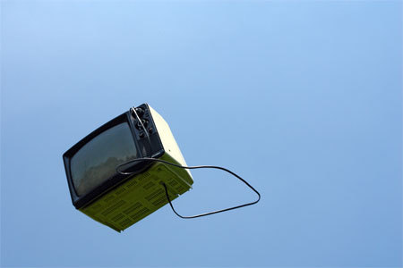

Title: Áróðurslíkanið - Hvers neysluvara ert þú?
Slug: arodurslikanid-hvers-neysluvara-ert-thu
Date: 2008-04-01 13:33:00
UID: 242
Lang: is
Author: Unnur María Bergsveinsdóttir
Author URL: http://unnur.klaki.net
Category: Fjölmiðlafræði, Menningarfræði
Tags:

Árið 1988 gáfu Noam Chomsky og Edward S. Herman út rit sitt _Manufacturing Consent: The Political Economy of the Mass Media_. Þar settu þeir fyrst fram kenningu sína um áróðurslíkanið (e. the Propaganda model). Samkvæmt kenningum Chomsky og Herman er hlutverk fjölmiðla það að innræta almenningi þau gildi og þá tegund hegðunar sem valdhafar telja æskilega. Í flóknum samfélögum nútímans, þar sem ólíkir hagsmunir takast á, krefst innrætingin markviss og skipulagðs áróðurs. sem. Í einræðisríkjum þar sem fjölmiðlun er í höndum ríkisins er framkvæmd áróðursins bæði einföld og augljós en í samfélögum þar sem fjölmiðlun er sögð frjáls, eða, í höndum einkaaðila, er hún öllu flóknari. Í raun eru frjálsri fjölmiðlun þó þröngar skorður settar hvað varðar efnisval og umfjöllun. Bæði koma þar til ójafnar fjárhagslegar aðstæður fjölmiðla og svo hitt að þó ritskoðun sé ekki formleg er hún engu að síður til staðar.

Áróðurslíkan Chomsky og Herman ögrar viðteknum hugmyndum um samband fjölmiðla og okkar sem fylgjumst með. Flest erum jú við eflaust vön að líta svo á að sú vara sem fjölmiðlar selji sé það efni sem þeir birta og markhópurinn við sem fylgjumst með. Samkvæmt áróðurslíkaninu eru það hinsvegar við, -við sem héldum okkur neytendur, sem erum neysluvaran og auglýsendurnir markhópurinn. Áhrif þessa á fjölmiðlun eru sú að til þess að koma okkur fyrir sjónir þarf það efni sem fjölmiðlar birta að ganga í gegnum flókið ferli ritskoðunar þar sem til hliðsjónar eru annars vegar vald þeirra sem standa að baki fjármögnun útgáfu og hinsvegar þau áhrif sem birt efni er líklegt til að hafa á lesendurna.

Áróðurslíkan Chomsky og Hermans auðveldar greiningu fjölmiðlaumhverfis og þó svo það sé smíðað með tilliti til tiltekins fjölmiðlaumhverfis á tilteknum tímapunkti tel ég það nýtist engu síður vel í dag án tillits til landfræðilegrar staðsetningar. Líkanið samanstendur af fimm síum sem fréttir þurfa að komast í gegnum eigi þær að komast fyrir augu lesenda. Þessar síur eru:

1. Stærð, eignarhald og gróðamarkmið
2. Vald auglýsenda
3. Uppsprettur upplýsinga
4. Möguleg viðbrögð þrýstihópa
5. Andkommúnísk hugmyndafræði

Fyrstu tvær síur líkansins snúa að þeim takmörkunum sem ráðast af eignarhaldi og fjármögnun – valdið er þeirra sem borga. Chomsky og Herman staðsetja upphaf þessarar þróunar í bresku fjölmiðlaumhverfi á seinni hluta 19. aldar en þá þróuðust breskir fjölmiðlar á þann veg að í stað þess að blöðin væru kostuð með söluverði varð hlutur auglýsenda æ fyrirferðarmeiri. Róttæk verkamannablöð höfðuðu ekki til auglýsenda þeirra tíma og gátu því ekki staðið í verðstríði við þau blöð sem löðuðu til sín auglýsendur. Þannig fækkaði þeim málgögnum sem tjáðu rödd róttækrar verkalýðsstéttar á meðan hin döfnuðu og stækkuðu . Þetta lögmál er enn í fullu gildi í dag, róttækir fjölmiðlar eiga erfiðara með að fjármagna starfssemi sína á meðan fjölmiðlar sem þykja hvetja til neyslu eiga auðvelt með að selja auglýsingar og ná þannig meiri útbreiðslu. Sem auðvitað þýðir meiri áhrif sem aftur skilar sér í betri aðstöðu til auglýsingasölu. Chomsky og Herman benda einnig á að jafnvel þó fjölmiðlun sé ekki ríkisrekin þá hafi völd stórfyrirtækja og auðhringja vaxið svo gífurlega að áhrif þeirra megi sjá í sambærilegu ljósi og völd ríkisstjórna.

Möguleikar slíkra aðila til að hafa áhrif á fjárhagslega afkomu fjölmiðils eru gífurlegir og oft eru fjölmiðlarnir hluti af veldi þeirra. Hér á Íslandi má minna á langvinnar deilur sem hafa staðið um möguleika Fréttablaðsins á að flytja hlutlausar fréttir af Baugsmálinu. Bæði auglýsingar og eignarhald skipta svo máli þegar litið er til gróðamarkmiðs fjölmiðilsins. Fjölmiðill hverra eigendur hafa áhuga á því að græða sem mest forðast það að styggja ríka hluthafa og mögulega auglýsendur og hefur það áhrif bæði á fréttaval og umfjöllun.

Sía númer þrjú í áróðurslíkani Chomsky og Herberts snýr að því hvernig valdhafar reyna að tryggja viðhald viðtekinnar hugmyndafræði með því að hafa áhrif á upplýsingaflæði. Sú staðreynd að lesendur krefjast þess að fjölmiðlar færi þeim fréttir úr öllum áttum daglega auðveldar valdhöfum þetta í raun. Fæstir fjölmiðlar senda blaðamenn til allra heimshorna heldur reiða sig á upplýsingar frá bæði atvinnuupplýsingarveitum en líka frá opinberum upplýsingafulltrúum ríkisstjórna og stofnana. Þeir síðarnefndu auðvelda blaðamönnum upplýsingaöflunina, og stýra henni, með því að halda opnum fjölmiðlamiðstöðvum og skipleggja blaðamannafundi, senda út fyrirfram afrit af ræðum stjórnmálamanna og óbirtum skýrslum, skrifa fréttatilkynningar og fleira í þeim dúr . Chomsky og Herman benda einnig á það að stuðningur sérfræðinga er eitt sterkasta bragðið sem hægt er að beita til þess að auka á vægi tiltekinna hugmynda. Þetta eru ríkisstjórnir og stórfyrirtæki meðvituð um og með því að ota sínum sérfræðingum fram í fjölmiðlum, ganga valdhafar á það pláss sem óháðar raddir hefðu annars getað notað til að koma sínum skoðunum á framfæri. Þetta hefur til dæmis verið áberandi hvað Kárahnjúkavirkjun, flestir hafa jú væntanlega tekið eftir lítt dulbúnum virkjanaauglýsingum framleiddum af Landsvirkjun, sem sýndar hafa verið í Ríkissjónvarpinu á besta útsendingartíma. Hvað sjálfa sérfræðingana varðar vita þeir að viðhald ríkjandi hugmyndafræði er ávallt ríkjandi valdastéttum í hag. Bakland þeirra sem hafa átt þátt í að greina og staðfesta ríkjandi hugmyndafræði liggur þannig í ríkjandi valdhöfum. Eru hagsmunir sérfræðinga þannig oft samofnir hagsmunum valdhafanna, til dæmis á þá vegu að sérfræðingur sem heldur fram kenningum sem styrkja völd ríkisstjórna eða stórfyrirtækja er líklegur til að njóta meiri velgengni en hinn sem andæfir þeim.

Sía númer fjögur lítur að því atriði að þeir aðilar sem hafa skoðanamótandi áhrif eða dreifa upplýsingum, eiga það ávallt á hættu að einhverjir mótmæli málflutningi þeirra eða jafnvel hóti þeim. Þetta tala Chomsky og Herman um sem ,,flak”. Í þessu samhengi má skoða hótun Baugs árið 1995 um að hætta að auglýsa í fjölmiðlum Norðurljósa eftir að fréttaskýringarþátturinn Ísland í bítið fjallaði um óeðlilega hækkun vöruverðs frá Bandaríkjunum í verslunum Baugs .

Síu númer fimm má kenna við óæskilega hugmyndafræði en í líkani Chomsky og Herman er fjallað um kommúnisma sem hugmyndafræði sem nægir til að brennimerkja einstaklinga sem ótrúverðuga. Þessi síðasta sía gengur út á það að í flestum samfélögum eru tilteknar gerðir hugmyndafræði skilgreindar sem óæskilegar, jafnvel hættulegar. Fréttir sem birta slíka hugmyndafræði í jákvæðu ljósi eiga að sjálfsögðu erfitt með að komast á síður almennra fjölmiðla. Það að spyrða einstaklinga og skoðanir þeirra saman við slíka hugmyndafræði er svo klassísk leið til að gera þá ótrúverðuga.

Chomsky og Herman draga umfjöllun sína um áróðurslíkanið saman með umfjöllun um það að með því megi greina stefnu fjölmiðla og yfirvalda í gegnum umfjöllun um fórnarlömb hörmunga af ýmsu tagi. Þeir tala um þá sem taldir eru verðskulda nafngiftina ,,fórnarlömb” og þá sem ekki eru taldir eiga jafn mikinn rétt á henni. Þetta sé ein afleiðing þeirra aðstæðna sem áróðurslíkanið lýsi, mun erfiðara sé að koma á framfæri sanngjarnri umfjöllun um atburði sem valdhöfum eru ekki að skapi. Þannig sé mismikið og á ólíkan hátt fjallað um fórnarlömb stríðsreksturs eftir því hvort þau séu fórnarlömb óvinaþjóðar eða vinaþjóðar. Í hvorn flokkinn fórnarlömbin falla er hægt að greina út frá þeim heimildum sem liggja að baki fréttunum, séu þau talin verðug samúðar koma heimildirnar yfirleitt úr ýmsum áttum, jafnt frá opinberum fréttamiðlum og óháðum, við sjáum viðtöl við fórnarlömbin sjálf og vitnað er í skýrslur frá mannréttindasamtökum. Sé það valdhöfum í óhag að almenningur fyllist samúð í garð viðfangsefnisins er hinsvegar líklegra að meirihluti frétta sé byggður á upplýsingum frá opinberum stofnunum og öllu því sem vakið gæti samúð og varpað mannlegu ljósi á fórnarlömbin sé haldið í lágmarki.

Það væri eflaust áhugavert að nota áróðurslíkanið til að skoða umfjöllun íslenskra fjölmiðla annars vegar um deilur Kína við Tíbet, Nepal og Taiwan og hinsvegar um innrás Bandaríkjanna í Afganistan og Írak. Slík greining myndi án efa undirstrika mjög skýrt hvar efnahagslegir og pólítískir hagsmunir íslensks ríkis og auðhringja liggja og hvernig þeir hafa tekið breytingum á síðasta aldarfjórðungi eða svo.

---

<small class="blurb">
Þeim sem áhuga hafa á því að kynna sér skrif Chomsky betur er bent á vefsetur hans: [http://www.chomsky.info/](http://www.chomsky.info/). Á vefsíðunum [MediaLens](http://www.medialens.org/) og [The Free Press](http://www.freepress.net/) má svo sjá áróðurslíkani Chomsky og Herman beitt til þess að greina breska og bandaríska fjölmiðlun.
</small>

