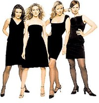
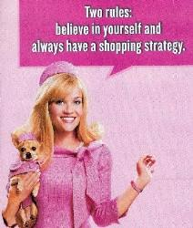

Title: Bleikt og blátt
Slug: bleikt-og-blatt
Date: 2006-11-28 18:31:00
UID: 114
Lang: is
Author: Helga Tryggvadóttir
Author URL:
Category: Kynjafræði, Dægurmenning
Tags:

> Hver vill búa í heimi þar sem konur geta ekki keypt sér þá skó sem tærnar girnast eða lagt í stæði með listfengum hætti eftir eigin nefi eða fengið að stjórna heiminum?[^1]

Þessi spurning var lögð fram í vikuritinu Birtu ekki alls fyrir löngu. Ég geri ráð fyrir því að hún sé sett fram í hálfkæringi og jafnvel má greina í henni eilítinn kaldhæðnisbrodd ef vel er að gáð. Hins vegar má líka sjá í henni mjög útbreidda skoðun á því hvernig litið er á hæfileika, eða hæfileikaskort, kynjanna á vissum sviðum. Í nánast hverju einasta vikuriti og mörgum dagblöðum má sjá misgáfulegar alhæfingar um kynin (upp að því marki sem alhæfingar geta verið gáfulegar). Þessi tilhneiging hefur löngum verið þekkt í afþreyingariðnaðinum, þar sem þáttum og tímaritum er miskunnarlaust skipt upp eftir kynjunum. Uppskipting af því tagi einfaldar þó bæði þá mynd sem dregin er upp af kynjunum og þrengir áhugasvið þeirra, kjósi einstaklingar að taka eitthvert mark á henni.

Gjarnan má sjá í dagblöðum og tímaritum þá fullyrðingu að konur hatist sjálfkrafa við íþróttir í sjónvarpi, sér í lagi fótbolta. Það getur varla staðist, síst nú til dags þar sem síaukinn fjöldi stúlkna æfir íþróttir af kappi, ekki einungis ballet og fimleika eins og í gamla daga, heldur ekki síður boltaíþróttir. Að öllum líkindum hafa þær stúlkur sem æfa fótbolta og handbolta einnig gaman af því að horfa á þær. Eins er til fullt af konum sem hvergi hafa komið nálægt spark- eða tuðruíþróttum, en hafa samt gaman af að horfa á þær sem afþreyingu.

Sjónvarpsþáttum er ítrekað skipt upp í karla- og kvennaþætti bæði í þeim prentmiðlum sem um þá fjalla og í auglýsingum sjónvarpsstöðva. Þá eru „stelpuþættirnir“ svokölluðu venjulega þættir sem fjalla um útlit, makaleit eða ástarmál og drama, svosem Americas Next Top Model eða Sex and the City.[^2] Spennuþættir eru hins vegar fremur álitnir karlaþættir, auk þess sem íþróttaumfjöllun og bílaþættir eru vitanlega fyrir karla. Í Fréttablaðinu nýlega var því haldið fram að spennuþættir væru fremur fyrir karla þar sem í þeim væri mikið um blóðsúthellingar og morð. Vinsældir læknadrama meðal kvenkynsins, að mati greinarhöfundar, var sökum þess að þar væru „bleikar slaufur hnýttar hér og þar til að gera þeim þessar lýsingar af óhugnaði hversdagsins bærilegar.“[^3] Með því átti hann við að konum þætti nauðsynlegt að hafa ástarsenur í slíkum þáttum þar sem blæðandi slagæðar einar og sér væru þeim líklega óbærlegar. Sá sem heldur því fram að konur vikni við að sjá blóð og líkamsvessa hefur greinilega aldrei eignast barn eða tekið slátur. Auk þess gerir hann þá ekki ráð fyrir þeim gríðarlega fjölda kvenna sem vinnur á heilbrigðisstofnunum og eru sjálfar bæði læknar og hjúkrunarfræðingar.

Svo áfram sé haldið með þá umræðu um hvort konur þoli ekki hroða í sjónvarpi, þá er ekki úr vegi að minnast á lýtaaðgerðaþættina. Líklega eru þeir fremur stílaðir inn á konur af markaðsdeildum sjónvarpsstöðvanna. Þó má það furðu sæta því sú manneskja sem fæst til að fara í lýtaaðgerð eftir að hafa séð slíkan þátt hlýtur að teljast í meira lagi hugrökk. Að horfa á sílíkonpúða troðið inn í líkama manneskju, eða sargað framan af nefi á raunverulegum manneskjum, er með því allra hryllilegasta afþreyingarefni sem ég hef séð í sjónvarpi. Þegar horft er á hryllingsmynd er áhorfandanum að minnsta kosti ljóst að um sviðsetningu er að ræða.

Tónlist er ekki síður skipt í flokka eftir kyni, en um daginn var umfjöllun um kvennastöðina Létt 96,7 í einu dagblaðanna[^4]. Þar er, líkt og oft áður,  gert ráð fyrir því að konur vilji einvörðungu hlusta á hugljúfa tónlist sem fjalli ýmist um ást, ástarsorg eða glataða ást. Að sama skapi eru markhópar rokkstöðvanna einungis karlmenn, með samsvarandi áherslu á að það séu einungis karlmenn sem hlusti á rokktónlist. Hafi karlmenn því löngun til að hlusta á hugljúf ástarlög á Létt, eða langi konur til slamma við rokkslagara, fá bæði þau óbeinu skilaboð að þau séu nú ekki alveg eðlileg.

Margir halda því fram að með tilkomu fegurðarsamkeppna fyrir karlmenn og karlkyns strippurum eigi femínistar að hætta að kvarta yfir áherslu samfélagsins á útlitsdýrkun kvenna. Gott og vel, en ég held að fæstir femínistar hafi áhuga á að sjá karlmenn breytast í útlitsmiðuð fegrunaraðgerðaskrýmsli. Bæði karlmenn og konur geta vafalaust fundið sér eitthvað betra við tíma sinn og peninga að gera en að eyða þeim öllum í útlit sitt.

En hvað er að því að fólk vilji af fúsum og frjálsum vilja taka þátt í keppnum þar sem keppt er í útliti og útgeislun (hvernig sem hægt er að vinna keppni í nokkru sem hlýtur að teljast persónubundinn smekkur — en það er annað mál), spyrja margir í umræðu sem þessari. Svarið fer eftir því að hve miklu leyti við gerum nokkuð af algjörlega fúsum og frjálsum vilja þegar við lifum og hrærumst í samfélagi mannanna. Er okkur ekki alltaf stjórnað af samfélaginu og almenningsáliti, þó að mis miklu leyti sé? Tekur manneskja þátt í fegurðarsamkeppni vegna þess að í raun og veru langi hana til að standa upp á palli í undirfötum (og háhæluðum skóm) af frumstæðri þörf, eða er það vegna þess að hana langar til að fá viðurkenningu fyrir útlit sitt í útlitsmiðuðu samfélagi?

Taka verður það fram að það er ekkert að því að konur séu það sem kallað hefur verið „kvenlegar“, þ.e falli undir þá staðalmynd sem hér hefur verið gagnrýnd. Geri þær það hins vegar einvörðungu vegna þess áróðurs sem dynur á þeim daglangt um að vera fallegar að utanverðu og góðar og viðkvæmar að innanverðu, þá hlýtur það að vera tilefni til gagnrýni.

Taki kona mark á öllu því sem er skrifað og staðhæft um kynin er ekki laust við að henni gæti fundist hún ókvenleg þar eð hún eigi ekki fimmtíu skópör, keyri ekki um á yaris og eigi ekki erfitt með að leggja í stæði, hvort sem farið er afturábak eða áfram. Það getur varla heldur verið eftirsóknarvert fyrir þá karlmenn sem hugsanlega þykir gaman að einhverjum ofangreindra þátta, að vera núið það um nasir á síðum dagblaðanna að þeir séu stelpuþættir. Vitanlega eru ekki allir sem láta fjölmiðla mata sig á hvernig það eigi að vera og hvernig þeir eigi að haga sér — en mörgum finnst hins vegar erfitt að synda á móti straumnum þegar skilaboðin koma alls staðar að.

Væri það svo að þessi mynd væri einungis sums staðar dregin upp af konum í dagblöðum, vikuritum og annarri afþreyingu, þá væri það sök sér þar sem einstaklingar gætu sótt sínar fyrirmyndir annar staðar að. Hins vegar er það svo að greinar um málefni kynjanna þar sem bent er á að kynin séu ekki svart-hvít eru oft útnefndar leiðinlegar (líkt og þessi hér), eða eru einungis aðgengilegar sem fræðitextar. Því er það svo að mikill meirihluti fólks, og þá fyrst og fremst ungs fólks, sér aldrei neina aðra mynd dregna upp af kynjunum en þá að konur hugsi fyrst og fremst um skó, útlit og tísku, á meðan karlmenn geti haft önnur áhugamál, s.s íþróttir og tónlist. Því er það nauðsynlegt að fjölmiðlarnir endurskoði og gagnrýni sjálfa sig og stundi ábyrga umræðu um kynin og muninn á milli þeirra, hver svo sem hann er.

[^1]: „Talað um tilfinningar“. Birtist í Birtu, föstudaginn 6.október 2006
[^2]: „Góðir stelpuþættir heyra sögunni til“. Birtist í Fréttablaðinu, þriðjudaginn 28.nóvember 2006.
[^3]: „Elskast í blóðpolli“. Birtist í Fréttablaðinu, mánudaginn 20.nóvember 2006.
[^4]: „Áreynslulaus konustöð“. Birtist í Morgunblaðinu, sunnudaginn 19.nóvember 2006.

