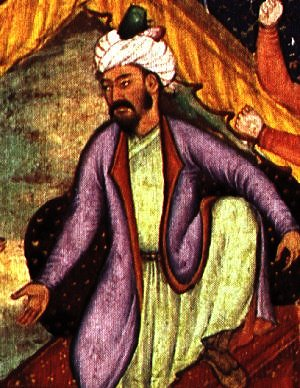

Title: Blóði drifin byggingarlist: Hlutverk arkitektúrs í átökum
Subtitle: Moska Babúrs keisara
Slug: blodi-drifin-byggingarlist
Part: 1/3
Date: 2008-11-11 11:50:00
UID: 800
Lang: is
Author: Hilmar Magnússon
Author URL: 
Category: Arkitektúr, Alþjóðasamskipti
Tags: Babúr keisari, The Destruction of Memory, Robert Bevan, Robert S. Nelson, Margaret Olin, Monuments and Memory Made and Unmade, minnismerki, Indland, hindúar, múslimar, Babri Masjid, Ayodhya, Norður-Indland, breska heimsveldið, Bretland, mógúll, mongóli, Chagatai, orrustan um Panipat, Delí, Ibrahim Lodi, Mir Baqi Tashqandi, moska, Ramjanmbhumi, Rama, búddismi, jaínismi, Bairagis, chabutra

### Arkitektúr í ófriðarbáli

Í bók sinni _Eyðing minnis: Arkitektúr í ófriði_ _(e. The Destruction of Memory: Architecture at War)_ heldur blaðamaðurinn Robert Bevan því fram að eyðing borga og bygginga hafi ávallt verið órjúfanlegur þáttur í ófriði. Hann bætir því við að með hverri öld hafi þetta einungis farið versnandi, þar sem vopnin hafi stöðugt orðið öflugri og búi nú yfir meiri eyðileggingarmætti. Það séu því heimsálfur fremur en borgir sem í nútímanum búi við þær ógnir að vera lagðar í rúst.[^1] Listfræðingarnir Robert S. Nelson og Margaret Olin skrifa á svipuðum nótum í bók sinni _Minni og minnismerki, mótuð og máð út_ _(e. Monuments and Memory, Made and Unmade)_, þar sem þau halda því fram að í stríði sé mun auðveldara að drepa eitthvað fjarlægt og afskekkt en það sem standi fólki nær og er því kunnuglegra. Ennfremur telja þau að dráp í stríðum nútímans þurfi ekki að snúast um eiginleg manndráp. Til að eyða samfélögum sé álíka áhrifaríkt að eyða þeim minnisvörðum sem standa sem táknmyndir þeirra. Að þessu leytinu séu minnisvarðar sannarlega dauðlegir, rétt eins og mannfólkið.[^2]

### Deilur hindúa og múslima á Indlandi

Með þessar hugmyndir á bakvið eyrað verður í eftirfarandi grein rætt um hvernig stríðsrekstur birtist jafnt í manndrápum sem og „drápum“ á stöðum og mannvirkjum. Fjallað verður um eyðingu minnis og minnismerkja og sjónum beint að því hversu stórt hlutverk arkitektúr hefur leikið á því sviði. Til að kasta ljósi á efnið verður tekið dæmi af trúarlegum og pólitískum deilum sem staðið hafa á milli hindúa og múslima á Indlandi í gegnum aldirnar.

Í fyrsta hluta greinarinnar verður sérstaklega staldrað við eina byggingu, mosku Babúrs keisara (_Babri Masjid_ á arabísku) í bænum Ayodhya á Norður-Indlandi. Hér verður fjallað um forsögu, tilurð og arkitektúr byggingarinnar, ásamt því sem saga hennar verður rakin fram á 19. öldina. Í síðari hlutum verður nánar kafað í hinar löngu deilur um eignarhald á byggingarlóðinni, ásamt því sem örlögum moskunnar verða gerð skil, en hún var að lokum eyðilögð þann 6. desember 1992.

Í greininni verður því haldið fram að trúarlegur arkitektúr hafi orðið að táknmynd fyrir deilur hindúa og múslíma í nútímanum, eins og glögglega sést á eyðileggingu moskunnar. Hér verður þó ekki aðeins staldrað við nútímann. Skrefið verður tekið til fulls og því haldið fram að þetta hlutverk arkitektúrsins megi rekja aftur um að minnsta kosti þúsund ár, eða allt til upphafs þess tíma er múslimar urðu ríkjandi afl á Indlandi. 

### Ábyrgð breska heimsveldisins og þjóðernissinnaðra Hindúa

Í greininni verða einnig færð rök fyrir því að orsaka núverandi haturs og ofbeldis sé ekki einungis að leita í þúsund ára gömlum deilum á milli hindúa og múslima. Hér verði líka að leita skýringa með því að skoða hlutverk breska heimsveldisins. Þá er sérstaklega átt við notkun þess á trúarlegum arkitektúr sem vopni í pólitík þeirri sem heimsveldið stundaði á 18. og 19. öld og kennd er við það að „deila og drottna“. Heimsveldið átti á þennan hátt stóran þátt í því að magna upp þá spennu og það hatur sem til staðar var á milli menningarhópanna og var þannig að hluta til ábyrgt fyrir seinni tíma eyðileggingu og blóðsúthellingum.

Að lokum verður því haldið fram að trúarlegur arkitektúr hafi leikið stórt hlutverk í indverskum stjórnmálum á 20. öldinni. Sérstaklega á tímum hins nýlega sjálfstæða Indlands um miðja öldina. Til að styðja þessa fullyrðingu verður litið á hvernig pólitískir trúarleiðtogar notuðu arkitektúr sem tæki til að ná fram markmiðum sínum. Með tilheyrandi skjálftum í hinu pólitíska landslagi.

### Babúr keisari og byggingarlist hans

Orðið „mógúll“ þýðir „mongóli“ á persnesku og arabísku og vísar til hins mongólska Chagatai ættflokks sem réði ríkjum á Indlandi. Upphaf ættarveldis mógúlanna má rekja til sigurs Babúrs keisara í orrustunni um Panipat, norðvestur af Delí árið 1526.[^3] Lok þess markast af útlegð keisarans Bahadur Shah II til Rangún árið 1858.[^4] Jafnvel þótt mógúlakeisararnir hafi síðar öðlast sess sem leiðtogar er töldu arkitektúr afar mikilvæga táknmynd fyrir konungstign sína stendur lítið eftir til marks um byggingarlist Babúrs. Einu ummerkin má sjá í nokkrum vatnsbrunnum, þremur moskum og fáeinum garðtjörnum. Þó er vitað að Babúr hafði sjálfur mikinn áhuga á arkitektúr, en hann lýsti metnaði sínum varðandi byggingarlistina og skrifaði um þau gæði sem hann sóttist eftir í henni. Þeirra mikilvægust voru að hans mati samræmi, samhverfa og rennandi vatn. Babúr heillaðist af garðahönnun og áleit garðrýmið jafnt vera uppsprettu ánægju sem umgjörð fyrir viðhafnir, hátíðahöld og veislur.[^5] 

### Moska Babúrs

Í orrustunni um Panipat réði Babúr keisari soldáninn Ibrahim Lodi af dögum og gerðist drottnari norðursvæða Indlands.[^6] Að því loknu víkkaði hann ríki mógúlanna út þannig að það næði yfir héraðið þar sem moska hans átti seinna eftir að rísa. Þá heimsótti hann Ayodhya[^7] og skipti héraðsstjóranum út fyrir dyggan stuðningsmann sinn, hinn mikilsmetna aðalsmann Mir Baqi Tashqandi.[^8] Samkvæmt fyrirmælum Babúrs byggði Mir Baqi svo árið 1528 þá mosku sem líta má á sem eina fyrstu mosku mógúlanna á Indlandi.

Í hógværri stærð sinni og látlausum skreytingum endurspeglaði moskan hina takmörkuðu þrá til afreka á sviði byggingarlistar sem og lítil efni hins unga ættarveldis. Á byggingunni voru þrjú hvolfþök en henni var skipt í þrjú skip þar sem miðjuskipið var mun hærra en hliðarskipin. Byggingarefnið var gipshúðaður múrsteinn og grjóthnullungar. Svartar útskornar steinsúlur stóðu báðu megin við aðalanddyrið, augljóslega fengnar úr hindúahofi.[^9]

Margar heimildir í minningum Babúrs lýsa heimsóknum hans í hindúahof og sumt bendir jafnvel til þess að hann hafi dáðst að musterisarkitektúrnum fyrir mikilfengleik sinn. Þetta hefur verið túlkað sem merki um sanngirni hans og umburðarlyndi í garð annarra trúarbragða. Í einu tilfelli virðist hann þó hafa skipað fyrir um að nakin líkneski skyldu fjarlægð úr einu hofanna í nafni velsæmis. Þetta hafi hann þó gert án þess að skaða hofið sjálft.

### Moska á rústum Rama-hofs?

Margir hindúar hafa í gegnum tíðina haldið því fram að moska Babúrs hafi verið byggð á rústum hindúahofs sem þeir telja að hafi verið _Ramjanmbhumi_ eða fæðingarstaður guðsins Rama. Í persneskum miðaldaheimildum og hindúaritum sem innihalda sagnir um Ayodhya er þó hvergi að finna vísbendingar um að nokkurt hindúahof hafi verið rifið niður á þessum stað.[^10] Þá hafa ekki einu sinni fundist víbendingar um svo mikið sem tilvist hofs tileinkuðu guðinum Rama á þessum stað og á þessum tíma. Og það þrátt fyrir að búsetu í Ayodhya megi rekja aftur til 7. aldar fyrir Krist og að öll megintrúarbrögð á forn-Indlandi, búddismi, jaínismi og hindúismi hafi álitið staðinn mikilvægan. Merki um Rama-hof á þessum slóðum má fyrst sjá á 18. öldinni, en þá skutu mörg hof upp kollinum í kjölfar þessa að Ayodhya varð að miðstöð Rama-safnaðarins.[^11]

Þrátt fyrir þessar staðreyndir gerðist það á árunum 1853-1856 að ýmsir heittrúaðir hindúar í Ayodhya gerðu tilkall til lóðarinnar sem moska Babúrs stóð á og markaði það upphafið að löngum og ofbeldisfullum deilum. Ekki urðu yfirráð Breta á svæðinu frá 1856 til þess að bæta ástandið og heldur ekki uppreisnin gegn þeim ári síðar. Í þeirri uppreisn naut breska heimsveldið stuðnings hreintrúaðra hindúa (_e. Bairagis_) og launaði fyrir sig með því að ýta enn frekar undir kröfur þeirra til moskunnar. Hindúar gjörnýttu sér þennan meðbyr og byggðu bænapall eða svokallaðan _chabutra_ inni í moskunni. Þetta varð til þess að Bretar vöknuðu til meðvitundar um að ástandið gæti farið úr böndunum og endað í blóðbaði. Gripu þeir því til þess ráðs að reisa girðingu umhverfis bænahúsið og gera hindúum að færa fórnir fyrir utan moskuna. Múslimar máttu enn biðja innandyra.[^12]

### Framhaldið

Í síðari hlutum greinarinnar verður nánar fylgst með áratugalöngum deilum trúarhópanna um moskuna fyrir dómstólum Indlands. Deilum sem lauk með ógn og skelfingu. Einnig verða örlög moskunnar sett í víðara samhengi og sögu hinna aldalöngu deilna hindúa og múslíma, ásamt tilheyrandi helgispjöllum, gerð betri skil. Þá verður nánar litið á hlutverk breskra yfirvalda við skrif þeirrar sögu, en sagnfræðingar heimsveldisins leika lykilhlutverk í því hvernig herskáir hindúar skoða hana og túlka. Að endingu verður horft yfir 20. aldar sögu Indlands og vikið að því hvernig þjóðernissinnaðir hindúar notuðu byggingarlistina til þess að „byggja upp þjóð“.

---

#### Heimildir

* Bevan, Robert. _The Destruction of Memory: Architecture at War_. London: Reaktion Books Ltd., 2006.
* Davis, Richard H. “Memories of Broken Idols.” _The Experience of Islamic Art on the Margins of Islam_. Irene A.Bierman (editor). Reading: Garnet Publishing Ltd. in association with the Gustav E. von Grunebaum Center for Near Eastern Studies, University of California, 2005, 133-165. 
* Eaton, Richard M. “Temple desecration in pre-modern India: When, where, and why were Hindu temples desecrated in pre-modern history, and how was this connected with the rise of Indo-Muslim states?” _Frontline - India's National Magazine_, no.25, vol.17, 2000, 62-70.
* Eaton, Richard M. “Temple desecration and Indo-Muslim states: Why, after the rise of pre-modern Indo-Muslim states, were some Hindu temples desecrated, some protected, and others constructed anew?” _Frontline - India's National Magazine_, no.26, vol.17, 2001, 70-76.
* Vaughan, Philippa. “India: From Sultanate to Mughal Empire”. _Islam - Art and Architecture_. Markus Hattstein & Peter Delius (editors). Hagen: Könemann, 2004, 452-489.
* Islam, Arshad. “Babri Mosque: A Historic Bone of Contention.” _The Muslim World_, vol.97, no.2, 2007, 259-286.
* Juergensmeyer, Mark. _Terror in the Mind of God: The Global Rise of Religious Violence_. Berkeley, Los Angeles and London: University of California Press, 2003.
* Nelson, Robert S. & Margaret Olin. _Monuments and Memory, Made and Unmade_. Chicago and London: The University of Chicago Press, 2003.

[^1]: Bevan, 2006: 7-8.
[^2]: Nelson & Olin, 2003: 205-207.
[^3]: Vaughan, 2004: 460.
[^4]: Sama heimild: 457.
[^5]: Sama heimild: 464.
[^6]: Islam, 2007: 268.
[^7]: Davis 2005: 133.
[^8]: Islam, 2007: 270.
[^9]: Davis, 2005: 133-134.
[^10]: Islam, 2007: 270-271.
[^11]: Sama heimild: 262-264.
[^12]: Sama heimild: 272.
