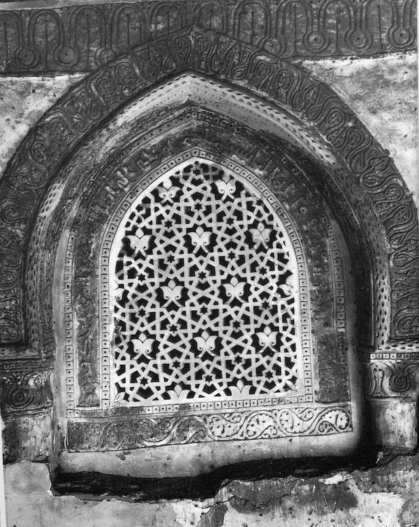

Title: Blóði drifin byggingarlist: Hlutverk arkitektúrs í átökum.
Subtitle: Endalok mosku Babúrs og saga helgispjalla á Indlandi
Slug: blodi-drifin-byggingarlist
Part: 2/3
Date: 2008-11-13 12:18:28
UID: 818
Lang: is
Author: Hilmar Magnússon
Author URL: 
Category: Alþjóðasamskipti, Arkitektúr
Tags: Babúr keisari, hindúar, múslimar, Indland, Ayodhya, breska heimsveldið, Bretland, Sjíva-hofið í Somnatha, Somnatha, Sjíva, Gujarat-hérað, helgispjöll, moska, Pakistan, Jawaharlal Nehru, Kongress-flokkurinn, Rajiv Ghandi, Bhartiya Janta Party, BJP, Rama, R.V. Venkataraman, World Hindu Congress, Sagnfræði, söguskoðun, stjórnmál, íslam, Mamúd, Somanatha, Richard Eaton

Í fyrsta hluta þessarar greinar voru kynntar til sögunnar aldalangar deilur hindúa og múslima á Indlandi. Rætt var um upphaf veldis Babúrs keisara, byggingarlist mógúlanna og byggingu moskunnar í Ayodhya. Þá var upphafi deilnanna um moskuna gerð skil og þær raktar fram á 19. öldina. Í þessum hluta verður haldið áfram þar sem frá var horfið og fylgst með baráttu trúarhópanna um moskuna fram eftir 20. öldinni. Þá verður sjónarhornið víkkað og reynt að grafast fyrir um ástæður þess haturs sem ríkir milli hindúa og múslima í nútímanum. Verður það gert með því að skoða langa sögu innbyrðis helgispjalla. Einnig verður þáttur breska heimsveldisins sem geranda og sagnaritara skoðaður og sjónum þá sérstaklega beint að hlutverki Sjíva-hofsins í Somanatha í Gujarat-héraði í því ferli. En fyrst að deilunum um mosku Babúrs keisara.

### Innbrot, skemmdarverk og óvænt endalok málaferla

Síðustu áratugir 19. aldarinnar einkenndust af ótal málaferlum þar sem bæði múslimar og hindúar voru málshefjendur. Hér beittu hindúar öllum brögðum til að ná moskunni á sitt vald, á meðan múslimar reyndu að verjast fjandsamlegri yfirtöku eftir fremsta megni. Þrátt fyrir að bresk yfirvöld hafi oft langað til að taka afstöðu með málstað Hindúa, ríkti algjör kyrrstaða í langan tíma, eða allt þar til að hvolfþök moskunnar voru skemmd í óeirðum árið 1934.[^1]

Í kjölfar sjálfstæðis Indlands og skiptingu þess árið 1947 óttuðust milljónir múslima um öryggi sitt og flúðu til Pakistan. Í sífellt spennuþrungnara andrúmslofti desembermánaðar árið 1949 gerðist það svo að nokkrir hindúar brutust inn í mosku Babúrs og komu þar fyrir líkneskjum af hindúaguðum. Samkvæmt indverskum lögum var gjörningurinn ólöglegur. Þegar hann barst forsætisráðherranum Jawaharlal Nehru til eyrna brást hann ókvæða við og fyrirskipaði að líkneskin skyldu fjarlægð þegar í stað. Málinu lauk hins vegar heldur óvænt með þeim dómsúrskurði að nú væri múslimum bannað að koma á svæðið svo gera mætti hindúum kleift að biðjast fyrir innandyra![^2]

### Hindúar ná yfirhöndinni

Næstu áratugum vörðu trúarhóparnir í að berjast um örlög moskunnar fyrir dómstólum Indlands. Þrátt fyrir að moskan væri _í vörslu_ indverska ríkisins allan þann tíma og ætti að vera lokuð fyrir öllum tilbiðjendum, tókst hindúum engu að síður að spilla henni og umkringja með hindúahofum. Dómstólarnir drógu svo málaferlin viljandi á langinn í áraraðir, héldu málinu í gíslingu og bjuggu þannig hindúum ákjósanlegan jarðveg. Hann nýttu þeir til að þjóna sínum pólitíska boðskap, kynda óspart undir trúarlegum hita og æsa fólk til stuðnings við sig. Í febrúar 1986 féll loks dómur, hindúum í vil. Í honum stóð að hliðin að moskunni skyldu opnuð og með þessum gjörningi veitti dómstóllinn hindúum í raun full yfirráð yfir moskunni. Úrskurðurinn leiddi til öldu ofbeldis sem flæddi um allt landið. Auk þessa dómsúrskurðar sóttust harðlínuhindúar eftir stuðningi leiðtoga Kongress-flokksins og endaði sú málaleitan með því að Rajiv Ghandi forsætisráðherra lýsti moskuna opna fyrir tilbeiðendum hindúa í mars 1986.[^3]

### Dagar moskunnar taldir

Deilan um mosku Babúrs hélt áfram. Árið 1989 skipulagði hinn hægrisinnaði flokkur hindúa, _Bhartiya Janta Party_ (_BJP_) bílalest sem fór um 10.000 km veg frá Somnath til Ayodhya. Lestin átti að enda með ólöglegri skóflustunguathöfn sem fram átti að fara í október 1990 og marka þar með upphafið að framkvæmdum við nýtt Ramahof. Ögrunin leiddi til ofbeldis víða um land, en áætlanir harðlínumannanna voru engu að síður knúðar fram. Og það með blessun þáverandi forseta landsins, R. V. Venkataraman, þingsins og ríkisstjórnarinnar. Stuttu síðar hófu hindúarnir „byggingaframkvæmdir“ sínar og þrátt fyrir að samfélag múslima, hæstiréttur Indlands og fjölmargir þingmenn á Indlandsþingi reyndu sitt ítrasta til að koma í veg fyrir hamfarirnar voru dagar mosku Babúrs taldir.[^4]

Þann 6. desember 1992 komu yfir 300.000 manns saman í bænum Ayodhya undir forystu hindúaflokksins BJP og hreyfingarinnar _Heimsþings Hindúa_ (_e. World Hindu Congress_). Þeir herskáustu úr fjöldanum brutu sér fljótt leið í gegnum farartálma lögreglunnar og eftir einungis 5 klukkustunda erfiði,[^5] þar sem notaðar voru sleggjur, hakar, meitlar og berar hendur, tókst þeim loksins að jafna hina 464 ára gömlu mosku við jörðu. Þar með höfðu þeir eyðilagt eina af síðustu byggingum mógúlanna í bænum Ayodhya.[^6] Eyðing moskunnar varð til þess að ólgan sem kraumað hafði undir víðs vegar um landið braust fram. Í þeirri öldu ofbeldis og óeirða sem á eftir fylgdu særðust um það bil 5.500 manns. Sautján hundruð lágu í valnum.[^7]

### Eyðing og árekstrar - aldalöng saga helgispjalla á Indlandi

Örlög mosku Babúrs eru einungis dramatískasti anginn af stærri samfélagssamræðu sem hefur á afdrifaríkan hátt breytt því hvaða augum hindúar nútímans líta íslömsk minnismerki í indversku landslagi.

Stuttu eftir eyðileggingu moskunnar skrifuðu leiðtogar BJP stefnuskrá þar sem þeir lögðu til að litið yrði á álíka moskur sem „ögrandi og áþreifanlega minnisvarða“ um „ofbeldisfulla og villimannslega innrás“ íslamskra stríðsmanna inn í Indland miðalda. Þessi orð var ekki hægt að túlka sem sérviskulegar ásakanir pólitísks jaðarhóps sem líta mætti framhjá. Öðru nær. Þau voru opinberar og ígrundaðar yfirlýsingar stórrar og ábyrgrar stjórnmálahreyfingar sem sóttist eftir völdum á þingi í gríðarstóru og flóknu samfélagi.[^8]

Til þess að dýpka enn gjána milli trúarhópanna hafa hægrisinnaðir hindúar á þennan hátt reynt að draga upp mynd af íslam á Indlandi sem umburðarlausri trú sem eyðileggi alla helgidóma og menningarverðmæti sem á vegi hennar verði. Þá hafa þeir reynt að mála múslima sjálfa sem innrásaraðila og utangarðsmenn. Hindúarnir hafa haldið því fram að allt 60.000 hindúahof hafi af trúarlegum ástæðum verið eyðilögð af múslimum í gegnum tíðina og oft verið skipt út fyrir moskur. Þeir vitna í fjöldamörg dæmi máli sínu til stuðnings og benda jafnvel á ákveðnar moskur sem þeir leggja til að verði jafnaðar við jörðu í þeirri viðleitni að afmá ævaforn illvirki múslimanna.[^9] Til að komast að því af hverju svo margir hindúar á Indlandi nútímans líta íslam þessum augum verður að skyggnast eilítið aftur í tímann.

Um leið og það er gert kemur í ljós að sum af þessum meintu spellvirkjum múslimanna eiga í raun við rök að styðjast. Sagnabálkar og annálar, bæði hindúa og múslima, lýsa nefnilega langri sögu helgispjalla á Indlandi. Saga múslimahöfðingjans Mamúds og helgispjalla hans í Sjíva-hofinu í Somanatha á fyrri hluta 11. aldar er líklega besta dæmið um þetta.[^10] En þrátt fyrir sögur á borð við þessa hafa umfang, ástæður og samhengi hinnar múslímsku eyðileggingar verið dregnar mjög í efa, aðallega af sagnfræðingnum Richard Eaton. Rannsóknir hans hafa sýnt að einungis sé hægt að sýna fram á eyðingu 80 hofa, en ekki 60.000, og að líta verði á þessa eyðileggingu sem tjáningu valds og sem refsingu fyrir uppreisn fremur en trúarlegan verknað. Hann færir rök fyrir því að þessir verknaðir hafi þjónað tilgangi sem afmarkaðar pólitískar yfirlýsingar og að ekki sé hægt að sjá að þeir falli í mynstur víðtækrar menningarhreinsunar. Eaton heldur því fram að þessari venju, að eyðileggja menningarverðmæti, hafi einnig verið fylgt í innbyrðis deilum hindúahöfðingja og að hana megi rekja aftur fyrir þann tíma er múslimar réðust inn í Indland. Og sé farið út í þá sálma, þá sé þessi háttur í raun mun eldri en sjálf hugmyndin um Indland sem eina heild.[^11]

Þetta skilur þó eftir spurningu sem enn hefur ekki verið svarað. Ef hægt er að kenna hindúum sjálfum um eyðingu fortíðarinnar til jafns við múslimahöfðingja þá er síðar komu til sögunnar, hvers vegna trúa þá svo margir hindúar því að múslimum sé einum um að kenna? Svarið við þessu liggur í sögu breskra yfirráða á Indlandi frá 1765-1947.

### Breska heimsveldið deilir og drottnar

Sporin má rekja aftur til stefnunnar um að „deila og drottna“ sem breska heimsveldið framfylgdi í S-Asíu og var hluti af nýlendustefnu þess. Meginmarkmið þessarar stefnu var einfaldlega að herða grip nýlendustjórnarinnar á svæðinu. Til að ná því markmiði notuðu yfirvöld í sífellu viðkvæm málefni á borð við stéttir, hörundslit, kynþætti og síðast en ekki síst trúarbrögð til að etja hinum ólíku hópum svæðisins hverjum gegn öðrum. Þetta reyndist afar áhrifarík aðferð og með því að heimfæra þetta leikhús upp á samfélag hindúa og múslima reyndi heimsveldið að mynda gríðarlega gjá milli trúarhópanna. Múslimar sem áður höfðu verið hin ráðandi stétt á svæðinu voru dubbaðir upp í hlutverk kúgaranna. Hindúarnir voru aftur á móti klæddir í hlutverk hinna kúguðu. Með því að æsa upp sögulegt hatur hindúanna á múslimum, ásamt því að styðja trúarlegar kröfur þeirra, sem og aðrar kröfur, í fjölda hlutdrægra bókmennta, fréttabréfa og skýrsla, náðu Bretar að vekja samúð hindúafjöldans með sínum málstað.[^12]

Breskir sagnfræðingar dustuðu rykið af indverskum miðaldabókmenntum, þeirra á meðal indversk-múslimskum sagnabálkum um landvinninga og hetjuskap, ásamt öllum þeim bókmenntalegu ýkjum sem slíkum verkum fylgja. Þessi bókmenntaverk túlkuðu þeir samkvæmt þörfum breska heimsveldisins og bjuggu til nýjar „sagnfræðilegar staðreyndir“ er tengdust miðaldasögu Sjíva-hofsins í Somanatha. Á þennan hátt náðu sagnfræðingarnir að setja saman röð atburða, þar sem skiptust á niðurrif múslima og enduruppbygging hindúa á hofinu. Bretum tókst þannig að breyta hofinu í Somanatha úr stað sem áður hafði verið minnst fyrir _eina_ fræga innrás, í táknmynd _stöðugrar_ baráttu milli þessara tveggja samfélaga.

Þessi ímynd af sundurrifnu indversku samfélagi, þar sem þrjóska, algjört trúarlegt umburðarleysi og deilur milli trúarhópa skipuðu stærstan sess, var orðin meginþemað í nýlendusöguskoðun á síðari hluta 19. aldar. Bretar stilltu svo auðvitað myndinni þannig upp að þeirra eigin stjórn hlaut að teljast jákvæð í samanburði við stjórn múslimanna sem þeir höfðu leyst af hólmi. Kaldhæðni örlaganna varð svo til þess að gera þessa ímynd að stórum þætti í þeim arfi sem þjóðernissinnaðir indverskir sagnfræðingar og rithöfundar fyrri hluta 20. aldarinnar fengu frá breskum lærifeðrum sínum.[^13] Nánar um það í þriðja og síðasta hluta.

---

#### Heimildir

* Bevan, Robert. _The Destruction of Memory: Architecture at War_. London: Reaktion Books Ltd., 2006.
* Davis, Richard H. “Memories of Broken Idols.” _The Experience of Islamic Art on the Margins of Islam_. Irene A.Bierman (editor). Reading: Garnet Publishing Ltd. in association with the Gustav E. von Grunebaum Center for Near Eastern Studies, University of California, 2005, 133-165. 
* Eaton, Richard M. “Temple desecration in pre-modern India: When, where, and why were Hindu temples desecrated in pre-modern history, and how was this connected with the rise of Indo-Muslim states?” _Frontline - India's National Magazine_, no.25, vol.17, 2000, 62-70.
* Eaton, Richard M. “Temple desecration and Indo-Muslim states: Why, after the rise of pre-modern Indo-Muslim states, were some Hindu temples desecrated, some protected, and others constructed anew?” _Frontline - India's National Magazine_, no.26, vol.17, 2001, 70-76.
* Vaughan, Philippa. “India: From Sultanate to Mughal Empire”. _Islam - Art and Architecture_. Markus Hattstein & Peter Delius (editors). Hagen: Könemann, 2004, 452-489.
* Islam, Arshad. “Babri Mosque: A Historic Bone of Contention.” _The Muslim World_, vol.97, no.2, 2007, 259-286.
* Juergensmeyer, Mark. _Terror in the Mind of God: The Global Rise of Religious Violence_. Berkeley, Los Angeles and London: University of California Press, 2003.
* Nelson, Robert S. & Margaret Olin. _Monuments and Memory, Made and Unmade_. Chicago and London: The University of Chicago Press, 2003.

[^1]: Islam, 2007: 273-275.
[^2]: Sama heimild: 275-276.
[^3]: Islam, 2007: 276-278.
[^4]: Sama heimild: 278-279.
[^5]: Davis, 2005: 136.
[^6]: Bevan, 2006: 134.
[^7]: Davis, 2005: 136.
[^8]: Davis, 2005: 136.
[^9]: Bevan, 2006: 137.
[^10]: Davis, 2005: 140-150.
[^11]: Eaton, 2000: 62-70 & Eaton, 2001: 70-76.
[^12]: Islam, 2007: 259.
[^13]: Davis, 2005: 153-154.
