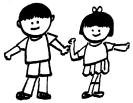

Title: Börn í íslenskum fjölmiðlum
Slug: boern-i-islenskum-fjoelmidlum
Date: 2006-06-29 08:25:39
UID: 84
Lang: is
Author: Elín Ösp Gísladóttir
Author URL: 
Category: Mannfræði, Fjölmiðlar
Tags: 

Mér lék forvitni á að vita hvernig fjallað væri um börn í íslenskum fjölmiðlum og ákvað að gera óformlega könnun á því hvernig umræðu um þau væri háttað í Fréttablaðinu. Er það jákvæð eða neikvæð umfjöllun? Fá þau að tjá sig sjálf eða tala aðrir fyrir þau? 

„Barnafræðingarnir" Pia Christensen og Alan Prout fjalla um mismunandi sjónarhorn á börn og er hér er aðallega um að ræða sjónarhorn við rannsóknir og skrif um börn þó hægt sé að að nota þau til hliðsjónar við lestur annars konar efnis. Umræðu er skipt í tvo flokka, svokölluð fullorðinslæg sjónarhorn annars vegar og barnslæg sjónarhorn hins vegar. Fullorðinslæg sjónarhorn er það kallað þegar litið er á börn sem hluti (object) eða persónur (subject) og byggir á aðgreiningu í börn og fullorðna og þeirri forsendu að börn þarfnist verndar, og séu hluti af stofnunum fullorðinna, svo sem fjölskyldu og skóla. Þegar litið er á börn sem persónur (subject) er viðurkennt að börn séu félagsverur á eigin forsendum. Þroskastig sálfræðinnar eru þó höfð sem viðmið og persóna barna ávallt sett í samræmi við aldur og þroska (Christensen og Prout, 2002).

Barnslægu sjónarhornin ganga út frá öðrum forsendum, þar sem annað hvort er litið á börn sem gerendur (agents) eða virka þátttakendur (active participants). Innan beggja þessara hluta er skiptingin í börn og fullorðna dregin í efa og litið er á börn sem þátttakendur í þeim félagslega heimi sem þau lifa í. Innan rannsókna sem nota þetta sjónarhorn fá börn sjálfstæða stöðu, eí stað þess að vera aðeins talin hluti af stofnunum fullorðinna. Rótgrónar aðferðir eru véfengdar og lögð áhersla á að hlusta á raddir barna. Þegar litið er á börn sem virka þátttakendur (active participants) eru þau höfð með í rannsóknarferlinu (Christensen og Prout, 2002). Nú þegar við höfum glöggvað okkur á fjórum ofantöldum sjónarhornum skulum við líta til frétta um börn í Fréttablaðinu og athuga hvort hægt sé að afmarka þær innan þeirra. 

Fréttablaðið var valið vegna þess hversu mikla dreifingu það hefur. Framsetning þess á efni og ímyndum hefur því allnokkur áhrif. Alls fundust fjörutíu fréttir og myndir sem tengdust á beinan eða óbeinan hátt börnum í þeim sjö blöðum sem skoðuð voru.[^1] Efni fréttanna var mismunandi en oft var fjallað um líkamlegt ofbeldi tengt börnum og myndir af börnum birtar í samhengi við ofbeldi, eða í níu fréttum. að auki var talað um börn og sjúkdóma, vanlíðan og vanrækslu í sex fréttum. Til að vega upp á móti þeirrri neikvæðu umræðu voru níu fréttir þar sem fjallað var um börn á uppbyggilegan hátt, þar sem þau stóðu sig vel eða voru að gera eitthvað jákvætt. Dæmi um það er frétt um kokkakeppni Rimaskóla, sigurvegara í blásarakeppni og góðan árangur stúlkna í Kópavogi í handbolta. Fjöldi frétta af fermingum barna var átta og er það stór hluti þeirra frétta sem skoðaðar voru. Oft var umfjöllunin tengd tísku og auglýsingum sem tengdust því sem gera þurfti fyrir fermingardaginn, svo það má einnig velta því fyrir sér hversu mikil umfjöllun er um börn fyrir utan árlegan tíma ferminga.

Töluvert var af myndum af börnum við fréttir sem tengdust börnum ekki, eða í ellefu tilvikum. Meðal annars myndir af börnum með foreldrum sínum þegar viðtöl voru við foreldra, mynd af börnum við opinbera atburði og í tengslum við viðkvæm málefni. Hugsanlega til að fá viss viðbrögð, til dæmis var mynd af barni við frétt sem fjallaði um öryggismál í Leifsstöð og fellur undir ímyndina um börn sem verndarþurfi. Einnig var mynd af barni með borða Hamas hreyfingarinnar og byssu við frétt sem var um heimastjórn Palestínu og tengist það sömu ímynd, og einnig því sem talið er hneykslanlegt og vekur óhug. Rætt verður um það síðar í textanum. 

Aðeins í fjórum tilvikum tjáðu börnin sig beint, þar af voru þrjú viðtalanna í tengslum við fermingarundirbúning. Oftast tjáði fullorðin manneskja sig um málefni barna þó svo að tilvalið hefði verið að fá þau til að tjá sig sjálf. Í umfjöllun um kokkakeppnina var talað við kennarann, blásarasveitin var kynnt af stjórnanda og þjálfari sagði frá góðu gengi íþróttakrakka Helmingur fréttanna, eða tuttugu af fjörutíu, sagði af börnum og þeirra málefnum án þess að sjónarhorn þeirra kæmi nokkru sinni fram.

Í fimmtán skipti tengdist umræðan neikvæðum hlutum, ofbeldi, sjúkdómum, vanlíðan og vanrækslu. Það finnst mér vera hátt hlutfall af þeim fjörutíu fréttum og myndum sem ég skoðaði. Meðalfjöldi frétta í einu blaði um hundrað, að öllum fréttum og pistlum meðtöldum. Af þeirri tölu að dæma er hlutfall frétta um börn eða myndir af börnum i blöðum sem samsvarar viku útgáfu af dagblaði lítill, eða um fjörutíu af sjöhundruð ef gróflega er reiknað. Velta má vöngum yfir hversu margar fréttir um börn væru í Fréttablaðinu ef Kópavogsblaðið hefði ekki verið tekið með[^2] og fréttir tengdar fermingum klipptar frá. Aðeins í þeim fréttum fengu börn að tjá sig sjálf.

Mannfræðingar hafa hingað til ekki verið duglegir við að fjalla um börn, sem er að vissu leyti undarlegt þar sem mannfræðin gengur út á að skoða menningu og hvernig hún er lærð en ekki erfð. Börn eru því tilvalin til rannsókna þar sem þau tileinka sér menningu fullorðinna og skapa sér eigin menningu óháð fullorðnum (Hirschfeld, 2002). 

Fræðimanneskjan Sharon Stephens (1995) segir að í rannsóknum á börnum sé oftar gert mat úr því neikvæða en því jákvæða, samanber fjölda rannsókna á börnum og ofbeldi, vanrækslu og misnotkun. Þá er um leið verið að beina athyglinni að samskiptum á milli barna og fullorðinna og hvernig fullorðnir hafa áhrif á börn en ekki öfugt. Að sumu leyti er því frekar verið að skoða fullorðna og þeirra gjörðir. Miðað við mína stuttu skoðun á fréttum um börn og myndum af börnum í Fréttablaðinu er auðvelt að segja að neikvæðar fréttir af börnum og ofbeldi séu áberandi. Ástæða þess kann að vera að þessar fréttir virðast meira spennandi, hugsanlega vegna þess að þar eru fullorðnir í brennidepli og þeirra verk gagnvart börnum skoðuð. Það bendir til þess að ekki sé litið á börn sem gerendur með áhrif á líf sitt heldur séu heimili og skóli mikilvæg í félagsmótuninni (Prout og James, 1990). Því er talið nær lagi að ræða um börn við fulltrúa þeirra stofnana.

Ímynd af börnum sem fórnarlömbum kallar á sterk viðbrögð, hvort sem um er að ræða börn í stríði, veik börn eða vanrækt börn. Stephens (1995) fjallar einnig um vestrænar hugmyndir um nútímabarnið og segir að æskan eigi fyrst og fremst að vera áhyggjulaus og einkennast af sakleysi. Þetta birtist meðal annars í því að börnum er ætlaður annar öruggari heimur aðskildum heimi hinna fullorðnu. Litið er á börn tilfinningalega verðmæt þar sem efnahagslegt gildi þeirra sem vinnuafls er lítið. Börn eru því frekar notuð sem tákn fyrir velsæld. Stephens telur að þjóðhverfa þessara hugmynda komi fram í umfjöllun um börn sem ekki passa inn í verndaðan heim bernskunnar, til dæmis frásögnum fræðimanna um börn sem fórnarlömb sem tapað hafi sakleysi sínu vegna vinnu, stríðs og fátæktar. Meint tapað sakleysi barna er því í brennidepli og talin forsenda þess að vera barn (Stephens, 1995).

Með því að skoða fréttir um börn frá sjónarhóli "barnafræðanna" kemur í ljós að fjölmiðlafólk virðist hafa svipaðar ímyndir í kollinum. Neikvæðar fréttir eru algengari en jákvæðar og einblínt er á það sem miður fer. Fréttir af börnum sem „tapað“ hafa sakleysi sínu eru algengar og eru hugsanlega sagðar með því markmiði að hneyksla okkur vesturlandabúa sem búum við þá hugmyndafræði að börn skulu lifa í sakleysi, allsnægtum og öryggi fram til 18 ára aldurs. Þetta tengist allt saman sýn fólks á barndóm, sem algildum eða staðbundnum. Ef algildur: þá er litið svo á að barndómurinn búi yfir ákveðnum fyrirframgefnum eiginleikum en sé um leið hverfull og býður þar með skýrari skilgreiningum birgin. Að mati Anne Trine Kjörholt og Hlidé Lidén (2004) er það ástæða þess að vestrænt fólk hafi þörf fyrir fréttir af hungruðum og fátækum börnum annars staðar í heiminum því án ímyndanna um vansælu börnin væri vestrænn barndómur ófullkominn. Þessar andhverfur, áhyggjulausi barndómurinn og vansæli barndómurinn, séu tvær hliðar á sama peningi.

Umræða um börn snýst oftar en ekki um tengsl á milli fullorðinna og barna, og hlutverk fullorðinna í mótun umhverfis og umgengni við börn. Sjálf eru þau sjaldan spurð álits, hugsanlega vegna þeirrar áherslu sem er á þroskasálfræði og að hugsun barna sé í mótun og þar með ófullkomin. Fullorðnir eru lang oftast í hlutverki útskýrandans í fjölmiðlum og segja frá málefnum barna fyrir þeirra hönd. Sjónarhornin fjögur sem Christensen og Prout nefna eru góð til þess að átta sig gróflega á umfjöllun um börn og glöggva sig á því hvernig umræða um þau fer fram. Þó sjónarhornin séu að mestu notuð við lestur fræðirita og rannsókna er gott að hafa þau á bak við eyrað þegar fylgst er með fjölmiðlum. Stutt skoðun á dagblaði getur leitt í ljós að fréttir um börn eru ekki veigamikill þáttur og er í miklum fjölda tilvika neikvæð. Ef marka má umfjöllun um börn í Fréttablaðinu er klárlega hægt að draga þá ályktun að sjónarhorn fjölmiðla á Íslandi sé fullorðinslægt.

---
#### Heimildir

* Christensen, Pia og Alan Prout. 2002. Working with ethical symmetry in social research with children. Childhood 9(4): 477-497.
* Fréttablaðið 13. febrúar, 14. febrúar, 15. febrúar og 21. mars, 22. mars, 23. mars, 24. mars 2006. Gefið út af 365 miðlum: Reykjavík.
* Hirschfeld, Lawrence A. 2002. Why don't anthropologists like children? American Anthropologist 104(2): 611-627.
* Kjörholt, Anne Trine, and Hlide Lidén. 2004. Children and youth as citizens: symbolic participation or political actors? Í Beyond the Competent Child. Exploring Contemporary Childhoods in the Nordic Welfare Societies. H. Brembeck, B. Johansson, and J. Kampmann, ritstj, bls. 63-87. Roskilde: Roskilde University Press.
* Prout, Allen og Allison James. 1990. A new paradigm for the sociology of childhood? Provenance, promise and problems. Í Constructing and Reconstructing Childhood.Contemporary Issues in the Sociological Study of Childhoood, bls. 7-34.
* Stephens, Sharon. 1995. Introduction. Children and the politics of culture in "late capitalism". Í Children and the Politics of Culture, bls. 3-48.

[^1]: Fréttir í blöðum Fréttablaðsins á tímabilinu 13.-15. febrúar og 21.-24. mars 2006 voru teknar fyrir. Leitað var að fréttum með vísan í börn í fyrirsögn og þar sem myndir af börnum voru notaðar. Hafa ber í huga að flokkun fréttannna er gróf og sumar fréttanna pössuðu í fleiri en einn flokk. Umfjöllun um framhaldsskóla var ekki tekin með vegna fjölbreytileika aldurs í þeim skólum. Fréttir frá grunnskólum voru skoðaðar og miðað var við skilgreiningu á barni sem manneskju undir 18 ára aldri.
[^2]: Kópavogsblaðinu er dreift með Fréttablaðinu.
