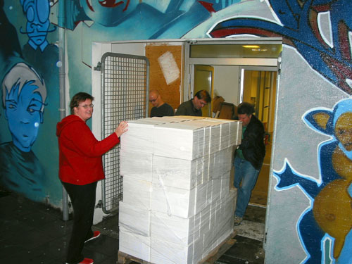

Title: Bókasafnsfræðingar í hreiðri sagnfræðinga?
Subtitle: Um skjalastjórnun og skjalavörslu.
Slug: bokasafnsfraedingar-i-hreidri-sagnfraedinga
Date: 2008-01-25 12:00:00
UID: 211
Lang: is
Author: Alfa Kristjánsdóttir
Author URL:
Category: Bókasafns- og upplýsingafræði, Sagnfræði
Tags:

<small>_Opið bréf til Hrafns Sveinbjarnarsonar um “Syndaflóðið … eftir vorn dag” erindi flutt í Þjóðminjasafni Íslands þann 15. janúar 2008 og greinina “Óinnvígður brýst í gegnum þoku upplýsingafræðings” sem birtist þann 24. janúar s.l. á www. hugsandi.is._</small>

---

Ég fagna öllum gagnrýnum skrifum um skjalastjórnun og skjalavörslu. Við getum þó alveg velt við steinum án þess að leggjast í skotgrafir. Í störfum mín sem ráðgjafi um skjalastjórnun hef ég stundum leitað í smiðju sagnfræðinga varðandi frágang og skráningu á skjalasöfnum og hefur það samstarf verið farsælt.

Samstarf faggreina er bráðnauðsynlegt í litlu landi. Þverfagleg hugsun og teymisvinna eru merki dagsins. Hugsun þín Hrafn er sorglega lítið í takt við þetta. Þú notar myndlíkinguna um hreiður sem þið sagnfræðingar hvílið í. Hvað er þetta hreiður?

### Hreiður sagnfræðinga?

Sagnfræðingar nálgast umræðuna um skjöl út frá hugmyndinni um skjalavörslu. Við skulum ekki rugla saman tveimur fræðigreinum skjalavörslu annars vegar og skjalastjórnun hins vegar. Skjalavarslan (archical management á ensku) er jafngömul ritlistinni og fjallar um vörslu skjala og rekstur skjalasafna. Skjalastjórnun (records management á ensku) er yngri fræðigrein sem þróaðist sem stjórnunargrein uppúr hefðbundinni skjalavörslu. Skiptingin í virk og óvirk skjöl kom fram í heimsstyrjöldinni síðari í Bandaríkjunum vegna gríðarlegs skjalamagns við stríðsreksturinn. Þá varð hugmyndin um lífshlaup skjala til, en sú hugmynd gengur út frá því að skjöl eigi sér lífshlaup svipað og allar lífverur sem fæðast, lifa sitt blómaskeið, fjölga sér (virkt skeið), setjast í helgan stein (héraðsskjalasafnið!) og deyja. Þetta er sniðug hugmynd sem nýtist vel við stjórnun skjala. Aðgreining virkra og óvirkra skjala er nauðsynleg meðal annars svo hægt sé að ganga frá óvirkum skjölum til vörslu, og ekki vilja sagnfræðingar missa af því. Lífshlaupshugmyndin er kennd við Bókasafns- og upplýsingafræðiskor í Háskóla Íslands.

Varðandi eyðingu skjala er aldrei of varlega farið.  Það er hins vegar staðreynd að umfang rafrænna skjala eykst margfalt frá ári til árs og það er bráðnauðsynlegt að skilja hismið frá kjarnanum.  Þjóðskjalasafnið gefur einnig út þær leiðbeiningar að grisjun skjala sé nauðsynleg, vegna hagnýtra ástæðna (sjá www.archive.is).  En það þarf að standa rétt að málum.  Faglegustu vinnubrögðin eru skjalaúttekt og kortlagning skjalaflokka áður en nokkru er eytt.  Eyðingin er síðan ákveðin í samráði við eiganda skjalanna, skjalamyndarann og Þjóðskjalasafn Íslands (eða héraðsskjalasafn) ef um opinberan aðila er að ræða.  Þessi vinnubrögð eru líka kennd við Bókasafns- og upplýsingafræðiskor hjá Háskóla Íslands.

### Syndaflóð og lögregluaðgerðir

Á sérhverri nútíma skrifstofu þarf ákveðna þekkingu til þess að stjórna skjölum og tryggja aðgang að þeim.  Það þarf að flokka, skrá og lykla skjöl alveg eins og aðrar heimildir eða skráða þekkingu.  Það er þarna sem bókasafns- og upplýsingafræðingurinn kemur sterkur inn.  Það þarf að skipuleggja og skilgreina lýsigögn skjala og stjórna þeim út lífshlaupið þannig að endurheimt skjala sé tryggð í tímans rás.   Hér vill því miður oft verða misbrestur á.  Ég veit dæmi þess að heilt skjalasafn með á annað hundrað þúsund skjölum hafi verið galtómt af lýsigögnum.  Þannig var ekki  hægt að leita að skjölum í safninu því nánast öll lýsigögn vantaði.  Þarna réð  “skjalamyndarinn” sjálfur ferðinni og ekki var stuðst við neina alþjóðlega staðla eða ráðgjöf bókasafnsfræðings.  Skjalamyndarinn hafði ekki hugmynd um að lýsigögnin væru ómissandi þáttur í stjórnun skjalanna.  Mikið hefði nú ISO 15489 staðallinn verið gagnlegur þarna.  Útkoman er sorgleg því hér er um verðmæt skjöl/upplýsingar að ræða sem skipta eigandann miklu máli.  En það er ekki of seint að færa þessi mál til betri vegar. Þá þurfum við að geta gagnrýnt faglega og fengið fólk í lið með okkur.

Hótanir um lögregluaðgerðir gegn fólki Hrafn er síðan gamaldags.  Við eigum við stjórnunarleg málefni að etja og leysum þau á faglegum grunni, en ekki með lögregluaðgerðum.  Skjalamyndarar þurfa ráðgjöf í heimi tæknilegra lausna og það er okkar að leiðbeina þeim um lýsigagnaskráningu, aðgangsstjórnun skjala og endurheimt þeirra.

### Skjalastjórnun í sókn

Skjalastjórnun er fræðigrein í sókn hér á landi sem erlendis. Jafnt á sviðum háskóla sem fræðigrein eða hagnýtt viðfangsefni í atvinnulifi.  Nýjasta fróðleikinn má sækja til Alþjóða skjalastjórnunarfélagsins, ARMA (www.arma.org), sem heldur árlegar ráðstefnur um þessi mál.  Næsta ráðstefna verður í Las Vegas í Bandaríkjunum og ég hvet alla sem koma að skjalastjórnun og skjalavörslu til að mæta.  Innanlands er einnig hægt að sækja sér fræðslu um skjalastjórnun. Ég hvet sagnfræðinga sérstaklega til að kynna sér stjórnunarhugmyndina um lífshlaup skjals.  (Sjá nánar um fræðslu á þessu sviði  www.skjalastjornun.is).

Þú Hrafn ert skarpur ungur maður og  hefur metnað fyrir hönd fags þíns, skjalavörslu. Hinsvegar er það vondur samskiptagalli að hlaupa í skotgrafir og skjóta úr kanónum í allar áttir, engum til gagns en mörgum til tjóns.

