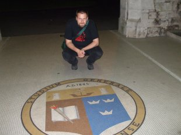
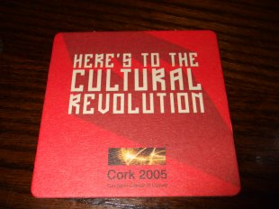
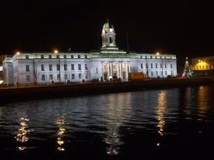
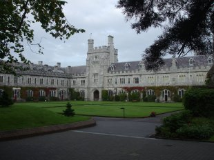
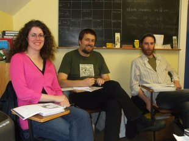
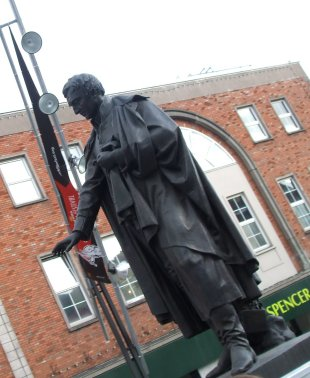
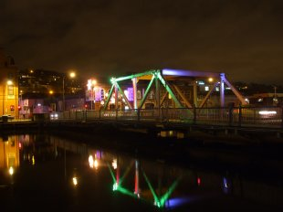

Title: Borgin og skólinn við ána Lee
Slug: borgin-og-skolinn-vid-anna-lee
Date: 2008-02-18 22:30:00
UID: 220
Lang: is
Author: Óli Gneisti Sóleyjarson
Author URL:
Category: Þjóðfræði, Póstur að utan
Tags:

Ég er í raun ekki mjög ævintýragjarn maður. Þó var ég fljótur að samþykkja það skilyrði sem er sett meistaranemum í þjóðfræði við Háskóla Íslands að þeir eyði minnst einni önn við erlendan skóla. Ég valdi ekki Cork upprunalega. Í raun var það nær óvart að ég lenti á Írlandi. Það er ekki mikið af þjóðfræðideildum í heiminum og í raun mjög fáar þar sem kennt er á ensku. Í Cork talar fólk ensku. Nokkurn veginn allavega. Ég þurfti reyndar túlkunaraðstoð þýsks vinar míns þegar ég reyndi að panta mér fisk og franskar. Þegar menn spyrja "how are you?" vilja þeir helst að maður segi "how are you?" til baka og tjái sig sem allra minnst um líðan sína.

Írlandi er skipt í fjögur héruð og 32 sýslur. Cork er staðsett í Munsterhéraði og Corksýslu. Borgin Cork er þriðja stærsta borg eyjunnar grænu og önnur í röðinni í írska lýðveldinu á eftir Dublin. Upphaf byggðar má rekja til munkabyggðar sem heilagur Finbarr stofnaði á sjöttu öld. Nokkrum öldum seinna komu víkingar og síðan þá hefur borgin vaxið og dafnað. Miðborg Cork liggur milli tveggja kvísla árinnar Lee. Upprunalega voru þetta 14 stakir hólmar og sum eldri hús bera þess merki að þau voru upprunalega niður við ánna. Kjarni borgarinnar er ekki stór og því hitti maður reglulega kunningja á röltinu í bænum.

Að vissu leyti er Cork Akureyri Írlands. Íbúarnir líta nokkuð stórt á sig þó aðrir Írar séu ekki alveg sammála. Allir geta þó sæst á að Corkbúar séu svolítið spes. Corksýsla er "rebel county", þar búa uppreisnarmenn og eru stoltir af því. Tilvísanir til kommúnisma eru tíðar. Það er hægt að kaupa sér boli með áletruninni Peoples Republic of Cork. Enn sjást skreytingar frá því að borgin var menningarborg Evrópu 2005 en þá skáluðu menn fyrir menningarbyltingunni. Þessar tilvísanir vöktu nokkra furðu hjá tékkneskum skiptinemum sem ég kynntist í Cork.

Þegar Írar börðust fyrir lýðveldi, fyrst við Breta og síðan við hverja aðra þá var Cork hálfgerð miðstöð þeirra sem lengst vildu ganga. Það var undarlegt að ganga um fallega miðborg Cork eftir að hafa lesið lýsingar á því hvernig hún var  brennd á skipulagðan hátt af Bretum í desember árið 1920 í hefndarskyni fyrir árásir á breska hermenn. Fyrir framan ráðhús Cork sem Bretar reistu í sáttaskyni í stað þess sem þeir brenndu eru styttur af  tveimur borgarstjórum Cork sem létu lífið í sjálfsstæðisbaráttunni. Annar var dreginn úr rúmi sínu og skotinn um miðja nótt, hinn lést eftir hungurverkfall í bresku fangelsi. Byltingarmaðurinn Michael Collins á sér líka styttu í Cork. Stytturnar af borgarstjóranum minna á grimmd Breta í stríðinu en styttan af Collins ýfir upp sárari minningar um innbyrðis stríð Íra sem fylgdi í kjölfarið og litaði sögu landsins langt fram eftir öldinni.

Ég hélt að ég væri að fara til kaþólsks lands. Lands þar sem skilnaður var bannaður þar til 1995. Það kom mér því á óvart að trúarbrögð voru nær ósýnileg í Cork. Það hefur mikið breyst síðustu áratugina á Írlandi. Kaþólska kirkjan hefur misst völd sín, sem voru hvað mest eftir stjórnarskrána sem Éamon de Valera laumaði inn árið 1937 á meðan Bretar áttu í vandræðum með konunginn sinn. Það eina sem eftir situr er bann við fóstureyðingum og í dag er hart barist á Írlandi um það. Þó má gera ráð fyrir að baráttan væri harðari ef það væri ekki svona auðvelt að ferðast til Englands.

Skólinn minn í Cork var University College Cork. Upprunalega var hét skólinn Queen's College, Cork og var stofnaður 1845. Á þeim árum voru Bretar byrjaðir að slaka á kúgun sinni á kaþólikkum og var skólinn fyrst og fremst ætlaður þeim. Einkunnarorð University College Cork eru "þar sem Finbarr kenndi skal Munster nema". Skólinn er hluti af National University of Ireland. Rúmlega 16 þúsund nemendur eru skráðir í skólann. Það að koma inn á háskólasvæðið var stórkostlegt. Gróðurinn, áin og húsin gera þetta að hálfgerðu draumalandi. Ég fann aðeins fyrir aldri mínum þegar ég fór í skólann fyrsta daginn á kynningu og sá á sveimi fjöldann allan af 18 ára nýstúdentum í sömu erindagjörðum. Sömuleiðis var það skrýtið þegar enginn vissi til þess að nokkur annar alþjóðlegur nemi væri jafn gamall mér, sá næsti í röðinni var 27 ára (ég var árinu eldri). Ég kynntist fjölmörgum stúdentum héðan og þaðan úr Evrópu og með þeim fór ég í eftirminnilegar ferðir um suð-vestur Írland. Meðal annars fór ég um svæði þar sem mannfræðingurinn Nancy Scheper-Hughes gerði etnógrafíu á áttunda áratugnum sem fór svo illa í íbúana að hún var hrakin þaðan með ógn um ofbeldi þegar hún sneri aftur rúmlega tuttugu árum seinna.

Fyrir utan mig voru einungis tveir aðrir skráðir í meistaranámið við þjóðfræðideildina í UCC. Fámennið kom sér svolítið illa því ég kynntist eiginlega engum innfæddum vel. Meistaranám í UCC er ársprógram. Kúrsarnir eru árslangir og það kemur sér illa fyrir þá sem ætla einungis að vera þar eina önn í skiptinámi. Það hefði í raun verið ómögulegt að koma eftir áramót. Það var einnig óþægilegt að vera búinn með tvær annir af meistaranámi og taka námskeið sem eru enduróm af því sem maður hefur áður lært. Hins vegar var allt litað af sjónarhóli Íra sem bætti að mörgu leyti upp fyrir það að kannast við efnið. Rólegheit Íra voru mér erfið. Þeir taka öllu rólega. Sérstaklega þótti mér erfitt að skólinn byrjaði ekki af alvöru fyrren tveimur vikum seinna en upplýsingar gáfu til kynna.

Með heppni hefði ég getað fengið betra húsnæði. Ég var í stúdentahúsnæði sem kallaðist Arcadia Hall og var í rúmlega hálftíma fjarlægð frá skólanum. Ég öfundaðist út í vini mína sem fengu sérbaðherbergi og voru bara kortér að ganga í skólann. Ég var þó sáttur þegar ég miðaði við þá sem ég hitti fyrstu daganna og voru ekki enn búnir að finna sér húsnæði.

Alþjóðlegum stúdentum er boðið upp á námskeið í írsku sem ég íhugaði að taka en gerði ekki. Tungumálið hræðir mig satt best að segja. Það hvað ritmálið og talmálið virðast gjörsamlega ótengd gerir það skelfilega erfitt. Í þjóðfræðideild UCC er írska reyndar mikið notuð þegar starfsfólk er að ræða innbyrðis saman og mér skilst að það eigi við um í fleiri deildum skólans. Írar nota tungumálið annars ekki mikið dagsdaglega. Ákveðin svæði á Írlandi njóta fjárhagslegs stuðnings fyrir það að hafa hátt hlutfall írskumælandi íbúa en það ristir víst ekki einu sinni djúpt þar. Skilti eru hins vegar oft bæði á írsku og ensku.

Það tók Breta mörg ár að koma enskunni inn á Íra en það tókst loksins í kringum kartöfluhungursneyðina sem gekk yfir Írland um miðja 19du öld. Írskumælandi kaþólikkar urðu verst úti í hungursneyðinni enda voru þeir illa staddir fyrir. Þessir atburðir sitja enn í Írum. Þó það sé mun styttra frá því að Írar og Bretar börðust í sjálfsstæðisstríði hinna fyrrnefndu þá er það kartöfluhungursneyðin sem ennþá vekur meiri biturð hjá Írum. Það er líka skelfilegt að heyra lýsingar á framferði Breta. Írar verða líka ennþá að hafa kartöflur með öllu en kunna þó ekki enn að elda þær sómasamlega. Lasagne verður ekki meira spennandi með frönskum.

Það kom sakleysingjanum mér á óvart að lesa fréttir í írskum dagblöðum um að IRA væri ennþá starfandi og ennþá að drepa fólk. Að mestu er hins vegar bjartsýni um framtíðina og þó menn séu ekki endilega á því að Írland verði stjórnmálaleg heild þá er landið að mörgu leyti menningarleg heild. Maður þarf samt ennþá að passa sig á því hvernig maður talar um N-Írland. Sjálfur missteig ég mig örlítið eitt sinn þegar ég var að tala um skiptinguna og fékk umsvifalaust leiðréttingu frá samnemanda mínum um að svona mætti maður ekki segja.

Þó ég hafi verið glaður þegar ég sneri aftur til Íslands til kærustu, fjölskyldu og vina þá er ég aðeins farinn að sakna borgarinnar. Það væri notalegt að taka rölt niður á Patreksstræti, framhjá "styttunni" (af Father Matthew). Kíkja inn í enska markaðinn þar sem á boðstólnum er allskyns matur sem gefur, ranglega, til að kynna að Írar séu miklir sælkerar. Síðan gæti ég rölt yfir Grand Parade og keypt mér langloku í Centra sem er besti skyndimaturinn sem býðst í borginni. Á leiðinni til baka myndi ég fara Oliver Plunkett stræti sem er hálfgerð göngugata. Þegar ég kæmi þaðan væri vonandi dimmt svo að lýsingin á Brian Boru brúnni myndi speglast í myrku yfirborði árinnar Lee.

