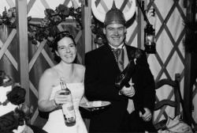

Title: Brúðkaup á Íslandi í aldanna rás
Slug: brudkaup-a-islandi-i-aldanna-ras
Date: 2007-01-23 12:06:00
Part: 1/3
UID: 126
Lang: is
Author: Telma Björg Kristinsdóttir
Author URL:
Category: Þjóðfræði, Mannfræði
Tags:

Elstu heimildir sem finna má um brúðkaup á Íslandi eru Eddukvæðin okkar. Í tveimur kvæða Eddukvæðanna er fjallað að einhverju leyti um brúðkaup og bónorð. Þar fáum við góða vísbendingu um að bónorð og brúðkaup eru ekki ný af nálinni, þó þau hafi verið talsvert ólíkt þeim brúðkaupum sem við þekkjum í dag.

Brúðkaup viðgengust lengi áður en kristin trú komst á, en fyrstu merki um að hjónaband hlýtur blessun kristinnar kirkju finnum við á 6.öld þegar sá siður komst á í Frakklandi að prestar blessuðu brúðhjón þegar þau voru komin upp í hjónarúmið. Hérlendis varð sá siður að láta prest vígja hjón saman ekki almennur fyrr en á 12. öld og komst ekki í lög fyrr en um miðja 13. öld, með tilskipun Árna biskups Þorlákssonar. Fram að þeim tímapunkti var brúðkaupið og stofnun hjónabands ekki trúarleg athöfn heldur veraldleg. Það var ekki fyrr en árið 1886 að borgaralegar, eða veraldlegar, giftingar voru leyfðar með lögum.

Það stendur í Grágás, lagasafni íslenska þjóðveldisins sem talið er að hafi verið ritað seint á 13. öld, að brúðkaup sé orðið löglegt þegar sá sem ræður yfir konunni segir hana gifta í að minnsta kosti en sex votta viðurvist og að brúðgumi gangi með henni til rekkju í birtu svo allir sjái. Í lagasafninu kemur einnig fram að 16 ára piltum var heimilt að ráðstafa mæðrum sínum í hjónaband og að feður réðu hverjum þeir giftu börnin sín, hvort sem það voru synir eða dætur. Ef dætur ráðríkra feðra voru mjög óánægðar með ráðhaginn áttu þær einn möguleika sem undankomuleið og það var að gerast nunnur, því ef stúlkur vildu gerast nunnur mátti ekki þvinga þær. Á þessum tíma var hjónabandið aðallega kaupsáttmáli fjölskyldna sem átti að tryggja að stofnun kaupsáttmálans væri lögleg og að fjármunum væri ráðstafað með réttum hætti.  Það hefur því eflaust komið upp að stúlkur urðu óánægðar með verðandi maka sinn þó að feður þeirra sæu mikla kosti og þægindi við sameininguna. Það hefði ef til vill verið stofnað til mun færri hjónabanda á þessum tíma ef börnin hefðu haft algildandi neitunarvald þegar kom að því að para þau við útvalda maka þar sem ekki var um svo marga að velja í þessu fámenna landi. Það er þannig á ákveðin hátt jákvætt að feður gátu skyldað börn sín til að ganga í hjónaband til að viðhalda fólksfjölgun, en auðvitað er sorglegt að setja sig í spor ungra meyja og sveina sem sáu fram á að eyða ævidögunum með einhverjum sem þau kunnu illa við.

Flóknar takmarkanir á því hverjir máttu giftast vegna skyldleika ullu því að það þurfti oft að leita langt út fyrir heimabyggð sína til að finna maka sem væri á svipuðu efnahagsstigi. Höfðingjar fengu þó nokkuð oft konungsleyfi til að kvænast frænkum sínum. Lögunum samkvæmt mátti fólk sem var skylt í fimmta lið ekki giftast nema með sérstöku leyfi biskups en það kemur einnig fram sem nýmæli í Grágás að svo skylt fólk megi ganga að eiga hvort annað með þeirri skyldu að þau greiði tíund af öllum eigum sínum til kirkjunnar. Þetta hefur eflaust verið góð tekjulind fyrir kirkjuna þar sem erfitt er að finna fjarskylt fólk í þessu fámenna landi. Í dag þykir þetta ekki ýkja mikill skyldleiki og má ætla að nokkuð margir landsmenn geti rakið ættir saman upp í þennan ættlið.

### Veisluhöld á miðöldum

Samkvæmt þjóðveldislögunum var það skylda bænda að að hýsa frá þremur og upp í þrjátíu gesti í svokallaða brúðför, eða ferðalag til brúðkaupsins, og gefa þeim að borða.  Þessir gestir bændanna komu margir langt að og höfðu ferðast langar vegalengdir ýmist á hestum eða fótgangandi. Þar sem brúðkaupsgestirnir áttu svo oftar en ekki svipað ferðalag fyrir höndum sér á leiðinni tilbaka þá er það ekki nema von að brúðkaup stóðu lengi yfir (allt frá tveimur dögum upp í heila viku), þó það væri ekki nema til þess að leyfa hrossum og leggjum að fá hvíld og orku. Þegar hugsað er til þess hve mikil fyrirhöfn það hefur verið að komast til og frá brúðkaups er spurning  hvers vegna fólk yfirhöfuð lagði slíkt á sig. En brúðkaup voru á þessum tíma helsti viðburður í félagslífi íslenska bændasamfélagsins og ekki mörg önnur tækifæri til að sletta úr klaufunum og blanda geði við fólk utan nánasta nágrennis.

Miðaldabrúðkaup fóru venjulega fram á heimili brúðarinnar eða á næsta kirkjustað og algengast var að þau færu fram að hausti til, oft í kringum veturnætur í október. Samkvæmt athugunum á annálum, fornsögum og sagnaritum kemur fram að haustbrúðkaup virðast yfir helmingi algengari en öll brúðkaup á öðrum árstímum samanlögð. Haustið hentaði vel til veisluhalds þar sem nóg var til af fersku kjöti og öðru matarkyns eftir að heyskapnum og sláturtíðinni lauk. Kornuppskeru var þá sömuleiðis lokið og þá mátti brugga öl, en ef of lítið var af korni var ekki of seint að fá innflutt öl og vín frá síðustu sumarskipunum. Á þessum árstíma var ennþá ágætis færð þó það væri farið að kólna aðeins í veðri.

Brúðkaupsveislurnar voru miklar og glæsilegar hátíðir þar sem margt fór fram til að gera stundirnar sem skemmtilegastar. Það voru drukkin minni að heiðnum sið og siðabækur sem fjalla um brúðkaupssiði frá þessum tíma eru að mestu leyti minnaformálar. Minnaformálar eru eins konar skálaræður þar sem minni guða og höfðingja eru drukkin. Slíkir minnaformálar þekkjast víðar á Norðurlöndunum. Það er sérkenni hinna íslensku formála hversu margar fyrirskipanirnar eru til manna um að syngja eða kveða. Fyrirskipanirnar eru um að menn eigi að „tóna upp vísurnar hratt og ríflega,“ „vera vísukátir“ og „syngja upp vísur eða kveða.“ Það virðist sem gestirnir eigi þá að syngja hver á eftir öðrum um leið og sopið er á minnishornunum, þeim drykkjarföngum er notuð voru í þessum tilefnum. Það þurfti þó að bíða kurteislega þar til sá sem var á undan var búinn. Annað sem fram fór í slíkum veislum var þegar mennirnir áttu að bjóða í brúðarsængina. Þá buðu karlarnir í brúðina og að sjálfsögðu bauð brúðguminn hæst. Í lok hátíðahaldanna voru menn látnir drekka úr vítabikar en þá supu þeir úr sérstöku glasi til þess að taka út refsingu synda sem menn hefðu mögulega framið í þeirri gleði, gaum og hífun sem skapaðist í veislunni.

Þessi hátíðarhöld virðast hafa verið mjög gleðilegar stundir þar sem fólk gat skemmt sér og notið samveru og góðs matar, auk þess að geta lyft sér upp með áfengum veigum og gleymt amstri hversdagsins. Söngur og gleði og spennandi stemmning hefur eflaust fyllt loftin í hátíðarsölunum við slík tilefni og stundin verið ánægjuleg upplifun og lifað lengi í minnum veislugesta.

---

#### Heimildir

* Árni Björnsson (1996). _Merkisdagar á mannsævinni: Gamlar venjur, siðareglur og sagnir_. Reykjavík: Mál og menning.
* Hallgerður Gísladóttir (ritstj., 2004). _Í eina sæng. Íslenskir brúðkaupssiðir._ Reykjavík: Þjóðminjasafn Íslands.

