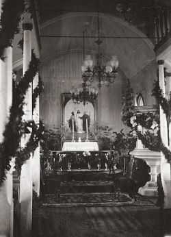

Title: Brúðkaup á Íslandi í aldanna rás
Slug: brudkaup-a-islandi-i-aldanna-ras
Date: 2007-01-25 09:00:00
Part: 2/3
UID: 127
Lang: is
Author: Telma Björg Kristinsdóttir
Author URL: 
Category: Þjóðfræði, Samfélag
Tags: 

Eftir 1600 og fram um miðja 18. öld fór smám saman að draga úr mikilfengleika brúðkaupa og í raun fór að draga úr flestu því sem mikilfenglegt var í þjóðlífinu með aukinni fátækt. Miklar hörmungar sem land og þjóð urðu fyrir hafa líklega ráðið þar talsverðu. Meðalárshitinn hafði þá farið lækkandi í um þrjúhundruð ár og var kuldinn nú farinn að segja til sín á áþreifanlegan hátt. Ofan á versnandi og óhagstæðari veðráttu kemur hið mikla arðrán þegar konungsvaldið eignaði sér allar eigur kirkja og klaustra. Þriðji skellurinn kom svo með verslunaránauðinni. Þá varð samkeppni kaupmanna um að ná sér í íslenskar vörur að engu og það hafði þær afleiðingar í för með sér að innfluttar vörur urðu fábreytilegri um leið og verðlag varð landsmönnum óhagstæðara. Í kjölfar þessara breytinga þurftu Íslendingar að smíða sér lægri hús og hafa þau minni og þrengri. Í slíkum húsakynnum var varla unnt að halda miklar brúðkaupsveislur og bjóða jafn mörgum og áður hafði tíðkast. Veisluskálar eins og þeir sem virðist vera gert ráð fyrir í siðareglunum fyrirfundust þó enn á einstaka stöðum fram til um það bil 1700. Slíkir veisluskálar voru frá um fimmtíu til hundrað fermetrar að stærð.

Það var ýmislegt til viðbótar sem átti hlut í að stórar og miklar brúðkaupshátíðir leggðust af og þykir það mögulegt að smitfaraldurinn stóra-bóla, sem gekk á árunum 1707 og 1708, hafi valdið hugarfarsbreytingu hjá forstöðumönnum brúðkaupa eða þeim sem rituðu annála. Eftir að drepsóttin hafði gengið yfir kom heittrúarstefna til landsins. Heittrúarstefnan, eða píetisminn, varð til þess að kirkjan og konungsvaldið amaðist enn meira en áður við léttleika, lausung og skemmtunum.

Árið 1746 voru gefin út lög af Kristjáni konungi VI., sem þótti strangur í siðferðismálum, og í þeim var margt bannað sem áður hafði tíðkast við brúðkaup. Þessi nýju lög bönnuðu að vers væru sungin yfir borðum og einnig að drukkið væri úr vítabikar.  Ólíklegt er að allir hafi verið sáttir með þessi nýju lög konungsins og í brúðkaupi Eggerts Ólafssonar eru þessi lög virt að vettugi.

### Brúðkaup aldarinnar

Eggert Ólafsson, náttúrufræðingur, varalögmaður og skáld skrifaði _Uppkast til forsagna um brúðkaupssiðu hér á landi_ og er talið að hann hafi skrifað bókina árið 1757. Bókin er eins konar tilraun til að endurvekja glæsilegar og hefðarríkar brúðkaupsveislur og í henni setur hann fram hugmyndir um endurreisn brúðkaupa í anda miðalda. Eggert hélt sjálfur upp á brúðkaup sitt með þeim hætti, þegar hann giftist Ingibjörgu Guðmundsdóttur frænku sinni haustið 1767. Brúðkaupið þeirra var á þessum tíma nefnt brúðkaup aldarinnar og töluðu menn um að það hafi verið haldið í fornum stíl, með ríkmannalegu yfirbragði og að öllu leyti var og mikið um fínan mat og drykk. Í bók sinni lýsir Eggert því nákvæmlega hvernig eigi að halda brúðkaup að heldri manna sið með tilheyrandi minnaflutningum, áti, drykk, dans, leik og söng.  Eggert lést árið 1768, aðeins ári eftir brúðkaup sitt, og þessi tilraun til endurreisnar gamalla siða tókst ekki, gömlu siðirnir voru ekki teknir upp aftur og komust aldrei aftur í tísku.  

Þó svo að brúðkaup Eggerts og Ingibjargar hafi verið mikilfenglegt og eftirminnilegt er ekki þar með sagt að það hafi verið reglan á þessu tímabili sögunnar.  Enda voru ekki margir sem höfðu mikla fjármuni til að eyða í brúðkaup, almenningur þurfti oft að láta sér nægja látlausari veisluhöld. 

Það er sagt lítillega frá brúðkaupsveislum bænda um 1790 í bréfum Stefáns Þórarinssonar amtmanns norðan og austan.  Í bréfum sínum talar Stefán um að brúðkaupsveislur almennings standi þá í einn dag, veitingar séu nær eingöngu brauð og að þær byrji og endi á brennivínsdrykkju. Hann leggur þá til að brennivín verði bannað í brúðkaupum og að menn eigi að vera skyldaðir til að veita tvíréttaða máltíð, en ekki brennivín og skonrok. 

### 19. öldin

Lýsingar á brúðkaupsveislum frá 19. öldinni eru margar og ef skoðað er hvaða drykkjarföng voru vinsælust má kalla tímabilið púnsöldina þar sem púnsinn varð fastur liður í íslensku brúðkaupshaldi alla öldina. Púnsinn, sem var oftast borinn fram í tarínum, samanstóð af rommi, heitu vatni, sykri, sítrónu og kanelbörk. Drukkið var úr kaffibollum því það var á færi fáa að smala saman vínglösum handa öllum í veislunni. 

Hinar svokölluðu brauðveislur í bændabrúðkaupum voru algengar fram eftir 19. öld. Fátækt fólk þessa tíma bauð oft eingöngu upp á innflutt tvíbakað brauð og kaffi ásamt brennivíni, eða þá að það bauð upp á kaffi og súkkulaði með hagldabrauði og skonroki, áður en það hófst handa við áfengisdrykkjuna. Ekki þótti fólki mikið til koma af slíkum brúðkaupsveislum og talað var um að við slík tækifæri tæki því ekki einu sinni að syngja borðsálma.

Það kemur ef til vill ekki gríðarlega á óvart að sögur um ölvaða veislugesti eða jafnvel presti sé ófáar frá þessu tímabili þar sem hægt er að sjá fyrir sér hvernig slíkir fögnuðir þróast þegar brennivínið er aðalréttur kvöldsins. Við lestur einnar slíkrar lýsingar á brúðkaupsveislu í byrjun 19. aldar fær maður þá tilfinningu brúðkaupsdrykkjan hafi þótt jafngild og prestvígslan: 

> En svo var mikill drykkjuskapur klerks, er þau áttu saman að vígjast, að aldrei varð hjónaband þeirra gert með lögboðnum ceremoníum. En veislan var haldin, og því voru þau álitin hjón og rengdi það enginn, þar eða allir máttu drekka eins og þeir vildu.
> <cite>– Friðrik Eggerz, 1950, sjá í Hallgerður Gísladóttir, 2004.</cite>

Nálægt aldamótunum 1900 fóru eldavélar með bakarofnum að verða algengar og framboðið af hráefnum til kökugerðar jókst, sem stuðlaði að því að íslendingar lögðu meira upp úr veislum með kaffi og fínum kökum en matarveislum.Um það leyti sem kökurnar verða vinsælar fer að bóla á tali um þurrar veislur þar sem ekkert vín var á boðstólum. Það má áætla að þetta gælunafn fyrir slíkar veislur hafi átt að vera niðrandi og því ekki þótt sérstaklega spennandi að fá ekki brennivínsdreitil í veislum. Ef til vill þóttu veislurnar bara frat fyrst fólk gat ekki fengið sér aðeins í tánna.

> Þessar veislur í fornum sið, með púnsi og dýrum veigum, lögðust af, þegar bindindisklerkarnir, séra Magnús Andrésson og séra Guðmundur Helgason, komu í Borgarfjörð. Kölluðu gamlir menn það hinar „þurru veislur,“ þar sem ekkert vín var haft um hönd.
> <cite>– Bragi Þórðarson, 1996; bls. 61.</cite>

Um aldamót fór að draga úr átveislum og drykkjarveislum í brúðkaupum þó að slíkar veislur hafi þekkst fram á kreppuár. Látleysi fór að einkenna brúðkaup og þar lögðu bindindishreyfingar, bannárin og loks kreppan sitt af mörkum. Þá fór tækifærum til að sletta úr klaufunum fjölgandi, fyrir þá sem það vildu, og var það ekki síst á vegum ungmennafélaga.

----

#### Heimildir

* Árni Björnsson (1996). _Merkisdagar á mannsævinni: Gamlar venjur, siðareglur og sagnir_. Reykjavík: Mál og menning.
* Bragi Þórðarson (1996). _Æðrulaus mættu þau örlögum sínum_. Reykjavík: Oddi.
* Eggert Ólafsson (1999). _Uppkast til forsagna um brúðkaupssiði hér á landi_ (Þorfinnur Skúlason og Örn Hrafnkelsson bjuggu til prentunar). Hafnarfjörður: Söguspekingastifti.
* Hallgerður Gísladóttir (ritstj., 2004). _Í eina sæng. Íslenskir brúðkaupssiðir._ Reykjavík: Þjóðminjasafn Íslands.

