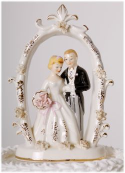

Title: Brúðkaup á Íslandi í aldanna rás
Slug: brudkaup-a-islandi-i-aldanna-ras
Date: 2007-02-06 15:23:00
Part: 3/3
UID: 130
Lang: is
Author: Telma Björg Kristinsdóttir
Author URL: 
Category: Þjóðfræði, Samfélag
Tags: 

Ný hjúskaparlög voru gefin út árið 1921. Í þeim var ekki talað um yfirráð foreldra yfir hjúskap barna sinna. Með þessum nýju lögum og breyttum áherslum í þjóðfélaginu fóru foreldrar að hafa minna forræði, eða minna alræði ef svo má að orði komast, yfir börnunum sínum. Á 20. öld var ást, kærleikur, mikill vinskapur og ýmsir þættir sem fólk skilgreinir sem ást helsta aflið við stofnun hjónabands og rómantík fór að setja sinn svip á brúðkaup. Önnur öfl hafa sjálfsagt þótt góðar ástæður til að giftast, til dæmis ótímabærar þunganir.

Í spurningaskrá þjóðminjasafnsins um trúlofun og giftingu frá 1992 kemur fram að brúðkaup voru yfirleitt í mjög hógværum og látlausum stíl fram um miðja 20. öld og jafnvel lengur. Mikil leynd ríkti yfir því þegar fólk fór að taka sig saman og trúlofun virðist hafa farið leynt þangað til hringar voru settir upp.  Það hefur líklega verið hluti af rómantíkinni að fara leynt með svoleiðis tíðindi, það getur verið spennandi að eiga leyndarmál með ástinni sinni. Svo hefur einhverjum eflaust fundist gaman að geta komið fjölskyldu og vinum á óvart með því að setja upp hringa. 

Í byrjun 20. aldar voru kirkjubrúðkaup nánast óþekkt og veislur sjaldgæfar. Annað hvort kom presturinn heim til fólks eða fólkið fór heim til prestsins þar sem presturinn og prestfrúin buðu til kaffisamsætis eftir á. Eftir að lög voru sett árið 1886 sem leyfðu fólki utan þjóðkirkjunnar að gifta sig borgaralega hjá sýslumönnum og dómurum fór fólk að nýta sér þann valkost. Brúðhjónin voru gjarnan ein eða með svaramönnum og stundum voru allra nánustu aðstandendur viðstaddir. Lög kváðu á um að svaramenn ættu að vera viðstaddir en þó var nóg að koma með skriflegt leyfi frá þeim. 

Þegar líða tók á öldina fór að bóla á fjölbreytni í veisluhaldi og athöfnum. Veisluhaldið fór eftir efnahag en kaffiveislurnar voru ennþá algengastar. Um miðja 20. öldina fór umstang og umfang brúðkaupa að aukast með batnandi efnahag auk þess sem krikjubrúðkaupin urðu tíðari. Um leið urðu veislurnar stærri og meira úr þeim gert. Tilfelli skutu upp kollinum þar sem verðandi hjón fengu leigðar kirkjur þar sem þau létu lesa sig saman án þess þó að athöfnin væri með nokkru leyti trúarleg eða að prestur kæmi við. Þegar leið svo á síðari hluta aldarinnar fór að bera nokkuð á því að fólk vildi giftast á furðulegum og óvenjulegum stöðum til að gera daginn sérstakan og eftirminnilegan. Slíkir óhefðbundnir staðir voru fornar kirkjur, náttúruperlur á borð við Þingvelli og Þórsmörk, háskalegar staðsetningar eins og klettabrúnir, jökultoppar, hraunhellar eða jafnvel í háloftunum um borð í þotum. Það hefur ekki verið kannað sérstaklega hvort það fari eftir tískustraumum þegar svona óvenjulegar aðstæður eru skapaðar í kringum brúðkaup en líklegast er að það fari eftir persónuleikum brúðhjónanna hvort slíkt henti þeim og sé eitthvað sem þau þrá. Fleiri þættir koma við þegar landslag brúðkaupa er skipulagt og ákveðið, þættir eins og fjárráð, þörf til að sýna sig og sanna og svo þrýstingur frá ættingjum og vinum. 

Vorið 2000 sendi Þjóðminjasafnið út spurningalista um brúðkaupssiði. Í svörum þess lista kom í ljós að mikil breyting hafði orðið á brúðkaupssiðum landsmanna eftir 1980 og að mesta breytingin hefði falist í því hvað brúðkaup voru orðin stór verkefni. Síðasti áratugur 20. aldarinnar hafði verið áberandi í þessum efnum og flestir sem giftu sig á þeim tíma sögðust hafa viljað „allan pakkann“ svokallaðan, sem fólst í miklum undirbúningi, dýrri fjölmennri veislu og háum útgjöldum í öllum liðum. Með auknum upplýsingum um umheiminn og siði í öðrum löndum eftir að internetið varð eins almennt og raun ber vitni fóru erlend áhrif að eiga greiðari leið að brúðkaupsmenningunni hérlendis. 

Samkvæmt svörum við spurningalista Þjóðminjasafnsins voru táknrænar hefðir viðhafðar í flestum tilfellum. Þessar táknrænu hefðir voru til að mynda bónorð, trúlofun, hvítur brúðarkjóll og slör, hringar, brúðarvendir, kransakökur og gæsa- og steggjapartí. Þessar táknrænu hefðir eru þannig mjög ungar miðað við hve löng hefð er fyrir brúðkaupum á landinu, en samt virðist sem margir álíti þessar hefðir vera hina einu sönnu brúðkaupssiði ef marka má vinsæla miðla og sjónvarpsefni á borð við Brúðkaupsþáttinn Já. 

Á internetinu má finna fjölmargar síður sem veita fólki í brúðkaupshugleiðingum upplýsingar og hugmyndir að úrlausnum mögulegra vandamála. Af þessum hjálparsíðum má áætla að það sé vinsælt að hafa mikið fyrir brúðkaupi sínu, að fólk geri sér grein fyrir að þetta kosti sinn skildinginn og að margir vilji hafa ferlið sem glæsilegast. Á síðunni femin.is eru nákvæmir gátlistar og kostnaðaráætlanir og fleira ætlað sem hjálpargögn við hinn mikla undirbúning. Þessir listar geta nýst sem ágætis gluggi inn í hugarheim nútíma brúðhjóna og ef marka má þessa lista mætti álykta að almenn sátt finnist meðal stórs hluta brúðkaupsmarkaðsins um að miklum fjármunum skuli varið í að gera brúðhjónin sem fallegust samkvæmt stöðluðum ímyndum og að veislur eigi að fylgja frekar takmörkuðu sniði til að vera ásættanlegar. En líklegra er að fólk noti þessa lista einungis sem viðmið. Á einum undirbúningslistanum er tekið fram að ekki síðar en heilu ári fyrir stóra daginn eigi brúðurin tilvonandi að vera búin að gera sér í hugarlund hvernig hún vilji hafa hárið sitt og að hún skuli fara í viðtal við hárgreiðslumeistara 9 mánuðum fyrir brúðkaupsdaginn. Gátlistar af þessu tagi kunna að minna á brúðkaupssiðabók Eggerts Ólafssonar frá 18. öld, nema í þessu tilfelli eru siðirnir í tísku og virðast ekki ætla að falla í gleymsku í bráð.

Meirihluti svarenda spurningalistans frá 2000 sögðust hafa verið í sambúð um tíma fyrir brúðkaupið, sumir höfðu búið saman í mörg ár og margir voru búnir að eignast börn. Það má segja að sjálf brúðkaupsathöfnin og sjálft ferlið sem brúðkaupið er breyti ekki miklu fyrir brúðhjón nútímans því þau eru komin á það stig í samveru sinni sem náðist ekki fyrr en eftir giftinguna hér á öldum áður. Helsta breyting sem brúðkaup hefur í för með sér er líklega lagalegs eðlis og hefur þá áhrif á fjárhagsmál og erfðarmál. Í dag fara mörg brúðhjón heim til sín að giftingu lokinni og halda áfram að lifa sínu lífi eins og þau höfðu gert án nokkurra breytinga. Það hefur þó augljóslega átt sér stað breyting þar sem fólkið hefur með giftingunni opinberað samband sitt fyrir umheiminum og kallað til vitni þar um. Þetta er þá gert með hátíðlegum aðferðum og fengið vini og aðstandendur til að taka þátt í opinberuninni með sér og samgleðjast. Staðfesting á heitum um ást og tryggð hefur með þessu átt sér stað.

---

#### Heimildir

* Femin.is (2006). http://femin.is/article.asp?art_id=2584. Sótt af vefnum 6. desember 2006.
* Hallgerður Gísladóttir (ritstj., 2004). _Í eina sæng. Íslenskir brúðkaupssiðir._ Reykjavík: Þjóðminjasafn Íslands.

