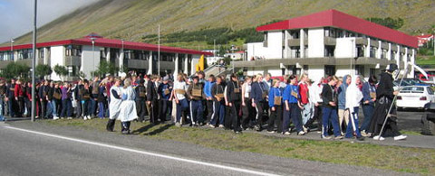
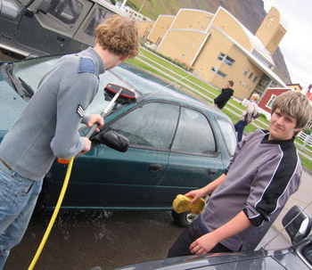
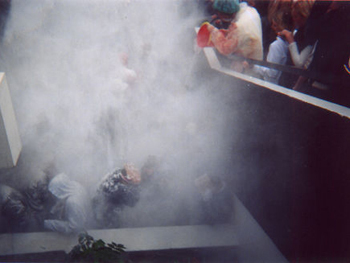
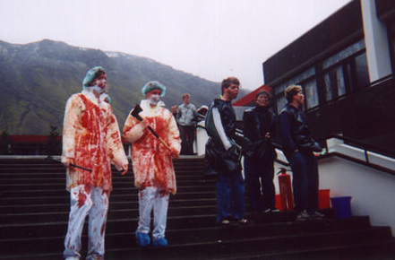
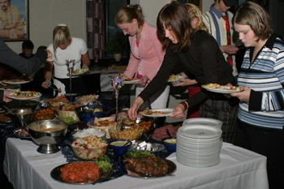

Title: Busavígsla í Menntaskólanum á Ísafirði
Slug: busavigsla-i-menntaskolanum-a-isafirdi
Date: 2006-09-07 09:00:00
UID: 91
Lang: is
Author: Telma Björg Kristinsdóttir
Author URL: 
Category: Þjóðfræði
Tags: Manndómsvígsla

Fjölmargar manndómsvígslur eiga sér stað um land allt á þessum árstíma þar sem fjöldi fyrrverandi grunnskólanema eru að hefja menntaskólagöngu sína. Þessir nýskráðu nemar menntaskólanna eru oft kallaðir busar þar sem þeir verða ekki nýnemar fyrr en þeir hafa gengist í gegnum vígslu, manndómsvígslu, sem jafnan stjórnast af þriðja árs nemum og er mismunandi eftir því hvaða skóli á í hlut.

Það er stór áfangi að skrá sig í nám sem ekki er skylda. Til að gera sem mest úr ákvörðuninni og að finna sem mest fyrir því að nýtt skeið sé að hefjast í lífinu er viðeigandi að búa til umfangsmikinn leik sem veitir verðandi menntskælingum mjög sjónræna, tilfinningalega og áþreifanlega upplifun á þessari kaflaskiptingu. Þessi leikur, eða leikrit, gerir inngönguna í menntaskólann hátíðlegri og með þessum hætti finnst einstaklingunum að hér sé um að ræða nýtt stig í tilverunni - það þarf að vígjast inn í þetta nýja samfélag. Að vígslu lokinni er maður svo ánægður meðlimur nýs samfélags, með opin augu og tilbúinn að taka þátt í öllu því sem þessi nýi heimur hefur upp á að bjóða.

Menntaskólinn á Ísafirði er ekki gamall skóli, stofnaður 1970 og því ekki með niðurnegldar hefðir hvað varðar athafnir eins og árlega vígslu nýrra nema. Á 36 árum hefur busavígslan þó fengið á sig nokkuð fasta mynd og hefur vígslan farið fram með litlum breytingum frá því að ég sjálf hóf nám mitt við stofnunina. Það er þó alls ekki langt síðan að vígslan var nánast ómannúðleg og jafnvel hæfandi að kalla endurminningar vígslunnar hryllingssögur.

Þegar pabbi minn var busi í Menntaskólanum á Ísafirði fór busavígslan heldur ómannúðlega fram samkvæmt hans frásögn og mínu mati. Pyntingar og útrás eldri nema á greyið busunum gat farið fram úr almennri skynsemi þegar busarnir voru bundnir til lengri tíma við ljósastaura og jafnvel færðir úr völdum flíkum. Vígslan sjálf var þetta árið með þeim hætti að busarnir voru færðir í fiskveiðinet sem híft var upp með krana, þeir svo spúlaðir duglega með ísköldu vatni og færðir ofan í fiskkar fullt af slori. Ekki veit ég sekúndufjöldann sem busarnir þurftu að dvelja á kafi í slori en þegar netið var híft upp á ný bar þeim að svara sem réttast við þeirri spurningu sem hrópað var: "Hverjir eru bestir?". Ef busarnir sýndu hugrekki með því að játa ekki ágæti þriðja bekkjar fengu þeir aðra ferð á bólakaf ofan í slorið. Það vill reyndar svo til að þennan dag þegar busunin fór fram var pabbi minn rúmfastur á sjúkrahúsi bæjarins og slapp þannig við hryllinginn, þó að hann hafi fengið að heyra bitra samnemendur útlista viðburðina með gremju. Af seinni busunarárum gengu svo sögur um óþekka busa sem fengu útreiðir á borð við flugferðir af bryggjunni út í sjó, óþekka busa sem hlutu beinbrot og fleira í þeim dúr. Ekki löngu seinna hertu skólayfirvöld reglur varðandi busun og fór mynd busunarinnar að mótast í átt að því sem hún er í dag.

Nútíma busavígsla í MÍ er þríþætt og þá daga sem busunin stendur yfir er leyfilegt að níðast á 1. bekkingum milli tíma með því að sprauta á þá vatni. Þessa daga eru gangar skólans merktir með límbandi þannig að þröngur og afmarkaður gangvegur busanna er bersýnilegur: þeir eiga að þekkja sín svæði og halda sig innan sinna marka, verandi illalyktandi smábörn - ennþá. Fyrsti hluti busunarinnar er uppboð. Nýnemar eru þá dregnir fram í hópum til sýnis á sal skólans þar sem eldri nemendur sitja og bjóða í hópana. Oftar en ekki eru busarnir látnir syngja, dansa eða sýna aðrar listir til að auka verðmæti sitt. Ágóði þessarar fjáröflunar rennur í ferðasjóð 3. bekkjar. Þeir eldri nemar sem bjóða í busana og borga fyrir þá fá að nýta sér annað hvort krafta eða félagsskap þeirra þar sem busarnir verða þrælar til dagsloka. Þennan dag, oftast fimmtudag, er ekki óalgengt að sjá bæinn fullan af unglingum að þrífa bíla eða að spássera um bæinn í furðulegum fötum.

Annar hluti vígslunnar er busunin sjálf þar sem fyrsta árs nemum er smalað saman, bleytt rækilega með hjálp vatnsbyssa og leidd í fallegri röð á valinn áfangastað. Þriðju bekkingarnir eru á þessum tímapunkti klæddir í búninga, drungalega og ógnvekjandi búninga, og þeir gegna því hlutverki að passa að enginn flýji ásamt því að halda busunum vökvuðum.

Misjafnt er eftir árum hvort ferðalagið liggi upp í fjall þar sem busarnir fá að skríða jarmandi um læki, eða niður í miðbæ þar sem neyddur er fram fjöldasöngur og alger undirgefni busanna gagnvart 3.bekkinga sýnd gestum og gangandi vegfarendum. Stuttu seinna er haldið aftur að skólanum þar sem busunum er smalað saman á þröngu svæði innan girðingar og án nokkurs fyrirvara er hellt yfir þau vatni, hveiti og jafnvel grísablóði. Þetta markar sjálfa vígsluna, þau hafa verið vígð og eru þá frjáls ferða sinna.

Þriðji og síðasti hluti þessarar miklu vígslu fer fram um kvöld eftir sjálfa busunina, þegar árgangarnir tveir hittast yfir hlaðborði og skemmtiatriðum og halda svo saman á dansleik. Á nýnemamatnum eru nýnemar teknir í sátt, þeir boðnir velkomnir og óskað til hamingu með nýja titla. Valin aðili nýnemanna heldur oft litla tölu og undir lokin eru allir sáttir og glaðir, saddir og sætir í fínum fötum tilbúnir að skoða annars vegar hina yngri og hins vegar hina eldri nemendur sem manneskjur og hugsanlega verðandi félaga.

Þessi vígsla er stórmerkilegt leikrit þar sem aðilarnir taka þátt án nokkurrar umhugsunar vegna þess að fyrir þessu er hefð.  Ástæðan fyrir því að aðilarnir fara auðveldlega í hlutverk sín er að fólk er vant því að leika, leikur er hluti af lífi okkar og hefur fylgt okkur frá bernsku þó hann taki á sig breytta mynd með auknum árafjölda. Helmingur leikendanna sætir niðurlægingu og hálfgerðum pyntingum meðan hinn helmingurinn breytist í örgusta herforingja sem skammast og niðurlægja eins og ekkert sé þeim eðlilegra. Þessi furðulega vígsla verður hlé frá raunveruleikanum rétt eins og allar hátíðir eru hlé frá hversdagsleikanum. Eins undarlegt og þetta ferli allt er þá erum við svo vön bæði hléum á hinni venjulegu tilveru sem og leikjum, leikritum og hlutverkum að við gleypum og kyngjum og spyrjum einskis. Þegar líður að leikslokum eru allir vinir. Biturð þeirra niðurlægðu leggst í dvala og sprettur ekki upp fyrr en tveimur árum seinna, þegar þeirra verða hlutverk böðlanna og ný fórnarlömb verða sjálvalin í síðri hlutverk.

<small class="blurb">– Þakka Fiffa fyrir myndirnar.</small>
