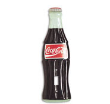
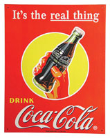
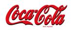

Title: Coca-Cola 120 ára, 1886-2006
Slug: coca-cola-120-ara-1886-2006
Date: 2006-01-26 16:30:00
Part: 1/3
UID: 40
Lang: is
Author: Jóhann Hjalti Þorsteinsson
Author URL:
Category: Sagnfræði, Neyslusamfélagið
Tags:

Maðurinn á bak við uppfinninguna hét John Pemberton. Hann fæddist í Georgíufylki og var orðinn lyfsali 22 ára gamall. Fljótt á litið þá er fátt sem greindi hann frá öðrum Suðurríkjamönnum þess tíma. Hann átti þræla, rak eigin fyrirtæki, barðist og særðist í borgarastríðinu. Annað atriði voru tilraunir hans sem lyfsala til að búa til  eigin uppskriftir að meðulum sem áttu að vera allra meina bót. Þetta athæfi var ekki frábrugðið því sem aðrir lyfsalar voru að gera á þessum tíma.

Lyfsalar voru blómstrandi stétt í Suðurríkjum 19. aldar þar sem mikill áhugi var meðal almennings um lyflækningar. Ástæðan var að  ýmsar aðfarir lækna voru í besta falli varasamar ef ekki beinlínis hættulegar og það var ekki gefið að þær dyggðu til að veita bata.

Lyfsalar versluðu með fleira en lyf og lækningavörur. Gosdrykkir voru vinsælir og voru þeir helst afgreiddir til drykkju innan lyfsölunnar. Afgreiðsla þessara drykkja fór fram með svipuðum hætti og með gosvélum sem við þekkjum af veitingastöðum nútímans. Aðferðin til að búa til kolsýrt vatn hafði komið fram á 18. öld í Englandi. En þess má geta að menn höfðu óbilandi trú að kolsýrðu vatni hvort sem var úr ölkeldum og tilbúnu sem lífsbætandi og frískandi drykk.

Á síðari hluta 19. aldar var kókaín tískuefni beggja vegna Atlantshafs. Menn eins og Sigmund Freud og Carl Koller fengu áhuga í því rétt eins og Pemberton og hófu rannsóknir og tilraunir með efnið, oft á sjálfum sér. Efnið hafði fyrst verið einangrað úr kókalaufum í þýskri rannsóknarstofu árið 1855 og á næstu áratugum fundu menn ýmsa notkunarmöguleika á því allt frá því að vera deyfiefni fyrir augnskurðaðgerðir yfir í að vera viðbótarefni í frönsku víni, Vin Mariani.

Vin Mariani var í meira lagi göróttur drykkur því mælingar frá þessum tíma sýndu að í einni hálfs lítra flösku sem var ráðlagður dagskammtur framleiðanda voru 14 grömm af kókaíni fyrir utan hið venjulega léttvíns alkóhólmagn. Drykkurinn varð óhemju vinsæll óháð stéttum en margir frægir einstaklingar urðu háðir drykknum. Þeir þekktustu voru William McKinley og Ulysses Grant Bandaríkjaforsetar, Buffalo Bill Cody, Émile Zola, Viktoría drottning og þrír páfar.

Vinsældir þessa drykkjar urðu til þess að Pemberton reyndi að gera sína útgáfu af drykknum.  Lending Pembertons var að bæta við fleiri örvandi efnum í viðbót við kókaínið. Það þekktasta var unnið úr kólahnetu en hún er var þá ræktuð í Ghana. Kólahnetan hafði þar verið notuð af innfæddum þar á svipaðan hátt og kókalaufið í Suður Ameríku. Virka efnið í kólahnetunni er kaffín.

Afurð Pembertons hlaut nafnið Coca Wine. Þegar vínið var að ná vinsældum í Georgíu þá kom fram þrýstihópur í fylkinu sem kröfðust áfengisbanns og þann 1. júlí 1886 tók það gildi í Atlantaborg og nágrenni í tilraunaskyni til tveggja ára. Reglugerðin um áfengisbannið var sett með þónokkrum fyrirvara og það varð til þess að Pemberton gafst ráðrúm til að bregðast við í tíma.

Viðbrögð Pembertons voru að breyta uppskriftinni að Coca Wine. Fyrst tók hann út vínið sem hafði verið uppistaðan að drykknum og í staðinn setti hann inn ýmsar vatnsuppleystar ávaxtaolíur en þær voru of beiskar svo að sykri var bætt í. Sykurinn gerði blönduna óhemju væmna en til að mæta því bætti Pemberton sítrónusýru  og kolsýrðu vatni við. Þetta ferli tilrauna og prófana tók lungan úr vetrinum 1885-86. Drykkurinn sem Pemberton hannaði fékk nafnið Coca-Cola. Hann hugsaði drykkinn frá upphafi sem lyf og til hressingar, gegn höfuðverkjum og þreytu. Þess vegna sótti Pemberton um lyfjaskráningu á drykknum í upphafi.

Það er óhætt að segja að þessi uppfinning var langt frá því að gera uppfinningarmanninn ríkann. Salan var í upphafi dræm, á fyrsta árinu var salan upp á heila 50 dollara en tilkostnaðurinn var 70 dollarar. John Pemberton tapaði því af sölu drykkjarins fyrsta árið. Það varð líklegast til þess að árið 1887 seldi hann uppskriftina til Asa Chandler sem var lyfsali rétt eins og hann. Upphæðin var u.þ.b. 1000 dollarar. Pemberton entist ekki aldur til að sjá eftir sölunni því hann var látinn nokkrum árum síðar.

Reyndar voru uppi nokkrar efasemdir uppi um söluna því fjölskylda Pembertons hafði uppi kröfur um breytingar á samningunum. Sonur Pembertons náði hins vegar ekki að fylgja kröfunni eftir þar sem hann lést á vafasaman hátt nokkru eftir lát föður síns.

Ef við veltum fyrir okkur ástæðunum fyrir dræmum undirtektum fyrsta árið þá er því líklega um að kenna að græni liturinn var ekki listugur. Chandler lét breyta litinum og hóf sölu á drykknum. Mörgum sögum fór af lækningarmætti hans á fyrstu árunum. M.a. þá átti drykkurinn að hafa eytt langvinnum mígreniseinkennum sem Chandler hafði barist við síðan í barnæsku.

Chandler neitaði því aldrei að drykkurinn innhéldi seyði af kókalaufum. Hann notaði þessar upplýsingar m.a. til auglýsinga í byrjun. Það er hins vegar óvíst hvenær kókaínið hvarf úr blöndunni. Á síðasta áratug 19. aldar og á fyrstu áratugum þeirrar 20. kom fram reglulega umræða um hvað væri í drykknum. Sögur af samspili Coke og aspiríns sem átti að valda vímu riðu húsum. Og sögur um uppruna koffínsins sem notað var í drykkinn voru langt frá því að vera bætandi.

Þegar kókaín fékk smátt og smátt á sig verri stimpil reyndu handhafar einkaleyfisins að gera greinarmun á kólalaufum og kókaíni. En þess má geta í því samhengi að sú víma sem indíánar Suður Ameríku komast í af því að tyggja kókalauf er samspil 13 efnasambanda skyldum kókaíni auk kókaínsins sjálfs.

Matvæla- og lyfjaeftirlit Bandaríkjanna tók Coca-Cola til athugunar árið 1939 eftir þrýsting frá þingmönnum og almenningi en þær athuganir leiddu í ljós að það væri ekkert kókaín í drykknum þó að enn væri notað efni úr kókalaufum í framleiðslunni.  Að að þeim sökum er í drykknum virkt efni sem er skylt kókaíni en það var talið bæði hættulaust og í það litlum mæli að ekki var talin ástæða til að grípa til aðgerða.

----

_Á næstunni mun ég fjalla um hvernig heimsveldi CocaCola varð til._

----

#### Heimildir

* Hays, Constance L.: The Real Thing. Truth and Power at the Coca-Cola Company. New York, 2004.
* Pendergrast, Mark: For God Country and Coca-Cola. The Unautorized History of the Great American Soft Drink and the Company that makes it. London, 1993.
* Heimasíða um uppfinningar: http://inventors.about.com/od/cstartinventions/a/coca_cola.htm skoðuð 24. janúar 2006.

