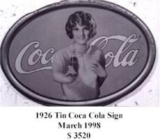
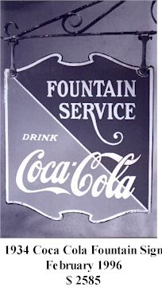

Title: Coca-Cola 120 ára, 1886-2006
Slug: coca-cola-120-ara-1886-2006
Date: 2006-03-23 08:08:00
Part: 2/3
UID: 47
Lang: is
Author: Jóhann Hjalti Þorsteinsson
Author URL: 
Category: Sagnfræði, Neyslusamfélagið
Tags: 

Vinsælasti gosdrykkur heims er án nokkurs vafa Coca-Cola, en í maí í ár verður frumgerð drykkjarins 120 ára. Þann 26. janúar 2006 hóf ég lítinn greinarflokk um þennan drykk. Í þessari grein mun ég tæpa á atburðum á fyrri hluta síðustu aldar sem leiddu til þess að Coca-Cola varð að því stórveldi sem það varð í Bandaríkjunum.

Maðurinn á bak við velgengni Coca-Cola hét Asa Chandler. Hann var lyfsali rétt eins og uppfinningarmaðurinn John Pemberton (sem fann upp Coca-Cola) en Chandler hafði ekki verið jafn laginn við að búa til nýjar efnablöndur. Það sem hann hafði hins vegar fram yfir Pemberton var viðskiptavit. Það ásamt nokkrum litlum breytingum á drykknum var upphafið að stærsta drykkjarvörufyrirtæki sem heimurinn hefur augum litið.

Asa Chandler lagði sig fram við að koma drykknum í sölu í öllum lyfjaverslunum í Atlanta og síðar um öll Suðurríkin. Samkeppnin var töluverð þar sem flestir lyfsalar framleiddu eigin gosdrykki. Til að skapa drykknum sérstöðu lagði Chandler áherslu á lyfjaeiginleika drykkjarins og hann stóð fast á því í sölumennsku sinni. Á upphafsárum Coca-Cola var innihaldsefnunum í kókalaufunum og kólahnetunum ákaft haldið á lofti.  Slagorð eins og „brain tonic“ og „nerve tonic“ voru notuð og því haldið fram að drykkurinn gæti sefað þandar taugar og slegið á höfuðverki. 

Það er til vitnis um viðskiptavit Chandlers að þegar ríkisstjórnin krafðist skatts á lyfsölu til að fjármagna spænsk-bandaríska stríðið árið 1898 þá snéri hann snarlega við blaðinu og lagði sig fram við að fá drykkinn skilgreindan sem matvæli. Þrátt fyrir þessa breytingu fór lítið fyrir nýjum aðferðum við sölu á drykknum. Í fyrri grein minni sagði ég frá því að Chandler hafði lagt upp með að selja drykkinn yfir búðarborðið í glösum eins og tíðkast hafði frá byrjun 19. aldar. Fyrirtæki Chandlers gekk út á að selja smásölum sírópið sem drykkurinn er blandaður úr. Sölumennskan var einföld, sambland af einföldum loforðum sem auðvelt var að halda, vilji til að gefa ókeypis sýnishorn og vilji til að starfa með hverjum þeim sem Chandler taldi geta sinnt viðskiptunum af heilindum.

Árið 1889 var salan 8.217 lítrar af sírópi en fimm árum síðar fór hún yfir 242.240 lítra, í öllum fylkjum og yfirráðasvæðum Bandaríkjanna. Þegar drykkurinn var blandaður var hlutfallið ein únsa á móti sex og hálfri af kolsýrðu vatni. 

Árið 1894 hófst ferli sem Chandler óraði tæpast fyrir. Um sumarið  hóf Joseph Biedenharn, umboðsmaður Chandlers í Vicksburg Mississippi, að tappa Coca-Cola á flöskur til að selja því fólki drykkinn sem ekki hafði færi á að sækja sölustandana. Biedenharn hafði ekki spurt um leyfi fyrir átöppun en þegar hann bar þessa aðferð undir Chandler hreyfði hann engum mótmælum. Fleiri komu til og hófu að tappa drykknum í flöskur í litlum mæli fyrir heimamarkaði. 

Það var síðan sumarið 1899 sem lögfræðingarnir Benjamin Franklin Thomas og Joseph Brown Whitehead gengu á fund Asa Chandlers og báðu um leyfi til að sjá um alla átöppun á Coca-Cola í Bandaríkjunum. Chandler tók dræmt í þetta í fyrstu þar sem hann taldi sig hafa nægar tekjur af því að selja sírópið til  hefðbundnu smásalanna, en þetta ár seldi hann 810.000 lítra af sírópi sem dugði í 85.000.000 skammta. Þá taldi hann að vélvæðing gæti skaðað vöruna og ímyndina. En lögfræðingarnir náðu að sannfæra Chandler um að þeir myndu ekki vinna skaða á Coca-Cola heldur bæta ímynd vörunnar. 

Chandler taldi víst að fyrirtæki þeirra félaga yrði dæmt til að fara á hausinn og er þess vegna talin hafa, í hálfkæringi, gefið þeim umboð til átöppunar í nánast öllu landinu, með fáeinum undantekningum. Af sömu ástæðu skrifaði hann undir sölusamning við Thomas og Whitehead þar sem hann skuldbatt sig til að selja þeim síróp á verðinu einn dollar á gallon (gallon er 3,785 lítrar). Chandler taldi fullvíst að greiðasemi við þessa menn myndi ekki skaða fyrirtæki hans, _The Coca-Cola Company_, þar sem að það væri engin hætta á að þetta uppátæki gæti borið sig. Auk þess var ákvæði í samningnum þess efnis að ef þeir gætu ekki staðið við dreifingarskilmála þá ógiltist samningurinn. Chandler hefur því líklegast talið að hann gæti ekki tapað á þessu framtaki þar sem hann þurfti ekki að leggja fram neinn höfuðstól.

Thomas og Whitehead ráku sig fljótt á þann gríðarlega múr sem byrjunarkostnaðurinn var.  Þeir voru að því komnir að fara á hausinn rétt eins og Chandler hafði reiknað með þegar þeir fengu þá hugmynd að selja áhugasömum kaupsýslumönnum sérleyfi til að tappa drykknum á flöskur og selja á sínum heimasvæðum. Árið 1905 höfðu þeir komið sér upp sérleyfishöfum um öll Bandaríkin að undanskildum þeim svæðum sem stóðu útaf upprunalega samningum.

Árið 1909 var salan á sírópinu komin upp í 3.486.626 gallon (13.196.879 lítra). Sex árum síðar var hægt að kaupa Coca-Cola í nánast öllum verslunum landsins og árið 1928 var sala Coca-Cola orðin meiri á flöskum en úr gosvélum. Chandler varð einn af ríkustu mönnum landsins en hann var ekki einn um að efnast á þessu fyrirkomulagi því sérleyfishafarnir urðu smátt og smátt forríkir líka. Kostnaður _The Coca-Cola Company_ í framleiðslu og dreifingu sírópsins var þó mun lægri en sérleyfishafanna, en að mati sérfræðinga var hann aðeins einn tuttugasti af þeim kostnaði sem sérleyfishafarnir þurftu að leggja út. Meðal sérleyfishafana myndaðist sérstakt bræðalag og vinátta en þeir komu oft og iðulega saman á vegum Coca-Cola fyrirtækisins til að læra nýjar aðferðir í meðhöndlun og sölu á gosdrykknum. Eða bara til skrafs, ráðagerða og veisluhalda. 

Þegar Chandler hætti hjá Coca-Cola fyrirtækinu árið 1915 til þess að verða borgarstjóri í Atlanta voru menn innan fyrirtækisins þegar farnir að tala um „rökvillu Chandlers“. Með því var átt við mistök hans við gerð samningsins við Thomas og Whitehead árið 1899. Mistökin voru fólgin í því að Coca-Cola fyrirtækið sem eigandi vörumerkisins og einkaleyfisins hafði hvorki full yfirráð yfir vörunni né yfir gróðanum af sölunni. Almennt var Chandler hælt fyrir að þessa miklu útþenslu Coca-Cola sem hafði verið án alls tilkostnaðar fyrir Coca-Cola fyrirtækið. En nú voru menn farnir að sjá eftir þeim fjármunum sem sérleyfishafarnir rökuðu saman af eljusemi. Gróði Coca-Cola fyrirtækisins var bundin við söluna á sírópinu eingöngu en sérleyfishafarnir tóku allan gróða af smásölunni eftir að hafa borgað hráefnis-, framleiðslu- og dreifingarkostnað.

----

_Í næstu grein mun ég fjalla um hvernig grunnurinn var lagður að heimsútbreiðslu Coca-Cola._

----

#### Heimildir

* Hays, Constance L.: _The Real Thing. Truth and Power at the Coca-Cola Company_. New York, 2004
* Pendergrast, Mark: _For God Country and Coca-Cola. The Unautorized History of the Great American Soft Drink and the Company that makes it_. London, 1993.

