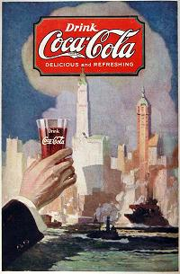
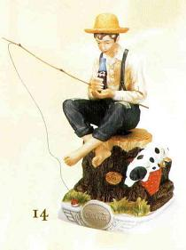
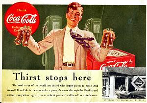

Title: Coca-Cola 120 ára, 1886-2006
Slug: coca-cola-120-ara-1886-2006
Date: 2006-03-28 08:00:00
Part: 3/3
UID: 58
Lang: is
Author: Jóhann Hjalti Þorsteinsson
Author URL: 
Category: Sagnfræði, Neyslusamfélagið
Tags: 

Árið 1915 voru sérleyfishafar Coca-Cola orðnir 1200 talsins. Samningurinn frá 1899 kom hins vegar í veg fyrir að fyrirtækið gæti stjórnað markaðsetningu á einstökum svæðum þrátt fyrir að það legði út fyrir auglýsingum. Þá hafði fyrirtækið engin tök á að grípa inn í ef sérleyfishafi var líklegur til þess að lúta í lægra haldi fyrir samkeppni, t.d. frá Pepsi-Cola. Eina leiðin til að fá sérleyfishafa til að láta leyfið af hendi var að kaupa það af honum.

Eina breytingin sem fyrirtækið náði á samningnum frá 1899 kom í kjölfar þess að Chandler fjölskyldan seldi hlut sinn í fyrirtækinu árið 1919 fyrir 25.000.000 dollara. Niðurstaða breytinganna var að nýir eigendur gátu árið 1921 hækkað verðið á sírópinu eftir því hvernig verð á sykri breyttist en þó aðeins með úrskurði alríkisdómara. Víst er að sambúð fyrirtækisins og sérleyfishafana var alls ekki friðsöm á þessum árum. Stjórnendur Coca-Cola fyrirtækisins tóku á þessum tíma þá ákvörðun að losa sig við sérleyfakerfið. Enn í dag eru yfirmenn fyrirtækisins að reyna að einfalda viðskiptaumhverfi sitt, en með takmörkuðum árangri.

Þegar Bandaríkin hófu þátttöku í seinni heimsstyrjöldinni hafði Coca Cola verið á boðstólum í u.þ.b. 50 ár. Gosdrykkurinn var sá vinsælasti í Bandaríkjunum og forsvarsmenn fyrirtækisins höfðu gert tilraunir til þess að dreifa honum víðar um heiminn. Það hafði hinsvegar gengið treglega fyrir utan Kanada, Þýskaland og Kúbu.

Strax eftir árásina á Pearl Harbour tók þáverandi forstjóri The _The Coca-Cola Company_, Robert Woodruff, þá ákvörðun að allir bandarískir hermenn, hvar sem þeir væru staðsettir, skildu eiga kost á því að kaupa Coca-Cola flöskur á sama verði og heima hjá sér, þ.e. 5 cent fyrir flösku. Fyrirtækið ætlaði að mæta kostnaðinum sjálft. Á sama tíma fengu bæði sérleyfishafar og fyrirtækið sjálft skýr skilaboð um að herinn vildi hafa drykkinn á boðstólum fyrir mannskapinn. Það var talið að fátt væri jafn gott fyrir baráttuþrek þeirra að geta fengið gosdrykkinn sem þeir voru vanir að fá. 

Coca-Cola fyrirtækinu tókst að koma sér í mjúkinn hjá hermálayfirvöldum. Það auðveldaði sölu á drykknum og tryggði nægt framboð af sykri til framleiðslunnar. Á meðan allir aðrir gosdrykkjaframleiðendur urðu að taka á sig sykurskerðingu vegna skömmtunar náði Coca-Cola að tryggja nægan sykur fyrir sig með undanþágu á þeirri forsendu að verið væri að framleiða gosdrykkinn fyrir hermenn. 

Í byrjun reyndi fyrirtækið að senda drykkinn átappaðann í flöskum til herstöðva utan landsins en umfangið varð strax það mikið að tiltækið sætti gagnrýni fyrir að taka frá mikilvægt pláss í flutningum þegar meiri þörf var á vopnum og hergögnum. Viðbrögð fyrirtækisins voru að þreifa fyrir sér með átöppunarverksmiðjur í nágrenni herstöðva og líka að bjóða upp á gosvélar á þeim stöðum sem átöppun var ekki fýsileg. 

Fyrsta átöppunarverksmiðjan fyrir hermenn utan Bandaríkjanna var reist í Reykjavík og hóf afgreiðslu á gosi um mánaðarmótin maí-júní 1942. Vélasamstæðan sem sett var upp í byrjun annaði 12.000 flöskum á dag. Mark Pendergrast höfundur bókarinnar _For God, Country and Coca-Cola_ taldi að drykkurinn hafi slegið svo rækilega í gegn á Íslandi að forsætisráðherrann hafi tekið þá ákvörðun að ráðstafa helmingi alls sykurinnflutnings landsins í framleiðsluna. Það hefur líkast til farið fram hjá Pendergrast að Björn Ólafsson  eigendi íslensku átöppunarverksmiðjunar sat í ríkisstjórn Íslands á þessum árum. Sú stjórn hlaut þess vegna viðurnefnið „Coca-Cola stjórnin“.

Átöppunarverksmiðjan á Íslandi var sú fyrsta af sextíu og fjórum sem fyrirtækið kom á fót í stríðinu. Þær voru á öllum byggðum meginlöndum jarðarinnar. Í flestum tilfellum var kostnaðurinn greiddur af ríkisstjórn Bandaríkjanna. Fyrirtækið fékk að gera út starfsmenn sína sem „tæknilega eftirlitsmenn“ innan hersins. Þeir fengu einkennisbúninga frá hernum en voru auðkenndir með „TO“ á búningunum. Hlutverk þeirra var að setja upp átöppunarverksmiðjunar nálægt víglínum og herstöðvum og sjá þannig til þess að hermenn hefðu nóg af Coca-Cola. 

Þó að bæði fyrirtækið og starfsmenn þess græddu ótæpilega á þessu framtaki þá varð enginn til þess að gagnrýna þá, allra síst hermennirnir sjálfur sem tóku fegins hendi við gosdrykknum hvar sem þeir gátu fengið hann. Yfirmenn hersins óttuðust ekki á þessum tíma að spilling gæti komið út úr þessu samstarfi hersins og iðnaðarins. Sögur fara af herforingjum og afstöðu þeirra til drykkjarins. Mac Arthur til dæmis áritaði fyrstu flöskuna sem úr nýrri átöppunarverksmiðju sem sett var upp eftir að Bandaríkjaher hafði rutt Japönum frá Manila. Eisenhower og Robert Woodruff urðu nánir vinir eftir stríðið. Engum duldist að á meðan að stríðinu stóð var drykkurinn nauðsynlegur til að halda uppi baráttuþreki hermanna. Samstarf fyrirtækisins við bandaríska herinn var á hinn bóginn á mörkum þess að geta talist eðlilegt. Nægir þar að nefna að í fjölmörgum átöppunarverksmiðjum naut Coca-Cola vinnukrafta þýskra og japanskra stríðsfanga. Eða að herflugmenn hafi lagt sig í óþarfa hættu með ofhlaðnar vélar  af ótta við að verða lækkaðir í tign ef þeir færu ekki eftir skipunum tæknilegu eftirlitsmannanna. 

Með eljusemi, og líka vegna jákvæðni í garð þess, tókst fyrirtækinu að samtvinna ímynd drykkjarins við bandaríska þjóðarsál á stríðsárunum. Til eru fjöldamörg dæmi um hermenn sem tilgreindu Coca-Cola sem helstu hvatninguna í stríðinu. Menn börðust fyrir frelsi til að geta keypt Coca-Cola.

Starf Coca-Cola fyrirtækisins í stríðinu var fyrirtækinu ómetanlegt eftir stríð þegar það hóf að vinna nýja markaði erlendis. En það var líka ómetanlegt vegna þess að búið var að koma 11.000.000 hermanna á bragðið. Mat manna var að á friðartímum hefði það tekið 25 ár að öðlast þá markaðsstöðu sem fyrirtækið náði í samstarfi við bandaríska herinn í síðari heimsstyrjöld. Sigurvegari stríðsins var Coca-Cola, heimurinn var tilbúinn fyrir Coke.

Í styrjöldinni hafði Coca-Cola náð fótfestu í Suður Ameríku en það var þó ekki fyrr en með The World Bank sem að fyrirtækið náði flugi í álfunni þar sem fyrirtækið nýtti sér starfsmenn bankans við rannsóknir og undirbúning markaðssóknar. Þetta var gert með vitund bankans og án mótmæla. Samtímis ávann Coca-Cola sér nýja ímynd í hugum Suður Ameríkumanna og Coke var nú ímynd ferskleika, gleði og bjartari framtíðar.

Í apríl 1945 komu saman í San Fransisco fulltrúar fimmtíu landa til að undirbúa stofnun Sameinuðu Þjóðanna. Coca-Cola fyrirtækið sendi kynningarmenn á staðinn til þess að koma sér í mjúkinn hjá höfðingjunum og höfðu þeir ótakmörkuð fjárráð til þess að slá um sig. 

Brátt varð mönnum innan fyrirtækisins ljóst að Coca-Cola stóð í hugum margra sem tákn fyrir stjórnmál vesturlanda. Á árunum eftir stríð hóf fyrirtækið viðskipti í fjölmörgum ríkjum og nýlendum Afríku og Asíu um leið og meiri hörku var beitt á fyrri mörkuðum í Suður Ameríku og í Evrópu. Um þá hörku, ofbeldi og hugtakið ,,Coca-Colanization“ og þá gagnrýni sem fyrirtækið hefur hlotið vegna þess mun ég fjalla um í næstu grein.

----

#### Heimildir

* Hays, Constance L.: _The Real Thing. Truth and Power at the Coca-Cola Company_. New York, 2004.

* Pendergrast, Mark: _For God Country and Coca-Cola. The Unautorized History of the Great American Soft Drink and the Company that makes it_. London, 1993.

* Heimasíða Vífillfells: http://www.vifilfell.is/Forsida/UmVifilfell/Sagafyrirtaekisins/ Skoðuð 26. mars 2006.

* Heimasíða Stjórnarráðsins: http://www.stjr.is/Rikisstjornartal/nr/3 Skoðuð 27. nóvember 2005. 

