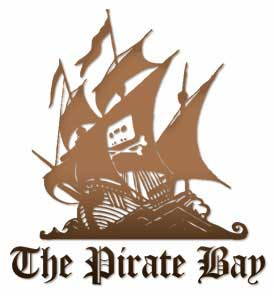
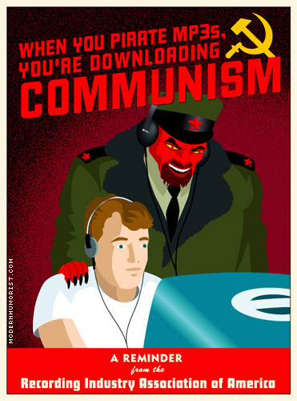

Title: Deilan um Bittorrent
Subtitle: Ævintýrið að líða undir lok?
Slug: deilan-um-bittorrent
Date: 2008-03-11 10:35:00
UID: 227
Lang: is
Author: Ragnar Björgvinsson
Author URL: 
Category: Vefurinn, Lögfræði
Tags: Jafninganet, peer to peer, torrent.is, bittorrent, Svavar Lúthersson, Istorrent ehf., höfundaréttur, einkaréttur, dvd

Á síðustu misserum hafa miklar umræður skapast um lögmæti svokallaðra jafningjaneta (e. Peer to peer). Komst sú umræða í hámæli er sýslumaðurinn í Hafnarfirði féllst á kröfu nokkurra rétthafasamtaka um lögbann á heimasíðuna torrent.is þann 19. nóvember síðastliðin. Var því haldið fram að þar færi fram ólögmæt dreifing á höfundaréttarrvörðu efni. Samhliða lögbanninu var höfðað staðfestingarmál á hendur Istorrent ehf. og Svavari Lútherssyni, sem var einn helsti stjórnandi síðunnar frá upphafi. Þeir aðilar sem að lögbanninu standa krefjast ekki einungis staðfestingar á lögbanninu, heldur gera þeir einnig kröfu um skaðabætur og að Svavari verði ekki heimilt að reka sambærilegar vefsíður og torrent.is.

Á heimasíðunni torrent.is gátu notendur nálgast bíómyndir, sjónvarpsþætti, forrit, tónlist og fleira í gegnum BitTorrent tæknina. Var efni síðunnar að meginstefnu til sett þar inn í óþökk höfundarétthafa.

Er þessi pistill er skrifaður stendur aðalmeðferð málsins ennþá yfir, en einungis hefur verið rætt um formhlið málsins, þar sem Istorrent ehf. og Svavar hafa krafist frávísunar málsins. Fróðlegt verður að sjá hvernig þessu máli mun ljúka og hvort horft verði til sambærilegra dómsmála sem fallið hafa í nágrannalöndum okkar. Undirritaður ætlar hér að varpa ljósi á þau álitaefni sem við koma höfundarétti og BitTorrent tækninni.

Kostir og vinsældir BitTorrent stafa af því að ekki er gerð krafa um stóra og kraftmikla netþjóna eða mikla netflutningsgetu til að hægt sé að dreifa stórum skrám milli aðila. Til að deila skrá með öðrum þarf deilandinn að útbúa sérstakt skjal sem nefnist straumur (e. Torrent). Skjalið inniheldur upplýsingar um skránna sem á að deila og hvaða þjón (e. Tracker) deilandinn er tengdur við. Skjalinu er oftast upphalað á vefsíðu, sem býr sjálfkrafa til krækju á skjalið svo aðrir geti nálgast það. Þeir sem vilja sækja efnið sem er verið að deila þurfa þá að niðurhala straums skjalinu, sbr. að ofan, og opna það með sérstöku BitTorrent forriti (sem dæmi má nefna uTorrent). Forritið tengist þá þjóninum sem gerir lista yfir þá aðila sem eru að deila skránni.

Tæknin byggir á því að hver skrá sem á að deila með öðrum er skipt niður í smærri einingar. Hver notandi sem hleður niður skránni, deilir jafnóðum til annarra niðurhalara þeim einingum sem hann hefur þegar sótt. Álagið er því ekki einungis á þeim aðila sem upphaflega deildi skránni heldur jafnast hún yfir alla þá sem eru að niðurhala skránni. Sá sem hefur skránna í heild sinni nefnist deilandi (e. Seeder, bein þýðing yrði sáðmaður) og sá sem er að niðurhala skránni nefnist sækjandi (e. Leecher, bein þýðing er blóðsuga).

Á Íslandi eru í gildi höfundalög nr. 73 frá árinu 1972. Í 1. gr. laganna kemur fram að höfundar eigi eignarétt á verkum sínum. Rétturinn felst annars vegar í fjárhagslegum réttindum, þ.e. einkarétti höfundar til að gera eintök af verki sínu og birta það, sbr. 3. gr. laganna, og hins vegar sæmdarrétti höfundar, sbr. 4. gr. laganna, þ.e. réttur höfundar til að verða nafngreindur og að verki hans verði ekki breytt.

Einkaréttur höfunda til að gera eintök af verki sínu er skilgreindur í 1. mgr. 2. gr. laganna. Þar segir, „það er eintakagerð, þegar hugverk (bókmenntaverk eða listaverk) er tengt hlutum, einum eða fleiri“. Ekki er gert að skilyrði að formið sé eins og því telst það eintakagerð þegar tónlist er yfirfærð frá geisladiski yfir í tölvu, eða þegar DVD kvikmynd er afrituð (e. ripped) yfir í tölvu.

Staðfest hefur verið fyrir erlendum dómstólum að niðurhal á skrám sé eintakagerð.

Íslensku höfundalögin veita ekki aðeins höfundum réttindi, heldur koma einnig fram í II. kafla laganna þær takmarkanir sem eru á rétti höfunda. Samkvæmt 1. mgr. 11. gr. laganna er einstaklingum heimilt að gera eintök til einkanota. Sé efni niðurhalað, án þess að það sé gert öðrum aðgengilegt, telst það eintakagerð til einkanota, og því ekki brot á höfundalögum. Í dönsku höfundarlögunum er kveðið á um að sé efni sett á netið með ólögmætum hætti sé einnig ólögmætt að niðurhala því. Ekkert slíkt ákvæði er að finna í íslenskum höfundarlögum og því ólíklegt að sakborningar sem eingöngu væru sakaðir um niðurhal á ólögmætu efni yrðu sakfelldir.

Sé skrám niðurhalað án heimildar rétthafa, og um leið deilt til annarra notenda, telst sá sem halar niður skránni ekki einungis vera að brjóta einkarétt höfundar til eintakagerðar, heldur einnig einkarétt höfundar til opinberrar birtingar, en bæði réttindin njóta verndar 3. gr. höfundalaga. Eintakagerð notendans fellur ekki undir undanþágu 1. mgr. 11. gr. höfundarlaga þar sem ekki er um eintakagerð til einkanota að ræða.

Með BitTorrent tækninni fara skráarskiptin beint á milli deilenda og sækjanda en ekki gegnum þriðja aðila eins og miðstýrða tölvu. BitTorrent tæknin byggir hins vegar á því að um leið og einstaklingur sækir skrá er hann að deila henni með öðrum og gerist því brotlegur við höfundarlög sbr. að ofan. Þó eru alltaf undantekningar, en hægt er í einstökum BitTorrent forritum að stilla þau þannig að skránni verði ekki deilt með öðrum.

Ólíklegt er að rétthafasamtök eða ákæruvaldið hafi afskipti af einstökum notendum jafningjaneta. Líklegra er að þeir gjói augnum til þeirra sem eiga og stjórna vefsíðunum þar sem krækjur eru á straumskjalið (e. torrent) eða þar sem þjóninn (e. tracker) er staðsettur. Líklegt er að forráðamenn vefsíðna sem þessara verði dæmdir fyrir hlutdeildarábyrgð í brotum almennra notenda. Skilyrði eins og torrent.is hafði um ákveðið hlutfall sem notendur þyrftu að uppfylla til að halda aðgangi sínum má túlka sem hvatningu til brota, sem er eitt af skilyrðum fyrir hlutdeildarábyrgð. Einnig hafa forráðamenn vefsíðna og þjóna möguleika á að koma í veg fyrir höfundarréttarbrot sem eiga sér stað fyrir tilstuðlan þeirra. Erlendis hefur verið litið svo á að almennar yfirlýsingar forráðamanna vefsíðnanna um að þeir taki ekki ábyrgð á brotum notenda jafningjanetanna skipti engu og fríi þá engri ábyrgð.

Má því spyrja sig hvort allt torrent ævintýrið sé liðið undir lok?

