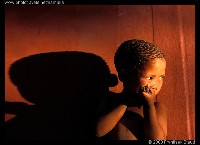

Title: Efnishyggja í eyðimörkinni
Slug: efnishyggja-i-eydimoerkinni
Date: 2006-02-02 12:27:00
UID: 41
Lang: is
Author: Helga Tryggvadóttir
Author URL: 
Category: Mannfræði, Samfélag
Tags: 

Í íslensku þjóðfélagi er mikið lagt upp úr því að vinna mikið og þéna mikið. Fólk leggur metnað sinn í að eiga nóg til að eiga fyrir brýnustu nauðsynjum og mikilvægustu ónauðsynjum. Við erum orðin svo föst í þeim vítahring að þurfa sífellt að eiga stærri og betri tæki að við sjáum ekki að þau sem við eigum fyrir eru kannski bara alveg ágæt. Lífsgæðakapphlaupið keppir að marki sem enginn sér lengur, líkt og eitt tæki í viðbót létti okkur loksins lífið, án þess að við sjáum að afborganirnar gera það að verkum að við verðum að leggja á okkur fleiri yfirvinnutíma. Við álítum okkur samt sem áður heppin, við höfum þó allt sem við þurfum og til þess að öðlast meira þurfum við bara að vinna meira og skapa fleiri störf. Þegar við hugsum um aðra menningarheima er það oftast með því hugarfari að meðlimir þeirra hafi það ekki eins gott og við og því sé þeim vorkunn. Því deilum við með þeim þekkingu okkar af einskæru örlæti til þess að lífskjör þeirra geti batnað. En færri spyrja hvað við getum lært af þeim.

San er etnískur hópur sem lifir sem veiðimenn og safnarar í Kalahari eyðimörkinni[1]. Margir þeirra hafa nú tekið upp fasta búsetu en upphaflega fluttu þeir sig um set eftir því hvar vatn og veiðidýr var að finna. Þeir eiga það sameiginlegt að búa í litlum hópum sem samanstanda af nokkrum kjarnafjölskyldum þar sem einstaklingur eða lítil fjölskylda gæti ekki haft nóg í sig og á með veiðimennsku og fæðusöfnun. Í hefðbundnu samfélagi San er ekkert yfirvald og enginn maður er álitinn öðrum æðri. Þar ríkir töluvert mikið jafnrétti, hvort sem um er að ræða milli kynja, pólitískrar eða félagslegrar stöðu fólks eða skiptingar eigna. Í hirðingjalífi eru eignir til trafala en það breytist við fasta búsetu. Í hefðbundnu samfélagi San leggur fólk mikla áherslu á að bráð sé skipt jafnt á milli alls hópsins og einnig á gjafaskipti. Báðir þessir þættir efla og styrkja félagsleg tengsl auk þess að minnka hættuna á átökum milli fólks með því að koma í veg fyrir að auður safnist á fárra hendur. Einn af þeim þáttum sem einkenna samfélag San er sú áhersla sem þau leggja á lítillæti. Reyni einhver að hreykja sér af hæfileikum sínum sem veiðimaður er gert lítið úr honum með kaldhæðni og hnyttnum athugasemdum. 

Mannfræðingurinn Richard Lee komst að því á eigin skinni hvernig Ju/’hoansi[^2] fólk tekur á hroka og sjálfsánægju. Hann vildi sýna þeim þakklæti sitt eftir að hafa búið með þeim í nokkur ár með því að gefa þeim vænan uxa. Fólkið komst brátt að því hvaða uxa hann hafði fest kaup á og fór að gera lítið úr honum. Á hverjum degi heyrði hann frá mismunandi fólki að uxinn sem hann hafði keypt væri ólseigur, grindhoraður, ekkert nema beinin, yrði aldrei nóg í máltíð handa öllum og þar fram eftir götunum. Þegar kom að því að borða beinahrúguna fékk hann einn úr hópnum, /gaugo, til að slátra dýrinu og skera fyrsta skurðinn sem leiðir í ljós hversu feitt dýrið er. Þegar það var gert kom það í ljós sem hann hafði alltaf haldið; skepnan var spikfeit. Furðu lostinn spurði hann /gaugo hvers vegna allir hefðu haldið því fram að dýrið væri horað, uxinn væri í raun akfeitur. „Feitur?“ svaraði /gaugo. „Kallarðu þetta fitu? Þetta skar er horað, veikt, dautt!“ Og við það sprungu allir í búðunum úr hlátri. 

Þegar Lee fór að spyrjast fyrir um hvers vegna allir hefðu gert lítið úr uxanum hans kom það í ljós að þetta var hefð hjá San. Þeir gerðu alltaf lítið úr bráð veiðimanna. Algengt var að hinir mennirnir í hópnum ávíttu veiðimanninn fyrir að hafa dregið þá með sér til að bera bráðina heim. Gjarnan sögðu þeir bráðina ekki nothæfa til annars en að vera skilin eftir fyrir hýenurnar. Í raun meintu þeir þó ekkert af þessu heldur voru hæstánægðir með að fá kjöt í matinn. Þetta var þeirra leið til þess að koma í veg fyrir hroka hjá veiðimanninum og varast það að hann færi að líta á sig sem öðrum æðri. Þegar Lee komst að þessu uppgötvaði hann að hann hafi gerst sekur um mikið af hlutum sem ekki eru viðurkenndir hjá San. Það var til dæmis að deila ekki með sér mat sem hann gerði ekki til að trufla ekki rannsókn sína á matarvenjum og fæðuöflun þeirra. Hann sá þeim einnig fyrir tóbaki og lyfjum og skammtaði þeim eins og honum hentaði. Allt var þetta í samfélagi þar sem það er sjálfsagt mál að fólk deili öllu með sér án þess að fá sérstakar þakkir fyrir. Í rauninni fékk hann þá ráðningu sem hann átti skilið þegar fólkið gerði lítið úr honum[3].  

En öll samfélög taka breytingum og samfélag San er þar ekki undanskilið. Þar hafa átt sér stað róttækar breytingar á undanförnum árum með aukinni fastri búsetu, launaðri vinnu, eignasöfnun og ýmsum þáttum sem því fylgja. Áður höfðu San kannski ekki mikið að bíta og brenna, en þá sáu þeir að minnsta kosti um sig sjálfir. Þeir voru meistarar eyðimerkurinnar, búnir að aðlaga sig svo lífi á þessum harðbýla stað að þeir höfðu lifað þar af í þúsundir ára þrátt fyrir skort á vatni og veiðidýrum. Nú er svo komið að einungis örfáir San lifa líkt og forfeður þeirra. Ríkisstjórnir bæði Namibíu og Botswana hafa hvatt þá með ýmsu leyti til að taka upp fasta búsetu og landbúnað eða stunda launaða vinnu. Sumir taka þessu fegins hendi og eru ánægðir með að þurfa ekki lengur að treysta á veiðar, sem voru aldrei áreiðanlegar. Aðrir eru hins vegar ekki sáttir við þessar breytingar og álíta að þeir séu neyddir til þess að breyta um lífshætti. Með aukinni fastri búsetu hefur atvinnuleysi aukist og um leið áfengissýki. Eignasöfnun hefur einnig aukist, bæði vegna þess að þar sem San hafa tekið upp fasta búsetu hafa þeir nú orðið möguleika á því, og einnig vegna þess að nú stunda margir launaða vinnu. Með eignum eykst ójöfnuður milli fólks. Einnig eykst munur á milli kynjanna þar sem konurnar eyða meiri tíma heima en karlarnir stunda vinnu utan heimilanna. Þar með fá þeir launin og konurnar verða háðari þeim en áður. Áherslan á að deila öllu með sér minnkar að sama skapi. Með breyttu mataræði og aukinni áfengis- og tóbaksneyslu hefur tíðni ýmissa sjúkdóma aukist. Áður fyrr höfðu San afar lágt kólesteról og blóðþrýsting. Nú hafa báðir þessir þættir hækkað. Einnig hefur tíðni hjartasjúkdóma aukist en þeir voru nánast óþekktir áður. 

Hvort breytingarnar séu óumflýjanlegar eða ekki skal ósagt látið. Það er ekki víst að möguleiki hafi verið fyrir San að lifa við óbreyttar aðstæður í breyttum heimi. Hafa þeir hins vegar glatað einhverju dýrmætu í leiðinni? Tekst þeim enn að halda í húmorinn og kaldhæðnina sem skín jafnvel í gegn um þurra fræðitexta? Búa þeir enn yfir þeirri visku sem margra þúsund ára veran í eyðimörkinni hefur veitt þeim? Að minnsta kosti hefur það farið svo að í stað þess að við hlustum á þau og lærum af þeim höfum við troðið upp á þau okkar þekkingu. Spurningin er hvort að það sé barnalegt að vilja halda í fortíðina vegna ótta við breytingar. Kannski vilja San breyta samfélagi sínu og öðlast meira af vestrænum lífsgæðum. Eftir að hafa kynnst þeim er ekki aftur snúið. En hvort þau voru hamingjusamari áður en þau voru „fundin“ af vestrænum mönnum veit enginn nema þau sjálf.

[^1]: Þeir tilheyra þremur ríkjum, Namibíu, Botswana og Suður-Afríku.

[^2]: Ju/’hoansi er einn af ættflokkunum sem tilheyrir San.

[^3]: Lee, Richard, 2003. The Dobe Ju/’hoansi. London: Wadsworth.

ss1. Kent, Susan. 1995. ,,Does sedentarization promote gender inequality? A case study from the Kalahari". _Journal of the Royal Anthropological Institute_. 1(3). 513-534.  
ss2. Lee, Richard B. 2003. _The Dobe Ju/’hoansi_. (3.útgáfa). London: Wadsworth. 
ss3. Draper, Patricia. 1975. ,,!Kung women: Contrasts in Sexual Egalitarianism in Foraging and Sedentary Contexts". Í: _Reiter: Toward an Anthropology of Women_. New York og London: Monthly Review Press.

