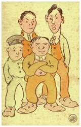

Title: „Ég ferðaðist ekki 5000 mílur til Bandaríkjanna til að á ávarpa jafningja mína sem „háttvirta“ eitthvað“
Slug: eg-ferdadist-ekki-5000-milur-til-bandarikjanna
Date: 2005-12-06 10:23:00
UID: 25
Lang: is
Author: Íris Ellenberger
Author URL: 
Category: Teiknimyndir, Bókmenntir
Tags: 

Varla þarf lengur að kynna Íslendinga fyrir hugtakinu _manga_. Japanskar teiknimyndasögur hafa rutt sér til rúms hér á landi sem og um heim allan þótt þær þyki um margt frábrugðnar vestrænum teiknimyndasögum. Gjarnan er minnst á risastór augu persónanna sem minna helst á lýsingar af hundunum þremur í _Eldfærum_ H.C. Andersen. Þennan stíl má rekja til guðföður manga-myndasafna, Osamu Tezuka, sem varð öllum eftirkomendum hans fyrirmynd frá og með 6. áratug síðustu aldar með myndasögum eins og _Astro Boy_, _Pheonix_ og _Buddah_. Á meðan Vesturlandabúar álíta teiknimyndasögur barnaefni eru þær lesnar af öllum aldurshópum í Japan og eru eitt vinsælasta bókmenntaformið þar í landi. Þrátt fyrir að hefðir í Japan og á Vesturlöndum séu um margt ólíkar þá litu japanskir teiknimyndahöfundar við upphaf 20. aldarinnar mjög til Bandaríkjanna hvað varðar form og stíl teiknimyndasagna. Til að mynda var allstórt samfélag japanskra innflytjenda í San Francisco um aldamótin 1900; þar skráði og teiknaði ungur listnemi sögu nokkurra slíkra nýbúa á fyrsta fjórðungi 20. aldarinnar.

Árið 1990 vann Frederik L. Schodt, einn helsti sérfræðingur Vesturlanda í manga, að rannsóknum á bókasafni Kaliforníuháskóla. Þar rakst hann á látlausa bók sem reyndist vera teiknimyndasaga í 52 þáttum. Henry Kiyama nokkur var titlaður höfundur verksins. Hann fæddist sem Yoshitaka Kiyama árið 1885, var sonur kráareigenda í litlu þorpi og tilheyrði því eins konar millistétt. Árið 1904, aðeins 19 ára að aldri, gerði Kiyama sér lítið fyrir og flutti til San Francisco til að stunda myndlistarnám.

Teiknimyndasagan sem Schodt uppgötvaði fyrir tilviljun heitir _The Four Immigrants Manga_. Hún rekur sögu fjögurra japanskra innflytjenda, Henry, Charlie, Fred og Frank, í San Francisco á árunum 1904-1924. Allir komu þeir til Bandaríkjanna með ólík markmið. Einn til að læra myndlist, annar til að gerast hrísgrjónabóndi, sá þriðji til að kynna sér vestrænt lýðræði og sá fjórði til að auðgast á innflutningi á japönskum vörum. Fjórmenningar teiknimyndasögunnar sækja fyrirmyndir sínar til Kiyama sjálfs og þriggja vina hans frá Bandaríkjadvölinni. Sögurnar 52 rekja atburði sem fjórmenningarnir eða aðrir kunningjar Kiyama urðu vitni að og því er bókin sjálfsævisöguleg að hluta. 

Vinirnir fjórir fluttu til San Francisco á mjög viðkvæmum tíma í samskiptum Bandaríkjanna og Japan. Japanir voru í stríði við Rússa og urðu fyrsta austræna ríkið til að nútímavæðast og sanna sig sem herveldi. Þar að auki kepptu Japanir við Bandaríkjamenn um völd á Kyrrahafseyjunum. Það er því varla að undra að Henry, Charlie, Fred og Frank þyrftu að glíma við fjandsamleg viðhorf í þeirra garð sem náði hámarki með alls kyns lagasetningum sem beint var gegn japönskum innflytjendum. 

Í _The Four Immigrants Manga_ kynnumst við því hvernig ungir Japanir reyna að fóta sig í samfélagi sem er þeim fjandsamlegt og mjög ólíkt því sem þeir eiga að venjast í heimalandinu. Námsmennirnir ganga í kvöldskóla þannig að flestir byrja þeir á að vinna hlutastörf í búðum og á heimilum. Vanþekking þeirra á venjum og verklagi verður gjarnan til þess að þeim verður fótaskortur og þeir fá reisupassann. Þeir eiga erfitt með að sætta sig við þjónustustörf því þeim finnst þeir vera þjónar jafningja sinna eða jafnvel undirsáta. Eins og Charlie segir: „I didn't travel 5000 miles to America to address my equals as „honorable“ anything“ (bls. 79). Ekki var nema von að þeir beittu öllum brögðum til að auðgast og losna undan þeirri samfélagsstöðu sem þeim er áskipuð. Charlie er sífellt á höttunum eftir skjótfengnum gróða og dregur Frank greyið með sér í hverja framkvæmdina á fætur annarri sem verða oftar en ekki til þess að sá síðarnefndi missir allt sparifé sitt. 

Bandaríska teiknimyndasagan um aldamótin 1900 einkennist af kynþáttahyggju. Kynstofnar, aðrir en hinn hvíti, voru teiknaðir á mjög staðlaðan hátt. Blökkumenn voru sýndir hálfrangeygðir með ofurþykkar varir og Asíubúar með skásett augu og framstæðar tennur. Teiknimyndasöguhöfundar um allan heim tóku þó bandaríska teiknimyndasöguformið sér til fyrirmyndar og var Henry Kiyama engin undantekning. Hann var forminu trúr og minnir stíll hans helst á teiknimyndasögurnar um Gissur Gullrass. En náttúrlega víkur Kiyama frá vestrænni hefð að einu leyti, landar hans eru hvorki skáeygðir né með skögultennur heldur teiknaðir á sama hátt og Vesturlandabúar.

Teiknimyndasagan _The Four Immigrants Manga_ er því ef til vill fyrst og fremst vitnisburður um sjálfsmynd japanskra innflytjenda í vestrænu samfélagi. Það tekur á taugarnar þegar þeim er ruglað saman við Kínverja enda eru fjórmenningarnir fullir stolts af yfirburðum japanska keisaraveldisins og eigin sérstöðu meðal Asíubúa. En þótt þeir séu fórnarlömb fordóma kemur það ekki í veg fyrir gífurlega fordóma þeirra sjálfra í garð annarra útlendinga eða kynþátta, sér í lagi Kínverja og blökkumanna sem Kiyama teiknar í stíl við hefðbundnar vestrænar staðalmyndir. Henry og Charlie labba innan um Vesturlandabúa á sýningunni _The Panama Pacific International Exposition_ og skoða framandi þjóðir sem þar er stillt upp án þess að athuga að japanskar þjónustustúlkur eru þar til sýnis á nákvæmlega sama hátt og austurlenskar magadansmeyjar.

_The Four Immigrants Manga_ var skrifuð af Japana fyrir japanska innflytjendur í Bandaríkjunum. Sagan var loks gefin út í San Francisco árið 1931. Í þeirri útgáfu var textinn bæði á ensku og japönsku. Samtöl Japananna voru skrifuð á móðurmáli þeirra á meðan samskipti við innfædda voru skrifuð á ensku. Í endurútgáfu Schodt frá 1999 hefur japönskunni verið snúið yfir á ensku og reynt að fanga stíl tímabilsins með því að nota vinsæla leturgerð frá aldamótunum 1900. Hins vegar standa enskir textar Kiyama nær óbreyttir sem gerir það að verkum að Japanarnir tala lýtalaust mál á meðan Bandaríkjamenn tala mjög bjagaða ensku sem gefur verkinu skoplegt yfirbragð. Önnur vandamál fylgja því að þýða teiknimyndasögu, skrifaða á japönsku fyrir Japani (í innflytjendasamfélagi í Bandaríkjunum), yfir á ensku fyrir vestræna lesendur tæpri öld síðar. Kiyama fylgdi vestrænni hefð og lét söguþráðinn flæða frá vinstri til hægri, en ekki öfugt eins og tíðkast í Japan. Honum var það þó ekki mjög tamt og ruglaðist gjarnan svo að spegla þurfti rammana til að Vesturlandabúar gætu fylgt söguþræðinum í endurútgáfunni. Stundum var þess þó ekki kostur svo að hætt er við að vestrænir lesendur missi þráðinn. Ekki bætir úr skák að húmorinn er mjög staðbundinn og stundum erfitt að greina kímnina í atriðum sem augljóslega eiga að vera bráðfyndin. Aftanmálsgreinar megna ekki einu sinni að brúa bilið.

_The Four Immigrants Manga_ er því undarlegur blendingur, ekki aðeins teiknimyndasögustíla og -hefða, heldur einnig menningarheima. Brandarar skrifaðir fyrir japanska innflytjendur í San Francisco á fyrsta fjórðungi síðustu aldar missa gjarnan marks þegar þeir eru lesnir af Íslendingi við árslok 2005. Þrátt fyrir það er sagan óvænt innsýn inn í gleymdan heim. Hvernig ber afskræmdur maður sig að þegar hann vill ná sér í konu, „picture bride“, að heiman? Hvernig upplifa innflytjendurnir jarðskjálftann mikla, bannárin, fyrri heimsstyrjöldina eða spænsku veikina? Hvernig gengur hrísgrjónarækt í Kaliforníu? Hvernig líst japönskum innflytjendum á landa sína frá Hawaii? Þeim sem vilja víkka sjóndeildarhringinn í ólíklegustu áttir er því bent þá þennan undarlega blending, _The Four Immigrants Manga_.

