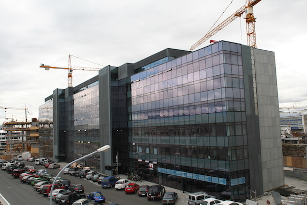

Title: Ég hef mjög löggiltan smekk!
Slug: eg-hef-mjog-loggiltan-smekk
Date: 2009-01-15 10:16:15
UID: 971
Lang: is
Author: Bragi Bergsson
Author URL: 
Category: Arkitektúr, Í umræðunni, Listir
Tags: Hjörleifur Stefánsson, Listaháskóli, Laugavegur, timburhús, miðborgin, Reykjavík, fagleg, umræða, samkeppni, fagurfræði, hutföll, mælikvarði, gagnrýni

Á haustmánuðum 2008 kom út bókin Andi Reykjavíkur eftir Hjörleif Stefánsson. Bókin hefur verið sögð þarft innlegg í umræðu sem hefur stigmagnast á síðustu mánuðum og árum, nú síðast í umræðunni um fyrirhugaða nýbyggingu Listaháskóla Íslands við Laugaveg og í uppkaupum borgarstjórnar á húsunum við Laugaveg 4 og 6.[^1]

Vissulega var umræðan um hús fyrir listaskóla og gömul timburhús í miðborginni mjög fyrirferðamikil síðstu misseri fyrir _„hrun“_ en hvað hefur sú umræðan skilið eftir sig? Var hún hugsanlega einungis bitbein misvísra borgarfulltrúa? eða verður hún til þess að efla faglega umræðu um byggingar- og skipulagsmál í landinu? en skortur virðist vera á  faglegri umræðu um byggingarlist í landinu.

_„Fjöldi þátttakenda, niðurstaðan og raunar keppnin öll er í raun mikill sigur fyrir íslenska arkitekta og íslenska byggingarlist; hér verður hægt að sjá að Íslendingar eru fullfærir um að hanna frábæra byggingu sem mætir með einstökum hætti þörfum þeirrar öflugu stofnunar sem Listaháskóli Íslands er og skapa honum umgjörð til að eflast enn frekar í framtíðinni til heilla fyrir íslenska menningu og þjóðlíf“_ [^2] sagði Þorgerður Katrín Gunnarsdóttir við opnun sýningarinnar sem sett var upp í kjölfar samkeppninnar um hús Listaháskólans við Laugaveg sumarið 2008. Orð Þorgerðar eru háleit og virðast eiga að styrkja íslenska þjóðarstoltið sem er einhvern vegin alltaf með minnimáttakennd.

Leiknir og lærðir tjáðu sig um vinningstillöguna í samkeppninni og snérist hún í flestum tilvikum um hvort húsið væri fallegt eða ljótt og hvort það félli að byggðinni sem fyrir var. Þáverandi borgarstjóri hafi auk þess afdráttarlausar og neikvæðar skoðanir á tillögunni og segja má að í kjölfarið hafi meirihluti borgarstjórnar fallið í þriðja sinn á kjörtímabilinu. Ef einhver fagleg umræða hefur átt sér stað um bygginguna þá hvarf hún algerlega í almennu umræðuna sem og þá pólitísku.

En þó að fagleg umræða á opinberum vettvangi um vinningstillöguna hafi verið lítil þá ætti að vera hægt að nálgast slíka umræðu með því að skoða samkeppnislýsinguna því þar kemur fram hverju skuli náð fram með samkeppninni og einnig að lesa umsögn dómnefndar um vinningstillöguna.

Í samkeppnislýsingunni segir meðal annars að viðhalda eigi sögulegu umhverfi og sérkennum Laugavegarins og að varðveisla á byggingararfinum eigi að haldast í hendur við eflingu byggingarlistar í samtímanum. Ennfremur er svo sagt að nýbyggingar í miðbænum beri að hanna af næmni og tillitssemi við umhverfið þannig að ný byggð beri ekki ofurliði þann fínlega mælikvarða sem fyrir er. Einnig áttu þáttakendur í samkeppninni að skoða möguleika á því að leyfa upprunalegri götumynd að halda sér.[^3] 

Dómnefndin átti í vali sínu m.a. að meta hvernig nýjar byggingar yrður aðlagaðar að umhverfinu og borgarmynd. Hvernig tillit var tekið til mælikvarða og sögulegra einkenna byggðar í þessum hluta miðbæjarins og „fagurfræði hvað varðar form, hlutföll og aðlögun að umhverfi.“[^4] 

Í umsögn dómnefndar um vinningstillöguna segir m.a.:

> _„Mjög sterk tillaga sem byggir á einfaldri hugmynd sem felst í því að raða kubbalaga einingum umhverfis glæsilegt miðrými sem er baðað dagsljósi. Grunnformið er nýtt á frumlegan hátt til að fella heildaryfirbragð byggingarinnar að nálægri byggð. Með sínu nútímalega útliti og fínlegu útfærslu upphefur byggingin söguleg einkenni borgarhverfisins. Tilvísanir til íslensks menningararfs auka á dýpt tillögunnar án þess að því sé ofgert á nokkurn hátt. Almennt endurspeglar tillagan næmni í útfærslu og frágangi. ... Húsið opnar sig vel að Laugaveginum og þannig getur samspil götulífs og starfsemi skólans orðið lifandi og virkt.“_[^5]

Að öðru leyti fjallar dómnefndin ekki um útlit byggingarinnar. Aftur á móti er mikið fjallað um innir gerð byggingarinnar og virðist hún hafa heppnast mjög vel að því leyti, enda var m.a. lagt upp með að gott flæði væri um bygginguna á milli þeirra listgreina sem kenndar eru í skólanum.  

Innihald umsagnarinnar um útlit byggingarinnar virðist því heldur rýrt, sé litið til þeirra háleitu markmiða sem ná átti fram með samkeppninni. Umsögnin er orðuð mjög almennt og ekki er lagt upp með að greina bygginguna né útskýra nákvæmlega með faglegum rökum hversvegna hún var valin í fyrsta sæti. Hér er því ekki að finna faglega umræðu um byggingarlist heldur almenna og varfærna umsögn um tillögu sem var sennilega sú skásta sem tók þátt í samkeppninni.  

Svo virðist því sem fagleg og upplýst umræða um byggingarlist og skipulagsmál sé skammt á veg komin hér á landi. Fyrir hinn almenna borgara er byggingin augljóslega of stór og umfangsmikil á þessum stað og ekki í neinum takti við umhverfi sitt. En aftur á móti þá skortir hinn almenna borgara ákveðna grunnþekkingu á byggingarlist til þess að geta tjáð sig um bygginguna og dæmt hana sem vel eða illa heppnað listaverk. Það þarf því að fræða almenning um byggingalist og skipulagsmál. En hver á að gera það og afhverju hefur það ekki verið gert?

Strax í grunnskóla ætti að byrja á því að ræða um þessi málefni, t.d. sem hluti af sögukennslu og myndlistarkennslu. Stutt er einnig síðan byggingarlistadeild tók til starfa í Listaháskóla Íslands og er ljóst að fræðileg umræða um byggingarlist eykst með hverju árinu innan veggja skólans. Ekki er þó hægt að skella skuldinni eingögnu á mennamálaráðherra, varðandi skort á faglegri og fræðilegri umræði, því að hér á landi hefur verið starfrækt í nokkra áratugi Arkitektafélag Íslands. Í lögum þess kemur meðal annars fram að það eigi að að stuðla að góðri byggingarlist í landinu, efla samvinnu félagsmanna og standa vörð um hagsmuni þeirra.[^6]

Félagið er því fyrst og fremst hagsmunafélag en á þó að sutðla að góðri byggingarlist í landinu. En þar sem arkitektar eru þeir einu sem hafa rétt á því að teikna og hanna byggingar mætti ætla að þeir væru leiðandi í umræðu um byggingarlist og skipulagsmál. Þeir eru jú þeir einu sem hafa löggildingu ráðherra til þess að teikna byggingar og skipulagsuppdrætti og má því segja að arkitektar hafi löggiltan smekk.

Arkitektafélag Íslands kemur að útgáfu tveggja rita _Arkitíðindi_ annarsvegar, sem er nokkurskonar málgagn félagsins og hinsvegar _AT Tímarit Arkitekta_.  Í þessum ritum ætti að vera að finna faglega og upplýsta umræðu um byggingarlist á Íslandi og fróðleik sem upplýsir almenning um byggingarlist.

Arkitíðindi eru aðgengileg ókeypis á netinu. Þar er að finna upplýsingar um ýmsar uppákomur á vegum félagsins, enda um að ræða málgagn félagssins sem kemur yfirleitt út mánaðarlega og kemst fyrir á einu A4 blaði. Í blaðinu koma fram upplýsingar um ýmsar samkeppnir sem á að halda og úrslit úr þeim sem er lokið. Þar er einnig að finna pistil sem oft er skrifaður af formanni félagsins og hefur núverandi formaður Sigríður Magnúsdóttir, reynt á síðustu mánuðum að hvetja til þess að fagleg umræða verði aukin. Hér er þó ekki að finna faglega umræðu um byggingarlist á Íslandi.

AT tímarit arkitekta, er hinsvegar ekki aðgengilegt á netinu og kostar blaðið um 1000 kr í lausasölu þrátt fyrir að það sé yfirfullt af auglýsingum og nær eingöngu um innsendar greinar að ræða. Blaðið kemur út tvisvar á ári og telur yfir 100 síður. Þar er að finna umfjallanir um margar byggingar og niðurstöður samkeppna ásamt dómnefndaráliti.[^7] Hér ætti að vera aðalvettvangur faglegrar umræðu arkitekta en svo er því miður ekki.

Dómnefndarálitin eru jafn almenn í umfjöllun sinni og það um listaháskólan sem minnst var á hér á undan. Svo virðist vera að dómarar í þessum samkeppnum komi sér hjá því að útskýra nákvæmlega hvað sé gott við viðkomandi samkeppnistillögu og koma aldrei með athugasemdir um það sem heppnaðist illa og hvað hefði mátt vinna betur með. Umfjallanir um byggingar í blaðinu eru yfirleitt skrifaðar af þeim sem hönnuðu byggingarnar eða eru útdrættir úr lýsingu þeirri sem skrifuð var með byggingunni.[^8] Í blaðinu er því lítið um falgega umræðu heldur umfjöllun um verk þar sem hönnuði gefst kostur á að ræða um eigið ágæti.        

Árið 2000 var gefið út af Arkitektafélagi Íslands ritið; _Leiðsögn um íslenska byggingarlist_. Ritið er einkar gott og aðgengilegt upplýsingarrit þar sem fjalað er um margar af frægustu byggingum landsins auk þess sem stiklað er á stóru í byggðarsögu Reykjavíkur. Í bókinni er að finna góðar ljósmyndir og farið er gróflega yfir sögu hverrar byggingar, hver hannaði hana og hver byggði. Allur ágóði af sölu bókarinnar átti að renna í sjóð sem hafði það hlutverk að vekja áhuga almennings á íslenskri byggingarlist og mikilvægi góðrar hönnunar. Í bókinni er ekki að finna faglega gagnrýni á byggingarnar heldur er eingöngu um að ræða almenna umræðu og hefðbundið sögulegt samþykki almennings á því að ákveðin byggingin sé falleg. Bókin er gott upplýsingarit um íslenska byggingarlist en spurt er í hvað fór ágóði af sölu bókarinnar?

Bók Hjörleifs Stefánssonar Andi Reykjavíkur, er sennilega ekki einungis innlegg í faglega umræðu um byggingarlist og skipulagsmál landsins, heldur er hún sennilega eina innleggið sem kemst næst því að ræða faglega og fræðilega um þetta svið. Þó vantar talsvert uppá að um fræðilegt rit sé að ræða, enda er það ekki ætlun Hjörleifs með skrifum sínum..

Í bókinni veltir Hjörleifur fyrir sér ýmsum hugtökum svo sem eins og Andi staðar, mikilvægi staðar, áhrif og ábyrgð byggingarlistar og hvað sé falleg bygging. Hjörleifur leggur hvergi dóm á eða gagnrýnir verk samtíma manna sinna, fyrir utan rómantíska lýsingu á skála Alþingis og húsi Hæstaréttar, en getur þó gagnrýnt skipulagsyfirvöld borgarinnar harkalega fyrir mistök í skipulagningu og uppbyggingu borgarinnar. Ólíkt Hjörleifi reynir höfundur þessarar greinar að koma við kjarnan í arkitektum, með borubröttum yfirlýsingum og fullyrðingum, en hvetur um leið til umræðna um byggingarlist sem verður vonandi fagleg og fræðileg. 

Fagleg og fræðileg umræða þarf að fara fram um áhrif skipulagsyfirvalda á verk arkitekta í dag og áhrif stjórnmálamanna á skipulag og byggingarlist í landinu. Einnig þyrfti að rannsaka hver áhrif kaupandans eða byggingarverktakans eru á vinnubrögð arkitekts. Eru það hugsanlega byggingaverktakar sem stuðla að byggingarlist í landinu?

Arkitektar teljast til listamanna en þrátt fyrir það virðast þeir vera hafnir yfir gagnrýni á verk sín. Gagnrýnin og uppbyggileg fagleg umræða fyrirfinnst ekki í þeim skýjaborgum sem íslenskir arkitektar hafa byggt sér. Hvorki meðal þeirra sjálfra né frá almenningi í landinu, sem á þó mestra hagsmuna að gæta, þar sem almenningur er sá sem býr í listaverkum arkitektanna og notar þau.

Í öllum öðrum listgreinum starfa gagnrýnendur sem mæla út og dæma ákveðin listaverk, hvort sem um er að ræða, tónlist, myndlist, dans- eða leiklist. Skáldsögur rithöfunda eru ræddar og fræðimenn í hinu akademíska umhverfi takast á um efnistök og niðurstöður annara fræðimanna og ritrýna verk þeirra og nota til þess fagleg og gagnrýnin rök. Því spyr maður sig, hversvegna er þetta ekki gert meðal íslenskra arkitekta?

[^1]: Hjörleifur Stefánsson. _Andi Reykjavíkur. Genius Reykiavicensis. _Reykjavík 2008.__

[^2]: http://mbl.is/mm/frettir/innlent/2008/07/17/arkitektar_hlutskarpastir/

[^3]: http://nybygging.lhi.is/samkeppni-um-byggingu/keppnislysing/

[^4]: http://nybygging.lhi.is/samkeppni-um-byggingu/keppnislysing/

[^5]: http://nybygging.lhi.is/files/2008/09/umsogn-71.pdf

[^6]: http://www.ai.is/um-felagid

[^7]: http://www.ai.is/utgefid-efni/arkitidindi

[^8]: _AT tímarit arkitekta_. 2.tbl. nóvember 2007.

