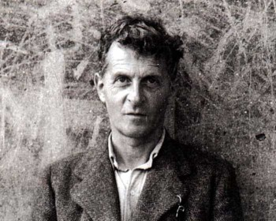

Title: Einkamálsrök Wittgensteins
Slug: einkamalsrok-wittgensteins
Date: 2008-05-27 13:40:01
UID: 307
Lang: is
Author: Flóki Ásgeirsson
Author URL: 
Category: Heimspeki
Tags: Wittgenstein, Philosophical Investigations, P. F. Strawson, Saul Kripke, P. M. S. Hacker, David Stern, einkamálsrök, efahyggja um tungumál

Eitt af höfuðverkum heimspeki 20. aldarinnar er _Philosophical Investigations_ eftir austurríska heimspekinginn Ludwig Wittgenstein.[^1] Þó heimspekingar séu flestir sammála um mikilvægi þess er lítið samkomulag um eðli þeirra röksemdafærslna sem verkið inniheldur, og má nærri heita að túlkanir á þeim séu jafnmargar og túlkendurnir. Frægasta dæmið um slíka röksemdafærslu eru ef til vill hin svokölluðu einkamálsrök, sem hafa verið skýrð á ýmsa vegu. Þó samkomulag ríki um að með einkamálsrökunum sýni Wittgenstein fram á það að tungumál hljóti að vera opinbert í einhverjum skilningi er lítið samkomulag um það hvernig hann fari að því að komast að þessari niðurstöðu eða hvað hún þýði. Hér verður fjallað stuttlega um þær deilur sem staðið hafa um túlkun einkamálsrakanna og spurt hver geti verið skýringin á því hversu illa heimspekingum hefur gengið að koma sér saman um túlkun á heimspeki Wittgensteins.

Ein túlkun á einkamálsrökum Wittgensteins var sett fram í frægum ritdómi P. F. Strawsons um _Philosophical Investigations_.[^2] Samkvæmt túlkun Strawsons sýnir Wittgenstein fram á að tungumálið geti aðeins fjallað um hluti sem hægt er að skynja á einn eða annan hátt. Tungumál sem vísar til þess sem er hulið er, samkvæmt röksemdafærslu Wittgensteins eins og Strawson túlkar hana, útilokað. Reyndar átelur Strawson Wittgenstein fyrir það að draga af þessari (réttmætu) niðurstöðu sinni þá óleyfilegu ályktun að tungumálið geti af þessum sökum ekki vísað beint til fyrirbæra sálarlífsins, enda séu þau hulin öllum nema þeim sem upplifir þau. Hið rétta, segir Strawson, er að orð yfir slík fyrirbæri hljóti að lokum að vísa líka til þess sem er opinbert. Eitt stef í röksemdafærslu Wittgensteins, í túlkun Strawsons, er að í þeim tilvikum þar sem ógjörningur sé að gera greinarmun á réttri og rangri notkun orða sé ekki hægt að tala um tungumál. Að sögn Strawsons þýðir þetta að ekki sé hægt að tala um tungumál sem aðeins einn maður talar, vegna þess að í því tilviki væri engin leið að greina rétta orðanotkun frá orðanotkun sem aðeins sýndist vera rétt, enda væri ekkert sem hægt væri að bera dóma mannsins saman við.

Önnur túlkun á einkamálsrökum Wittgensteins er túlkun Saul Kripke, en hún er mjög frábrugðin túlkun Strawsons.[^3] Að sögn Kripkes eru einkamálsrökin lausn Wittgensteins á heimspekilegu vandamáli sem hann uppgötvar, eða svar hans við nýrri tegund af efahyggju. Sú efahyggja sem Wittgenstein uppgötvar, að sögn Kripkes, er efahyggja um merkingu, en samkvæmt henni ríkir efi um það hvort orð okkar hafi þá merkingu sem við teljum þau hafa. Einkamálsrökin, telur Kripke, eru tilraun Wittgensteins til að svara þeim efasemdum um merkingu sem hann setur sjálfur fram. Lausn Wittgensteins á þeim vanda sem hann finnur sjálfur varðandi merkingu er, að sögn Kripkes, að höfða til samfélagsins. Það sem ræður því hvaða merkingu orð okkar hafa er, samkvæmt einkamálsrökunum eins og Kripke túlkar þau, samfélag tungumálsnotendanna. Dómar þess eru sá grundvöllur sem merking hvílir á. Af þessum rökum leiðir meðal annars, segir Kripke, að tungumál sem aðeins einn maður tali sé útilokað, enda sé í því tilviki ekkert samfélag sem dæmt geti um það hvaða merkingu tungumálið hafi. En þessi niðurstaða, telur Kripke, er í raun aukaatriði. Röksemdafærsla Wittgensteins, í augum Kripke, gengur ekki út á það að sýna að einkamál sé útilokað, heldur hitt að aðeins í krafti þess að vera á valdi fleiri en eins er tungumál yfir höfuð mögulegt.

Enn önnur túlkun á einkamálsrökum Wittgensteins er túlkun P. M. S. Hackers.[^4] Samkvæmt túlkun Hackers er skotmark röksemdafærslunnar ekki hugmyndin um mál sem aðeins einn maður talar, heldur ákveðnar kenningar um eðli sálarinnar og tungumálsins sem Hacker rekur til Descartes og Locke. Samkvæmt þessum kenningum, telur Hacker, eru orð yfir fyrirbæri sálarlífsins nöfn á sálrænum fyrirbærum á samskonar hátt og orð yfir fyrirbæri umheimsins eru nöfn á þeim. Hacker telur að einkamálsrök Wittgensteins sýni fram á að þessar kenningar séu rangar. Eitt mikilvægasta stefið í röksemdafærslu Wittgensteins, eins og Hacker túlkar hana, er að ekki sé hægt að skilgreina orð yfir sálræn fyrirbæri með ábendingarskilgreiningu á sama hátt og hægt sé að skilgreina orð yfir áþreifanlega hluti. Að sögn Hacker ser hægt að skilgreina orð með því að benda öðrum á þann hlut sem orðið á við um og segja þeim hvað hann heiti. En þetta, telur Hacker, á ekki við um sálræn fyrirbæri; orð yfir þau er ekki hægt að skilgreina á þennan hátt. Þannig er ekki hægt, að sögn Hackers, að skilgreina orðið 'sársauki', til dæmis, með því að benda á sársauka og segja að þetta heiti 'sársauki'. Af þessu leiðir, að sögn Hackers, að ógjörningur er að koma sér upp máli þar sem orð eru nöfn á sálrænum fyrirbærum. Ástæða þess að Wittgenstein sýnir fram á að slíkt mál sé útilokað er að sögn Hackers sú að þær kenningar um eðli sálarinnar og tungumálsins sem ráðið hafi ríkjum í heimspeki geri ráð fyrir að slíkt mál sé mögulegt. Það sem einkamálsrökin sýna, telur Hacker, er að þessar kenningar eru rangar.

Hér hafa verið nefndar þrjár túlkanir á einkamálsrökum Wittgensteins. Eins og sjá má eru þær allólíkar, enda ber þeim hvorki saman um hver sé niðurstaða Wittgensteins né hvernig hann fari að því að komast að henni. Eitt sem þær þrjár túlkanir sem hér hafa verið nefndar eiga þó sameiginlegt er að í þeim öllum er gert ráð fyrir því að röksemdafærsla Wittgensteins sé af ákveðinni tegund. Það sem Strawson, Kripke og Hacker virðast allir gera ráð fyrir er að Wittgenstein setji fram röksemdafærslu þar sem færð séu hefðbundin rök fyrir ákveðinni fullyrðingu. Að þetta sé það sem Wittgenstein geri kann í fyrstu að virðast svo sjálfsagt að fáránlegt þyki að draga það í efa. En ef við athugum að ekki hefur allur texti það markmið að setja fram röksemdafærslur sjáum við að þessi forsenda er kannski ekki jafnsjálfsögð og hún virðist í fyrstu. Ef við athugum enn fremur að texti Wittgensteins er, að formi til, allfrábrugðinn hefðbundnum heimspekilegum texta, sem og þá staðreynd að lítið samkomulag ríkir um það hver röksemdafærslan sem gert er ráð fyrir að textinn geymi sé, fara ef til vill að renna á okkur tvær grímur. Gæti ástæða þess hve lítið samkomulag ríkir um það hver röksemdafærsla Wittgensteins sé verið sú að Wittgenstein setji einfaldlega ekki fram neina röksemdafærslu af því tagi sem heimspekingar hafa gert ráð fyrir?

Þá mætti ef til vill spyrja hvað það sé sem texti Wittgenstein hafi að geyma, ef ekki röksemdafærslur af því tagi sem við eigum að venjast. Ein tilgáta er sú að markmið Wittgensteins í _Philosophical Investigations_ sé ekki að setja fram eða hrekja heimspekilegar kenningar, heldur það að afhjúpa mótsagnir í þeim hugmyndum sem búa að baki slíkum kenningum. Af þessum sökum setji hann ekki fram hefðbundnar röksemdafærslur, enda henti þær ekki til þess verks sem hann leitast við að vinna.

David Stern[^5] túlkar Wittgenstein á þessa leið og telur að marga af þeim erfiðleikum sem heimspekingar hafa rekið sig á við túlkun á texta Wittgensteins megi rekja til þess að þeir geri sér ekki grein fyrir því hvað Wittgenstein ætlist fyrir með texta sínum. Sá sem gerir ráð fyrir því að Wittgenstein ætli sér að setja fram eða hrekja heimspekilegar kenningar leitar vitanlega að rökstuðningi sem hæfir slíku verki, en eins og Stern bendir á er ýmislegt í texta Wittgensteins sem varpar efa á þá hugmynd að þetta sé ætlun hans. Sú mynd sem Stern dregur upp af _Philosophical Investigations_ er af samræðu þar sem hugmyndir séu settar fram og ræddar, og leitast við að leiða í ljós þær mótsagnir sem taldar eru búa í þeim. Aðferð Wittgensteins, samkvæmt þessari túlkun, er ekki sú að setja fram rök sem sýna að ákveðin hugmynd sé röng, heldur að, með ábendingum og dæmum, vekja athygli okkar á því að hugmyndir sem í fyrstu kunna að virðast skýrar og greinilegar geta reynst mótsagnakenndar við nánari skoðun. Samkvæmt túlkun Stern setur Wittgenstein til dæmis ekki fram neina röksemdafærslu sem sýnir að einkamál sé útilokað, heldur sýnir hann okkur með dæmum þau vandræði sem við rötum í þegar við reynum loks að ímynda okkur slíkt tungumál. Einkamálsrök Wittgensteins eru samkvæmt þessari túlkun ekki röksemdafærsla sem sýnir fram á ákveðna niðurstöðu, heldur einfaldlega áskorun Wittgensteins til okkar að við reynum að ímynda okkur ákveðnar aðstæður (mál þar sem einn maður talar um sálarlíf sitt, til dæmis) og veitum því athygli hvaða vandræði eða mótsagnir við getum komið auga á þegar við þiggjum þetta boð. Frá sjónarhóli þessarar túlkunar er engin furða að heimspekingum hafi gengið illa að koma sér saman um hver röksemdafærsla Wittgensteins sé, enda er samkvæmt henni enga slíka röksemdafærslu að finna í texta hans.

[^1]: Wittgenstein, L. 2001. _Philosophical Investigations_ (3. útg.). Oxford: Blackwell.
[^2]: Strawson, P. F. 1954. _Critical notice. Mind_, 63 (249), 70–99.
[^3]: Kripke, S. 1982. _Wittgenstein on rules and private language_. Oxford: Blackwell.
[^4]: Hacker, P. M. S. 1990. _Wittgenstein: Meaning and mind, vol. 3 of an analytical commentary on the Philosophical Investigations_. Oxford: Blackwell.
[^5]: Stern, D. G. 2007. "The uses of Wittgenstein's beetle: Philosophical investigations §293 and its interpreters." Í G. Kahane, E. Kanterian, & O. Kuusela (Ritstj.), _Wittgenstein and his interpreters: Essays in memory of Gordon Baker_. Oxford: Blackwell.
