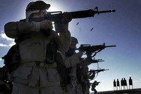

Title: Einkavæðing átaka
Slug: einkavaeding-ataka
Date: 2006-05-25 08:12:00
UID: 75
Lang: is
Author: Elín Ösp Gísladóttir
Author URL: 
Category: Stjórnmálafræði
Tags: 

Með auknum alþjóðlegum samskiptum og fleiri þátttakendum í markaðshagkerfi hafa kaupendur og fyrirtæki enn meiri áhrif á stöðu ríkja en áður fyrr. Sérstaklega veikra ríkja þar sem efnahagur er bágur, lögmæti ríkisins lítið og algengara er að vopnuð átök eigi sér stað. Veik ríki geta ekki séð þegnum sínum fyrir almennri þjónustu, svo sem heilsugæslu, menntun og atvinnu. Þau eru, andstætt skoðunum margra, ekki undantekning á ríkjakerfinu heldur liður í heimsskipulagi dagsins í dag. 

Veikburða ríki eru ekki til í tómarúmi heldur draga til sín ákveðna utanaðkomandi pólitíska og hagræna áhrifavalda. Til dæmis hafa alþjóðaviðskipti með náttúruauðlindir við spilltar ríkisstjórnir eða uppreisnahópa á átakasvæðum, áhrif á framgang stríðs. Kaupendur hafa því áhrif á framgang átaka og eru stór aðili í því að gera átök möguleg með því að viðhalda fjármagnsstreymi til ákveðinna hópa. Alþjóðleg viðskipi með afurðir náttúruauðlinda og einkavæðing á sviði herþjónustu eiga þátt í að veikja enn frekar veikburða ríki í stað þess að styrkja þau til að geta sinnt skyldum sínum gagnvart þegnunum.

Í bók sinni _Understanding Conflict Resolution_ segir fræðimaðurinn Wallensteen óhjákvæmilegt að rannsaka stöðu ríkisins þegar kemur að greiningu átaka, sérstaklega þegar hugmyndin um ríkið sem eina lögmæta notanda ofbeldis er skoðuð. Lögmæti ríkisins  á ofbeldi, innheimta skatta og veik staða ríkis, eru samverkandi. Til að innheimta skatta verður ríki að hafa réttmæt lög og áreiðanlega lögreglu. Til þess að hafa réttmæt lög og áreiðanlega lögreglu þarf svo aftur skattpening[^1]. Þegar svo er komið leita ríki í frekari mæli til einkafyrirtækja sem geta veitt þeim þá þjónustu sem þau þarfnast. Hagkerfi veikra ríkja verða því gjarnan háð erlendum aðilum til að fjármagna stríðsrekstur og meira verður um ólögleg viðskipti. Þetta verður að vítahring þar sem ofbeldi viðheldur efnahagskerfinu[^2]. 

Mikilvægt er að átta sig á fylgni á milli lögmætingu á notkun ofbeldis og lögmæts hagkerfis annars vegar og hins vegar því að ólöglegu ofbeldi fylgir ólöglegt hagkerfi og er stríðshagkerfi með viðskipti með afurðir náttúruauðlinda dæmi um það. Þar sem ólögmætu hagkerfi fylgir ofbeldi er einnig hægt að líta svo á að einkavæðing herþjónustu sé af sama meiði. Vegna þess að illa gengur að varðveita lögmæti ríkisins í augum þegnanna og erfitt er að byggja upp her er þeim mun meiri markaður fyrir fyrirtæki sem bjóða út hernaðarþjónustu. 

Einkafyrirtæki á sviði herþjónustu sem stunda viðskipti við veikar ríkisstjórnir eru frekar til þess fallin að viðhalda átökum og veikri stöðu ríkisins heldur en að byggja ríkið upp. Ef skattheimta gengur illa eru aðrar leiðir notaðar, svo sem eins og ólöglegur útflutningur og rán. Þetta er vítahringur ofbeldis. Það er engin skattheimta ef enginn er herinn eða lögreglan og öfugt. Fræðimaðurinn Peter Singer bendir á að með einkavæðingu herþjónustu hafa hópar aðrir en stjórnarher, t.d andspyrnuherir, aukinn aðgang að hergögnum og hernaðarþjónustu og að einkavæðing herþjónustu grafi þannig undan einokun ríkis á beitingu vopnavalds frekar en að ýta undir það. Fleiri hópar innan ríkis geta öðlast völd þegar aðilar utan ríkis annast framboð og eftirspurn. Það leiðir af sér aukna óvissu og óstöðugleika sem getur leitt til upplausnar innan ríkis. Hernaðarfyrirtæki eru til dæmis þekkt fyrir að skipta við hópa sem vinna að upplausn ríkisins eins og eiturlyfja baróna eða hryðuverkamenn[^3]. Einkavæðing á herþjónustu stuðlar því að upplausn ríkja vegna viðskipta sinna við ríkisvald og uppreisnarhópa innan sama ríkis.

Möguleikar til að stunda viðskipti með vopn og kaup á herþjónustu fara eftir fjármagni. Átök stjórnast ekki einungis af misrétti, heldur líka af möguleikum til fjármögnunar. Þetta er í stuttu máli innihald hinnar svokölluðu rányrkjukenningar. Hún felur í sér að hópar séu líklegri til að gera uppreisn ef fjármagn er fyrir hendi. Eins aukast líkur á átökum ef ríki eiga allt sitt undir hráefnisútflutningi. Sú áhersla tengist alþjóðamarkaði og hagnaði sterkari ríkja á þeim viðskiptum. Náttúruauðlindir eru hlutlausar því bæði er hægt að nota þær til góðs og ills. Aðgangur að þeim er mikilvæg björg og hefur framboð og eftirspurn á alþjóðamarkaði, og hvort aðgangur að alþjóðamarkaði er opinn, mikið um það að segja. Þessi atriði kalla á að skoða verði sambandið á milli auðlindanýtingar og stríðsátaka annars vegar, og innlendra gerenda og erlendra fyrirtækja sem koma að alþjóðaviðskiptum með náttúruauðlindir hins vegar[^4]. Nýting náttúruauðlinda er háð aðgangi að alþjóðamarkaði, löglegum eða ólöglegum, og alþjóðlegum fyrirtækjum sem tilbúin eru að eiga skipti við uppreisnarsveitir eða spilltar ríkisstjórnir. Alþjóðaviðskipti hafa á þennan hátt áhrif á stríð og frið, og þar með viðgang eða sundurliðun ríkisvaldsins.

Ekki telja allir að viðskipti með náttúruauðlindir hafi slæm áhrif á átök. Ný-umbótasinnar (neo-liberals) halda því fram að alþjóðaviðskipti stuðli að friði þar sem opnun hagkerfa veikra ríkja á frjálsum markaði stuðli að velgengni þeirra, þau verði betur í stakk búin til að sinna þörfum þegna sinna. En tilgátan um að alþjóðaviðskipti hafi áhrif á stríð og frið, er háð þeirri vöru eða hráefni sem um ræðir. Ef verslað er með vöru sem er háð afmörkuðum mörkuðum er líklegra að það hafi friðsamlegri áhrif en hráefni sem á greiðan aðgang alls staðar, eins og olía eða demantar. Áhrif hnattvæðingar og alþjóðaviðskipta á þróunarlönd eru því önnur en fyrir iðnríki. Iðnríkin eiga hagsmuna að gæta í þróunarlöndum einkum vegna beinna fjárfestinga í hráefnisiðnaði. Viðskipti hafa því ekki í öllum tilvikum friðsamleg áhrif eins og ný-umbótasinnar halda fram. 

Iðnríki og aðrir viðskiptavinir ríkja í hráefnisútflutningi hafa meiri tækifæri til þess að draga úr misrétti þar sem þau geta sett framleiðendum skilyrði fyrir vinnslu í samvinnu við alþjóðastofnanir. Það er mikilvægt að koma stjórnendum fyrirtækja í skilning um tengsl þeirra við átakasvæði og að setja sér siðareglur. Ekki er nóg að fyrirtækjum sé í sjálfsvald sett að fylgjast með því að farið sé eftir þeim reglum, heldur þurfi að koma á alþjóðlegum viðskiptasiðareglum þar sem alþjóðleg stofnun sér um eftirlit. Einnig þarf að ýta undir að bókhald fyrirtækja sé gagnsætt og að fyrirtæki geti ekki ákveðið sjálf hvort þau fari eftir lágmarksreglum ILO. Amnesty International vinnur að því að alþjóðlegum siðareglum verði komið á og að eftirlit verði haft með virðingu þeirra[^5].

Sambandið á milli stöðu veikra ríkja og stöðu sterkra ríkja er oft slitið úr samhengi. Það er ekki lengur hægt að segja að veik ríki skipti ekki máli og að þau lagist sjálfkrafa á endanum. Ekkert ríki er til í tómarúmi og líta þarf á samskipti ríkja með hráefnisframleiðslu og iðnríkja sem mótandi hvort á annað. Alþjóðaviðskipti með náttúruauðlindir við spilltar ríkisstjórnir eða uppreisnahópa á átakasvæðum hafa áhrif á framgang stríðs þar sem fjármögnun til stríðsreksturs er viðhaldið. Það getur leitt til upplausnar ríkis, rétt eins og einkavæðing herþjónustu grefur undan einokun ríkisvalds á beitingu vopnavalds, sem er ein forsenda sterkra ríkja. 

Fyrirtæki sem versla með náttúruauðlindir geta tekið þá afstöðu að setja þvingandi reglur á viðskiptin og draga þannig úr misrétti sem er hugsanleg ástæða átaka. Nýting náttúruauðlinda getur verið til góðs eða ills, svo og alþjóðaviðskipti með afurðir þeirra. Taka þarf til endurskoðunar kenningar ný-umbótasinna um að viðskipti hafi ávallt góð áhrif og líta að þau í víðara samhengi með siðferðislegar spurningar í huga, og líta til einkavæðingar herþjónustu í því sambandi. Samskipti veikra ríkja við alþjóðasamfélagið stuðlar því ekki alltaf að friði líkt og ný-umbótasinnar halda fram.

[^1]: Wallensteen, Peter. 2002. _Understanding Conflict Resolution: War, Peace and The Global System_. SAGE Publications: London.
[^2]: Kaldor, Mary. [Ártal vantar]. _Beyond Militarism, Arms Races and Arms Control_.
[^3]: Singer, Peter Warren. 2003. _Corporate Warriors: The Rise of The Privatized Military Industry_. Cornell University Press: Ithaca og London.
[^4]: Collier, Paul og Anke Hoeffler. 2001. "Greed and Grievance in Civil War." Í Chester A. Crocker (Ritstj.), Fen Osler Hampson og Pamela Aall, _Turbulent Peace: The Challenges of Managing International Conflict_. United States Institute of Peace Press: Washington, D.C.
[^4]: Jóhanna Eyjólfsdóttir. Mars 2006. Fyrirlestur í tíma í námskeiðinu Nútímastríð: átakagreining og lausnir. Háskóli Íslands.

