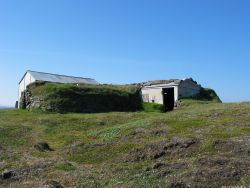
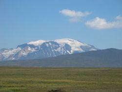
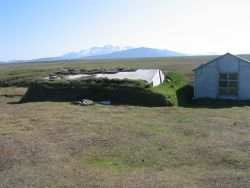

Title: Einsleit mótmæli
Slug: einsleit-motmaeli
Date: 2006-11-09 13:38:00
UID: 109
Lang: is
Author: Þóra Pétursdóttir
Author URL: 
Category: Fornleifafræði, Í umræðunni
Tags: 

Nú hafa verið (og eru enn) unnin mikil og dýrkeypt spjöll á stórum landsvæðum norðan Vatnajökuls. Tappinn hefur nýverið verið settur í stærsta uppistöðulón landsins og þar sem áður voru fjöll og dalir, urðir og ásar, mýrar og fláir skríður nú mórautt jökulvatn yfir landið og svelgir það sem fyrir verður.

Stíflun Jökulsár á Dal hefur frá upphafi verið mótmælt þótt deila megi um hversu kröftug þau mótmæli hafi verið á stundum. Í grein hér á Hugsandi þann 27. september síðastliðinn velti Helga Tryggvadóttir vöngum yfir því hvernig á því standi að fjölmennustu mótmæli í sögu stíflunnar voru haldin aðeins tveimur dögum áður en hleypa átti vatni á lónið. Þá fylktu 11-15 þúsund manns liði í miðbæ Reykjavíkur til að sýna andstöðu sína. Var það ekki full seint í rassinn gripið? 

Helga spyr í grein sinni hvort vera megi að ástæðan hafi verið sú að mótmælendur hafi áður skort leiðtoga til að sameinast um, enda hafi sú skoðun heyrst á meðal virkjunarandstæðinga að ákveðinn hópur mótmælenda gengi of langt í sínum aðgerðum. Það hafi svo e.t.v. orðið til þess að kljúfa fylkinguna og „fæla hinn almenna virkjunarandstæðing frá því að mótmæla“. Mér finnst margt áhugavert koma fram í grein Helgu og held að hún hafi nokkuð til síns máls. Raunin er líklega sú að mótmælin voru frá upphafi klofin, jafnvel margklofin. Tilfinningar manna og ímyndir um það land sem um ræðir eru t.a.m. afar ólíkar og getur það valdið því að einhverjir finni sig ekki í mótmælaaðferðum og -áherslum annarra.

Á undanförnum árum hef ég notið þess láns að fá að kynnast nokkuð þessu brátt hverfandi svæði í gegnum fornleifaskráningar og rannsóknir sem þar hafa farið fram í tengslum við framkvæmdirnar. Sumarið 2000 fór fram fornleifaskráning vegna umhverfismats á áhrifasvæði Kárahnjúkavirkjunar[^1] þar sem skráðar höfðu verið um 4000 minjar á svæðinu, frá öræfum til sjávar. Fæstar þeirra voru þó skilgreindar „í hættu“ vegna framkvæmdanna og aðeins fimm áttu samkvæmt skýrslunni að lenda undir vatnsborði Hálslóns og Kelduárlóns. Veturinn 2005 tók ég þátt í frekari skráningu minja á svæðinu.[^2] Hugmyndin var að safna saman tiltækum heimildum um þá minjastaði sem áttu að hverfa eða verða fyrir alvarlegum áhrifum af virkjanaframkvæmdum og varpa þannig ljósi á sögu og hlutverk þessara minja. Upplýsinga var aflað í fyrirliggjandi heimildum, s.s. örnefnaskrám, sýslu- og sóknarlýsingum, héraðsritum, ferðabókum og ferðalýsingum, hreppaskjölum og víðar. Þar að auki var aflað munnlegra heimilda meðal kunnugra manna á svæðinu og bar hvort tveggja góðan árangur. Þekktum minjum fjölgaði ört og þegar upp var staðið voru komnar upplýsingar um þrettán minjastaði á lónsstæðunum auk leiða sem legið höfðu um framkvæmdasvæðin. Þar við bættust svo tóftir þær sem Páll Pálsson bóndi í Hrafnkelsdal fann á leið sinni um svæðið, og ýmist hafa verið kallaðar Reykjasel eða Pálstóftir.

Það eru einkum tvö hálendissvæði sem verða fyrir áhrifum af framkvæmdunum, annars vegar _Vesturöræfi_ austan Jökulsár á Brú, sem er afrétt Fljótsdælinga, og hins vegar _Brúardalir_ vestan árinnar, sem er innsti hluti afréttarlands Jökuldælinga. Allar þekktar minjar eru á þessum tveimur svæðum, en einn gangnamannakofi er auk þess á lónsstæði Kelduárlóns á _Múlaafrétt_ Fljótsdælinga. Sökum þess hvers eðlis svæðið er, þ.e. afréttarland, eru þekktar minjar nokkuð einsleitar. Um er að ræða gangnamannakofa og samgönguminjar ýmiskonar, vörður, vöð, leiðir og kláfferjur, en einnig hugsanlegt sel eða bústað. Aldur þessara minja er í fæstum tilvikum áreiðanlega þekktur. Í þremur tilvikum er aðeins um að ræða heimildir um minjar sem ekki hafa fundist við frekari leit á vettvangi. Ef ekki hefði legið svo á að ljúka framkvæmdum við stífluna hefði eflaust mátt finna einhverjar þessara minja sem heimildir fundust fyrir. Þeirra þarf hins vegar ekki að leita frekar úr því sem komið er.

Það sem mér hefur fundist einkenna verulega þau mótmæli sem látið hafa hæst (eða hafa hlotið mestan hljómgrunn og athygli fjölmiðla) í tengslum við framkvæmdirnar er hin rómantíska og jafnvel þjóðernislega áhersla á svæðið sem „ósnortna náttúruperlu“. Oft á tíðum hafði maður á tilfinningunni að verið væri að ræða um tunglið, eða einhvern álíka stað þar sem enginn hefði áður stigið niður fæti. Stað þar sem heiðagæsir og hreindýr hefðu unað við sitt í fullkominni harmóníu við náttúruöflin — í friði fyrir menningunni. Á hinum síðustu og verstu tímum streymdi fólk svo hvaðanæva af landinu (og raunar víðar að) til þess að berja þetta áður óséða og brátt horfna draumaland augum.  

En eins og rann upp fyrir mér við heimildaöflunina er staðreyndin hins vegar sú að svæðið norðan Vatnajökuls var hvorki óséð eða ósnortið (þótt vissulega væri það náttúruperla) áður en framkvæmdir þar hófust. Menn hafa um aldaraðir reynt að nýta þetta land eins og annað, gefið því nöfn og lagt um það leiðir. Landið er sjónarsvið margra sagna úr gamalli tíð og nýrri — draugasagna og þjóðsagna, sagna af svaðilförum og hrakningum, lífsbjörg og manntjóni, eða sagna af blíðviðrisdögum í fögrum fjallasal. Menn hafa mótað landið og það hefur mótað mennina. Í vinnu við áðurnefnda heimildaöflun tók ég viðtöl við fólk sem fætt er og uppalið á þessum slóðum. Fyrir mörgum þeirra er þetta land meira en ósnortin náttúra. Það er líka landslag minninga og sögu.

Einsleit áhersla á náttúruna í mótmælum við framkvæmdirnar varð e.t.v. einnig til þess að draga úr eða skyggja á þær alvarlegu afleiðingar sem framkvæmdirnar hafa og munu hafa í byggð á Fljótsdalshéraði. Kárahnjúkavirkjun, með uppistöðulónum og jarðraski, er ekki aðeins röskun óspilltrar náttúru, heldur einnig byggðar og auk þess breyting á tengslum fólks við sögu sína og fortíð. Dýrmæti lands er ekki aðeins falið í óspjallaðri náttúru heldur einnig í menningu, en þó mest í samspili þessara tveggja þátta. Þetta samspil hefur hins vegar verið rofið við Kárahnjúka. 

[^1]: Adolf Friðriksson ritst. (2001) _Fornleifakönnun vegna fyrirhugaðrar virkjunar við Kárahnjúka._ Fornleifastofnun Íslands, Reykjavík. </a>
[^2]:  Þóra Pétursdóttir og Sædís Gunnarsdóttir (2005) „Í torfkofa uppi undir jökli“. _Gangnakofar, leiðir og aðrar minjar á áhrifasvæði Kárahnjúkavirkjunar._ Fornleifastofnun Íslands, Reykjavík.

