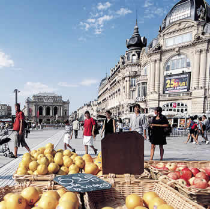

Title: Eitt Erasmusár af tuttugu
Slug: eitt-erasmusar-af-tuttugu
Date: 2007-10-18 15:03:00
UID: 188
Lang: is
Author: Unnur María Bergsveinsdóttir
Author URL: http://unnur.klaki.net
Category: 
Tags: 

Í dag er haldin 20 ára afmælishátíð Erasmus áætlunarinnar. Áætlunin nær til landa innan Evrópubandalagsins og landa á svæði efnahagsbandalagsins. Markmið hennar er að hvetja til og styðja við bakið á nemenda- og kennaraskiptum innan framangreindra landa og er það ekkert launungarmál að áætlunin er einn liður í því að skapa samevrópska sjálfsmynd í þágu sameinaðrar Evrópu. 

Árið 1998 pakkaði ég saman þeim tuttugu kílóum sem ég taldi mig síst getað verið án yfir eitt ár og tróð reyndar öðru eins í handfarangur. Ég var á leiðinni til Montpellier í Frakklandi þar sem ég ætlaði að dveljast eitt ár sem Erasmus skiptinemi. Ástæður mínar fyrir förinni voru einfaldar. Í fyrsta lagi mæltist frönskuskor Háskóla Íslands eindregið til þess að frönskunemar sem ætluðu sér að taka frönsku til 90 eininga tækju eitt ár af þremur úti í Frakklandi. Í öðru lagi leist mér einfaldlega bráðvel á það að komast aftur út til Frakklands því þar líkaði mér vel og ekki spillti fyrir að Montpellier er afskaplega fallegur bær, heitur og líflegur. 

Fyrir utan sjálft námið þarf Erasmus neminn að takast á við ýmsa praktíska hluti. Það tók verulega á andlega stillingu að skrá sig í kúrsa. Franskt skrifræði tekur fram öllum þeim sögum sem af því eru sagðar og gott betur en það. Ólíkt þeim góðu konum sem vinna á nemendaskrá Háskóla Íslands mæta franskar kollegur þeirra ekki í vinnuna á morgnana til að aðstoða nemendur heldur til þess að sneypa þá fyrir að vita ekki að tiltekin skrifstofa er bara opin milli 10-12 á föstudagmorgnum og að það sé alls ekki hægt að skrá sig í þennan kúrs nema vera búinn að fá útfyllt tiltekið eyðublað, sem auðvitað fæst bara á einni skrifstofu sem auðvitað er ekki opin núna. Sömuleiðis var það flókið ferli að ganga frá landvistarleyfi, að opna bankareikning og ganga frá leigusamningum. Til þess að mega stunda íþróttir í skólanum var krafist læknisvottorðs frá skólalækninum. Skoðunin framkallaði minningar úr barnaskóla; ég stóð á nærbuxunum fyrir framan hjúkrunarkonu sem potaði í mig og athugaði hvort ég væri með hryggskekkju eða berkla. Hún fylltist svo hneykslan yfir því að ung gjafvaxta stúlka á borð við mig væri ekki á pillunni og útskýrði að þótt skólinn tæki þátt í Erasmusáætluninni væri það ekki markmið áætlunarinnar að útlendingar væru að koma hingað til þess að eignast börn. Öllu þessu tókst mér samt að taka með stökustu ró enda vorum við nokkur saman þetta árið sem þekktumst úr frönskunáminu að heiman og héldum reglulega hópmeðferðarfundi þar sem við deildum ósigrum dagsins í baráttunni við kerfið og sannreyndum læknandi áhrif rauðvíns. Okkur hafði að vísu verið úthlutaður einhver trúnaðarmaður en hann hafði næsta lítinn áhuga á okkur. 

Hvað sjálft námið varðar var ýmislegt ólíkt því sem ég átti að venjast úr Háskóla Íslands. Fyrir það fyrsta var töluverður aldursmunur á mér og frönsku nemendunum. Ég sat yfirleitt tíma með nemendum á fyrsta ári, krökkum sem voru 18-19 ára á meðan ég var rúmlega tvítug. Þetta er ef til vill ekki mikill aldursmunur í árum talið en ég man hvað mér leiddist það að sitja undir endalausum ræðum beint til frönsku fyrstaársnemanna um það að nú væru þau komin í háskóla og þyrftu að taka sjálf ábyrgð á náminu. Fæstir kennaranna höfðu þó neina trú á því að krakkagrislningarnir tækju námið neitt alvarlega (annars væru þau jú varla í ríkisreknum háskóla heldur í einum af fínu háskólanna) og einkenndist viðmót marga af þeirri trú. Í ofanálág bættist að samskipti nemenda og kennara almennt einkennast í Frakklandi af mun meiri formlegheitum en hér á Íslandi. Kennarar eru þéraðir en þúa nemendurna og vei þeim sem gleymir sér! 

Kennsluformið einkenndist af fyrirlestrum og þáttaka nemenda í sjálfum kennslustundunum var yfirleitt í lágmarki. Fyrirlestrarnir voru hinsvegar oft bæði mjög áhugaverðir og skemmtilegir. Ritgerðir áttu að lúta ákveðnum formreglum, nokkuð sem frönsku nemendurnir áttu auðveld með enda höfðu þeir verið þjálfaðir í ritun _dissertation_-a frá því í grunnskóla. Við útlendingarnir hinsvegar áttum erfitt með þetta form og kom það niður á einkunnum okkar. Síðast en ekki síst fórum fram munnleg próf í mörgum áföngum, nokkuð sem okkur Íslendingunum fannst hryllileg tilhugsun en reyndist þó léttari áskorun en höfðum reiknað með. 

Við frönskunemarnir vorum mjög heppin að því leyti að hvað kúrsaval varðar var okkur það eitt sett sem skilyrði að taka tiltekinn bókmennakúrs að hausti og vori. Að öðru leyti vorum við frjáls til að taka svo til hvaða áfanga sem okkur heillaði, svo lengi sem hann væri kenndur á frönsku. Université Paul Valery er stór skóli og þar er mýgrútur faga kenndur. Þennan vetur lærði ég kvikmyndafræði, kvikmyndasögu, listasögu bæði miðalda og kirkjulistar, sögu evrópusambandsins, um lagaumhverfi evrópusambandsins, kirkjusögu miðalda, varð slarkfær í héraðsmálinu occitan, lærði um trúbadora og mansöngva miðalda, um wagner og dulspekihugsun aldamótamanna, kennslufræði tungumála á tímum netvæðingar og svo tók ég skyldubókmenntirnar auðvitað þar sem farið var yfir franskar bókmenntaperlur tuttugustu aldar. 

Mér fannst ég hafa verið mjög lánsöm að fá tækifæri til þess að velja mér kúrsa af þessu glæsilega hlaðborði. Frönskuskorin beið reyndar skaða af vetrardvöl minni í Montpellier því ég áttaði mig á því að það sem ég hafði virkilegan áhuga á að læra var sagnfræði. Þegar heim var komið skottaðist ég því yfir í þá skor og hef hangið í pilsfaldi Clio síðan. Þessir sundurleitu kúrsar sem ég tók Erasmus árið hafa reyndar allir endað á því að gagnast mér á einn hátt eða annan í sagnfræðináminu enda láta þau fræði sér flest við koma. 

Þegar ég hugsa til baka þá sé ég þó alltaf betur og betur hvað ég lærði margt þetta ár utan þess sem beinlínis var kennt í kennslustofunum. Það er holl reynsla að búa í öðru samfélagi, fyrir utan að þroska æðruleysi gagnvart reglum sem virðast handahófskenndar þá veitir sú reynsla manni nýja sýn á eigin samfélag og tilveru. Ég sakna ennþá margra hluta frá Montpellier en kann á sama tíma betur að meta hluti sem mér fannst áður sjálfsagðir hér heima. Eitt af því sem ég saknaði hvað mest var hversu hægur og rólegur takturinn í bæjarlífinu. Með tímanum hef ég þó áttað mig á því að þótt ég geti ekki lengur rölt á útimarkaðinn tvisvar í viku og keypt _une livre_ af grænmeti úr héraðinu, sest við eitt borðanna á barnum við hlið markaðarins og pantað mér kaffi eða glas af pastis, þá get ég búið mér til reykvískar rólegheitavenjur hvað hversdagsleg skylduverk á borð við innkaup varðar. Ég er ekki bundin við það að setjast upp í bílinn minn og þroðast í gegnum föstudagsumferðina og slást um bestu tilboðin í næstu lágvörubúð. 

Af því að bæði læra og læra um héraðstungumálið occitan opnðust líka augu mín fyrir því hvernig samfélög varðveita menningararf sinn á lifandi hátt og eftir að ég kom aftur heim hef ég verið mun meira vakandi fyrir þeirri sögu sem mitt nánasta umhveri varðveitir. Sem aftur veitir mér mun meiri ánægju heldur en það að arka einfaldlega um götur sem í huga mér hafa litla sem enga merkingu. Ég er ekki frá því að þetta sé ef til vill það merkilegasta við Erasmus verkefnið, það veitir okkur tækifæri til að upplifa það hvernig hinir lifa og ef við erum opin fyrir því, möguleikann á því að taka það sem okkur líst vel á heim með okkur. Og svo skyldi aldrei vanmeta það að eftir Erasmus árið kann ég að segja skál á mun fleiri tungumálum en ég kunni áður! 

