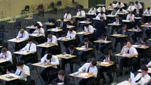

Title: Eitt skref í rétta átt
Slug: eitt-skref-i-retta-att
Date: 2005-11-29 15:34:35
UID: 23
Lang: is
Author: Hrafnkell Lárusson
Author URL: 
Category: Sagnfræði, Í umræðunni
Tags: nám, Háskóli Íslands, sagnfræðiskor

Núverandi námsskipan í BA-námi í sagnfræði við sagnfræðiskor Háskóla Íslands er orðin um 30 ára gömul. Á síðustu 30 árum hefur margt breyst, bæði í íslensku samfélagi og fræðaheiminum. Hugmyndastraumar hafa komið og farið, hugarfarsbreytingar hafa orðið, sem og kynslóðaskipti. Með það síðasttalda í huga er athyglisvert að hugsa til þess að stærstur hluti nemenda í sagnfræði við HÍ, nú um stundir, var ekki fæddur þegar núverandi námskipan var tekin upp. Það er því sannarlega tímabært að gera breytingar.

Í öllum aðalatriðum er ég mjög jákvæður gagnvart þeim breytingartillögum hafa verið kynntar. Til að byrja með vil ég nefna að ég tel það til mikilla bóta að aðskilja nám 1. árs nema í sagnfræði og nám 2. og 3. árs nema. Þeir sem eru að hefja BA-nám í sagnfræði og þeir sem eru lengra komnir eiga á tíðum litla samleið í námskeiðum. Þetta fann ég bæði við upphaf míns BA-náms og ekki síður undir lok þess. Með því að aðskilja þessa hópa má mæta þörfum þeirra betur en gert hefur verið. Hægt verður að leggja fyrir fjölbreyttari verkefni og gera meiri kröfur í námskeiðum sem nemendur á 2. og 3. ári sækja þegar ekki þarf lengur að taka tillti til nemenda á 1. ári sem eru skemmra á veg komnir. Með því að 1. árs nemar haldi hópinn allan veturinn verður hægt að aðlaga námið meira að þörfum þeirra og stigþyngja það.

Í núverandi kerfi hefur að mínum dómi verið verulegur þyngdarmunur milli námskeiði, þ.m.t. kjarnanámskeiða. Sá munur hefur verið bagalegur og t.d. leitt til þess að 1. árs nemar hafa átt erfitt með takast á við sum námskeiðin. En einnig að lengra komnum hefur á stundum þótt tíma sínum sólundað og lítið bætast við þekkingu sína og færni. Það hefur einnig annan kost sem tengist náminu óbeint að 1. árs nemar haldi hópinn. Með því móti vænti ég að tengsl innan hvers árgangs styrkist. Umræður um námið og samhjálp milli nemenda eru enda ekki síður mikilvæg en góð samskipti við kennara.

Gömlu yfirlitsnámskeiðin hafa byggt tilveru sína einkum á því að þeim sé ætlað að viðhalda og byggja upp þekkingargrunn. Ég er sammála því að hann sé nauðsynlegur upp að vissu marki. Það má ekki gleyma því að aðeins lítill hluti þeirra sem stunda BA-nám í sagnfræði starfar við fagið að loknu námi. Þeir sem það gera ljúka langflestir lengra sagnfræðinámi. Mikill meirihluti þeirra sem ljúka BA-námi í sagnfræði taka að starfa við annað en fagið að loknu námi, m.a. blaða og fréttamennsku. Fólk í þeim geira mætti að ósekju oft á tíðum vera betur að sér um ýmsa þætti sögunnar. Áhersluna á byggingu þekkingargrunns á að mínu mati að binda við fyrsta námsárið.

Þó yfirlitsnámskeiðin séu jafnan fremur yfirborðskennd þarf það ekki endilega að vera slæmt. Í yfirlitsnámskeiðunum geta nemendur fengið nasasjón af ýmsum þáttum og tímaskeiðum sögunnar sem þeir annars hefðu ekki spáð í. Að skauta yfir vítt svið getur kveikt áhuga og hugmyndir sem leiða til dýpri athugunar og ala jafnvel af sér rannsókn. Rétt eins og of almennt nám með þungri áherslu á þekkingaratriði er að mínum dómi slæmt er ótímabær sérhæfing ekki síður slæm.

Eftir sem áður hefur hlutur yfirlitsnámskeiðanna verið alltof stór hingað til. Áhersla á þekkingaratriðanám í sagnfræðinni hefur verið of mikil á kostnað annarra þátta, t.d. vinnubragða, hugtaka og kenninga. Að stafla meiru og meiru af þekkingaratriðum í höfuðið á sér þjónar takmörkuðum tilgangi. Höfuðfylli þeirra gerir varla meira en að nýtast við að slá um sig í samkvæmum eða á göngum Árnagarðs.

Áherslan á þekkingaratriðin samræmist raunar ákveðinni ímynd sagnfræðinga sem virðist allútbreidd í samfélaginu. Ég hef ítrekað upplifað að fólk ætlist til að ég hafi á hraðbergi upplýsingar um hina og þessa atburði eða persónur úr fortíðinni vegna þess að ég er sagnfræðingur. En það að vera sagnfræðingur snýst ekki — og á ekki að snúast — um að geta svarað staðreynda- eða alfræðispurningum á svipstundu. Því fólki sem beinir slíkum spurningum að mér hef ég oftar en ekki svarað á eftirfarandi hátt: „Ég er sagnfræðingur — en ekki uppflettirit.“

Það er engin tilgangur að stúdera sögu í háskóla með því einungis að lesa hvert söguritið á fætur öðru, án þess að reyna að komast á bak við efni þess eða öðlast skilning á þeim vinnubrögðunum sem beitt er. Beinist áhugi manns aðeins að því að lesa sögu og vera vel inn í sem flestum skrásettum atburðum fortíðarinnar er nóg að fá sér bókasafnsskírteini, lesa sem mest af söguritum og flagga svo vitneskjunni í kunningjahópnum. Hvorki fræðaheimurinn né atvinnulífið hafa þörf fyrir einstaklinga sem geta fátt annað en þulið það sem aðrir hafa skrifað en skortir færni til að leggja dóm á þann texta sem lesinn er og getu til að skapa sinn eigin.

Ég tel því ástæðu til að fagna sérstaklega þeirri áherslu sem í tillögunum er lögð á vinnulag, hugtaka- og kenninganotkun. Á þetta hefur skort hingað til. Ég náði t.a.m. að fara í gegnum BA-nám í sagnfræði án þess að hafa fundist ég hafa fengið neina markvissa þjálfun í skilningi á kenningum eða beitingu þeirra. Það þykir mér slæmt.

Með fækkun yfirlitsnámskeiða mun skapast meira pláss fyrir valnámskeið, en skortur á þeim hefur verið réttmætt umkvörtunarefni nemenda um alllangan tíma. Að bjóða upp á minni valnámskeið (2,5 ein) kemur svo til með auka fjölbreytnina enn frekar. Mikil þörf hefur verið fyrir að boðið væri upp á námskeið sem væri hugsað sem undirbúningur fyrir ritun BA-ritgerðar. Í tillögunum sýnist mér að ætlunin sé að mæta þessari þörf. Er það vel, því vinna við BA-ritgerð hefur reynst mörgum torveld og verið sá þröskuldur sem komið hefur í veg fyrir útskrift sumra nemenda sem hafa lokið tilsettum einingafjölda í námskeiðum. Þegar slíkt gerist kemur það sér ekki aðeins illa fyrir viðkomandi nemanda heldur einnig fyrir sagnfræðiskorina.

Mig langar að endingu að nefna aðra þætti í sagnfræðináminu sem ekki síður en námsskipanin eru í þörf fyrir endurskoðun — þ.e. kennsluaðferðir og námsmat. Þetta tvennt er almennt of einsleitt í sagnfræðiskor HÍ. Hin „heilaga“ þrenning: Framsaga, ritgerð og lokapróf eru gegnumgangandi. Hinar stöðluðu 10 mínútna framsögur og 10-12 blaðsíðna ritgerðir skópu meginhluta vinnu nemenda í yfirgnæfandi meirihluta þeirra námskeiða sem ég tók á BA-stigi. Þessi sífellda endurtekning sömu nálgana eykur ekki færni nemenda heldur elur af sér andlausa sjálfvirkni í vinnubrögðum. Tíu mínútna framsögur hafa engan fræðilegan tilgang, því þær rista svo grunnt. Eini sjáanlegi tilgangurinn virðist vera að þjálfa fólk í tjáningu, en það er EKKI hlutverk sagnfræðinámsins. Breytinga er þörf hvað þetta varðar. Verkefni þurfa að verða fjölbreyttari, þau þurfa að rista dýpra og hafa meiri skýrskotun til mögulegra verkefna síðar meir í fræðaheimi eða atvinnulífi.

Ég el einnig þá von í brjósti að nái breytingartillögurnar fram að ganga verði skrifleg lokapróf á 2. og 3. ári í lögð af. Þau geta hentað í yfirlitsnámskeiðum þar sem verið er að kanna þekkingu (eða geymslurými skammtímaminnis) nemenda á meginlínum og atburðum. Þau eru hins vegar gagnslaus mælikvarði á vinnubrögð nemenda og færni þeirra við að vinna með heimildir, hugtök og kenningar eða að miðla til annarra. Þó í einhverjum tilvikum kunni að vera erfitt að komast hjá því að nota skrifleg lokapróf sem mælikvarða ýtir, næsta ósjálfráð notkun þeirra sem aðalmælikvarða á námsárangur, undir staðreyndadýrkun og páfagaukslærdóm sem lítið skilur eftir.

Þrátt fyrir gagnrýni mína álít ég að BA-námið undanfarin ár hafi ekki verið alslæmt. Ég get þó ekki látið hjá líða að benda á nokkur atriði sem mér þykja miður. Í heildina séð fagna ég fyrirliggjandi tillögum um breytingar á námsskipan í sagnfræði við sagnfræðiskor HÍ. Ég fagna þeim sem nauðsynlegu skrefi í átt til frekari þróunar sagnfræðinámsins. Þessar tillögur á að skoða sem þarft skref í átt til heildarendurskoðunar námsins — en ekki sem varanlega niðurstöðu.
