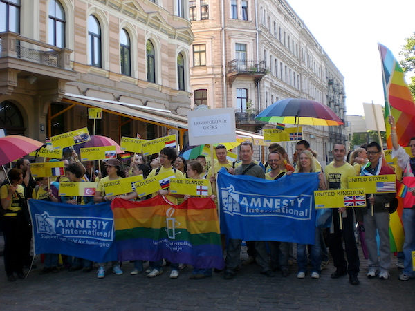

Title: Ekkert stolt? Riga Pride og réttindi samkynhneigðra í Lettlandi
Slug: ekkert-stolt-riga-pride
Date: 2008-10-09 11:00:13
UID: 712
Lang: is
Author: Íris Ellenberger
Author URL: 
Category: Hinsegin fræði, mannréttindi
Tags: STT, LGBT, Lettland, Riga, Riga Pride, Amnesty International, Aigars Kalvitis, mannréttindi, mannréttindabrot, aktivismi, aktívistar, Samtökin 78, Hilmar Magnússon, Mozaika, Vermanes-garður, 11. Novembra Krastmala, Daugava, Sovétríkin, No Pride, New Generation, Watchmen on the Walls, Jacob Holdt, Klu Klux Klan, Valdis Zatlers, Baltic Pride, Tallin, Eistland

Réttindi samkynhneigðra og tvíkynhneigðra á Íslandi hafa tekið stórt stökk á síðustu áratugum þótt enn sé nokkuð í land með að transgender einstaklingar nái þeim réttindum sem þeir æskja. Flestir viðurkenna þó að ástandið í þessum málaflokki sé með því besta sem gerist í heiminum því víða um heim á STT-fólk (samkynhneigðir, tvíkynhneigðir og transgender) undir högg að sækja. Það berst ekki aðeins fyrir jafnrétti og sjálfsögðum mannréttindum heldur einnig fyrir frelsi frá ofsóknum, ofbeldi og jafnvel morðhótunum. Slík barátta á sér ekki einungis stað í fjarlægum löndum. Þúsundir Íslendinga fara á ári hverju í sumarleyfis- og menningarferðir til staða þar sem STT-fólk berst fyrir því að fá að lifa óáreitt. Meðal þessara landa er Lettland. Þar hefur komið til hatrammra átaka milli STT-fólks og öfgasamtaka en einnig hafa stjórnvöld verið STT-fólki mjög andsnúin.

Staða STT-fólks í Lettlandi vakti fyrst athygli árið 2005 þegar hundruð manna veittust að fáum tugum einstaklinga sem reyndu að fara í „hinsegin göngu“ um stræti höfuðborgarinnar, Riga. Ári síðar, í byrjun sumars 2006, gagnrýndi Amnesty International lettneska þingið fyrir að fella lagabreytingartillögu sem miðaði að því að lögleiða bann við mismunun á grundvelli kynhneigðar. Þá um sumarið létu nokkrir háttsettir embættismenn, m.a. Aigars Kalvitis forsætisráðherra, frá sér fara móðgandi og særandi ummæli í garð STT-fólks sem varð til þess að framkvæmdastjóri borgarráðs Riga afturkallaði leyfi til að halda hinsegin göngu, sem átti að fara fram 23. júlí það sumar. Auk þess óttuðust mannréttindasamtök að ummælin myndu auka á andúð og óvild í garð STT-fólks.

Og það kom á daginn. Þann 22. júlí 2006 réðst stór hópur fólks að einstaklingum sem voru við kirkjuathöfn til stuðnings Riga Pride og kastaði að þeim eggjum og mannasaur. Lögregluverndar hafði verið óskað en lögreglan lét ekki til skarar skríða fyrr en árásirnar höfðu staðið yfir í nokkurn tíma. 

STT-samfélagið lét þó ekki bugast og efndi til Riga Pride á ný 3. júní 2007. Aktívistar frá fjölmörgum Evrópulöndum flykktust til Riga í þeirri von að yfirvöld finndu sig knúin til að leyfa gönguna og veita þátttakendum næga lögregluvernd. Þessi alþjóðlegi þrýstingur bar árangur, Riga Pride gangan fór fram undir vernd gegn andstæðingum hennar sem voru fjölmargir og létu ófriðlega. 

Í ár var sömu aðferð beitt til að STT-fólk gæti borið höfuðið hátt á hinsegin dögum í Riga. Gangan var haldin 31. maí sl. og þangað streymdi fjöldinn allur af erlendum aktívistum, þar af u.þ.b. hundrað á vegum mannréttindasamtakanna Amnesty International. Tilgangurinn með aðgerð samtakanna var þríþættur; að sýna alþjóðlegan stuðning við lettneska STT-samfélagið, að þrýsta á um að Riga Pride yrði haldið í samræmi við óskir skipuleggjenda og að tryggja þátttakendum næga lögregluvernd. Meðal þeirra sem lögðu leið sína til Riga þetta árið voru tveir fulltrúar Amnesty International og Samtakanna 78, undirrituð auk Hilmars Magnússonar arkitekts. 

Þrátt fyrir að snemma væri ljóst að von væri á nokkrum fjölda erlendra gesta á Riga Pride gekk undirbúningurinn ekki snurðulaust fyrir sig. Aðalskipuleggjandi hátíðarinnar, lettnesku samtökin Mozaika, stóð í töluverðu stappi við yfirvöld í Riga um að fá að halda hátíðina miðsvæðis. Yfirvöld virtust á tímabili staðráðin í að gera Riga Pride útlægt úr miðbænum og báru ýmsar samkomur og hátíðir fyrir sig. Fyrsta skrefið var að sækja um leyfi til garðyrkjustjóra borgarinnar til að halda hátíðina í sama garði (Vermanes-garði) og sömu helgi (fyrstu helgina í júní) og árið 2007 í þeirri von að hægt væri að koma á ákveðinni hefð. Í svari frá stofnuninni var Mozaika tjáð að því miður væri ekki hægt að verða við þeirri ósk þar eð lettneska þjóðdansa- og söngvahátíðin yrði haldin í júlí og því yrðu allir almenningsgarðar í miðborginni lokaðir allar helgar allt sumarið.

Svarið frá embætti garðyrkjustjóra átti augljóslega ekki við rök að styðjast. Því sneri Mozaika sér til borgarráðs og lagði inn umsókn fyrir göngunni. Í fyrstu tilraun var fulltrúa Mozaika vísað frá undir því yfirskyni að umsóknin innihéldi ekki ákveðið skjal sem þó er hvergi minnst á í lögum og reglum. Þegar fulltrúinn kom aftur nokkrum klukkustundum síðar var honum tilkynnt að á meðan hann var í burtu hefði borist umsókn fyrir öðrum viðburði, barnahátíð á vegum menningarsviðs borgarinnar. Borgaryfirvöld buðust hins vegar til að leyfa göngunni að eiga sér stað að barnahátíðinni lokinni. Mozaika taldi það þó fásinnu sökum hins mikla lögregluviðbúnaðar sem þarf að vera til staðar til að vernda þátttakendur í Riga Pride.

Borgaryfirvöld sáu þó að sér að lokum og buðu fram götuna 11. Novembra Krastmala sem liggur meðfram Daugava-á í miðborginni. Mozaika ætlaði ekki að trúa eigin eyrum því á þeim stað fyrir 17 árum sameinuðust Lettar til að fagna sjálfstæði þjóðarinnar og lausn undan yfirráðum Sovétríkjanna. Þessi staður hefur því mjög táknrænt gildi enda mótmæltu andstæðingar Riga Pride þessu fyrirkomulagi harðlega. Ákvörðunin stóð hins vegar og gangan fór fram 31. maí á 11. Novembra Krastmala.

Mikill viðbúnaður var í kringum gönguna, ekki aðeins af hálfu lögreglu heldur einnig aðstandenda og þátttakenda. Að morgni 31. maí lögðum við af stað í litlum hópum niður í miðbæ. Var brýnt fyrir okkur að láta hvergi sjást í Amnesty-merki eða boli og að fela vandlega öll spjöld og borða sem við ætluðum að bera í göngunni til að minnka líkur á að ráðist yrði á okkur. Þegar komið var á staðinn sást að lögreglan hafði í raun lokað stórum hluta miðbæjarins. Hátíðarsvæðið hafði aðeins einn inngang og þar var fjöldi lögreglumanna sem leitaði í fórum hvers þess sem vildi komast inn. Til að torvelda aðgang enn frekar þurfti hinn almenni borgari að gera ráðstafanir fyrirfram, að verða sér úti um appelsínugult armband í aðdraganda göngunnar eða þekkja einhvern innan garðs sem gat ábyrgst að viðkomandi væri vinveittur STT-samfélaginu. Því varð snemma ljóst að enginn þurfti að óttast ónóga lögregluvernd í það skiptið.

Gangan sjálf fór friðsamlega fram ef undan eru skildir um fjögur hundruð mótmælendur sem höfðu tekið sér stöðu við afgirt svæðið. Þessi hávaðasami hópur var aðallega á vegum tveggja samtaka, annars vegar samtaka sem kalla sig _No Pride_ og voru stofnuð til höfuðs Riga Pride og hins vegar öfgatrúarsafnaðarins _New Generation_ sem er tengdur hinum bandaríska trúarsöfnuði _Watchmen on the Walls_. Mótmælendur héldu á spjöldum með slagorðum eins og „Stop Pride, Stop Aids“ og „Gay Pride, Aids Pride“. Það vakti óhug meðal reyndari þátttakenda að mótmælendur virtust skipulagðari en í fyrra. Einn virtist t.a.m. hafa gefið sér tíma til að föndra gálga og sauma brúðu sem hékk neðan úr honum. Einnig virtist mótmælendum göngunnar hafa fjölgað milli ára en það var þó að mestu rakið til þess að þeir höfðu minna pláss til að gera sig sýnilega fyrir enda götunnar en í fyrra þurftu þeir að umkringja heilan almenningsgarð. 

Gangan kom hvergi nærri þessum hópi heldur hélt sig ávallt í nokkurra metra fjarlægð. Við, hinir erlendu gestir, vorum flest sammála um að gangan hefði verið stórundarleg miðað við það sem við eigum að venjast í okkar heimalöndum. Við gengum í eins konar einskis manns landi, röltuðum með kröfuspjöld og –borða eftir breiðstræti án þess að almenningur fengi tækifæri til að skoða gönguna eða taka þátt í henni og það sökum hinna miklu varúðarráðstafana sem jöðruðu við ofvernd. Þrátt fyrir að fulltrúar Mozaika séu lifandi fegnir að fá loks almennilega lögregluvernd þá telja þeir að næsta skref sé að semja við lögregluna á þann veg að á næsta ári verði gengið fyrir allra augum. Enda sé það ekki baráttunni til framdráttar að andstæðingar geti bent á að STT-fólk eigi einmitt heima bak við girðingu, eins og „önnur dýr“. 

Frægur danskur ljósmyndari að nafni Jacob Holdt var með í för. Hann áleit göngufólk bleyður að fara ekki nærri mótmælendum. Hann hefur nefnilega getið sér gott orð fyrir að taka myndir af ýmsum öfgahópum, t.a.m. meðlimum Klu Klux Klan. En í göngunni var t.d. ungt lettneskt par, strákur og stelpa. Þau vildu með þátttöku sinni mótmæla sjónvarpsþætti þar sem staðhæft var að kjarnafjölskyldan væri hornsteinn lettnesks þjóðernis. Þessir Lettar kvörtuðu ekki yfir hugleysi göngufólks heldur höfðu það á orði að þau þyrðu ekki að fara mikið nær mótmælendum. Þau skýldu sér á bak við sólgleraugu sennilega í þeim tilgangi að ekki væri hægt að bera kennsl á þau enda aldrei að vita hverju mótmælendurnir taka upp á. Því skal ekki undra að Lettar hafi verið tregir að mæta í gönguna og urðu skipuleggjendur fyrir vonbrigðum með að heimafólki fjölgaði ekki milli ára.

En þrátt fyrir að Riga Pride hafi ekki stækkað frá ári til árs þá er árangur hennar ótvíræður. Á síðustu árum hefur hver stjórnmálamaðurinn á fætur öðrum láta hafa eftir sér niðrandi ummæli í garð STT-fólks. Því var það óvænt ánægja þegar tilkynnt var í göngunni þetta árið að sjálfur forseti Lettlands, Valdis Zatlers, hefði viðhaft vinsamleg ummæli í garð göngunnar og fordæmt fordóma og umburðarleysi. Aðstæður STT-fólks þokast því í rétta átt. Vonast er til að árið 2009 verði ár örra breytinga. Þá verður allsherjar Baltic Pride haldið í Riga og er vonast til að íbúar baltnesku landanna taki þátt í ríkari mæli og að borgaryfirvöld verði samvinnuþýðari þótt þau óski þess í augnablikinu að hátíðin verði haldin í Tallinn í Eistlandi.

<small>_Greinin birtist upphaflega í Lesbók Morgunblaðsins 5. júlí 2008_</small>
