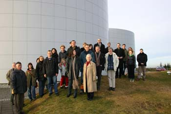
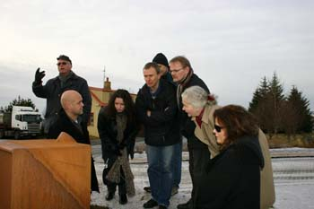
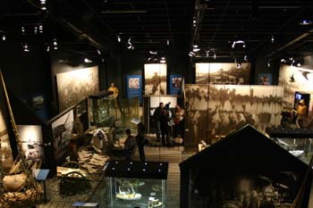
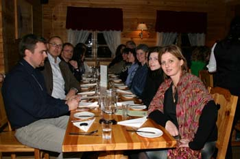

Title: Ekki eru öll söfn söfn þótt sum séu
Subtitle: Safna- og sýningaferð sagnfræðinga og annarra
Slug: ekki-eru-oll-sofn-sofn-thott-sum-seu
Date: 2005-11-18 11:17:00
UID: 18
Lang: is
Author: Guðni Th. Jóhannesson
Author URL: 
Category: Safnafræði, Sagnfræði
Tags: Sagnfræðingafélag Íslands, Félag safna og safnamanna, Félag sögukennara, safn, Saga Museum, Hofsstaðir, Siggubær, Byggðasafn Hafnarfjarðar, Saltfisksetur

Í sumar eða svo kviknaði sú hugmynd með stjórnarmönnum Sagnfræðingafélags Íslands að bjóða upp á dagsferð á söfn og sýningar í höfuðborginni og nágrenni. Safna- og sagnfræðingurinn Guðbrandur Benediktsson var mestur áhugamaður um þessa ferð og hafði veg og vanda af undirbúningi hennar og framkvæmd, því ekki er að orðlengja að hann var tekinn á orðinu og ferðin var farin, núna á laugardaginn var, 12. nóvember. Að henni stóðu Sagnfræðingafélag Íslands, Félag safna og safnamanna og Félag sögukennara.

Yfirlýstur tilgangur ferðarinnar var sá að bera saman mismunandi söfn og sýningar og gera sér um leið glaðan dag í góðra vina hópi. Hvort tveggja tókst, með þessum hætti: Laust fyrir klukkan eitt eftir hádegi höfðu tæplega þrjátíu manns safnast saman í Perlunni í Reykjavík og var þar farið á „Saga Museum“ í eina tankinum undir veitingahúsinu sem ekki er fullur af heitu vatni. Aðstandendur „Saga Museum“ fræddu fólk um tilurð þess og framkvæmd, og var síðan gengið um ganga og dáðst að hinum raunverulegu fígúrum sem þarna eru til sýnis og eiga að vera Skarphéðinn, Snorri og fleiri kappar. Fólk var að ég held allt sammála um það að þær væru listilega vel gerðar og flestir töldu að í því lægi styrkur „Saga Museum“. En auðvitað er „Saga Museum“ „plat“, rétt eins og „Geysir“ sem gýs í plati við hliðina á Perlunni fyrir túrista sem hafa ekki tíma til að sjá hina eina rétta og sanna Geysi uppi í Haukadal (þótt sumum þyki framkvæmdir þar líka hafa varpað nokkrum gervibrag á umhverfið).

„Saga Museum“ er ekki heldur alvöru „museum“ eða safn. Þar er ekki einn einasti safnhlutur í hefðbundnum skilningi. Um þetta ræddu þeir Guðbrandur Benediktsson og Eggert Þór Bernharðsson sagnfræðingur nokkuð síðar í ferðinni og var þá m.a. bent á að í lögum og reglugerðum væri fyrirbærið „safn“skilgreint á ákveðinn hátt, og ekki félli „Saga Museum“ undir þann hatt.

Nóg um það. Næst lá leiðin að Hofsstöðum í Garðabæ þar sem ferðafólk var frætt um fornleifauppgröft síðustu ára og hvernig uppfræðsla á sér stað með nýjustu margmiðlunartækni, undir berum himni, og í köldu frosti þegar svo ber við eins og á laugardaginn. Vel hefur tekist til þarna að sameina einfaldleika fornra rústa og flóknar útfærslur nútímans á miðlun þekkingar.

Frá Garðabæ var haldið áfram suður á bóginn og var næsta stopp í Siggubæ við Hellisgerði í Hafnarfirði. Aftur var þar komið safn sem ekki er hefðbundið, því Siggubær er nær alveg eins og síðasti ábúandi skildi við hann. Húsið og orgínal innanstokksmunirnir eru safnið, og ekki síst andrúmsloftið allt þar um kring. Þarna myndi allt spillast ef ein hilla væri full af útskornum öskum þar sem stæði t.d. „Askur. Guðrún Jónsdóttir gaf 1945. Nr. 1345-A-14“. Minjasafnið er án muna nema þeirra sem áttu alltaf heima þar, fyrir utan auðvitað fólkið sjálft en það er ekki á allt kosið í þessum bransa.

Hefðbundnari minjasöfn eru þó einnig góðra gjalda verð og að því komust gestir í Byggðasafni Hafnarfjarðar (þar sem ferðalangar nutu einnig kaffiveitinga). Auk muna sem tengjast Hafnarfirði á einn eða annan hátt getur einnig að líta í safninu ágætis sýningu um hernámsárin.

Frá Hafnarfirði var síðan haldið suður til Grindavíkur, í saltfisksetrið sem þar er að finna. Setrið er einkar glæsilegt, enda í sérhönnuðu sýningarhúsi og var fróðlegt að kynnast saltfiski í sögu þjóðar. Ekki var síður gaman að eta hann, en þannig lauk ferðinni, með góðum kvöldverði á Salthúsinu. Heim til Reykjavíkur var svo komið eftir kvöldmat og standa vonir til að aftur verði farið í safna- og sýningaferð einhvern tímann á næsta vetri. Var þá rætt um Akranes og uppsveitir Borgarfjarðar, eða jafnvel Snæfellsnesið.
