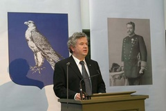

Title: Ekki góðir menn? Um heimastjórnarafmælið 2004
Slug: ekki-godir-menn-um-heimastjornarafmaelid-2004
Date: 2007-11-22 14:27:00
UID: 197
Lang: is
Author: Hafdís Hafsteinsdóttir
Author URL: 
Category: Menningarfræði, Sagnfræði
Tags: Heimastjórn, Davíð Oddson, afmælishátíðir, póst módernismi, Björn Bjarnaron, fjölmiðlar, Hannes Hafsteinn, Valtýr Guðmundsson, Fréttablaðið, Dagblaðið, Morgunblaðið, Júlíus Hafstein, Alþingishátíðin 1930, Sjáfstæðisbarátta, stúdentar

Ef það sem er sígillt og tengir best samheldni í kristnum menningararfi okkar Íslendinga þykir gamaldags er illa fyrir okkur komið. Raunar hefur hefur hin síðari ár fremur virst vakning um lifandi gildi Passíusálmanna en að á þá sé litið sem gamalt og sögulegt góss. Við vitum aldrei hvert tíðarandinn leiðir okkur, síst af öllu nú á þeim tíma, sem kenndur er við póstmódernisma og þegar allt er lagt að jöfnu og alla hluti á að skoða í afstæðu ljósi en ekki með vísan til inntaks þeirra og eðlis. Enginn hefur lagt sig meira fram um að skýra það fyrir okkur en Kristján Kristjánsson, prófessor við Háskólann á Akureyri, hvað felst í póstmódernismanum. Hann segir í einni ritgerða sinna: 

> „Ég hef reynt að skýra aðdráttarafl póstmódernismans með þrá fólks eftir kraftaverkum, leyndardómum og valdi í stað hversdagssanninda og frelsis.[…] Hatur póstmódernista á húmanisma og sameiginlegu manneðli, blástur þeirra á vonarglætuna um betri og skilningsríkari heim, fær mann til að efast um að þeir séu upp til hópa góðir menn. Og er það ekki á endanum eina ófyrirgefanlega syndin?“

Hér er fast að orði kveðið og sé rétt að skotið hafi rótum í lífsviðhorf samtíma okkar, sem hafnar kærleiksboðskapnum, er vá fyrir dyrum. Max Weber benti á að hversdagsverkin, að vera trúr yfir því, sem manni er falið, gæta þess og rækta það, væri inntak lífs hins sanntrúaða manns og hornsteinn agaðs þjóðfélags. Hitt skiptir ekki minna máli, að kærleikurinn sé hafður í heiðri, þegar tekist er á við viðfangsefni daglegs lífs.

Svo mælir Björn Bjarnason í lesbókargrein í Morgunblaðinu þann 7.febrúar 2004. Ástæður þessarar birtingar eru óljósar, en þó er ekki úr vegi að tengja hana við atburð sem átti sér stað rétt rúmlega viku fyrr. Þá var nefnilega haldið uppá hundrað ára afmæli heimastjórnarinnar.  Afmælinu var fagnað á ýmsan hátt, meðal annars með sýningu í Þjóðmenningarhúsi, opnun vefsíðu um heimastjórnina, málþingum sem haldin voru vítt og breitt um landið, leiksýningu um aldamótakynslóðina sem sett var upp í Þjóðleikhúsinu og hátíðarkvöldverðir bæði í Reykjavík og á Ísafirði. Hápunkturinn var svo hátíðardagskrá í Þjóðmenningarhúsi þann 1.febrúar sem var sýnd í beinni útsendingu í ríkissjónvarpinu.Það sem situr hins vegar eftir þegar litið er til baka til þessara hátíðarhalda er það sem kallað var „fjarvera forsetans“, en hann var erlendis á meðan á hátíðarhöldunum stóð og sagðist ekki hafa verið beðinn um að taka þátt í þeim. Forsetinn og forsætisráðherra sendu hvor öðrum kaldar kveðjur á síðum blaðanna, en skipuleggjendur hátíðahaldanna börmuðu sér og sögðu að slíkt þras drægi athyglina frá hátíðarhöldunum sjálfum.

Umræðan um hátíðarhöldin snérist sem sé að flestu leyti um fjarveru forsetans, en þeim mun minna var fjallað um innihaldið. Dagblaðið tók þó fljótlega að snúa útúr hátíðarhöldunum. Ritstjórum Dagblaðsins fannst hátíðarræða forstæisráðherra og umgjörðin í kringum hátíðarhöldin hafa það pólitíska markmið að hnýta Sjálfstæðisflokkinn við Heimastjórnarflokkin og skapa þar með vafasama sögulega tenginu.  Þetta kristallaðst í myndbirtingu í leiðara blaðsins af forsætisráðherra í einkennisbúningi Hannesar Hafstein. Enda kom í ljós að lesendum Dagblaðsins fannst útsendingin frá Þjóðmenningarhúsinu leiðinleg og spurðu jafnframt hvort  ekki hefði verið nær að gera eitthvað sem fólkið í landinu hefði getað tekið þátt í.[^1]  Umræðan í Fréttablaðinu var öllu hvassari, og gjarnan var spurt afhverju ætti að eyða almannafé í samkomu sem almenningur kom hvergi nærri . _„Þarna voru valdastéttirnar samankomnar að nudda saman axlapúðum og láta glamra í skartgripum. Það var hirðin. Ég set spurningamerki við það í niðurskurði á þjónustu við bæjarbúa hvort að þetta hafi verið rétta aðferðin“_ sagði Lárus Valdimarsson, bæjarstjórnarfulltrúi á Ísafirði í Fréttablaðinu 4.febrúar 2004 um framkvæmd hátíðarhaldanna. Einnig fannst mörgum sem hlutur Hannesar Hafsteins væri gerður full mikill og spurðu afhverju enginn hefði minnst á Valtý Guðmundsson og þátt hans í aðdraganda heimastjórnar. Sé valtýskunni sleppt, væri sögutúlkuninn algerlega einþráða og að sjálfsögðu röng.[^2]    

Þessar umræður áttu sér allar stað í vikunni eftir hátíðarhöldin. Má þar greina mikinn pólitískan ríg milli manna og gremju stjórnarandstöðuflokka yfir menningarlegum yfirgangi stjórnarflokkanna, og þá helst flokki forsætisráðherra. Enda var það svo að flestir sem komu að undirbúningi afmælisins voru flokksbundnir úr flokki forsætisráðherra. Formaður hátíðarhaldanna, Júlíus Hafstein sat t.d í borgarstjórn fyrir Sjálfstæðisflokkinn og var dyggur stuðningsmaður forsætisráðherra.

Í ljósi ummæla í Fréttablaðinu og Dagblaðinu lítur út fyrir að landsmönnum hafi haft ýmislegt útá framkvæmdina að setja og þá túlkun sem forsvarsmenn hátíðarhaldanna vildu tefla fram. Þessvegna er ekki að undra að Björn Bjarnarsson dómsmálaráðherra hafi brýnt fyrir þjóðinni trúna á hversdagssannindin og varað við niðurrifsmönnum sem vilja rífa allt úr samhengi í lesbókargrein sinni vikuna á eftir.

Síðar kom í ljós að áhugi almennings á þátttöku var við frostmark. T.d. voru aðeins 10 menntaskólanemar sem sendu inn ritgerð í ritgerðasamkeppni um heimastjórnina, þrátt fyrir að verðlaun fyrir þrjár bestu ritgerðirnar væru 100.000 krónur, sem verður að teljast nokkuð góð ritlaun. Leiksýningin um aldamótakynslóðina sem sett var upp í Þjóðleikhúsinu var aðeins sýnd þrisvar og aldrei fyrir fullu húsi,[^3] en á sama tíma var uppselt á Dýrin í Hálsaskógi fram á vor.[^4] Flestir landsmenn létu sér fátt um finnast þrátt fyrir að vera áminntir reglulega í fjölmiðlum um hátíðarárið.

Í ágúst sama ár var svo slegið aðsóknarmet á hina árlegu Gleðigöngu, eða Gay-pride og árið eftir var metttþátttaka í kvennafrídeginum. Þannig að ekki er um að kenna áhugaleysi almennings á þátttöku í atburðum eða hátíðarhöldum eins og Júlíus Hafstein vildi halda fram.[^5]

Því er verður ekki komist hjá því að viðurkenna að umgjörð hátíðarinnar eða túlkunin hafi ekki náð til almennings. Í því samhengi má benda á að Íslendingar eru ekki sérstaklega duglegir að flagga sögulegum atburðum með að efna til hátíðarhalda, nema um sé að ræða áratuga afmæli áfanga sem tengjast sjálfstæðisbaráttunni. Svo sem 50 ára afmæli lýðveldisins, Alþingishátiðin 1930, 1100 ára afmæli íslandsbyggðar og 100 ára afmæli stjórnarskránna  1974.

Fyrir utan 17.júní er enginn dagur tileinkaður sögulegum atburði í dagatali landsmanna. 1.desember var lengi vel rauður dagur, en missti titilinn í upphafi 21.aldarinnar.

Samt sem áður var 1.desember reyndar afar sérstakur dagur lengi vel og þá sérstaklega meðal stúdenta. Stúdentar byrjuðu að halda upp á daginn 1921 og var hann síðar notaður sem baráttudagur í sjálfstæðismálum, eftir því hvernig þau voru skilgreind á hverjum tíma. Þá var blásið til hátíðarhalda, málþings og Stúdentablaðið kom út í viðhafnarútgáfu. Málþingin áttu það til að vera með skrautlegasta móti en þá voru samtímamál krufin til mergjar og mikill hiti í mönnum. Aðal hitamál kosninga til stúdentaráðs voru oftar en ekki hvaða fylking fékk að halda utan um 1.des hátíðarhöldin, fengju að ritstýra stúdentablaðinu og sjá um skemmtiatriðin. Megas kom t.a.m fram í fyrsta skipti opinberlega á 1.des hátíðarhöldum, en þá voru róttækir vinstristúdentar við völd.

Stúdentar notuðu sem sé 1.des, ekki bara til að rifja upp sömu söguna ár eftir ár, heldur líka til að skoða samtímann og oftar en ekki út frá sögulegu sjónarhorni. Kaldastríðstíminn spilaði oft stóra rullu og stúdentar voru sífellt að velta fyrir sér stöðu Íslands, fullveldi og sjálfstæði eða jafnvel hvort að íslenska þjóðin væri í raun og veru sjálfstæð.[^6]  Þessi hátíðarhöld voru lengi vel stæsti viðburður sem stúdentar stóðu fyrir. Í seinni tíð hefur þessi hefð lagst af og Oktoberfest komið í staðin.

Það er ljóst að Íslendingar hafa fagnað áföngum sjálfstæðisbaráttunnar á mismunandi hátt í gegnum tíðina. Hitt er annað mál að það er firra að halda því fram að pólitík setji ekki sinn stimpil á hátíðarhöldin hverju sinni eins og dæmið með hátíðarhöld stúdenta sanna. Því yfirráðum yfir sögunni fylgir jú ákveðið vald. Þrátt fyrir fögur fyrirheit forsvarsmanna hátíðarhaldanna 1.febrúar 2004 um að þeirra hlutverk væri bara að endurvekja anda liðinna tíma, er varla hægt að túlka orð dómsmálaráðherra um hversdagssannindin á annan hátt en lesendum væri ekki ætlað að túlka eða beita gagnrýnni hugsun á söguna, heldur einungis að trúa.

[^1]: Sjá _Dagblaðið_ vikuna 1-7.febrúar 2007.
[^2]: Þorvaldur Gylfason: „Að njóta sannmælis“ _Fréttablaðið_ 4.febrúar 2004.
[^3]: Skýrsla um Heimastjórn. Fengin af www.heimastjórn.is http://www.heimastjorn.is/myndbond/nr/121
[^4]: Tölur fengnar úr _Morgunblaðinu_ 1., 15., og 20. febrúar.
[^5]: Skýrsla um Heimastjórn. Fengin af www.heimastjórn.is http://www.heimastjorn.is/myndbond/nr/121
[^6]: Jón Ólafur Ísberg: _Stúdentsárin. Saga stúdentaráðs_. Reykjavík. 1996. bls 88-102

