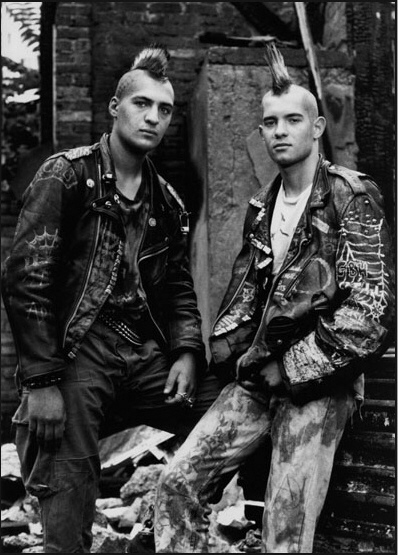

Title: Ekta íslenskt pönk?
Slug: ekta-islenskt-ponk
Date: 2008-07-18 15:26:51
UID: 357
Lang: is
Author: Unnur María Bergsveinsdóttir
Author URL: http://unnur.klaki.net
Category: Munnleg saga, Sagnfræði, Tónlist
Tags: subculture, Tónlist, Listir, Munnleg saga, minni, pönk, menningarkimar

Íslenska pönksenan sem blómstraði í upphafi níunda áratugarins hefur alla jafna verið álitin fremur einsleit. Sú staðreynd að hér var um fámennan menningarkima að ræða hefur aðeins styrkt þetta sjónarmið. Þegar skoða skal fyrirbæri á borð við íslensku pönksenuna er mikilvægt að hafa í huga að hér var um að ræða fámenna hreyfingu í fámennu samfélagi. Þeir sem höfðu áhuga á pönkinu þurftu að takast á við aðstæður sem einkenndust af aðstöðuleysi (lýsa því nánar!) auk þess sem innflutningur á pönkplötum og öðrum varningi sem tengdist pönkinu var lengst af í lágmarki. Þeir sem vildu gera pönkið að lífsstíl neyddust því til að taka virkan þátt í því að skapa senuna með því að virkja eigin sköpunarkraft.  Plötur og fjölfaldaðar kassettur gengu mann frá manni. Fatnaður og fylgihlutir voru heimatilbúnir með plötuumslög og myndir í New Musical Express sem fyrirmyndir. Þennan þátt senunnar væri erfitt að fanga með því að reiða sig eingöngu á hefðbundnar heimildir á borð við fjölmiðlaumfjöllun og minjar. Því má jafnvel halda fram að án munnlegra heimilda væri sérhver tilraun til þess að lýsa menningarkima sem byggist að svo miklu leyti á virkri þátttöku fólks dæmd til þess að reynast ófullkomin. 

Um þessar mundir legg ég lokahönd á rannsókn á þessum menningarkima. Það var ekki markmið rannsóknar minnar að greina á milli frásagna í leit að einni „réttri“ sýn á atburði. Slík nálgun hefði enda ekki verið í samræmi við eðli senunnar. Engu að síður er ljóst að innan munnlegrar sögu íslensks pönks má greina tvær ólíkar frásagnir af því um hvað pönnkið snerist. 

Það kom mér reyndar ekki á óvart að fá að heyra ólík sjónarmið. Pönkið er menning sem byggir á fleiri þáttum en útlitinu einu. Það nær einnig til hugmynda um lífsstíl og samfélag. Pönkið er samheiti yfir marga tónlistarstíla, ólíka hugmyndafræði og tísku og vísar til sjónlistarmenningar, danslistar og kvikmyndagerðar.  Þar að auki hefur pönksenan eins og við þekkjum hana kvíslast í marga litla menningarkima.

Margir þeirra listamanna sem verið hafa hvað mest áberandi í íslensku menningarlífi síðasta áratuginn eða svo, rekja upphaf ferils síns aftur til pönkáranna. Hér er jöfnum höndum um að ræða tónlistarfólk, rithöfunda, skáld, myndlistarmenn og kvikmyndagerðamenn. Ótal viðtöl við þennan hóp hafa haft afgerandi áhrif á þá sýn sem fjölmiðlar draga upp af tímabilinu og á það mikilvægi sem pönkinu er úthlutað í íslenskri menningarsögu. Í dag er það viðtekin venja að telja pönkið hafa haft veruleg áhrif á íslenskt menningarlíf. Þegar þeirri mynd sem haldið er fram í fjölmiðlum er stillt upp við hlið minninga þeirra sem ekki áunnu sér frægð og frama í gegnum pönkið er hinsvegar greinilegt að sú upplifun sem lýst er í fjölmiðlum er ekki jafn dæmigerð fyrir reynslu pönkara og haldið hefur verið fram. Er jafnvel til efs að margar sumar ímynda íslenska pönksins séu byggðar á staðreyndum. 

Sálfræðingurinn Endel Tulving skilgreindi tvær gerðir langtímaminnis: getuna til þess að muna persónulega upplifun yfir lengri tíma (e. episodic memory) og getuna til þess að læra hluti og festa þá í minni sér (e. semantic memory). Ulrich Neisser sýndi svo síðar fram á að ef atburður hefur haft þýðingu fyrir þann sem man verður minningin um hann að sjálfsævisögulegri minningu og mögulega hluti af lífssögu. 

Þrátt fyrir augljósa og ef til vill óþægilega tengingu við skáldskap og sjálfssköpun er frásagnarmynstrið mikilvægt hugtak innan munnlegrar sögu. Munnlegar sögur eru skapaðar til þess að lýsa raunveruleikanum en hvorki upprifjun minninga né endursögn þeirra er eitthvað sem gerist í tómi. Það er aldrei hægt að líta á frásögn sem annað hvort einfalda upprifjun persónulegrar upplifunar eða birtingarmynd sameiginlegs félagslegs minnis. Allar slíkar frásagnir eru blanda hvoru tveggja og í þeim má greina gildi og markmið ríkjandi menningar. Rammarnir sem gera endurkall minninganna mögulegt byggja ekki aðeins á félagslegri mótun heldur ráðast einnig af félaglegum og menningarlegum skilyrðum. 

Oliver Sacks hélt því fram að við hefðum hvert okkar skapað okkur eigin ævisögu, eigin frásögn sem hefur þann tilgang að vera ævi okkar. Segja má að hvert okkar skapi og lifi eigin frásögn og að hún sé það sem við byggjum sjálfsmynd okkar á[1]. En hvað gerist þá þegar við freistumst eða jafnvel teljum okkur hafa ástæðu til þess að hjúpa sjálfið goðsagnakenndum blæ?

Samband sagnfræði og goðsagna gengur út á mun meira en það að skera úr um rétta og ranga mynd af atburðum fortíðar. Hér á ég við goðsagnir sem frásagnir er byggja gildi sitt á því að vera almennt samþykkt sem sönn á tilteknum tíma og stað. Goðsagnir geta verið skapaðar á stórum skala og þjónað heilli þjóð jafnt og smærri hópum. Þær geta jafnvel haft þann tilgang að þjóna aðeins einum einstaklingi.  Margar sameiginlegar minningar snúast um mótun sjálfsmyndar og sköpun sögu og Anthony Smith hefur bent á að slíkar minningar séu sérlega móttækilegar fyrir áhrifum goðsagna sem þjóna tilteknum markmiðum tiltekinna aðila. 

Eins og fram kemur hér að ofan hefur tiltekinn hópur pönkara haft mjög sterk áhrif á þá mynd sem pönkinu hefur verið mótuð. Þetta er ekki óeðlilegt, í augum fjölmiðla eru listamenn jú áhugavert umfjöllunarefni og hafa þeir því því fjölmörg tækifæri til þess að koma sér og sínum sjónarmiðum á framfæri. Það er einnig eðlilegt að listamenn eins lands setji sínar athafnir og sjálfa sig í samhengi við erlenda kollega.

Allt frá því hljómsveitin Sex Pistols lýsti yfir anarkíi í Bretlandi hefur tenging pönks og anarkisma verið miðlægur í huga almennings. Til viðbótar við stöðuga upprifjun þeirra pönklistamanna sem enn starfa að listsköpun hefur heimildamynd Friðriks Þórs Friðrikssonar, _Rokk í Reykjavík_, orðið til þess að styrkja enn frekar þá hugmynd að pönkarar hafi verið uppteknir af hugmyndafræði og þá sér í lagi pólítískri hugmyndafræði.  Leitin að hugmyndafræði pönksins er grunnþema þeirra viðtala sem bera heimildamynd Friðriks uppi. Það er í sjálfu sér eðlilegt, þegar fanga á menningarkima á filmu, að leggja áherslu á þá þætti sem á heimsvísu eru álitnir einkenna senuna. Það þýðir aftur á móti að myndin styrkir enn frekar ríkjandi ímynd pönksins og frásögn lítils hluta heildarinnar er gerð að dæmigerðri reynslu hópsins. Opinber útgáfa af því hvernig pönkið átti sér stað hefur þannig verið sköpuð. Afgangur hópsins, sem ekki á hlutdeild í þessari reynslu, verður þar með að læra goðsögnina og laga eigin reynslu að henni eða hafna henni. Spennan á milli þessara tveggja sjónarmiða er greinileg í þeim viðtölum sem ég tók og skipta má viðmælendum mínum í tvo flokka. 

Fyrri flokkinn fylla einstaklingar sem standa fast á því sjónarmiði að pönksenan hafi verið alvarleg og listræn hreyfing. Þessi hluti viðmælenda minna var gjarn á að vitna til orða Einars Arnar Benediktssonar - það er ekki hvað þú getur heldur hvað þú gerir! Þessi sami hópur hafnar því sjónarmiði að eiturlyfjanotkun hafi verið algeng á meðal pönkara. Margir halda því jafnvel fram að neysla áfengis og eiturlyfja hafi verið sjaldgæfari á meðal pönkara en annarra ungmenna vegna þess að pönkið hafi verið svo spennandi og senan svo hlaðin sköpunarkrafti að engra áhrifaauka hafi verið þörf. Þessi hópur reynir gjarnan að aðgreina sínar kreðsur frá hópi yngri pönkara sem kenndir eru við Hlemm sem, eins og það var gjarnan orðað í viðtölunum, höfðu ekki hugmynd um það út á hvað pönkið gekk. 

Aðrir viðmælenda minna eru allt annað en sáttir við hvernig fortíð þeirra hefur verið spyrt saman við tiltekna hugmyndafræði og lífssýn. Það eina sem við vorum að spá, útskýra þeir, var að skemmta okkur. Þessi hópur finnur hjá sér þörf til þess að setja fram fullyrðingar á borð við „Ég var ekkert að spá í anarkisma“ eða „ég hafði ekki einu sinni heyrt í sumum hljómsveitunum, samt krotaði ég nöfnin þeirra á skólatöskuna mina og jakkann“. Í viðtölunum leggur þessi hópur ekki áherslu á að tefla gerðu-það-sjálfur (e. do-it-yourself) menningunni á móti neysluhyggjunni og þeim virðist ekki finnast það mikilvægt að hafna þrálátum orðrómi um eiturlyfjaneyslu pönkara. Einn einstaklinganna sem ég ræddi við játaði það meira að segja kinnroðalaust að hafa haft yndi af diskótónlist til jafns við pönkið. Allir þeir einstaklingar sem ég ræddi við héldu því hinsvegar hiklaust fram að þeir hefðu verið „alvöru pönkarar“. 

[^1]: Olivier Sacks, _The Man Who Mistook His Wife for a Hat: And Other Clinical Tales_, sjá kafla 12 (A Matter of identity). 
