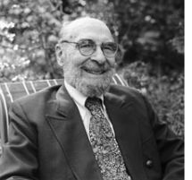
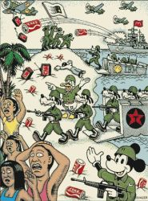
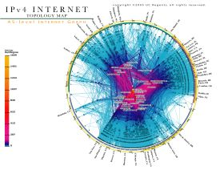

Title: „Endalok sögunnar“ og yfirlitið á tímum hnattvæðingar
Slug: endalok-soegunnar-og-yfirlitid-a-timum-hnattvaedingar
Date: 2007-04-25 13:01:00
UID: 152
Lang: is
Author: Magnús Sveinn Helgason
Author URL: 
Category: Sagnfræði
Tags: 

Líkt og veraldarsaga á hnattsaga uppruna sinn í kennslustofunni. Hún kemur fram sem tilraun til þess að bjóða nemendum upp á inngangsnámskeið sem veitir þeim einhverskonar sögulegan skilning á veröldinni og samtíma sínum. Líkt og veraldarsagan kemur hún einnig fram sem svar við evrópumiðjun _Western Civ_ og hefðbundinnar “stórsögu”. Hnattsaga vex því úr sama jarðvegi og veraldarsaga og skiptar skoðanir eru uppi um hvort gera eigi greinarmun á þeim. Sumir sagnfræðingar hafa haldið því fram að hnattsaga sé aðeins tísku-nafn á veraldarsögu, notað til þess að laða að nemendur. “The term global history was simply a modish, space age name for world history” eins og Gilbert Allardyce komst að orði.[^1] Það er þó rétt að gera greinarmun á þessum tveimur greinum, bæði vegna ólíkra viðfangsefni, en ekki síður vegna þess að frásagnarmáti þeirra er í grundvallaratriðum ólíkur. 

Mikilvægasti munurinn liggur í áherslu á ólík tímabil. Veraldarsaga hefur mestmegnis fjallað um fornöld, miðaldir og árnýöld, en tuttugasta öldin hefur yfirleitt fengið fremur lítið rými í kennslubókum í veraldarsögu. _The Journal of World History_ birti sömuleiðis mjög fáar greinar um 19. eða 20. öld. Í sjálfu sér fékk 20. öldin þó aðeins hlutfallslega jafn mikið rými og fyrri skeið mannkynssögunnar. Það er einnig mjög krefjandi verk að kenna stór yfirlitsnámskeið, svo ekki sé talað um sögu mannkynsins frá upphafi vega til okkar daga, og veraldarsögunámskeið geta því yfirleitt ekki eytt meira en einni eða tveimur vikum í að fjalla um 19 og 20 öldina. Þó samtímasaga, sérstaklega saga heimsstjórnmála og kalda stríðsins, hafi verið afgreidd í sérhæfðari námskeiðum, höfðu sagnfræðingar lítið sem ekkert fjallað um hnattvæðingu, sem félagsvísindamenn töldu mikilvægasta einkenni samtímans. Háskólanemar sem vildu fræðast um rætur hnattvæðingar urðu því að leita í aðrar háskóladeildir, sérstaklega til félagsfræðinnar. Hnattsagan kom fram á níunda áratugnum sem svar sagnfræðinnar.

Eftirspurnin virðist hafa verið til staðar, því hnattsaga hefur unnið sér öruggan sess sem kennslugrein í bandarískum sagnfræðideildum, þar sem hún er víða með aðsóknarmestu námskeiðum sem boðið er upp á, t.d. í Minnesota háskóla. Rannsóknir, bóka og greinaskrif, eru skemur á veg komin. Þó hefur _American Historical Association_ gefið út ritaröð í veraldarsögu síðan 1987, _Essays on Global and Comparative History,_ og nýlega hóf göngu sína sérhæfð tímarit helgað hnattsögu, _The Journal of Global History_ (2006). Það er þó til marks um grósku í hnattsögu að í ár hefur göngu sína annað tímarit helgað henni, _New Global Studies_. 

Hnattsagan fæst við söguleg vandamál og ferli sem er hvorki hægt að fanga innan ramma þjóðríkisins né flokka með hefðbundinni samanburðarsögu — hnattrænar spurningar, vandamál eða ferla. Samtímasaga krefst í auknum mæli slíks hnattræns sjónarhorns. Skilningur á hagsögu einstaka ríkja krefst t.d. skilnings á stöðu þeirra innan heimshagkerfisins. Mikilvægustu efnahags og fjármálakreppur tuttugustu aldarinnar hafa verið hnattrænar, bæði í orsökum og afleiðingum. Neyslumenning nútímans er sömuleiðis hnattræn. Síðan 2001 hafa flestir talsmenn hnattsögu í Bandaríkjunum nefnt “stríðið gegn hryðjuverkum” (_the global war on terror_). Sögu kalda stríðsins er sömuleiðis ekki hægt að segja nema með hnattrænni nálgun, því þó margar mikilvægustu ákvarðanirnar hafi verið teknar í Washington og Moskvu, teygði kalda stríðið sig til allra heimshorna. Kaldastríðsfræðingar hafa á seinustu árum einnig lagt aukna áherslu á “local actors”. Atburðarásin var ekki síður knúin áfram af staðbundnum aðstæðum, stjórnmálum eða félagsþróun í þriðja heiminum en í höfuðborgum fyrsta og annars heimsins.

Þó fræðimenn séu ekki á einu máli um hversu langt aftur skuli rekja sögu hnattvæðingar eru allir sammála um að hún sé tiltölulega nýlegt fyrirbrigði. Flestir benda á nítjándu öldina og er þá miðað við iðnvæðingu Evrópu og annað skeið evrópskrar heimsvaldastefnu, sem hefð er fyrir að talið sé hefjast með innlimun Alsír í franska heimsveldið árið 1830. Aðrir telja hnattvæðinguna hefjast eftir seinni heimsstyrjöldina, eða á áttunda áratugnum. Um svipað leyti tóku fræðimenn fyrst að veita hnattvæðingu athygli. Hugtakið er upprunnið í félagsfræði — hugmyndin um “the global village” varð fræg á sjöunda áratugnum eftir útkomu bókar Marshall McLuhan og Quentin Fiore, _War and Peace in the Global Village_ (1968). Roland Robertson er þó yfirleitt nefndur sem áhrifamesti frumkvöðull rannsókna á hnattvæðingu.[^2]

Mikilvægasta einkenni hnattvæðingar er vitaskuld að dregið hefur úr mikilvægi þjóðríkisins, sem getur ekki reist rönd við hnattrænum öflum. Mest aðkallandi vandamál og viðfangsefni samtímans er ekki hægt að skilja innan hefðbundins ramma þjóðríkisins, heldur eru þau raunverulaga hnattræn. Sagnfræðingar, líkt og aðrir háskólaborgarar, bera ekki aðeins ábyrgð á því að lýsa veröldinni réttilega, heldur einnig að ljúka upp augum almennings fyrir aðkallandi vandamálum okkar tíma. Umhverfismál koma auðvitað fyrst upp í hugann, enda hafa umhverfissögufræðingar verið atkvæðamiklir innan hnattsögunnar. Hnattvæðingin kallaði því á nýja sögu sem ekki væri byggð í kringum þjóðríkið. Michael Geyer og Charles Bright halda því fram að “the central challenge of a renewed world history at the end of the twentieth century is to narrate the world’s pasts in an age of globality”.[^3] 

Mikilvægasti einkenni hnattsögunnar er að hún er samtímasaga — ekki eingöngu í þeim skilningi að hún fjallar um atburði sem eru okkur nærri í tíma, heldur ekki síst vegna þess að efnisval hennar ræðst af samtímanum. Markmiðið er að skýra samtímann — ekki að segja sögu liðinna atburða. Hnattsagan er samtímamiðuð, _presentist_, og ólíkt veraldarsögunni horfir hún “aftur á bak” í gegn um söguna — frekar en að segja sögu frá “upphafi til okkar daga”. Wolf Schäfer setur þetta fram svo: 

> I would characterize the difference as follows: we global historians are chiefly interested in past and present globalizations and their contemporary outcome (globality), whereas the main focus of our world-historical colleagues is on civilizations and their epic struggles.[^4]

Skrif allra hnattsögufræðinga renna því öll að sama endapunkti og námskeið í hnattsögu _byrja_ því yfirleitt á fyrirlestri um eðli hnattvæðingar og ástand veraldarinnar í dag. Þessi áhersla á samtímann og hnattvæðingu býður upp á heildstæðari söguþráð en ella og gerir að verkum að auðveldara er að setja saman stór yfirlitsnámskeið, þar sem nemendur ræða hvernig mismunandi söguleg ferli hafa endurspeglað, unnið gegn, eða lagt sitt af mörkum til hnattvæðingar.

Samtímaáherslan gerir einnig að verkum að hnattsaga er tematískari en veraldarsaga og ekki eins bundinni af línulegri, krónólógískri frásögn. Hnattsögufræðingar rekja ekki sögu ríkja eða menningarsvæða, heldur sögu ferla og þróunar sem hefur teygt anga sína um allan hnöttinn. Í formála _Essays on Global and Comaprative History_ segir Michael Adas:

> Writers of the new global history are less concerned with comprehensiveness or with providing a total chronology of human events. Their works tend to be thematically focused on recurring processes like war and colonization or on cross-cultural patterns like the spread of disease, technology, and trading networks.[^5]

Hnattsögufræðingar halda því fram að með því að fórna draum veraldarsögunnar um allsherjar heildarsýn yfir alla mannkynssöguna sé hægt að segja heildstæðari sögu, sem skýri samtímann betur. Hnattsagan kemur því fram bæði sem tilraun til að svara spurningum sem veraldarsagan hafði ekki sinnt og sem andóf við frásagnarhefð hennar. En frekar en að “hafna yfirlitinu” halda flestir hnattsögufræðingar því fram að samtíminn krefjist _nýs yfirlits_, nýrrar sögulegrar nálgunar sem yfirstígi ekki aðeins evrópumiðjunina og þjóðríkið, sem einkenndu _Western Civ_, heldur einnig áherslu veraldarsögunnar á menningarsamfélög og tilraunir póstmódernista til að “afmiðja” eldri sögu. Bright og Geyer benda á að hnattvæðingin fáist ekki skilin sem framhald af sögu einstaka heimshluta eða landa. Sögu hennar sé ekki hægt að skrifa sem síðasta kaflann í sögu vesturlanda, afleiðingu af sigurgöngu vestrænnar menningar (eða heimsvaldastefnu), né er hægt að skrifa hana út frá hetjulegri varnarbaráttu hinna undirokuðu. Við getum ekki skilið hnattvæðingu með því að hlaða upp stöðugt sérhæfðari og þrengri þekkingu á sögulegri sérstöðu afmarkaðra viðfangsefna. Það þarf einhverskonar frásögn, söguþráð og yfirlit, til þess að ljá þessu fyrirbrigði merkingu sem getur gert okkur kleift að takast á við það á ábyrgan máta.

> But, in bringing out this history, it is important to realize that the condition of globality that characterizes our age is no more the sum of all pasts than it is the fulfillment of a special (Western) past.[^6]

Bright og Geyer benda ennfremur á að hnattsaga geti forðað okkur frá sögulegri nauðhyggju á borð við þá sem einkennir mikið af skrifum um hnattvæðingu. Sú saga hnattvæðingar sem nemendum er boðið upp á í öðrum fræðigreinum og fjölmiðlum er yfirleitt byggð á frekar “gamaldags” sagnfræði — þar sem hnattvæðingin er lítið annað rökrétt skref í útbreiðslu vestrænnar menningar og seinasti kaflinn í endurvakinni “mannkynssögu” _Western Civ_. 

Mannskepnan er þannig útbúin að hún leitar skýringa á umhverfi sínu, samtímanum og sögulegum uppruna hans. Ef sagnfræðingar skjóta sér undan því að segja þessa sögu munu aðrir gera það; ef sagnfræðingar neita að skrifa sögu hnattvæðingar og veraldarinnar, og bjóða upp á sannfærandi yfirlit af hræðslu við að öll yfirlit séu menguð af evrópumiðjun og dæmd til að þjóna sem verkfæri í höndum heimsvaldasinna, verður afleiðingin einmitt sú að eldri evrópumiðjuð saga heldur velli eða jafnvel að enn vafasamari söguleg nauðhyggja úr félagsfræði eða hagfræði verði ríkjandi. Gott dæmi um slíka nauðhyggju er bók Francis Fukuyama _The End of History_, (1992) sem setur upp mjög einfaldaða mynd af gangverki veraldarsögunnar og óumflýjanleika hnattvæðingar undir formerkjum vestrænna menningargilda og kapítalískra framleiðsluhátta. Verkefni hnattsögufræðingsins er að sýna lesendum sínum og nemendum að hnattvæðing okkar daga á sér sögu, að hún sé ekki óumflýjanleg eða eigi sér eina fyrirframgefna útkomu. Slíkur sögulegur skilningur er grundvöllur þess að við getum tekist á við vandamál samtímans á uppbyggilegan og upplýstan máta. 

----

<small class="blurb">**15. desember 2007:** Höfundur óskar að tekið sé fram: Þessi grein er fyrstu drög að stærra verki sem er í vinnslu.</small>

[^1]: Gilbert Allardyce, “Toward World History, American Historians and the Coming of the World History Course” _Journal of World History_ 1 (vor 1990), bls. 23-76. Sjá bls. 43.
[^2]: Roland Robertson, _Globalization: Social Theory and Global Culture,_ (London, 1992). — Félagsfræðingnum W.E. Moore er stundum eignaður heiðurinn af því að hafa fyrstur talað um hnattvæðingu, “Global Sociology: The World as a Singular System”, _American Journal of Sociology,_ 71:5, (1966), bls. 475-482. 
[^3]: Michael Geyer; Charles Bright, “World History in a Global Age”, _The American Historical Review,_ 100:4, (október 1995), bls. 1034-1060. Tilvitnun á bls. 1041.
[^4]: Wolf Schäfer, “The New Global History. Toward a Narrative for Pangaea Two”, _EWE_ 14:1 (2003), bls. 75-88. Tilvitnun bls. 75.
[^5]: Michael Adas, “Foreword”, _The Columbian Voyages, the Columbian Exchange, and Their Historians,_ eftir Alfred W. Crosby (Washington D.C., 1987), bls. V.
[^6]: Michael Geyer; Charles Bright, “World History in a Global Age”, _The American Historical Review,_ 100:4, (október 1995), bls. 1034-1060. Tilvitnun á bls. 1042.

