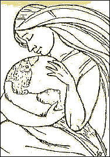

Title: Er vistfræðikreppa nútímans afleiðing feðraveldis og kapítalisma?
Slug: er-vistfraedikreppa-nutimans-afleiding-fedraveldis-og-kapitalisma
Date: 2005-11-22 00:06:48
UID: 19
Lang: is
Author: Hrafnhildur Ragnarsdóttir
Author URL: 
Category: Kynjafræði, Umhverfismál
Tags: Umhverfisfemínismi, vistfræði, femínismi, umhverfisvernd, Francoise d’Eaubonne, Rosemary Ruether, Sherry Ortner, jafnrétti, umhverfisfræði, Umhverfismál

Umhverfisfemínismi, eða _ecofeminism_, er áhugaverð blanda af róttækri vistfræði og femínisma sem hefur verið að festa rætur í háskólum víðs vegar í vestrænum samfélögum. Umhverfisfemínismi eru mótmæli kvenna við þeim umhverfisspjöllum sem þær telja vera afleiðingar hins kapítalíska feðraveldis sem við lifum í. Þessi hugmyndafræði spratt ekki upp á einum stað, eða á ákveðnum tíma, heldur kom upp á yfirborðið þegar konur víðsvegar um heiminn fóru að mótmæla umhverfisspjöllum á 7. og 8. áratug síðustu aldar.

Allt frá árinu 1962 hafa ótrúlega margar kærur gegn stórfyrirtækjum í Bandaríkjunum komið úr eldhúsum kvenna. Árið 1964 setti hópur kvenna í Bandaríkjunum á fót samtök til að berjast gegn umhverfisspjöllum. Þær töluðu fyrir umhverfisvænni jarðrækt og nauðsyn þess að spyrna gegn mengun. Greinar fóru að birtast í blöðum og bók Francoise d’Eaubonne, _Le féminisme ou la mort_, kom út 1974, og bók Rosemary Ruether, _New Woman, New Earth_, stuttu síðar. Þetta markaði akademískt upphaf umhverfisfemínisma. Konur fóru að grípa til aðgerða, samtök voru stofnuð víðs vegar um heim, og fleiri bækur voru gefnar út.

Ein áhrifamestu skrif þessa tíma var grein Sherry Ortner, _Is Female to Male as Nature is to Culture_. Greinin var skrifuð árið 1974 þar sem Ortner setti fram hugmyndir sem umhverfisfemínismi byggir að miklu leyti á. Hún hélt því fram að bæði menningarlega og sögulega hafi konur verið álitnar hafa sterkari tengsl við náttúru en karlar, vegna líffræðilegs og félagslegs hlutverks þeirra. Líffræðilega vegna barnsburðar, tíðarhrings og brjóstagjafar, og félagslega vegna hlutverks kvenna sem mæður og húsmæður. Ortner taldi að konur hefðu þróað með sér tilfinningalegar hliðar sem væru í meiri tengslum við hið sérstaka og persónulega, á meðan karlmenn hefðu haft meiri tíma og frelsi til að veiða, ferðast, berjast, og vera í forsvari fyrir opinberum málefnum. Karlar hefðu útilokað konur frá opinberum málum. Þeir samsömuðu sig menningu og hinu andlega, og skilgreindu sig sem yfir náttúruna hafna, eins og yfir konur hafnar.

Þær konur sem aðhyllast umhverfisfemínisma telja að bæði konur og náttúra hafi verið kúguð af mönnum í gegnum sögu og tíma. Verði þessum tengslum og viðhorfum breytt, sé ekki aðeins hægt að stuðla að jafnrétti kynjanna, heldur líka finna jafnvægi milli náttúru og mannfólksins, og bjarga jörðinni frá eyðileggingu. Þær vilja að mannfólkið viðurkenni að það er hluti af náttúrunni, en setji sig ekki ofar henni, og telja að það arðrán á náttúrunni sem við horfum upp á í dag, vera beina afleiðingu hins kapítalíska feðraveldis.

Umhverfisfemínistar benda réttilega á að konur eru í meirihluta mótmælenda gegn mengun og öðrum umhverfisspjöllum, og leggja margar áherslu á sérstaka kvennasögu og kvennamenningu.  Karlar eru aftur á móti þeir sem taka ákvarðanir og standa að baki þessum sömu umhverfisspjöllum. Konur standi því uppi með að reyna að laga eða bæta arðrán karla. Konur hafa því ekki aðeins tekið ábyrgð á hinni ólaunuðu vinnu innan veggja heimilisins sem mæður og húsmæður, heldur berjast líka fyrir verndun náttúrunnar.

Samkvæmt þessari hugmyndafræði, hafa hvorki umhverfisfræði né framkvæmdir tekið tillit til þarfa kvenna né aðstæðna þeirra um allan heim, og afleiðingar þessara framkvæmda á störf kvenna og lífsafkomu hunsuð. Umhverfisfemínistar halda því fram að aðgerðir karla komi oft verst niður á konum og rökstyðja orð sín með því að benda á að kjarnorkugeislun hafi orsakað fæðingargalla barna. Karlar skilji eftir sig hættulegan úrgang nálægt skólum og heimilum sem spilli drykkjarvatni og auki hættu á fósturmissi. Þeir úði meindýraeyði yfir akra og skóga þar sem konur ala upp börnin sín, og leggi þannig líf þeirra í hættu. Þær halda því ekki fram að allir karlar standi að baki umhverfisspjöllum og að allar konur séu þolendur umhverfisspjalla, og að um hreina tvískiptingu sé að ræða. Fremur að hin yfirráðandi karllæga heimssýn sem leggur áherslu á tæknilegar framfarir og frjálsan markað taki hvorki tillit til umhverfisins, né bágrar félagslegrar og efnahaglegrar stöðu kvenna í heiminum. Umhverfisfemínistar trúa því að femínismi sem tengi saman baráttuna fyrir kynjajafnrétti og gegn umhverfisspjöllum skapi farveg fyrir réttlátara og jafnara þjóðfélag, og leita eftir því að umhverfisfemínismi verði viðurkenndur meðal bæði femínista og umhverfissinna.

Umhverfisfemínismi þróaðist af sömu ástæðu og hver önnur grein af femínisma; vegna þess að konur eru að miklu leyti raddlausar þegar kemur að því að taka, eða hafa áhrif á, mikilvægar ákvarðanir og framkvæmdir. Umhverfisfemínistar hafa verið gagnrýndir fyrir eðlishyggju og fyrir að styðja þá hugmynd að meginhlutverk kvenna sé, og eigi, að vera mæður. Konur eigi nú ekki einungis einar að bera ábyrgð á barnauppeldi, heldur einnig að vera mæður jarðarinnar og laga það sem hin karllæga hugmyndafræði og tækni skaðar. Víst er að sumir umhverfisfemínistar standa tæpt á bjargi eðlishyggju. Veruleikinn sýnir okkur þó að konur og karlar gegna enn ólíkum hlutverkum bæði félagslega og efnahagslega. Umhverfisfemínistar leggja áherslu á þennan mun og vilja hið kvenlæga njóti jafnréttis við hið karllæga. Þær trúa að með því að ná jafnvægi milli hins kvenlæga og karllæga, náist einnig jafnvægi milli menningar og náttúru.

Konur sem aðhyllast umhverfisfemínisma telja að tengsl kvenna við menningu og náttúru veiti þeim tækifæri til að skapa menningu og stjórnkerfi sem sameina sálrænt innsæi og rökræna þekkingu, vísindi og þjóðmenningu. Hlutverk kvenna sé að byggja upp þjóðfélag þar sem náttúran og menning sættast og skilin milli manns og náttúru eru afmáð. Umhverfisfemínistar benda réttilega á að félagslegur og umhverfislegur vandi er sprottin af sömu rót. Marktækar breytingar þurfi til hins betra og krefjast verði stefnubreytinga sem varða grundvallaruppbyggingu þjóðfélagsins í efnahagslegu, tæknilegu og hugmyndafræðilegu tilliti.
