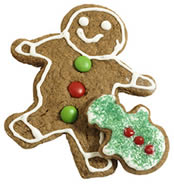
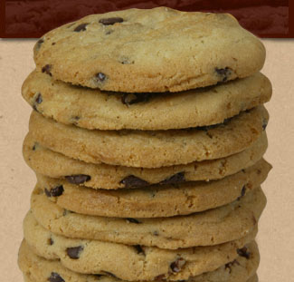

Title: „Ertu byrjuð að baka?“
Slug: ertu-byrjud-ad-baka
Date: 2006-12-21 14:44:00
UID: 121
Lang: is
Author: Sólveig Ólafsdóttir
Author URL: 
Category: Menningarfræði, Neyslusamfélagið
Tags: 

Þessari spurningu var beint til mín af samstarfskonu minni að morgni vinnudags, snemma á jólaföstunni. Spurningin virðist í fyrstu ósköp einföld. En fyrir hvað stendur smákökubakstur aðventunnar og hvernig má rekja slóðir smákökusortanna í gegnum þjóðmenningu tuttugustu aldar? Matarmenning hverrar þjóðar er mjög mikilvæg því hún nærir ekki síður anda en maga. Hún endurspeglar öðru betur menningarástandið í samfélaginu og má nota líkt og hitamæli til að gæta að því hvernig þjóðinni líður í landinu[^1].

### „Það á að gefa börnum brauð að bíta í á jólunum“[^2] 

Þetta alkunna kvæði vitnar í tilskipun um ákveðin réttindi barna og annars undirmálsfólks á jólunum.  Á meðan klifað var á húsagaskyldunum í lagatextum fyrri alda voru réttindi þeirra áréttuð í þjóðtrú og hefðum. Það átti að passa upp á að börnin fengu nýjar flíkur fyrir jólin annars færu þau í Jólaköttinn og það átti að gefa þeim brauð þó svo að landið væri nánast mjöllaust. Hallgerður Gísladóttir, sérfræðingur á Þjóminjasafninu segir tvennt hafa einkennt matargerð úr mjöli á Íslandi allt fram yfir aldamótin 1900. Annars vegar þá staðreynd að hér á landi voru ekki til bakaraofnar eins til voru í Evrópu allt frá fornöld enda var hér landlægt eldiviðarleysi. Hins vegar var það viðvarandi mjölleysi „sem átti rót sína að rekja til kulda og einangrunar landsins en úr kornrækt dró þegar veðurfar tók að kólna á síðmiðöldum og henni var að mestu hætt um siðaskipti. Það sem til var af mjöli þótti nýtast betur í grauta og því var lítið um brauð.“[^3]  Fram á 20. öld var brauðið sparimatur og því jafnframt það sem almenningi þótti eftirsóknaverðast í mat.[^4]  Það er því ekki furða að laufabrauðið skuli hafa verið skapað með því lagi sem það er enn skorið í í dag, örþunnt og ofskreytt. Laufabrauðið var einmitt það brauð sem börnin áttu að fá á jólunum og þá kannski bara eina köku. 

Það ekki fyrr en með tilkomu bakara og bakaraofna í Reykjavík og Akureyri um aldamótin 1900 að smákökur taka að ryðja sér til rúms. Um smákökurnar segir Hallgerður: „Ýmsar tegundir — til dæmis gyðingakökur, hálfmánar, vanilluhringir og piparkökur — komu frá Danmörku og unnu hér hratt land í lok 19. aldar og byrjun þeirrar 20.“[^5]  Smákökurnar voru seldar í bakaríum og voru ekki sérstaklega bundnar við jólin.[^6]  Í bókinni „Lærið að matbúa“, eftir Helgu Sigurðardóttur, sem kom út árið 1934, eru einmitt uppskriftir af gyðingakökum, vanilluhringjum, kókosmakkarónum, mömmukökum og tíglum en engin uppskrift af piparkökum.[^7]  Þær virðast ekki hafa verið ættleiddar úr bakaríunum í heimaeldhúsin með sama hætti og hinar smákökurnar[^8] . Þegar uppskriftirnar eru skoðaðar gaumgæfilega kemur í ljós að þær eiga það allar sammerkt að vera fituríkar og nánast alveg lausar við hin fágætu egg. Í uppskriftinni að vanilluhringjunum er hálft egg[^9]  á móti 250 gr. af hveiti og í gyðingakökunum er eitt egg á móti 175 gr. af hveiti. Tíglarnir, mömmukökurnar og jafnvel kókosmakkarónurnar eru án eggja.  Í „Kvennafræðaranum“, sem er enn eldri matreiðslubók eru svo uppskriftir af hálfmánum, spesíum og vanilluhringjum án eggja.[^10]  Annað  uppskrifta er hversu litlar þær eru og er í flestum tilfellum um hnoðað deig að ræða en ekki hrært. Hér ræður naumhyggjan förinni. 

Þegar smákökubaksturinn kemur inn á heimilin fer hann smátt og smátt að tengjast jólunum. Aðrar kökugerðir, sem ekki krefjast eins mikillar handavinnu voru bakaðar allt árið og jólakakan, þ.e. formkakan með rúsínunum verður heilsárskaka þrátt fyrir nafnið. Það má ætla að tilkoma húsmæðraskólanna og annarar reglubundinnar kennslu í heimilisfræðum hafi átt sinn hlut í að forma og miðstýra regluverkinu í kringum heimilisreksturinn og með árunum varð til afar sterk hefð í kringum jólasmákökubakstur heimilanna.[^11]  Sömu uppskriftir með sömu eða svipuðum nöfnum urðu gegnumgangandi hvar sem var á landinu og fjöldi sorta hjá húsmæðrunum voru frá fimm til átta. Grunndeigið í sumum sortanna var það sama en svo var einhverju bætt við sem skildi á milli sortanna eða kökurnar mótaðar á mismunandi hátt.[^12]  Smákökurnar voru bakaðar snemma á jólaföstu og voru geymdar í lokuðum dunkum sem  mikil bannhelgi ríkti yfir. Nokkrar kökur voru bornar fram daginn sem þær voru bakaðar en að öðru leyti voru þær settar undir lás og slá og vei þeim börnum sem stálust í dunkana. Húsmæður óþekku barnanna brugðu stundum á það ráð að fá að geyma smákökudunkanna í öðrum húsum eða líma þá hreinlega aftur.[^13]  

Það er eftirtektarvert að þegar líður á öldina minnka áherslur á smákökur í auglýsingum bakaríanna í Reykjavík mjög mikið[^14] . Má kannski draga af því þá ályktun að þær hafi dottið úr sölu á öðrum tímum ársins, en um miðja öldina þótti nánast skammarlegt að kaupa smákökur úr bakaríum fyrir jólin.[^15]  Seinni heimstyrjöldin, innflutningshöft og skammtanir höfðu vitanlega sín áhrif á aðdrætti til heimilisins en samt var reynt að uppfylla smákökuhefðirnar eftir bestu getu. Öll spjót voru höfð úti með að útvega eggin og húsmæðurnar geymdu sykurskömmtunarmiðanna eins og sjáaldur auga síns. 

Það er hægt að gera sér í hugarlund að fram eftir 20. öldinni hafi verið mikill aðstöðumunur á milli húsmæðra, ekki einungis vegna efna heldur einnig aðstæðna. Húsmæður í Reykjavík og öðrum kaupstöðum höfðu miklu betri möguleika á að afla sér hráefna og rafmagnsofna urðu þar algengar miklu fyrr en úti á landi. Ég leyfi mér hér með að vitna beint í frásögn Sigrúnar Lárusdóttur, f. 1951, sem ólst upp á Neðra-Nesi á Skaga „Byrjað að baka fyrripart desember. Eggjaskortur á þessum árstíma þar sem hænurnar felldu fiður í skammdeginu og verptu mjög lítið. Bakað í kolaeldavél, sem kynt var með rekavið og mó fyrr á árum. Mikill vandi að halda hæfilegum hita í ofni. Öll deig hnoðuð ekki hrærð enda ekkert rafmagn og engin hrærivél. Helstu tegundir: Vínartertan, brúnterta, gyðingakökur, hálfmánar, rúsínu-, bónda- og sírópskökur. Sírópið lagað heima. Oft notuð hrossafita í stað smjörlíkis. Rafmagn kemur í sveitarfélagið 1974 og þá urðu ýmsar breytingar í hátt til nútímahorfs. Meira um hrærðar kökur og lagtertubotna, þó íhaldssemi ríkti á þessu sviði sem flestum öðrum. Þegar ég hef búskap hélt ég mjög fast í gamlar hefðir en þó bættust við nokkrar „eggjafrekar tegundir“ svo sem Marens sem sem sást ekki á mínum uppvaxtarárum.“[^16] 

### „Hér er ekkert fínt undir sautján sortum“[^17] 

Þegar dró úr höftum og skömmtunum eftirstríðsáranna hljóp nokkuð líf í jólasmákökubaksturinn.  Hráefni til bakstur varð fjölbreyttara og ekki skorti lengur eggin enda fara uppskriftirnar að bera þess merki.[^18]  Það er hægt að finna fyrir léttum glímuskjálfta í lýsingum húsmæðra.[^19]  Þá urðu sem flestar smákökusortir einkennismerki góðra húsmæðra og þar ríkti, og ríkir kannski enn, sum staðar, metingur og metnaður þeirra á milli[^20]  Það var ekkert fínt undir fjórtán sortum og eftir að spurt hafði verið hvort baksturinn væri hafinn var næsta skref að spyrja um sortafjölda. Svava Guðrún Sigurðardóttir, f. 1972, segir að í byrjun tíunda áratugsins hafi ríkt ósvikinn keppnisandi hjá konunum við færibandið í Rækjuvinnslu Skagastrandar og þær hafi yfirboðið hvor aðra í sortafjölda.[^21]  „Ætlaði að baka sjö smákökutegundir en hætti þegar þær voru orðnar sautján, segir Sigríður María Bragadóttir húsmóðir“[^22]  í fylgiriti Morgunblaðsins, „Daglegt líf“, sem síðar átti eftir að breytast í árlegt Jólablað Morgunblaðsins og hér er rétt að vitna í dásamlegan jólatexta Borgardætra um ömmu engil: „þegar ofnskúffan átjándu sortina sá..“[^23]  Með tilkomu margs konar heimilisblaða, Eldhúsbókarinnar, Vísis í vikulokin, Vikunnar, matardálka í dagblöðum, smábæklinga Osta- og smjörsölunnar og síðast en ekki síst uppskriftabæklinga Nóa-Síríus[^24]  varð aðgangur að nýjum og spennandi uppskriftum greiður og „uppáhaldskökurnar mínar“ hættu að vera gyðingakökur, hálfmánar og önnur klassík og við tóku spennandi súkkulaðibitakökur, marengs-smákökur, haframjölskossar með hjúpsúkkulaði, amerískar smákökur, kornflekskökur og „góðar smákökur.“[^25]   Hinn nútímalegi smekkur var staðfestur í öllum þessum blöðum og uppskriftabæklingum og kannski hefur hér bæst við ný spurning við hinar tvær, „ertu búin að prófa þessa nýju“?

Mesta útbreiðslu þessara blaða hefur jólablað Morgunblaðsins fengið en það hefur verið gefið út í tuttugu ár. Í jólablaði Moggans hefur áhersla verið lögð á viðtöl við myndarlegar húsmæður, sem gefa uppskriftirnar sínar og lýsa jólastemningunni, alls kyns hollráð varðandi mat og bakstur og jafnvel leiðbeiningar um jólaundirbúning frá degi til dags.[^26]  Öll þessi opinbera umræða um jólabaksturinn sem og aðra hefðbunda hluta jólahaldsins hefur orðið til að tryggja og herða á fastmótuðum venjum. En þó að kökurnar sjálfar hafi breyst og þó svo að hópur „meðvitaðra kvenna“ hafi gert uppreisn gegn þessum hefðum og neitað að baka fyrir jólin[^27]  þá var það mikill meirihluti húsmæðra landsins, sem tók, og tekur kannski enn, þátt í kappbakstrinum.

Til þess á ná sömu áhrifum og forfeður okkar og formæður fengu af þunnri laufabrauðskökunni sinni eða hálfmánunum með hálfu eggi þurfum við að baka kökur Söru Bernhard með átta eggjum og 150 gr. af 70% suðusúkkulaði og ef að við höfum ekki tíma til að baka getum við alltaf leitað í þau bakarí sem baka jólasmákökurnar líkt og þær væru heimagerðar, óreglulegar og mislitar.[^28]  Það má því segja að smákökurnar séu, að minnsta kosti að hluta til komnar aftur heim í bakaríin.

Í nýjasta jólablaði Morgunblaðsins, sem kom út föstudaginn 1. desember er miðopnan óvenju glæsileg. Undir fyrirsögninni „Föndrað við smákökur formæðranna“ gefur Jenný Bjarnadóttir uppskriftir að eftirfarandi jólasmákökum, ödduhringjum (vanilluhringjum), gyðingakökum, piparkökum, röggu-rósukökum, ömmu-dæs, súkkulaðifingrum, spesíum og mömmukökum. Jafnframt segir Jenný bökunarsögur þriggja kynslóða kvenna og í lokin kemur fram að þessum sögum hafi verið haldið til haga „því þær færa okkur mæðgurnar og börnin sem okkur fylgja nær fólkinu okkar - og um það snúast auðvitað jólin fyrst og fremst.“[^29]  Hér er þá kominn, hinn sanni tilgangur jólanna og það er að tengja saman kynslóðirnar með öllum hefðunum og venjunum og hver veit nema að smákökubaksturshefð okkar Íslendinga eigi eftir að rata á menningarerfðaskrá Unesco[^30]  og kannski eigum við eftir að koma okkur upp jólasmákökuráði, sem varðveitir smákökurnar frá öllum óæskilegum breytingum á sama hátt og  þjóðbúningaráðið passar upp á varðveita þjóðbúninginn okkar.[^31] 

[^1]: Andi Valdimars Kr. Hafstein og Sigrúnar Sigurðardóttur svífur hér yfir vötnunum. Sjá nánar tiltekið: Valdimar Tr. Hafstein, „Menningararfur.  Sagan í neytendaumbúðum“, _Frá endurskoðun til upplausnar. Tvær prófritgerðir, einn formáli, þrjú viðtöl, sjö fræðigreinar, fimm ljósmyndir, einn eftirmáli og nokkrar minningargreinar af vettvangi hugvísinda_, ritstjórar Hilma Gunnarsdóttir, Jón Þór Pétursson og Sigurður Gylfi Magnússon, Miðstöð einsögurannsókna og ReykjavíkurAkademían, Reykjavík 2006, bls. 313-328 og Sigrún Sigurðardóttir, „Magdalenukökur. Um fortíð og framtíð í sagnfræði samtímans“, sama rit.

[^2]: Íslenskt þjóðkvæði haft eftir minni.	

[^3]: Hallgerður Gísladóttir, _Íslensk matarhefð_, Mál og menning, Reykjavík, 1999, bls.15.

[^4]: Hallgerður Gísladóttir, _Íslensk matarhefð_, bls.18.

[^5]: Hallgerður Gísladóttir, _Íslensk matarhefð_, bls.236.

[^6]: Lausleg athugun í gagnasafni Morgunblaðsins á tímabilinu 1913-1930 leiddi í ljós að bakarí og verslanir auglýstu smákökur til sölu allan ársins hring. Sjá [Tímarit.is](www.timarit.is/mbl).

[^7]: Helga Sigurðardóttir, _Lærið að matbúa, matreiðslubók og ágrip af næringarefnafræði_, Prentað á kostnað höfundar, Reykjavík 1934, bls.136-138

[^8]: Piparkökurnar komu á Akranes með matreiðslunámskeiði, sem haldið var þar seint á fjórða áratugnum. Svona matreiðslunámskeið voru haldin af og til á Akranesi og komu þá hússtjórnarkennarar frá Reykjavík. Viðtal við Katrínu Georgsdóttur, f. 1932 en móðir hennar, Vilborg Matthildur Ólafsdóttir, f. 1908 fór einmitt á þetta námskeið.

[^9]: Alla mína baksturstíð hef ég verið að velta þessum hálfu eggjum í uppskriftum fyrir mér. Mér er fyrirmunað að skilja hvernig húsmæður fyrri tíma fóru að við að skipta eggjum í tvennt.

[^10]: Hallgerður Gísladóttir, _Íslensk matarhefð_, bls.243. Hér er Hallgerður að vitna í _Kvennafræðarann_ eftir Elínu Briem, sem kom út árið 1911.

[^11]: Viðtöl við Katrínu Georgsdóttur, f. 1932, Sólveigu Magnúsdóttur, f. 1932, Þórdísi Ólafsdóttur, f. 1948, Elínu Ólafsdóttur, f. 1946.

[^12]: Viðtal við Sólveigu Magnúsdóttur, f. 1932 um jólahald á æskuheimili hennar í Nýlendu í Miðneshreppi.

[^13]: Reynsluheimur bernskunnar.

[^14]: Sjá [Morgunblaðið á tímarit.is](http://www.timarit.is/mbl) árin 1913-1950. Þetta var mjög lausleg og ábyrgðarlaus könnun.

[^15]: Viðtöl við Katrínu Georgsdóttur, f. 1932, Sólveigu Magnúsdóttur, f. 1932, Þórdísi Ólafsdóttur, f. 1948, Elínu Ólafsdóttur, f. 1946.

[^16]: Sigrún Lárusdóttir, f. 1951. Skrifleg svör við spurningum mínum 30. nóvember 2006.

[^17]: Halldór Laxness, _Kristnihald undir jökli_, Helgafell, Reykjavík, 1968, bls. 136.  Þetta er tilsvar  frk. Hnallþóru í eftirminnilegasta samtali íslenskra bókmennta, þegar Umbi er alveg að örmagnast undan kökuátinu. Rétt framar í bókinni er lýsing Umba á gyðingakökunum á hlaðborði Hnallþóru: „...gyðingakökur, sem eru heldur niprar í sköpulagi ámóta þykkar og ostra og litlaus blettur úr eggjahvítu og sykri ofaná og minnir á eitthvað uppþornað sem óþarft er að nefna.“, bls.134.

[^18]:  Hér vitna ég í mjög yfirgripsmikið safn mitt af bókum, blöðum og bæklingum um mat og bakstur frá ofanverðri 20. öld og fram til dagsins í dag.

[^19]:  Viðtöl við Katrínu Georgsdóttur, f. 1932, Sólveigu Magnúsdóttur, f. 1932, Þórdísi Ólafsdóttur, f. 1948, Elínu Ólafsdóttur, f. 1946 auk margra lauslegra samtala sem ég hef átt síðustu daga.

[^20]:  Viðtal við Katrínu Georgsdóttur, f. 1932, sem var í Húsmæðraskólanum á Blönduósi 1951-1952.

[^21]:  Viðtal við Svövu  Guðrúnu Sigurðardóttur, f. 1972. 

[^22]: _Morgunblaðið_, 08/12/1989.

[^23]: Borgardætur, _Jólaplatan_, texti Friðrik Erlingsson.

[^24]: Það hafa komið út 12 bæklingar á 13 árum. Svar frá Nóa-Síríus við fyrirspurn minni..

[^25]: Uppskriftir af þessum smákökur birtust undir yfirskriftinni „Uppáhalds smákökurnar mínar“ í _Morgunblaðinu_ 08/12/1989.

[^26]:  „Jólaalmanak“, _Morgunblaðið_ 04/12/1987. Skv. þessu almanaki á að baka jólasmákökurnar þann 9. desember.

[^27]:  Viðtal við Þórunni Guðmundsdóttur, f. 1950, sem segir að vinkonuhópur hennar hafi meðvitað afneitað jólabakstrinum og þeim hefðum sem þeim fannst vera neytt upp á sig á árunum upp úr 1970.

[^28]: Viðtal við Tómas Gíslason, f. 1964.

[^29]:  „Jól 2006“, _Morgunblaðið_, 01/12/2006, bls.52-53

[^30]: http://whc.unesco.org/. „Menningarerfðir“ eru víst íslenska þýðingin á „Cultural Heritage“ og það eru nú áhöld um hvort þetta sé heppileg þýðing.

[^31]: Valdimar Tr. Hafstein, „Menningararfur. Sagan í neytendaumbúðum“, bls.320

