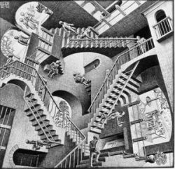

Title: Eru mótsagnir til í raunveruleikanum?
Slug: eru-motsagnir-til-i-raunveruleikanum
Date: 2007-04-03 18:59:03
UID: 147
Lang: is
Author: Karl Jóhann Jóhannsson
Author URL: 
Category: Heimspeki, Sálfræði
Tags: 

Ef raunveruleikinn væri háður skilgreiningum okkar og hugtökum þá væri raunveruleikinn á margan hátt ekki mögulegur. Gefum okkur til dæmis að þegar maður tekur af stað og gengur að dyrum, með það að markmiði að vera inni í herbergi, þurfi hann að komast yfir þröskuld herbergisins áður en hann geti talist inni í herberginu. Þegar maðurinn leggur af stað er ákveðin lengd í tíma og rúmi á milli hans og þröskuldarins, einhvern tímann frá því að maðurinn gengur af stað og þangað til hann er kominn inn í herbergið er lengdin í rúmi á milli upprunalegu stöðu mannsins og þröskuldarins hálfnuð. Á tímanum á milli þess að maðurinn gengur af stað og þangað til hann kemur að þröskuldinum helmingast leiðin aftur og aftur.

Rúm getur deilst í óendanlega hluta – rúm er óendanleg samfella, fyrir hverja tvo staði í rúmi er alltaf einhver staður á milli þeirra – og því helmingast vegalengdin óendanlega oft áður en maðurinn gengur loksins yfir þröskuldinn og inn í herbergið. En fyrst leið mannsins helmingast alltaf og getur haldið því áfram óendanlega, hvernig kemst maðurinn einu sinni að þröskuldinum?

Zenon frá Eleu velti fyrir sér svipaðri spurningu fyrir óendanlega deilanlegum árum, eða jafnvel löngu löngu síðan (2500 árum nánar tiltekið). Hugmyndir Zenons, sem síðar hafa verið nefndar þverstæður Zenons, fást við eðli raunveruleikans og ofangreint dæmi er ágætis lýsing á þverstæðu Zenons um tvískiptingu. 

Zenon tekur einnig dæmi um gríska ofurmanninn Akkiles og skjaldböku sem eigast við í kapphlaupi. Akkiles á við það vandamál að stríða að hann þarf alltaf að vera á þeim stað sem skjaldbakan var þegar hann byrjaði (skjaldbakan fékk forskot) og þar sem hún var þegar hann náði þeim stað og svo framvegis. Þannig gæti Akkiles ekki náð skjaldbökunni.

Ef þetta væri raunin um veruleikann værum við í mjög slæmum málum því ekki væri hægt að labba framhjá útlendingum á Laugaveginum sem gengju á hraða skjaldböku. En þetta vandamál er augljóslega ekki til staðar í raunveruleikanum. Að sjálfsögðu kemst maðurinn leið sína í tíma og rúmi þó hann helmingi leið sína í sífellu. Akkiles á í hægindum með að ná skjaldbökunni og við flýtum okkur framhjá ferðamönnum sem eru að skoða í glugga.

Þverstæðan um sjálfsblekkingu er sama eðlis, það er ekki til í raunveruleikanum. Hún er þannig að maður getur á sama tíma vitað og ekki vitað sama hlutinn. Þetta virðist vera mótsögn, en skoðum aðeins hvort svo sé.

Ef við tökum dæmi af manneskju sem þjáist af þeirri röskun að hún hafi brenglaða sjálfsmynd sem hefur orðið til af þeim orsökum að manneskjan sé búin að ljúga að sér lengi að hún sé feit, á meðan hún gæti í raun ekki verið mjórri. Gerum ráð fyrir því að innst inni viti viðkomandi þetta en heldur þó áfram að sjá sig sem feita. Tilfinningin er til staðar þó skynsemin segi annað. Í þessu tilfelli er verið að tala um tvo ólíka þætti hugsunar sem tjáðir eru með sömu orðalagi, í öðru tilfelli er um að ræða skynsemishugsun sem á sér hliðstæðu í raunveruleikanum en í hinu er það ómeðvituð tilfinning. Að sjálfsögðu er málið flóknara en óþarfi er að fara í það hér.

Í öðru dæmi mætti hugsa sér mann sem blekkir sjálfan sig um að allt verði nú í lagi með fjármál sín á meðan hann veit betur. Þessi vitneskja veldur honum óþægindum, svo hann kýs að láta eins og hún sé ósönn.  Veruleikinn er allt annar en skoðun mannsins og hann „veit“ það.  Enn og aftur er þessi hugsun á tveimur ólíkum stigum: sú tilfinning sem hann hefur („allt verður í lagi“) og raunveruleikinn sem nagar hann („ég skulda meira en ég mun nokkurn tíman geta borgað“).

Í Þrætubókarkorni eftir þá Peter Geech, Þorstein Gylfason og Eyjólf Kjalar Emilsson er svipaðri ásökun lýst svo að „[…]einhver töluð orð stang[ast á] við önnur án alls tillits til veruleikans sem orðin fjalla um.“  En þessari ásökun er fljótt andmælt. „Þegar hinn ytri veruleiki skiptir okkur engu, heldur aðeins ímyndanir, þá skiptir ósamkvæmni engu heldur. […] Svo það er einmitt tilvísun í ytri veruleika sem veldur því að við hljótum að forðast ósamkvæmni að svo miklu leyti sem okkur er í mun að hafa réttar skoðanir og framkvæmanlegar áætlanir.“ 

Fólk upplifir hluti öðruvísi, það vita allir sem hafa skýra hugmynd um hugsun sína. Einhverjum gæti þótt kona undurfögur á meðan öðrum þykir hún það alls ekki. Þetta þýðir ekki að konan sé bæði falleg og ekki falleg, heldur einungis að aðrir þættir eru metnir út frá því sem mönnunum tveimur þóknast betur í fari kvenna. Jafnvel þó að báðum finnist hún falleg getur það verið af ólíkum ástæðum. Hlutlægra dæmi væri að einum manni finnist steinn þungur á meðan öðrum þætti hann léttur.

Rök fyrir skoðunum (bókleg) og rök fyrir athöfnum (verkleg) er lýst sem ólíkum hlut í Þrætubókarkorni. „[E]f við viljum að áætlanir okkar séu framkvæmanlegar, þá hljótum við að stefna að samkvæmni [því] sjálfri sér ósamkvæm áætlun er óframkvæmanleg.“  Samkvæmni þegar við hugsum um heiminn er líka nauðsynleg — þó svo að ósannindi geti verið okkur kærari — þar sem misræmi í hugsun veldur okkur óþægindum. Auðvitað er hægt að byggja sér upp blekkingarvef og búa tiltölulega sáttur í sínum lygaheim en það væri þó undantekning sem krefðist mikillar þvermóðsku af hálfu viðkomandi.

Ef við ætlum að þykjast skilja eðli hugsana okkar og eðli tíma og rúms þá erum við í of  djúpum frumspekilegum pælingum til þess að geta andað. Rökfræði leysir ýmiss vandamál sem komið hafa upp í málnotkun okkar, en þessi vandamál eru einungis þar og í hugum okkar, ekki í raunveruleikanum. Við förum ekki einungis hálfa leið að einhverju, tíminn er ekki samansafn augnablika heldur samfelldur og svo framvegis. Tungumál eru vel til þess fallin að lýsa raunveruleikanum, en þau hvorki skapa hann né hafa nein áhrif á hann. Þegar við notum staðhæfingar til þess að lýsa veruleikanum sem útiloka hvor aðra, það er geta ekki báðar verið sannar á sama tíma, þá erum _við_ í mótsögn, ekki veruleikinn.
